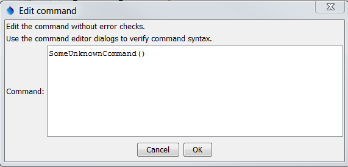

# TSTool / Command / UnknownCommand #

* [Overview](#overview)
* [Command Editor](#command-editor)
* [Command Syntax](#command-syntax)
* [Examples](#examples)
* [Troubleshooting](#troubleshooting)
* [See Also](#see-also)

-------------------------

## Overview ##

The `UnknownCommand` is used to store commands that are not recognized as valid commands.

## Command Editor ##

The following dialog is used to edit the command and illustrates the command syntax.

**

`UnknownCommand` Command Editor (<a href="../UnknownCommand.png">see also the full-size image</a>)

**

## Command Syntax ##

Unrecognized commands in command files are converted to `UnknownCommand` commands.

## Examples ##

See the [automated tests](https://github.com/OpenCDSS/cdss-app-tstool-test/tree/master/test/regression/commands/general/UnknownCommand).

## Troubleshooting ##

## See Also ##

* [`Empty`](../Empty/Empty.md) command - used for commands that only contain an empty line
