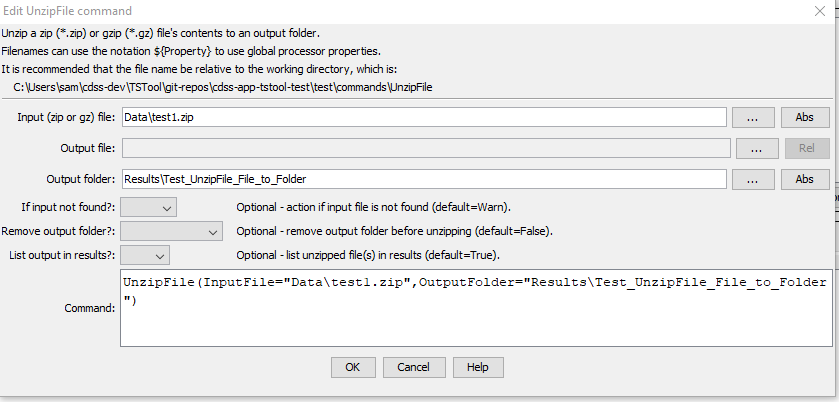

# TSTool / Command / UnzipFile #

* [Overview](#overview)
* [Command Editor](#command-editor)
* [Command Syntax](#command-syntax)
* [Examples](#examples)
* [Troubleshooting](#troubleshooting)
* [See Also](#see-also)

-------------------------

## Overview ##

The `UnzipFile` command unzips the contents of a zip (`*.zip`) or gzip (`*.gz`) file, saving to a specified output folder.
Existing files will be overwritten.

## Command Editor ##

The following dialog is used to edit the command and illustrates the command syntax.

**<p style="text-align: center;">

</p>**

**<p style="text-align: center;">
`UnzipFile` Command Editor (<a href="../UnzipFile.png">see also the full-size image</a>)
</p>**

## Command Syntax ##

The command syntax is as follows:

```text
UnzipFile(Parameter="Value",...)
```
**<p style="text-align: center;">
Command Parameters
</p>**

|**Parameter**&nbsp;&nbsp;&nbsp;&nbsp;&nbsp;&nbsp;&nbsp;&nbsp;&nbsp;&nbsp;&nbsp;&nbsp;&nbsp;&nbsp;&nbsp;&nbsp;&nbsp;&nbsp;&nbsp;&nbsp;&nbsp;&nbsp;  | **Description** | **Default**&nbsp;&nbsp;&nbsp;&nbsp;&nbsp;&nbsp;&nbsp;&nbsp;&nbsp;&nbsp;&nbsp;&nbsp;&nbsp;&nbsp;&nbsp;&nbsp;&nbsp;&nbsp;&nbsp;&nbsp; |
| --------------|-----------------|----------------- |
|`InputFile`<br>**required**|The name of the file to unzip.  Can be specified using processor `${Property}`. | None – must be specified.|
|`OutputFile` | The name of the output file, when the zip file contains a single file.  Can be specified using processor `${Property}`. | **This parameter is not enabled.**  Output file is determined from the zip file contents. |
|`OutputFolder` | The name of the output folder, to receive the contents of the zip file.  Can be specified using processor `${Property}`.| The output folder will be created if it does not already exist. The default is the same folder as the input file.|
|`IfNotFound` | Indicate action if the input file is not found, one of:<br><br><ul><li>`Ignore` – ignore the missing file (do not warn).</li><li>`Warn` – generate a warning (use this if the file truly is expected and a missing file is a cause for concern).</li><li>`Fail` – generate a failure (use this if the file truly is expected and a missing file is a cause for concern).</li></ul> | `Warn`|
|`RemoveOutputFolder` | Indicate whether to remove the output folder before unzipping: <ul><li>`False` - do not remove</li><li>`True` - remove the folder</li><li>`TrueWithPrompt` - remove the folder but only after acknowledging a confirmation prompt (**this willl pause command processing and can only be used when running the user interface**)</li></ul> | `False` |
|`ListInResults` | Indicate whether to list unzipped output files in results (`True`) or not (`False`).  It may be necessary to avoid listing for zip files with many entries. | `True` |

## Examples ##

See the [automated tests](https://github.com/OpenCDSS/cdss-app-tstool-test/tree/master/test/commands/UnzipFile).

## Troubleshooting ##

## See Also ##

* [`WebGet`](../WebGet/WebGet.md) command
