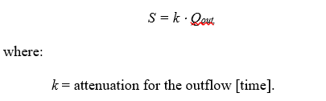
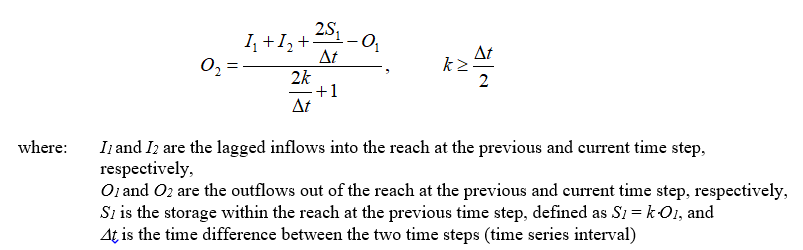
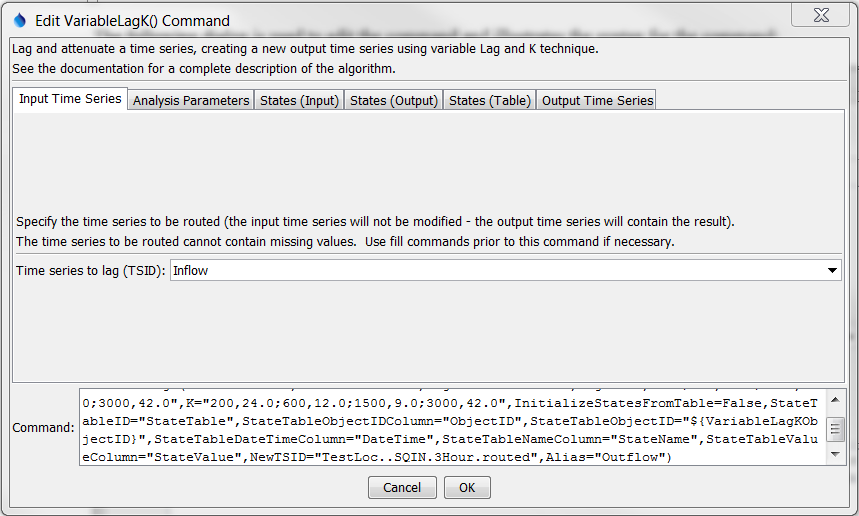
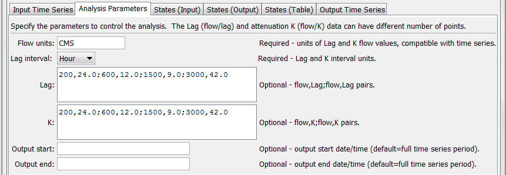
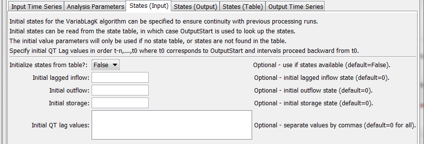
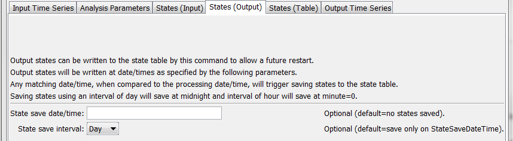
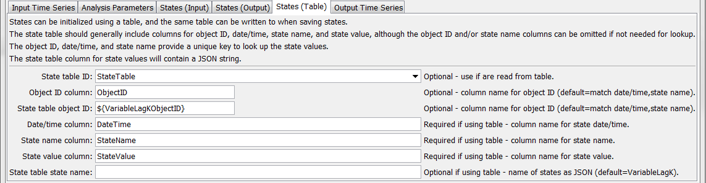
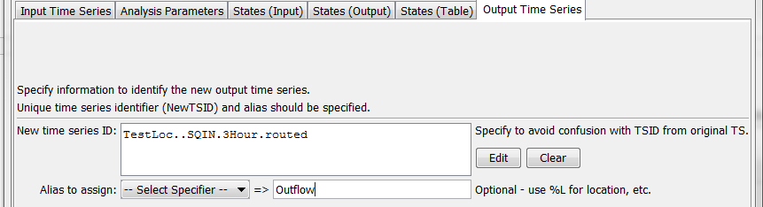
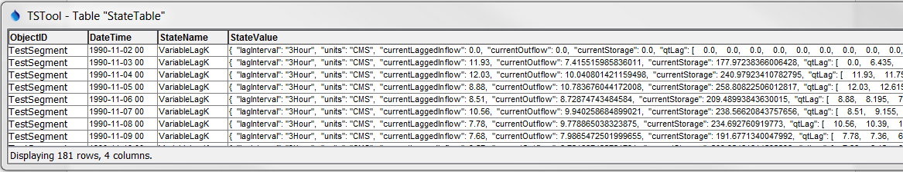

# TSTool / Command / VariableLagK #

* [Overview](#overview)
* [Command Editor](#command-editor)
* [Command Syntax](#command-syntax)
* [Examples](#examples)
* [Troubleshooting](#troubleshooting)
* [See Also](#see-also)

-------------------------

## Overview ##

The `VariableLagK` command 
can be used to lag and attenuate an input time series, resulting in a new time series.
The command is commonly used to route an instantaneous (not mean) regular interval
streamflow time series through a stretch of river (reach).
For example, route 5-minute or 1-hour instantaneous streamflows measured as cubic feet per second,
where the interval for data typically depends on the travel time in the reach and the analysis/modeling framework.
Lag and K routing is a common routing method that combines the concepts of:

1. Lagging the inflow to simulate travel time in a reach and,
2. Attenuating the wave to simulate the storage-outflow relationship for the reach (see figure below).

**<p style="text-align: center;">

</p>**

**<p style="text-align: center;">
Lag and K Routing (<a href="../VariableLagK.png">see also the full-size image</a>)
</p>**

At its fundamental level, the method solves the continuity equation using an approach similar
to Muskingum routing (assuming that the Muskingum parameter representing wave storage is negligible).
The governing equation for this routing method is given as:

**<p style="text-align: center;">

</p>**

The relationship assumes an outflow-storage relationship of the form:

**<p style="text-align: center;">

</p>**

To ensure accurate results, *k* should be larger or equal to *&Delta;t/2*.
For discrete time steps these relationships translate into:

**<p style="text-align: center;">

</p>**

Values for `Lag` and `K` can usually be
established by comparing routed flows to downstream observations.
Alternatively, the `Lag` can be estimated using the reach length and wave speed in the reach.
Without any other information, `K` can be set to `Lag/2`.

The above discussion applies where the `Lag` and `K` parameters are single values
(as implemented in the [`LagK` command](../LagK/LagK.md).
However, there are cases where the values vary by flow, which is handled by this command.
The approach that is implemented is an adaptation of that described in
National Weather Service River Forecast System LAG/K documentation:

* [NWS Lag and K Routing background](http://www.nws.noaa.gov/oh/hrl/nwsrfs/users_manual/part2/_pdf/24lagk.pdf)
* [NWS Lag and K Routing Operation](http://www.nws.noaa.gov/ohd/hrl/nwsrfs/users_manual/part5/_pdf/533lagk.pdf)

### VariableLagK States ###

States can be saved to a table during analysis using the `StateSaveDateTime` and `StateSaveInterval` parameters,
as long as state table parameters are also provided.
States are saved at any date/time of processing that match the requested save date/time.
State values in the state table are saved as a JSON string without line breaks,
as illustrated in the following example (line breaks inserted for readability):

```
{
        "lagInterval": "3Hour",
        "units": "CMS",
        "currentLaggedInflow": "1.0",
        "currentOutflow": ".4966",
        "currentStorage": "11.92",
        "qtLag": [ 0.0, 1.0, 11.93 ]
}
```

The following table explains the meaning of the states:

**<p style="text-align: center;">
VariableLagK States
</p>**

|**Parameter**&nbsp;&nbsp;&nbsp;&nbsp;&nbsp;&nbsp;&nbsp;&nbsp;&nbsp;&nbsp;&nbsp;&nbsp;&nbsp;&nbsp;&nbsp;&nbsp;&nbsp;&nbsp;&nbsp;&nbsp;&nbsp;&nbsp;&nbsp;&nbsp;|**Description**|**Default**&nbsp;&nbsp;&nbsp;&nbsp;&nbsp;&nbsp;&nbsp;&nbsp;&nbsp;&nbsp;&nbsp;&nbsp;&nbsp;&nbsp;&nbsp;&nbsp;&nbsp;&nbsp;|
|--|--|--|
|`currentLaggedInflow`|The lagged inflow corresponding to the state save date/time.|`0`|
|`currentOutflow`|The outflow corresponding to the state save date/time.|`0`|
|`currentStorage`|The storage corresponding to the state save date/time.|`0`|
|`lagInterval`|The interval between `qtLag` values, which matches the input time series interval.  This interval can be used as a check to confirm that states that were saved can be used later.|Assumed to be data interval for input time series.|
|`qtLag`|An array of QT lagged flows, where the last value corresponds to the save date/time and the first value is earliest in time.  The number of values depends on the largest lag value from input.  If specified with the `InitialQTLag` parameter the values will be positioned at the end of the internal array, with zeros filling earliest values if necessary.|`0` for all values.|
|`units`|Data units for states, which can be used to check against VariableLagK command that is attempting to use the states.|Assumed to be consistent with input time series.|

The saved states can then be used to restart the analysis, as follows:

* **Output period** – The output period used to create the output time series
is defined by the `OutputStart` and `OutputEnd` parameters.
If not specified, the full time series period (or global output period) is used.
* **Date/time for initial states** – The date/time corresponding to `OutputStart`
is used to retrieve states that have been previously saved to the state table.
* **Initialize states** – States are initialized for the algorithm as follows:
	+ If the state table should be used to initialize states (`InitializeStatesFromTable=True`),
	get the initial states from the state table by matching the `StateTableObjectID`, `OutputStart`,
	and `TableStateNameColumn` (for example state name of `VariableLagK`).
	+ If no states have been saved in the state table,
	then the initial values will be set to the values from parameters
	`InitialLaggedInflow`, `InitialOutflow`, `InitialStorage`, and `InitialQTLag`.
	+ If no initial states are specified, the values will default to zero.
	This will cause a start-up condition that will converge to accurate routed output after several intervals.

## Command Editor ##

The following dialog is used to edit the command and illustrates the syntax of the command.

**<p style="text-align: center;">

</p>**

**<p style="text-align: center;">
`VariableLagK` Command Editor Showing Input Time Series Parameters (<a href="../VariableLagK.png">see also the full-size image</a>)
</p>**

**<p style="text-align: center;">

</p>**

**<p style="text-align: center;">
`VariableLagK` Command Editor Showing Analysis Parameters (<a href="../VariableLagK-Analysis.png">see also the full-size image</a>)
</p>**

**<p style="text-align: center;">

</p>**

**<p style="text-align: center;">
`VariableLagK` Command Editor Showing Input State Parameters (<a href="../VariableLagK-StatesInput.png">see also the full-size image</a>)
</p>**

**<p style="text-align: center;">

</p>**

**<p style="text-align: center;">
`VariableLagK` Command Editor Showing Output State Parameters (<a href="../VariableLagK-StatesOutput.png">see also the full-size image</a>)
</p>**

**<p style="text-align: center;">

</p>**

**<p style="text-align: center;">
`VariableLagK` Command Editor Showing State Table Parameters (<a href="../VariableLagK-StatesTable.png">see also the full-size image</a>)
</p>**

**<p style="text-align: center;">

</p>**

**<p style="text-align: center;">
`VariableLagK` Command Editor Showing Output Time Series Parameters (<a href="../VariableLagK-Output.png">see also the full-size image</a>)
</p>**

## Command Syntax ##

The command syntax is as follows:

```text
VariableLagK(Parameter="Value",...)
```
**<p style="text-align: center;">
Command Parameters
</p>**

|**Group**|**Parameter**&nbsp;&nbsp;&nbsp;&nbsp;&nbsp;&nbsp;&nbsp;&nbsp;&nbsp;&nbsp;&nbsp;&nbsp;&nbsp;&nbsp;&nbsp;&nbsp;&nbsp;&nbsp;&nbsp;&nbsp;&nbsp;&nbsp;&nbsp;|**Description**|**Default**&nbsp;&nbsp;&nbsp;&nbsp;&nbsp;&nbsp;&nbsp;&nbsp;&nbsp;&nbsp;&nbsp;&nbsp;&nbsp;&nbsp;&nbsp;&nbsp;&nbsp;&nbsp;&nbsp;&nbsp;&nbsp;&nbsp;&nbsp;&nbsp;&nbsp;&nbsp;&nbsp;|
|--|--------------|-----------------|-----------------|
|Input TS|`TSID`|Identifier or alias for the time series to be routed.  It is assumed that this series describes an instantaneous flow.  Due to the lagging, the first data values required for the computation of *O_2* are not available within this time series and are therefore set to values set in the `InflowStates` parameter.  Can be specified with `${Property}`.|None – must be specified.|
|Analysis|`FlowUnits`|The units of the flow data specified in the `Lag` and `K` tables.  These units must be compatible with the time series units.  The table values will be converted to the time series units if the units are not the same.  Can be specified with `${Property}`.|None – must be specified.|
|Analysis|`LagInterval`|The base interval for the time data specified in the `Lag` and `K` tables.  The interval must be compatible with the time series base interval.  The table values will be converted to the time series time interval if the intervals are not the same.  For example, table data specified in Hour base interval will be converted to `Minute` if the time series being routed contains `NMinute` data.|None – must be specified.|
|Analysis|`Lag`|Flow value and lag time pairs to control routing.  The units of the data values are as specified by the `FlowUnits` parameter (see above).  The units of the lag are time as specified by the `LagInterval` parameter.  The `Lag` value is not required to be evenly divisible by the time step interval; values in the time series between time steps will be linearly interpolated.  Can be specified with `${Property}`.  Use commas and semi-colons to separate values, for example:<br>`100.0,10;200.0,20`|None – must be specified.|
|Analysis|`K`|Flow value and K time pairs to control routing.  The attenuation factor K is applied to the wave. The units of K are time as specified by the `LagInterval` parameter.  Can be specified with `${Property}`.  Use commas and semi-colons to separate values, for example:<br>`100.0,5;200.0,10`|None – must be specified.|
|Analysis|`OutputStart`|The starting date/time for the output time series.  States will be initialized relative to this date/time, which is referred to as *t_0*.  Can be specified with `${Property}`.|Full input time series period is processed.|
|Analysis|`OutputEnd`|The ending date/time for the output time series.  Can be specified with `${Property}`.|Full input time series period is processed.|
|States-In|`InitializeStates`<br>`FromTable`|Indicate whether to initialize states from the state table (can be specified with `${Property}`):<br><ul><li>`False` – do not attempt to initialize states from the state table, in which case the following parameters are used to initialize, if specified</li><li>`True` – attempt to initialize states from the state table and if states are not found, use the following parameters to initialize, if specified</li></ul>|`False`|
|States-In|`InitialLaggedInflow`|Initial state value for lagged inflow.  Can be specified using `${Property}`.|`0`|
|States-In|`InitialOutflow`|Initial state value for outflow.  Can be specified using `${Property}`.|`0`|
|States-In|`InitialStorage`|Initial state value for storage.  Can be specified using `${Property}`.|`0`|
|States-In|`InitialQTLag`|Comma-delimited list of initial QT Lag array values.  The order of the values is earliest to latest.  The array can specify up to (`Lag`/multiplier) + 1 values (1 is for bounding end point).  For example, a 10 minute time series data interval with a `LAG` of 30 must be provided with 30/10 + 1 = 4 inflow state values.  Specifying values that are not consistent with the `Lag` and `K` parameters will result in oscillation.  Can be specified with `${Property}`.|`0` for all values.|
|States-Out|`StateSaveDateTime`|Specify a date/time string, for example `YYYY-MM-DD HH` for a date/time to save states.  The precision of the date/time should be consistent with time series interval.  Can be specified with `${Property}`.|Do not save states.|
|States-Out|`StateSaveInterval`|Specify an interval to save states:<br><ul><li>`Hour` – save states when hour is zero</li><li>`Day` – save states at midnight of each day</li></ul>|Do not save states.|
|States-Table|`StateTableID`|The table identifier for the state table.  Can be specified using `${Property}`.|Default states are used.|
|States-Table|`StateTableObject`<br>`IDColumn`|State table column name for object ID, used to the computation unit with states.  For example, the object ID might be a stream reach identifier or location.  Can be specified with `${Property}`.|Will not be used to lookup states.|
|States-Table|`StateTableObjectID`|The object identifier, used to match the row in the state table.  Can be specified with `${Property}`.|Will not be used to lookup states.|
|States-Table|`StateTableDate`<br>`TimeColumn`|State table column containing state date/time.  Can be specified with `${Property}`.|Required for table.|
|States-Table|`StateTable`<br>`NameColumn`|State table column containing state name.  Can be specified with `${Property}`.|Will not be used to lookup states.|
|States-Table|`StateTable`<br>`ValueColumn`|State table column containing state value.  Can be specified with `${Property}`.|Required for table.|
|States-Table|`StateTableStateName`|Name of the state in the `StateTableNameColumn` for states, used to match rows.  The text should match that of the [VariableLagK States section](#variablelagk-states) above.  Can be specified with `${Property}`.|Will not be used to lookup states.|
|Output TS|`NewTSID`|Identifier for the new (routed) time series.  This is required to ensure that the internal identifier for the time series is unique and accurate for the data.  The interval of the identifier must be the same as for the time series specified by TSID.  Can be specified with `${Property}`.|None – must be specified.|
|Output TS|`Alias`|The alias that will be assigned to the new time series, which can use `${Property}` and `${ts:Property}`.|No alias will be assigned.|

## Examples ##

See the [automated tests](https://github.com/OpenCDSS/cdss-app-tstool-test/tree/master/test/regression/commands/general/VariableLagK).

A sample command file is as follows (commands to read time series are omitted, formatted for readability):

```text
# Test routing at 3 hour interval
StartLog(LogFile="Results/Test_VariableLagK_3hr.TSTool.log")
# Read NWSCard input file
ReadNwsCard(InputFile="Data\3HR_INPUT.SQIN",Alias=”Inflow”)
#
# Route using the same routing parameters used in the mcp3 input deck
# (metric units: Lag(hrs) K(hrs) Q(cms)
# Lag
# K
#    24.0   200.0    12.0  600.00     9.0  1500.0    42.0  3000.0
#    24.0   200.0    12.0  600.00     9.0  1500.0    42.0  3000.0
#
NewTable(TableID="StateTable",
  Columns="ObjectID,string;DateTime,datetime;StateName;string;StateValue;string")
SetProperty(PropertyName="VariableLagKObjectID",PropertyType=String,
  PropertyValue="TestSegment")
VariableLagK(TSID="Inflow",FlowUnits="CMS",LagInterval="Hour",
  Lag="200,24.0;600,12.0;1500,9.0;3000,42.0",
  K="200,24.0;600,12.0;1500,9.0;3000,42.0",InitializeStatesFromTable=False,
  StateTableID="StateTable",StateTableObjectIDColumn="ObjectID",
  StateTableObjectID="${VariableLagKObjectID}",StateTableDateTimeColumn="DateTime",
  StateTableNameColumn="StateName",StateTableValueColumn="StateValue",
  NewTSID="TestLoc..SQIN.3Hour.routed",Alias="Outflow")
```

**<p style="text-align: center;">

</p>**

**<p style="text-align: center;">
`VariableLagK` Command Editor Showing Output Parameters (<a href="../VariableLagK-StateTable-Out.png">see also the full-size image</a>)
</p>**

## Troubleshooting ##

## See Also ##

* [`LagK`](../LagK/LagK.md) command
