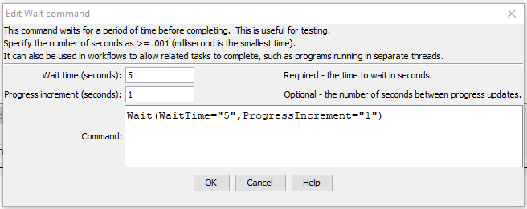

# TSTool / Command / Wait #

*   [Overview](#overview)
*   [Command Editor](#command-editor)
*   [Command Syntax](#command-syntax)
*   [Examples](#examples)
*   [Troubleshooting](#troubleshooting)
*   [See Also](#see-also)

-------------------------

## Overview ##

The `Wait` command waits a specified time before continuing.  Examples of use include:

*   Testing to simulate slow datastores or long processes.
*   Waiting for an external process to finish.  Functionality will be added in the future to wait for a file to exist or not exist.

The TSTool ***Run / Cancel Command Processing (interrupt processing)*** menu will initiate an interrupt on the processor.
Because the `Wait` command uses an internal wait,
such interrupts are treated differently than interrupting other commands and may generate warnings that have obscure wording.
This case will be evaluated and enhanced over time.
In most cases users will not need to interrupt command workflows that are using `Wait`.

## Command Editor ##

The command is available in the following TSTool menu:

*   ***Commands / General - Running and Properties***

The following dialog is used to edit the command and illustrates the command syntax.

**<p style="text-align: center;">

</p>**

**<p style="text-align: center;">
`Wait` Command Editor Showing Conditions Test (<a href="../Wait.png">see also the full-size image</a>)
</p>**

## Command Syntax ##

The command syntax is as follows:

```text
Wait(Parameter="Value",...)
```
**<p style="text-align: center;">
Command Parameters
</p>**

| **Parameter**&nbsp;&nbsp;&nbsp;&nbsp;&nbsp;&nbsp;&nbsp;&nbsp;&nbsp;&nbsp;&nbsp;&nbsp;&nbsp;&nbsp;&nbsp;&nbsp;&nbsp;&nbsp;&nbsp;&nbsp;&nbsp;&nbsp;&nbsp;&nbsp;&nbsp;&nbsp; | **Description** | **Default**&nbsp;&nbsp;&nbsp;&nbsp;&nbsp;&nbsp;&nbsp;&nbsp;&nbsp;&nbsp; |
| --------------|-----------------|----------------- |
|`WaitTime`<br>**required**|The number of seconds to wait, can be specified using `${Property}`.  Can specify as a decimal with minimum value of `.001` (1 ms). |None – must be specified.|
|`ProgressIncrement`|The number of seconds between progress updates in the main TSTool progress indicator, can be specified using `${Property}`.  Can be specified as a decimal. |`WaitTime` divided by ten.|

## Examples ##

See the [automated tests](https://github.com/OpenCDSS/cdss-app-tstool-test/tree/master/test/commands/Wait).

## Troubleshooting ##

See the main [TSTool Troubleshooting](../../troubleshooting/troubleshooting.md) documentation.

## See Also ##

*   [`Exit`](../Exit/Exit.md) command
