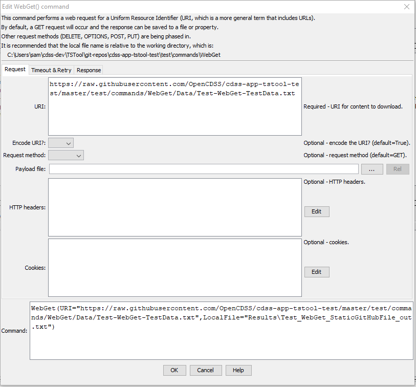
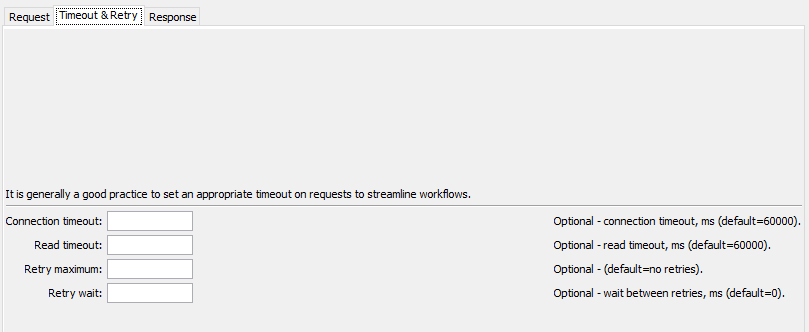
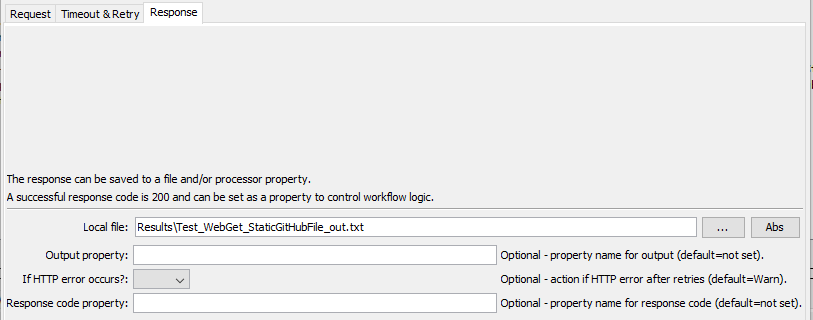

# TSTool / Command / WebGet #

*   [Overview](#overview)
*   [Command Editor](#command-editor)
*   [Command Syntax](#command-syntax)
*   [Examples](#examples)
    +   [Checking for Valid URLs](#checking-for-valid-urls)
*   [Troubleshooting](#troubleshooting)
*   [See Also](#see-also)

-------------------------

## Overview ##

The `WebGet` command retrieves content from a website and writes the content to a local file.
The transfer occurs using binary characters and the local copy is the same as that shown by
***View / Source*** (or ***View / Page Source***) in a web browser.
This command is useful for downloading files and content from web services.
The local file can then be processed with additional commands, for example 
[`ReadDelimitedFile`](../ReadDelimitedFile/ReadDelimitedFile.md) if the content is comma-separated-value and
[`ReadTableFromJSON`](../ReadTableFromJSON/ReadTableFromJSON.md) if the content is JSON.

The command is equivalent to an HTTP `GET` request.

Extraneous content (such as HTML markup around text) and inconsistencies in newline characters
(`CRLF`=`\r\n` for windows and `LF`=`\n` on other systems) may lead to some issues in processing the content with other commands.
See the [`TextEdit`](../TextEdit/TextEdit.md) and other commands to process files after downloading.

The HTTP code is checked for the connection.
If a redirect is detected, the URL for the redirect target is opened.
A maximum of 100 redirects is allowed.

Zipped files can be unzipped using the [`UnzipFile`](../UnzipFile/UnzipFile.md) command.

## Command Editor ##

The following dialog is used to edit the command and illustrates the command syntax.

**<p style="text-align: center;">

</p>**

**<p style="text-align: center;">
`WebGet` Command Editor for Request Parameters (<a href="../WebGet-Request.png">see also the full-size image</a>)
</p>**

**<p style="text-align: center;">

</p>**

**<p style="text-align: center;">
`WebGet` Command Editor for Timeout Parameters (<a href="../WebGet-Timeout.png">see also the full-size image</a>)
</p>**

**<p style="text-align: center;">

</p>**

**<p style="text-align: center;">
`WebGet` Command Editor for Response Parameters (<a href="../WebGet-Response.png">see also the full-size image</a>)
</p>**

## Command Syntax ##

The command syntax is as follows:

```text
WebGet(Parameter="Value",...)
```
**<p style="text-align: center;">
Command Parameters
</p>**

|**Tab** | **Parameter**&nbsp;&nbsp;&nbsp;&nbsp;&nbsp;&nbsp;&nbsp;&nbsp;&nbsp;&nbsp;&nbsp;&nbsp;&nbsp;&nbsp;&nbsp;&nbsp;&nbsp;&nbsp;&nbsp;&nbsp;&nbsp;&nbsp;&nbsp;&nbsp;&nbsp;&nbsp;&nbsp;&nbsp;&nbsp;&nbsp;&nbsp;&nbsp;&nbsp;&nbsp;&nbsp; | **Description** | **Default**&nbsp;&nbsp;&nbsp;&nbsp;&nbsp;&nbsp;&nbsp;&nbsp;&nbsp;&nbsp;&nbsp;&nbsp;&nbsp;&nbsp;&nbsp;&nbsp; |
| --------------|-----------------|----------------- | --- |
| ***Request*** | `URI`<br>**required**| The Uniform Resource Identifier (URI) for the content to be retrieved.  This is often also referred to as the Uniform Resource Locator (URL).  Global properties can be used with the `${Property}` syntax. The URI can include query parameters with special characters such as equal sign because URLs can be encoded (see the `EncodeURI` parameter). | None - must be specified.|
| | `EncodeURI` | Indicate whether to encode the URL to protect special characters: `False` or `True`.  See [Percent-encoding on Wikipedia](https://en.wikipedia.org/wiki/Percent-encoding). Encoded URLs are difficult to read and therefore human-readable URL can be entered as the `URI`, such as using spaces.  However, the requested resource may require encoding to be recognized by a called service.  If the provided `URI` is already encoded, then specify `False`. Only the value  part of `?property=value` and `&property=value` query is encoded. | `True` |
| | `RequestMethod` | The HTTP request method:<ul><li>`DELETE`</li><li>`GET`</li><li>`OPTIONS`</li><li>`POST`</li><li>`PUT`</li></ul> The web server must support the requested methods.  Refer to API documentation for the server. Some requests may require additional input such as HTTP headers or payload file, as described below.| `GET` |
| | `PayloadFile` | Payload file for `PUT` and `POST` requests. | |
| | `HttpHeaders` | List of HTTP header properties to be attached to the request.  This is useful if a website requires authentication via a key property, and for testing. The format is `PropertyName1:PropertyValue1,PropertyName2:PropertyValue2,...`| No headers. |
| | `Cookies` | List of HTTP header cookie properties to be attached to the request. The format is `CookieName1:CookietValue1,CookieName2:CookieValue2,...`| No cookies. |
| ***Timeout*** | `ConnectTimeout` | The connection timeout in milliseconds.  If a connection has not occurred in this time, an error will result. | `60000` (60 seconds) |
| | `ReadTimeout` | The read timeout in milliseconds.  If data read has not started in this time, an error will result. For example, a connection may be established and the server may begin processing a response, but may not provide data to read. | `60000` (60 seconds) |
| | `RetryMax` | Maximum number of retries, useful when a server rejects connections or is known to experience downtime.  Using retries will cause the workflow to wait on this command.  Another option is to use the [`For`](../For/For.md) command to control retries. | Try one time. |
| | `RetryWait` | Wait time in milliseconds before retries, which is additional time that can be used in addition to `ConnectTimeout` and `ReadTimeout` to space retries. | `0` |
| ***Response*** | `LocalFile` | The local file in which to save the content.  Global properties can be used with the `${Property}` syntax.| Output file will not be written.|
| | `OutputProperty` | Name of the processor property to set the retrieved contents.  For example, a snippet of data can be set as a property for processing by other commands, in which case the content will be accessed using `${Property}` notation.| Content will not be set in a property.|
| | `IfHttpError` | Indicate how to handle an HTTP return code other than 200:<ul><li>`Ignore` - ignore the problem</li><li>`Warn` - generate a warning message</li><li>`Fail` - generate a failure message</li></ul> | `Warn` |
| | `ResponseCodeProperty` | The [HTTP response code](https://en.wikipedia.org/wiki/List_of_HTTP_status_codes) returned by the request.  This can be used to check whether the request was successful and control the workflow. Code `200` typically indicates success. | Property value is not set. |

## Examples ##

See the [automated tests](https://github.com/OpenCDSS/cdss-app-tstool-test/tree/master/test/commands/WebGet).

### Checking for Valid URLs ###

This `WebGet` command can be used to check a dataset for valid URLs.
For example, if the dataset can be represented as a table:

1.  Use the [`For`](../For/For.md) command to iterate through the table rows.
    Use the `TablePropertyMap` command parameter to set a processor property for the website URL.
2.  Use this `WebGet` command with the following parameters:
    *   `URI` - for the URL
    *   `HttpHeaders` - if necessary, set the `User-Agent` header to a suitable agent (see
        [Chrome web browser user agent](https://www.whatismybrowser.com/guides/the-latest-user-agent/chrome) or
        [Mozilla User-Agent](https://developer.mozilla.org/en-US/docs/Web/HTTP/Headers/User-Agent) documentation)
        to mimic a web browser because some websites may reject requests without an accepted user agent.
        Edit the user agent value to remove commas, which cause problems parsing the parameter.
        It may also be necessary to surround the user agent property value with single quotes.
    *   `ResponseCodeProperty`- set a processor property for the HTTP response code
3.  Use the [`If`](../If/If.md) and [`Message`](../Message/Message.md) commands to check the error code.
    Any value other than 200 can be considered to be an error and a warning or failure message can be generated.

Any warnings or errors should be reviewed and problem URLs should be corrected in the dataset.

## Troubleshooting ##

## See Also ##

*   [`For`](../For/For.md) command
*   [`FTPGet`](../FTPGet/FTPGet.md) command
*   [`If`](../If/If.md) command
*   [`ListFiles`](../ListFiles/ListFiles.md) command
*   [`Message`](../Message/Message.md) command
*   [`TextEdit`](../TextEdit/TextEdit.md) command
*   [`ReadDelimitedFile`](../ReadDelimitedFile/ReadDelimitedFile.md) command
*   [`UnzipFile`](../UnzipFile/UnzipFile.md) command
