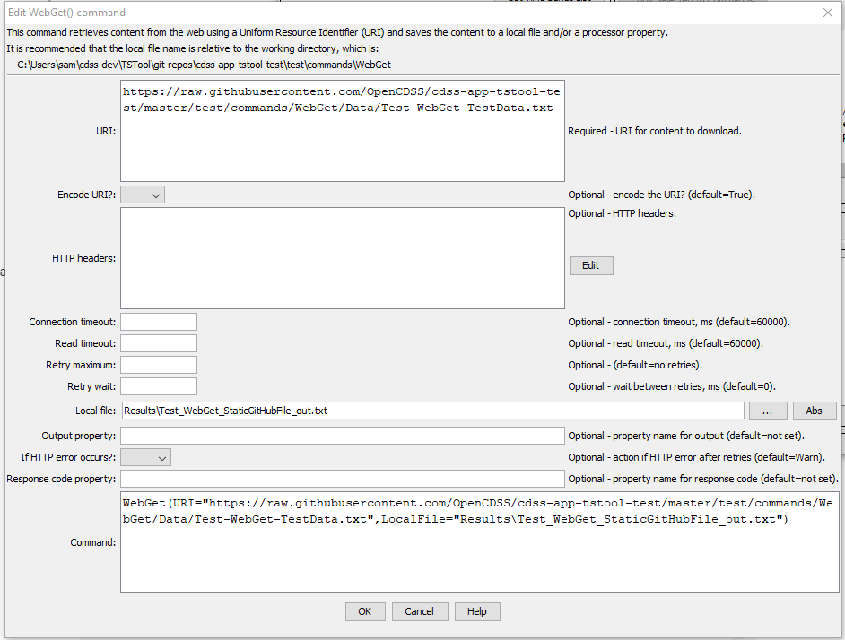

# TSTool / Command / WebGet #

* [Overview](#overview)
* [Command Editor](#command-editor)
* [Command Syntax](#command-syntax)
* [Examples](#examples)
* [Troubleshooting](#troubleshooting)
* [See Also](#see-also)

-------------------------

## Overview ##

The `WebGet` command retrieves content from a website and writes the content to a local file.
The transfer occurs using binary characters and the local copy is the same as that shown by
***View / Source*** (or ***View / Page Source***) in a web browser.
This command is useful for downloading files and content from web services.
The local file can then be processed with additional commands, for example 
[`ReadDelimitedFile`](../ReadDelimitedFile/ReadDelimitedFile.md) if the content is comma-separated-value and
[`ReadTableFromJSON`](../ReadTableFromJSON/ReadTableFromJSON.md) if the content is JSON.

Extraneous content (such as HTML markup around text) and inconsistencies in newline characters
(`CRLF`=`\r\n` for windows and `LF`=`\n` on other systems) may lead to some issues in processing the content with other commands.
See the [`TextEdit`](../TextEdit/TextEdit.md) and other commands to process files after downloading.

The HTTP code is checked for the connection.
If a redirect is detected, the URL for the redirect target is opened.
A maximum of 100 redirects is allowed.

Zipped files can be unzipped using the [`UnzipFile`](../UnzipFile/UnzipFile.md) command.

## Command Editor ##

The following dialog is used to edit the command and illustrates the command syntax.

**<p style="text-align: center;">

</p>**

**<p style="text-align: center;">
`WebGet` Command Editor (<a href="../WebGet.png">see also the full-size image</a>)
</p>**

## Command Syntax ##

The command syntax is as follows:

```text
WebGet(Parameter="Value",...)
```
**<p style="text-align: center;">
Command Parameters
</p>**

|**Parameter**&nbsp;&nbsp;&nbsp;&nbsp;&nbsp;&nbsp;&nbsp;&nbsp;&nbsp;&nbsp;&nbsp;&nbsp;&nbsp;&nbsp;&nbsp;&nbsp;&nbsp;&nbsp;&nbsp;&nbsp;&nbsp;&nbsp;&nbsp;&nbsp;&nbsp;&nbsp;&nbsp;&nbsp;&nbsp;&nbsp;&nbsp;&nbsp;&nbsp;&nbsp;&nbsp; | **Description** | **Default**&nbsp;&nbsp;&nbsp;&nbsp;&nbsp;&nbsp;&nbsp;&nbsp;&nbsp;&nbsp;&nbsp;&nbsp;&nbsp;&nbsp;&nbsp;&nbsp; |
| --------------|-----------------|----------------- |
| `URI`<br>**required**| The Uniform Resource Identifier (URI) for the content to be retrieved.  This is often also referred to as the Uniform Resource Locator (URL).  Global properties can be used with the `${Property}` syntax.| None - must be specified.|
| `EncodeURI` | Indicate whether to encode the URL to protect special characters: `False` or `True`.  See [Percent-encoding on Wikipedia](https://en.wikipedia.org/wiki/Percent-encoding). Encoded URLs are difficult to read and therefore human-readable URL can be entered as the `URI`, such as using spaces.  However, the requested resource may require encoding to be recognized by a called service.  If the provided `URI` is already encoded, then specify `False`. Only the value  part of `?property=value` and `&property=value` query is encoded. | `True` |
| `ConnectTimeout` | The connection timeout in milliseconds.  If a connection has not occurred in this time, an error will result. | `60000` (60 seconds) |
| `ReadTimeout` | The read timeout in milliseconds.  If data read has not started in this time, an error will result. For example, a connection may be established and the server may begin processing a response, but may not provide data to read. | `60000` (60 seconds) |
| `RetryMax` | Maximum number of retries, useful when a server rejects connections or is known to experience downtime.  Using retries will cause the workflow to wait on this command.  Another option is to use the [`For`](../For/For.md) command to control retries. | Try one time. |
| `RetryWait` | Wait time in milliseconds before retries, which is additional time that can be used in addition to `ConnectTimeout` and `ReadTimeout` to space retries. | `0` |
| `LocalFile` | The local file in which to save the content.  Global properties can be used with the `${Property}` syntax.| Output file will not be written.|
| `OutputProperty` | Name of the processor property to set the retrieved contents.  For example, a snippet of data can be set as a property for processing by other commands, in which case the content will be accessed using `${Property}` notation.| Content will not be set in a property.|
| `IfHttpError` | Indicate how to handle an HTTP return code other than 200:<ul><li>`Ignore` - ignore the problem</li><li>`Warn` - generate a warning message</li><li>`Fail` - generate a failure message</li></ul> | `Warn` |
| `ResponseCodeProperty` | The [HTTP response code](https://en.wikipedia.org/wiki/List_of_HTTP_status_codes) returned by the request.  This can be used to check whether the request was successful and control the workflow. Code `200` typically indicates success. | Property value is not set. |

## Examples ##

See the [automated tests](https://github.com/OpenCDSS/cdss-app-tstool-test/tree/master/test/commands/WebGet).

## Troubleshooting ##

## See Also ##

* [`For`](../For/For.md) command
* [`FTPGet`](../FTPGet/FTPGet.md) command
* [`ListFiles`](../ListFiles/ListFiles.md) command
* [`TextEdit`](../TextEdit/TextEdit.md) command
* [`ReadDelimitedFile`](../ReadDelimitedFile/ReadDelimitedFile.md) command
* [`UnzipFile`](../UnzipFile/UnzipFile.md) command
