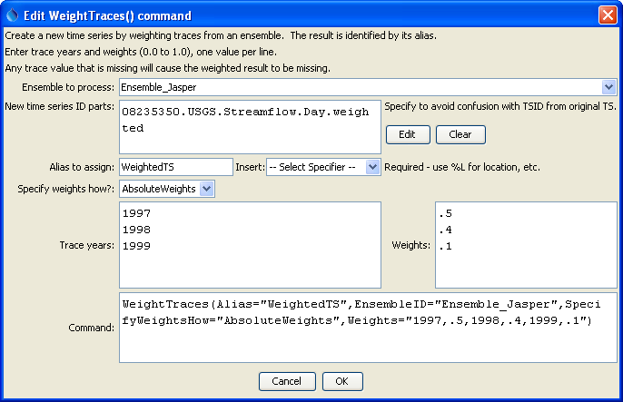
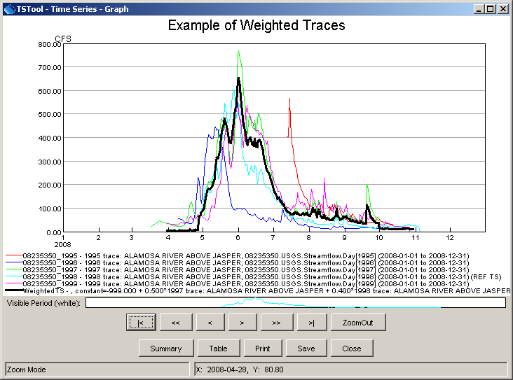

# TSTool / Command / WeightTraces #

* [Overview](#overview)
* [Command Editor](#command-editor)
* [Command Syntax](#command-syntax)
* [Examples](#examples)
* [Troubleshooting](#troubleshooting)
* [See Also](#see-also)

-------------------------

## Overview ##

The `WeightTraces` command creates a new time series as a weighted sum of time series ensemble traces,
for example as produced by a [`CreateEnsembleFromOneTimeSeries`](../CreateEnsembleFromOneTimeSeries/CreateEnsembleFromOneTimeSeries.md) command.
 If any trace contains missing data for a point, the resulting time series value will also be missing.
Note that this approach may not be appropriate for some analyses – the user
should evaluate the implications of whether the weighted result appropriately reflects the (in)dependence of input data.

## Command Editor ##

The following dialog is used to edit the command and illustrates the syntax of the command.

**<p style="text-align: center;">

</p>**

**<p style="text-align: center;">
`WeightTraces` Command Editor (<a href="../WeightTraces.png">see also the full-size image</a>)
</p>**

## Command Syntax ##

The command syntax is as follows:

```text
WeightTraces(Parameter="Value",...)
```
**<p style="text-align: center;">
Command Parameters
</p>**

|**Parameter**&nbsp;&nbsp;&nbsp;&nbsp;&nbsp;&nbsp;&nbsp;&nbsp;&nbsp;&nbsp;&nbsp;&nbsp;&nbsp;&nbsp;&nbsp;&nbsp;&nbsp;&nbsp;&nbsp;|**Description**|**Default**&nbsp;&nbsp;&nbsp;&nbsp;&nbsp;&nbsp;&nbsp;&nbsp;&nbsp;&nbsp;&nbsp;&nbsp;&nbsp;&nbsp;&nbsp;&nbsp;&nbsp;&nbsp;&nbsp;&nbsp;&nbsp;&nbsp;&nbsp;&nbsp;&nbsp;&nbsp;&nbsp;|
|--------------|-----------------|-----------------|
|`EnsembleID`<br>**required**|The ensemble identifier indicating time series to be processed (e.g., from a [`CreateEnsembleFromOneTimeSeries`](../CreateEnsembleFromOneTimeSeries/CreateEnsembleFromOneTimeSeries.md) command).  Time series matching the years specified by the Weights parameter will be processed.|None – must be specified.|
|`NewTSID`<br>**required**|The time series identifier for the new time series that is created.  This typically uses the same information as the original time series, with an added scenario.|None – must be specified.|
|`Alias`<br>**required**|The alias to assign to the time series, as a literal string or using the special formatting characters listed by the command editor.  The alias is a short identifier used by other commands to locate time series for processing, as an alternative to the time series identifier (TSID).|None – must be specified.|
|`SpecifyWeightsHow`|Weights are currently only applied as AbsoluteWeights (in the future an option may be added to normalized weights to 1.0 accounting for missing data in the traces).|Must be `AbsoluteWeights`.|
|`Weights`<br>**required**|Specify pairs of trace year and weights (0-1.0), used to create the new time series.  Trace years must be manually entered because at the time that the command is edited, time series have not yet been queried.  The weights do not need to add to 1.  Example data are:  `1995,.5,1998,.3,2005,.2`|None – must be specified.|

## Examples ##

See the [automated tests](https://github.com/OpenCDSS/cdss-app-tstool-test/tree/master/test/regression/commands/general/WeightTraces).

A sample commands file is as follows:

```
# Create annual traces from a time series shifted to the current year
# The original time series is read from HydroBase
# 
# (1995-1998) ALAMOSA RIVER ABOVE JASPER, CO  USGS  Streamflow  Day
08235350.USGS.Streamflow.Day~HydroBase
CreateEnsemble(TSID="08235350.USGS.Streamflow.Day",TraceLength=1Year,EnsembleID="Ensemble_Jasper",EnsembleName="ALAMOSA RIVER ABOVE JASPER, CO",ReferenceDate="2008-01-01",ShiftDataHow=ShiftToReference)
WeightTraces(Alias=”WeightedTS”,EnsembleID="Ensemble_Jasper",SpecifyWeightsHow="AbsoluteWeights",Weights="1997,.5,1998,.4,1999,.1",NewTSID="08235350.USGS.Streamflow.Day.weighted")
WriteDateValue(OutputFile="Results/WeightTraces_out.dv")
```
The results from the commands are shown in the following graph:

**<p style="text-align: center;">

</p>**

**<p style="text-align: center;">
Results of the `WeightTraces` Command (<a href="../WeightTraces_Graph.png">see also the full-size image</a>)
</p>**

## Troubleshooting ##

## See Also ##

* [`CreateEnsembleFromOneTimeSeries`](../CreateEnsembleFromOneTimeSeries/CreateEnsembleFromOneTimeSeries.md) command
