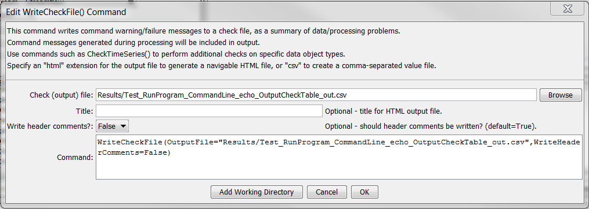

# TSTool / Command / WriteCheckFile #

* [Overview](#overview)
* [Command Editor](#command-editor)
* [Command Syntax](#command-syntax)
* [Examples](#examples)
* [Troubleshooting](#troubleshooting)
* [See Also](#see-also)

-------------------------

## Overview ##

The `WriteCheckFile` command summarizes the results of command processing
warning/failure messages in a “check file”.
This file is useful for reviewing results and for quality control.
The check file is essentially a persistent record of any problems that
occurred during processing organized by commands, whereas a full log file contains a sequential list of processing.
See the [`CheckTimeSeries`](../CheckTimeSeries/CheckTimeSeries.md) command to implement specific data checks.

## Command Editor ##

The following dialog is used to edit the command and illustrates the syntax of the command.

**<p style="text-align: center;">

</p>**

**<p style="text-align: center;">
`WriteCheckFile` Command Editor (<a href="../WriteCheckFile.png">see also the full-size image</a>)
</p>**

## Command Syntax ##

The command syntax is as follows:

```text
WriteCheckFile(Parameter="Value",...)
```
**<p style="text-align: center;">
Command Parameters
</p>**

|**Parameter**&nbsp;&nbsp;&nbsp;&nbsp;&nbsp;&nbsp;&nbsp;&nbsp;&nbsp;&nbsp;&nbsp;&nbsp;&nbsp;&nbsp;&nbsp;&nbsp;&nbsp;&nbsp;&nbsp;&nbsp;&nbsp;&nbsp;&nbsp;|**Description**|**Default**&nbsp;&nbsp;&nbsp;&nbsp;&nbsp;&nbsp;&nbsp;&nbsp;&nbsp;&nbsp;&nbsp;&nbsp;&nbsp;&nbsp;&nbsp;&nbsp;&nbsp;&nbsp;&nbsp;&nbsp;&nbsp;&nbsp;&nbsp;&nbsp;&nbsp;&nbsp;&nbsp;|
|--------------|-----------------|-----------------|
|`OutputFile`<br>**required**|The name of the check file to create.  A path relative to the command file containing this command can be specified.  Can be specified using `${Property}`.  Specify a filename with `.html` extension to generate an HTML file or `.csv` to generate a comma-separated value file suitable for use with Excel.  The HTML file will contain more information and include navigation links.|None – must be specified.|
|`Title`|Title to use for HTML output file.  Can be specified using `${Property}`.|Automatically generated.|
|`WriteHeaderComments`|Indicate whether to write header comments at the top of the output file as `False` or `True`.  These are standard comments indicating creator, date, etc.  The comments may not be desirable for a csv file read by another program, for example.|`True`|

## Examples ##

See the [automated tests](https://github.com/OpenCDSS/cdss-app-tstool-test/tree/master/test/commands/WriteCheckFile).

## Troubleshooting ##

## See Also ##

* [`CheckTimeSeries`](../CheckTimeSeries/CheckTimeSeries.md) command
