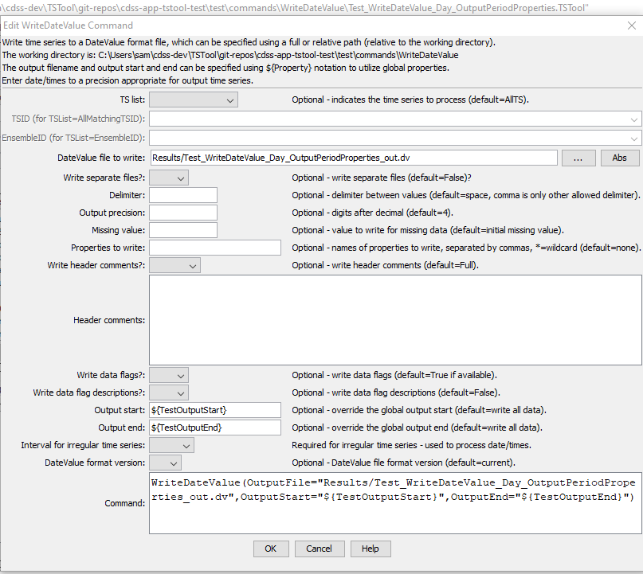

# TSTool / Command / WriteDateValue #

* [Overview](#overview)
* [Command Editor](#command-editor)
* [Command Syntax](#command-syntax)
* [Examples](#examples)
* [Troubleshooting](#troubleshooting)
* [See Also](#see-also)

-------------------------

## Overview ##

The `WriteDateValue` command writes time series to the specified DateValue format file.
See the [DateValue Input Type Appendix](../../datastore-ref/DateValue/DateValue)
for more information about the file format.
The time series being written must have the same data interval – use
the `TSList` parameter to select appropriate time series.  

## Command Editor ##

The following dialog is used to edit the command and illustrates the syntax of the command.
<a href="../WriteDateValue.png">See also the full-size image.</a>



**<p style="text-align: center;">
`WriteDateValue` Command Editor
</p>**

## Command Syntax ##

The command syntax is as follows:

```text
WriteDateValue(Parameter="Value",...)
```
**<p style="text-align: center;">
Command Parameters
</p>**

|**Parameter**&nbsp;&nbsp;&nbsp;&nbsp;&nbsp;&nbsp;&nbsp;&nbsp;&nbsp;&nbsp;&nbsp;&nbsp;&nbsp;&nbsp;&nbsp;&nbsp;&nbsp;&nbsp;&nbsp;&nbsp&nbsp;&nbsp;&nbsp;&nbsp;&nbsp;;&nbsp;&nbsp;&nbsp;&nbsp;&nbsp;&nbsp;&nbsp;&nbsp;&nbsp;&nbsp;&nbsp;|**Description**|**Default**&nbsp;&nbsp;&nbsp;&nbsp;&nbsp;&nbsp;&nbsp;&nbsp;&nbsp;&nbsp;&nbsp;&nbsp;&nbsp;&nbsp;&nbsp;&nbsp;&nbsp;&nbsp;&nbsp;&nbsp;&nbsp;&nbsp;&nbsp;&nbsp;&nbsp;&nbsp;&nbsp;|
|--------------|-----------------|-----------------|
|`TSList`|Indicates the list of time series to be processed, one of:<br><ul><li>`AllMatchingTSID` – all time series that match the TSID (single TSID or TSID with wildcards) will be processed.</li><li>`AllTS` – all time series before the command.</li><li>`EnsembleID` – all time series in the ensemble will be processed (see the EnsembleID parameter).</li><li>`FirstMatchingTSID` – the first time series that matches the TSID (single TSID or TSID with wildcards) will be processed.</li><li>`LastMatchingTSID` – the last time series that matches the TSID (single TSID or TSID with wildcards) will be processed.</li><li>`SelectedTS` – the time series are those selected with the [`SelectTimeSeries`](../SelectTimeSeries/SelectTimeSeries) command.</li></ul> | `AllTS` |
|`TSID`|The time series identifier or alias for the time series to be processed, using the `*` wildcard character to match multiple time series.  Can be specified using `${Property}`.|Required if `TSList=*TSID`|
|`EnsembleID`|The ensemble to be processed, if processing an ensemble. Can be specified using `${Property}`.|Required if `TSList=*EnsembleID`|
|`OutputFile`|The DateValue output file.  The path to the file can be absolute or relative to the working directory (command file location).  Can be specified using processor `${Property}`.|None – must be specified.|
|`Delimiter`|The delimiter character to use between data values.  Comma is the only other allowed value other than the default space and is recommended for irregular time series, which are output as blanks when date/times don’t align with other time series.|Space|
|`Precision`|The number of digits after the decimal for numerical output.|`4` (in the future may default based on data type)|
|`MissingValue`|The value to write to the file to indicate a missing value in the time series.	As initialized when reading the time series or creating a new time series, typically `-999`, `NaN`, etc.|
|`IncludeProperties`|A list of time series property names to write, separated by commas, as of `Version=1.6`.  Use `*` as a wildcard to match multiple properties.|None.|
|`WriteDataFlagDescriptions`|Indicate whether data flag descriptions should be written using `True` or `False`, as of `Version=1.6`.|`False`|
|`OutputStart`|The date/time for the start of the output as a date/time string or `${Property}`.|Use the global output period.|
|`OutputEnd`|The date/time for the end of the output as a date/time string or `${Property}`.|Use the global output period.|
|`IrregularInterval`|The interval (e.g., `Day`) used when writing irregular time series, to indicate the precision of date/times.  This may be necessary when it is not possible to automatically determine the date/time precision.  The date/time precision to format output is assumed to be `Minute` if unknown; however, specifying the irregular interval will inform the data processing.|Determined from the period start date/time of each time series, defaulting to `Minute` where the date/time precision is set to “irregular” (unknown).|
|`Version`|Version of the file to write.  See the [DateValue Input Type appendix](../../datastore-ref/DateValue/DateValue) for information.|Current version.|

## Examples ##

See the [automated tests](https://github.com/OpenWaterFoundation/cdss-app-tstool-test/tree/master/test/regression/commands/general/WriteDateValue).

## Troubleshooting ##

## See Also ##

* [`ReadDateValue`](../ReadDateValue/ReadDateValue) command
* [`SelectTimeSeries`](../SelectTimeSeries/SelectTimeSeries) command
