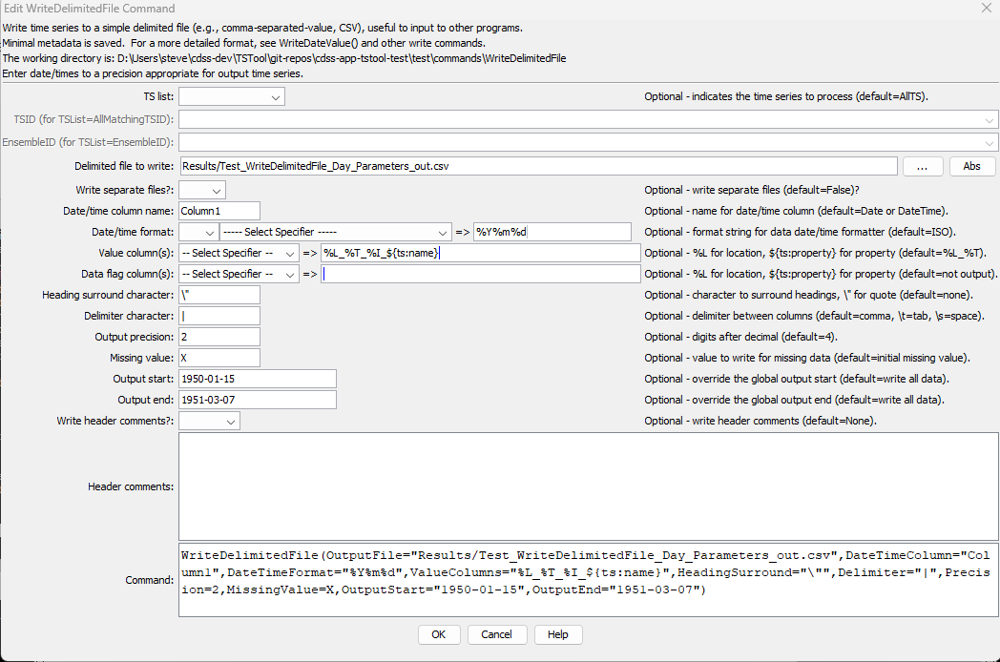

# TSTool / Command / WriteDelimitedFile #

* [Overview](#overview)
* [Command Editor](#command-editor)
* [Command Syntax](#command-syntax)
* [Examples](#examples)
* [Troubleshooting](#troubleshooting)
* [See Also](#see-also)

-------------------------

## Overview ##

The `WriteDelimitedFile` command writes time series to the specified delimited file,
for example a comma-separated-value (CSV) file.  The following constraints apply to this command:

* The time series being written must have the same data interval – use the
`TSList` parameter to select appropriate time series.
* Only one irregular time series can be written because functionality has
not yet been added to properly handle all date/times found in multiple time series.
The output period is adjusted to ensure that actual endpoints found in the time series are used to bound output.
* The first row in the file contains column headings, which often are used by other software to identify the column:
	+ By default, no character will be used to surround headings.
	+ The `HeadingSurround` parameter can be used to specify a character to surround each heading.
	+ If `HeadingSurround` matches a character in a column heading, the character will be removed from the column heading.
* Precision for data values and missing value for output can be specified.

## Command Editor ##

The following dialog is used to edit the command and illustrates the command syntax.

**<p style="text-align: center;">

</p>**

**<p style="text-align: center;">
`WriteDelimitedFile` Command Editor (<a href="../WriteDelimitedFile.png">see also the full-size image</a>)
</p>**

## Command Syntax ##

The command syntax is as follows:

```text
WriteDelimitedFile(Parameter="Value",...)
```
**<p style="text-align: center;">
Command Parameters
</p>**

| **Parameter**&nbsp;&nbsp;&nbsp;&nbsp;&nbsp;&nbsp;&nbsp;&nbsp;&nbsp;&nbsp;&nbsp;&nbsp;&nbsp;&nbsp;&nbsp;&nbsp;&nbsp;&nbsp;&nbsp;&nbsp;&nbsp;&nbsp;&nbsp;&nbsp;&nbsp;&nbsp;&nbsp;&nbsp;&nbsp; | **Description** | **Default**&nbsp;&nbsp;&nbsp;&nbsp;&nbsp;&nbsp;&nbsp;&nbsp;&nbsp;&nbsp;&nbsp;&nbsp;&nbsp;&nbsp;&nbsp;&nbsp;&nbsp;&nbsp;&nbsp;&nbsp;&nbsp;&nbsp;&nbsp;&nbsp;&nbsp;&nbsp;&nbsp; |
| --------------|-----------------|----------------- |
| `TSList`|Indicates the list of time series to be processed, one of:<br><ul><li>`AllMatchingTSID` – all time series that match the TSID (single TSID or TSID with wildcards) will be processed.</li><li>`AllTS` – all time series before the command.</li><li>`EnsembleID` – all time series in the ensemble will be processed (see the EnsembleID parameter).</li><li>`FirstMatchingTSID` – the first time series that matches the TSID (single TSID or TSID with wildcards) will be processed.</li><li>`LastMatchingTSID` – the last time series that matches the TSID (single TSID or TSID with wildcards) will be processed.</li><li>`SelectedTS` – the time series are those selected with the [`SelectTimeSeries`](../SelectTimeSeries/SelectTimeSeries.md) command.</li></ul> | `AllTS` |
| `TSID`|The time series identifier or alias for the time series to be processed, using the `*` wildcard character to match multiple time series.  Can be specified using `${Property}`.|Required if `TSList=*TSID`|
| `EnsembleID`|The ensemble to be processed, if processing an ensemble. Can be specified using `${Property}`.|Required if `TSList=*EnsembleID`|
|`OutputFile`|The delimited output file.  The path to the file can be absolute or relative to the working directory (command file location).  Global properties can be used to specify the filename, using the `${Property}` syntax.|None – must be specified.|
|`DateTimeColumn`|The name of the column for the date/time.|`Date` if day, month, or year interval, `DateTime` otherwise.|
|`DateTimeFormatterType`|Specify the date/time formatter type, which indicates the syntax for `DateTimeFormat`.  Currently, only `C` is supported, corresponding to the C programming language [strftime() function](https://en.wikipedia.org/wiki/C_date_and_time_functions), which is also used by other software (see [Linux date command](http://man7.org/linux/man-pages/man1/date.1.html)).|`C`|
|`DateTimeFormat`|The format used to expand the date/time corresponding to each time series data value.  The format string can contain literal strings and specifiers supported by the `DateTimeFormatterType`.	||
|`ValueColumns`|The name(s) of the column(s) corresponding to each time series, to use for the values.  Specify with `%` formatters, `${ts:property}` and `${property}`.  In the future a parameter may be added to more specifically define the column names.  If the column name contains the `HeadingSurround` character, occurrences of the character will be removed.`%L_%T`|
|`HeadingSurround`|Character that is used to surround column headings.  Specify a double quote using `\”`.|No surrounding character.|
|`Delimiter`|The delimiter character to use between data values.  Specify `\t` for tab and `\s` for space.|Space.|
|`Precision`|The number of digits after the decimal for numerical output.|4 (in the future may default based on data type)|
|`MissingValue`|The value to write to the file to indicate a missing value in the time series.  This will override the value initialized when the time series is read or created (typically `-999`, `NaN` or another value).  Specify `Blank` to output a blank.|Time series missing value.|
|`OutputStart`|The date/time for the start of the output.  Can be specified using processor `${Property}`.|Use the global output period.|
|`OutputEnd`|The date/time for the end of the output.   Can be specified using processor `${Property}`.|Use the global output period.|

## Examples ##

See the [automated tests](https://github.com/OpenCDSS/cdss-app-tstool-test/tree/master/test/regression/commands/general/WriteDelimitedFile).

## Troubleshooting ##

## See Also ##

* [`ReadDelimitedFile`](../ReadDelimitedFile/ReadDelimitedFile.md) command
* [`SelectTimeSeries`](../SelectTimeSeries/SelectTimeSeries.md) command
