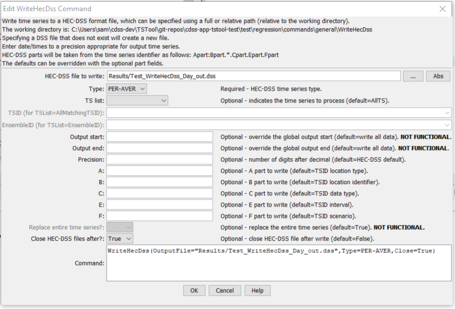

# TSTool / Command / WriteHecDss #

*   [Overview](#overview)
*   [Command Editor](#command-editor)
*   [Command Syntax](#command-syntax)
*   [Examples](#examples)
*   [Troubleshooting](#troubleshooting)
*   [See Also](#see-also)

-------------------------

## Overview ##

The `WriteHecDss` command writes time series to a HEC-DSS file.
See the [HEC-DSS Input Type Appendix](../../datastore-ref/HEC-DSS/HEC-DSS.md)
for information about how time series properties are output to HEC-DSS files.
Current limitations of the command are:

*   Irregular time series are not supported – the focus of initial development has been regular interval time series.
*   24-hour time series in TSTool cannot be written to HEC-DSS because HEC-DSS only supports 1DAY interval.
    Therefore, the time series must be converted to a daily time series before writing.
    An option to convert 24-hour values to 1DAY may be added to this command in the future.
*   HEC-DSS uses times through 2400.  TSTool will convert this to 0000 of the next day.
    Year, month, and day data are not impacted.  The internal TSTool values will be converted to hour 2400 when writing.
    Therefore, reading from a HEC-DSS file and then writing should result in no change in data.
*   Time series that are written overwrite existing time series, but only for the period that is written.
    Therefore, previously written values may remain, even if not appropriate.
    A future enhancement will allow the option of removing the old data before writing new data.
    The work-around is to write a period that is sufficiently long to guarantee
    that old data values do not remain in the file, or clear the file out with another tool such as DSSUTL before writing.
*   Currently the connections to the HEC-DSS file may remain open after the write,
    in order to minimize performance degradation for multiple write commands.
    However, this will lock the HEC-DSS file so that other commands or programs cannot perform file manipulation, such as removing the file.
    The connections will automatically time out after several minutes.
    A future enhancement will ensure that the file connections can be closed.  See the Close command parameter.

The A-F parts of the HEC-DSS time series pathname by default are taken from the time series properties, as follows:

*   The A part is taken from the time series location type.
*   The B part is taken from the time series location.
*   The C part is taken from the time series data type.
*   The D part is taken from the time series period in memory or as defined by the output period.
*   The E part is taken from the time series interval.
*   The F part is taken from the time series identifier scenario.

These conventions can be overruled by specifying the parts explicitly with command parameters.
The parameter values will apply to all time series being written.

## Command Editor ##

The command is available in the following TSTool menu:

*   ***Commands / Output Time Series***

The following dialog is used to edit the command and illustrates the syntax of the command.

**<p style="text-align: center;">

</p>**

**<p style="text-align: center;">
`WriteHecDss` Command Editor (<a href="../WriteHecDss.png">see also the full-size image</a>)
</p>**

## Command Syntax ##

The command syntax is as follows:

```text
WriteHecDss(Parameter="Value",...)
```
**<p style="text-align: center;">
Command Parameters
</p>**

|**Parameter**&nbsp;&nbsp;&nbsp;&nbsp;&nbsp;&nbsp;&nbsp;&nbsp;&nbsp;&nbsp;&nbsp;|**Description**|**Default**&nbsp;&nbsp;&nbsp;&nbsp;&nbsp;&nbsp;&nbsp;&nbsp;&nbsp;&nbsp;&nbsp;&nbsp;&nbsp;&nbsp;&nbsp;&nbsp;&nbsp;&nbsp;&nbsp;&nbsp;&nbsp;&nbsp;&nbsp;&nbsp;&nbsp;&nbsp;&nbsp;|
|--------------|-----------------|-----------------|
|`OutputFile`|The name of the HEC-DSS file to write.  If the file does not exist it will be created.  Can be specified using `${Property}` notation.|None – must be specified.|
|`Type`|The HEC-DSS time series type, indicating whether the time series is instantaneous, mean, or accumulated.|None – must be specified.|
|`TSList`|Indicates the list of time series to be processed, one of:<br><ul><li>`AllMatchingTSID` – all time series that match the TSID (single TSID or TSID with wildcards) will be processed.</li><li>`AllTS` – all time series before the command.</li><li>`EnsembleID` – all time series in the ensemble will be processed (see the EnsembleID parameter).</li><li>`FirstMatchingTSID` – the first time series that matches the TSID (single TSID or TSID with wildcards) will be processed.</li><li>`LastMatchingTSID` – the last time series that matches the TSID (single TSID or TSID with wildcards) will be processed.</li><li>`SelectedTS` – the time series are those selected with the [`SelectTimeSeries`](../SelectTimeSeries/SelectTimeSeries.md) command.</li></ul> | `AllTS` |
|`TSID`|The time series identifier or alias for the time series to be processed, using the `*` wildcard character to match multiple time series.  Can be specified using `${Property}`.|Required if `TSList=*TSID`|
|`EnsembleID`|The ensemble to be processed, if processing an ensemble. Can be specified using `${Property}`.|Required if `TSList=*EnsembleID`|
|`OutputStart`|The date/time for the start of the output.  Can be specified using `${Property}` notation.	Use the global output period or write all available data.|
|`OutputEnd`|The date/time for the end of the output.  Can be specified using `${Property}` notation.|Use the global output period or write all available data.|
|`Precision`|The number of digits after the decimal for numerical output.|HEC-DSS default.|
|`A`|The DSS path A-part to use for the time series as written to the HEC-DSS file.  Can be specified using `${Property}` notation.|Time series identifier location part before the `:` (if `:` is present) or the entire location if `:` is not present.|
|`B`|The DSS path B-part to use for the time series as written to the HEC-DSS file.  Can be specified using `${Property}` notation.|Time series identifier location part after the `:` (if `:` is present) or the blank if `:` is not present.|
|`C`|The DSS path C-part to use for the time series as written to the HEC-DSS file.  Can be specified using `${Property}` notation.|Time series identifier data type.|
|`E`|The DSS path E-part to use for the time series as written to the HEC-DSS file.  Can be specified using `${Property}` notation.|Time series identifier data interval, converted to HEC-DSS conventions.|
|`F`|The DSS path F-part to use for the time series as written to the HEC-DSS file.  Can be specified using `${Property}` notation.|Time series identifier scenario.|
|
|`Replace`|Not enabled – whether to replace the contents of the previous time series in the HEC-DSS file.|Only replace what is actually written.|
|`Close`|Indicate whether to close connections to the HEC-DSS file and allow other processes to move/rename/delete the file.  Specifying as `True` may slow the software as files are repeatedly opened and closed.|`False` – let the HEC-DSS internal software close the connection after timing out.|

## Examples ##

See the [automated tests](https://github.com/OpenCDSS/cdss-app-tstool-test/tree/master/test/commands/WriteHecDss).

A sample command file is as follows:

```text
WriteHecDss(OutputFile="sample.dss",TYPE=PER-AVER,OutputStart="1992-01-01",OutputEnd="1992-12-31") 
```

## Troubleshooting ##

See the main [TSTool Troubleshooting](../../troubleshooting/troubleshooting.md) documentation.

## See Also ##

*   [`ReadHecDss`](../ReadHecDss/ReadHecDss.md) command
*   [`SelectTimeSeries`](../SelectTimeSeries/SelectTimeSeries.md) command
