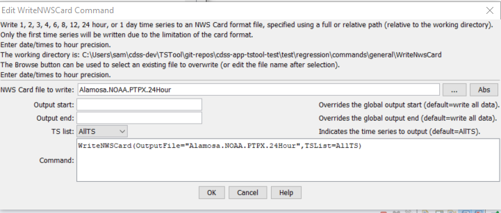

# TSTool / Command / WriteNwsCard #

*   [Overview](#overview)
*   [Command Editor](#command-editor)
*   [Command Syntax](#command-syntax)
*   [Examples](#examples)
*   [Troubleshooting](#troubleshooting)
*   [See Also](#see-also)

-------------------------

## Overview ##

The `WriteNwsCard` command writes one time series to the specified NWS Card format file.
See the [NWSCard Input Type Appendix](../../datastore-ref/NWSCard/NWSCard.md) for more information about the file format.
Only daily or hourly time series can be written.  Daily time series will be converted to 24Hour time series.

## Command Editor ##

The command is available in the following TSTool menu:

*   ***Commands / Output Time Series***

The following dialog is used to edit the command and illustrates the syntax of the command.

**<p style="text-align: center;">

</p>**

**<p style="text-align: center;">
`WriteNwsCard` Command Editor (<a href="../WriteNwsCard.png">see also the full-size image</a>)
</p>**

## Command Syntax ##

The command syntax is as follows:

```text
WriteNwsCard(Parameter="Value",...)
```
**<p style="text-align: center;">
Command Parameters
</p>**

|**Parameter**&nbsp;&nbsp;&nbsp;&nbsp;&nbsp;&nbsp;&nbsp;&nbsp;&nbsp;&nbsp;&nbsp;&nbsp;&nbsp;&nbsp;&nbsp;&nbsp;&nbsp;&nbsp;&nbsp;&nbsp;&nbsp;&nbsp;&nbsp;&nbsp;&nbsp;|**Description**|**Default**&nbsp;&nbsp;&nbsp;&nbsp;&nbsp;&nbsp;&nbsp;&nbsp;&nbsp;&nbsp;&nbsp;&nbsp;&nbsp;&nbsp;&nbsp;&nbsp;&nbsp;&nbsp;&nbsp;&nbsp;&nbsp;&nbsp;&nbsp;&nbsp;&nbsp;&nbsp;&nbsp;|
|--------------|-----------------|-----------------|
| `OutputFile` | The NWS Card output file to write.  The path to the file can be absolute or relative to the working directory (command file location). | None – must be specified. |
| `OutputStart` | The start of the output period, specified to daily or hourly precision to match the time series. | Write all data. |
| `OutputEnd` | The end of the output period, specified to daily or hourly precision to match the time series. | Write all data. |
| `TSList` | Indicate the time series to write, one of:<ul><li> `AllTS` – write all the time series.</li><li> `SelectedTS` – write time series selected using [`SelectTimeSeries`](../SelectTimeSeries/SelectTimeSeries.md). | `AllTS` |

## Examples ##

See the [automated tests](https://github.com/OpenCDSS/cdss-app-tstool-test/tree/master/test/commands/WriteNwsCard).

A sample command file to write data from the State of Colorado’s HydroBase is as follows:

```
# 0130 - ALAMOSA SAN LUIS VALLEY RGNL
0130.NOAA.Precip.Day~HydroBase
WriteNWSCard(OutputFile="Alamosa.NOAA.PTPX.24Hour",TSList=AllTS)
```

## Troubleshooting ##

## See Also ##

*   [`ReadNwsCard`](../ReadNwsCard/ReadNwsCard.md) command
