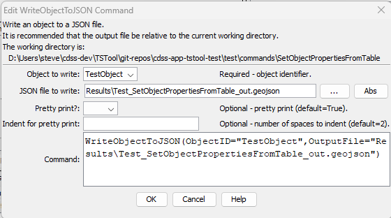

# TSTool / Command / WriteObjectToJSON #

*   [Overview](#overview)
*   [Command Editor](#command-editor)
*   [Command Syntax](#command-syntax)
*   [Examples](#examples)
*   [Troubleshooting](#troubleshooting)
*   [See Also](#see-also)

-------------------------

## Overview ##

The `WriteObjectToJSON` command writes an object to a JSON file.
Any JSON object can be written, including objects read from GeoJSON files
(for example using the [`NewObject`](../NewObject/NewObject.md) command).

## Command Editor ##

The command is available in the following TSTool menu:

*   ***Commands / Object Processing***

The following dialog is used to edit the command and illustrates the command syntax.

**<p style="text-align: center;">

</p>**

**<p style="text-align: center;">
`WriteObjectToJSON` Command Editor (<a href="../WriteObjectToJSON.png">see also the full-size image</a>)
</p>**

## Command Syntax ##

The command syntax is as follows:

```text
WriteObjectToJSON(Parameter="Value",...)
```
**<p style="text-align: center;">
Command Parameters
</p>**

| **Parameter**&nbsp;&nbsp;&nbsp;&nbsp;&nbsp;&nbsp;&nbsp;&nbsp;&nbsp;&nbsp;&nbsp;&nbsp;&nbsp;&nbsp;&nbsp;&nbsp;&nbsp;&nbsp;&nbsp;&nbsp;&nbsp;&nbsp;&nbsp;&nbsp;&nbsp;&nbsp; | **Description** | **Default**&nbsp;&nbsp;&nbsp;&nbsp;&nbsp;&nbsp;&nbsp;&nbsp;&nbsp;&nbsp;&nbsp;&nbsp;&nbsp;&nbsp;&nbsp;&nbsp;&nbsp;&nbsp;&nbsp;&nbsp;&nbsp; |
| --------------|-----------------|----------------- |
|`ObjectID`<br>**required**|The object identifier for the object to be output.  Can be specified using `${Property}`. |None - must be specified.|
|`OutputFile`<br>**required**|The name of the output file to write.  Can be specified using `${Property}`. |None - must be specified.|
|`PrettyPrint`| Whether to format the JSON in indented format, which is easier to read but results in larger files. | `True` |
|`Indent`| Used with `PrettyPrint=True` to indicate the number of spaces used for indentation. | `2` |

## Examples ##

See the [automated tests](https://github.com/OpenCDSS/cdss-app-tstool-test/tree/master/test/commands/WriteObjectToJSON).

## Troubleshooting ##

Problems in JSON files can be checked by using online "JSON lint" websites.

See the main [TSTool Troubleshooting](../../troubleshooting/troubleshooting.md) documentation.

## See Also ##

*   [`NewObject`](../NewObject/NewObject.md) command
