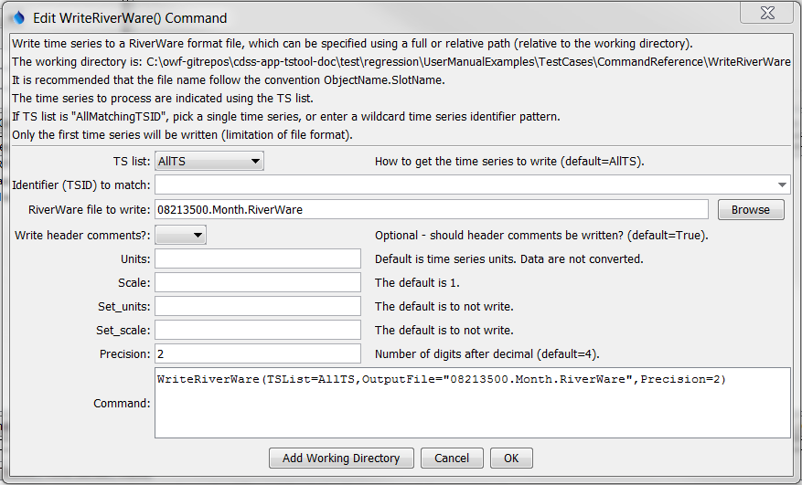

# TSTool / Command / WriteRiverWare #

*   [Overview](#overview)
*   [Command Editor](#command-editor)
*   [Command Syntax](#command-syntax)
*   [Examples](#examples)
*   [Troubleshooting](#troubleshooting)
*   [See Also](#see-also)

-------------------------

## Overview ##

The `WriteRiverWare` command writes one time series to the specified RiverWare format file.
See the [RiverWare Input Type Appendix](../../datastore-ref/RiverWare/RiverWare.md)
for more information about the file format.

## Command Editor ##

The command is available in the following TSTool menu:

*   ***Commands / Output Time Series***

The following dialog is used to edit the command and illustrates the syntax of the command.

**<p style="text-align: center;">

</p>**

**<p style="text-align: center;">
`WriteRiverWare` Command Editor (<a href="../WriteRiverWare.png">see full-size image</a>)
</p>**

## Command Syntax ##

The command syntax is as follows:

```text
WriteRiverWare(Parameter="Value",...)
```
**<p style="text-align: center;">
Command Parameters
</p>**

|**Parameter**&nbsp;&nbsp;&nbsp;&nbsp;&nbsp;&nbsp;&nbsp;&nbsp;&nbsp;&nbsp;&nbsp;&nbsp;&nbsp;&nbsp;&nbsp;&nbsp;&nbsp;&nbsp;&nbsp;&nbsp;&nbsp;&nbsp;&nbsp;|**Description**|**Default**&nbsp;&nbsp;&nbsp;&nbsp;&nbsp;&nbsp;&nbsp;&nbsp;&nbsp;&nbsp;&nbsp;&nbsp;&nbsp;&nbsp;&nbsp;&nbsp;&nbsp;&nbsp;&nbsp;&nbsp;&nbsp;&nbsp;&nbsp;&nbsp;&nbsp;&nbsp;&nbsp;|
|--------------|-----------------|-----------------|
|`TSList`<br>**required**|Indicates the list of time series to be processed, one of:<br><ul><li>`AllMatchingTSID` – all time series that match the TSID (single TSID or TSID with wildcards) will be processed.</li><li>`AllTS` – all time series before the command.</li><li>`SelectedTS` – the time series are those selected with the [`SelectTimeSeries`](../SelectTimeSeries/SelectTimeSeries.md) command.</li></ul> | `AllTS` |
|`TSID`|The time series identifier or alias for the time series to be processed, using the `*` wildcard character to match multiple time series.  Can be specified using `${Property}`.|Required if `TSList=*TSID`|
|`OutputFile`<br>**required**|The RiverWare file to write.  The path to the file can be absolute or relative to the working directory.  The ***Browse*** button can be used to select the file to write (if a relative path is desired, delete the leading path after the select). Can be specified with ${Property} notation.|None – must be specified.|
|`WriteHeaderComments`|Indicate whether # Comments should be written at the top of the file:  `True` or `False`|`True`|
|`Units`|The data units to be output.  Specify units that are recognized by RiverWare – the units are not actually converted but the new units string is used in the output file.|Use the units in the time series.|
|`Scale`|See the [RiverWare Input Type Appendix](../../datastore-ref/RiverWare/RiverWare.md).  Time series values are divided by this value on output.|`1`|
|`Set_units`|[See the RiverWare Input Type Appendix](../../datastore-ref/RiverWare/RiverWare.md).  If specified, the value is output as provided with no modification to data values.|`Set_units` is not output.|
|`Set_scale`|[See the RiverWare Input Type Appendix](../../datastore-ref/RiverWare/RiverWare.md).  If specified, the value is output as provided.|`Set_scale` is not output.|
|`Precision`|The number of digits after the decimal to write.|`4`|

## Examples ##

See the [automated tests](https://github.com/OpenCDSS/cdss-app-tstool-test/tree/master/test/commands/WriteRiverWare).

A sample command file to process a time series from the [State of Colorado’s HydroBase database](../../datastore-ref/CO-HydroBase/CO-HydroBase.md)
is as follows:

```text
# 08213500 - RIO GRANDE RIVER AT THIRTY MILE BRIDGE NEAR CREEDE
08213500.DWR.Streamflow.Month~HydroBase
WriteRiverWare(TSList=AllTS,OutputFile="08213500.Month.RiverWare",Precision=2)
```

## Troubleshooting ##

See the main [TSTool Troubleshooting](../../troubleshooting/troubleshooting.md) documentation.

## See Also ##

*   [`ReadRiverWare`](../ReadRiverWare/ReadRiverWare.md) command
*   [`SelectTimeSeries`](../SelectTimeSeries/SelectTimeSeries.md) command
