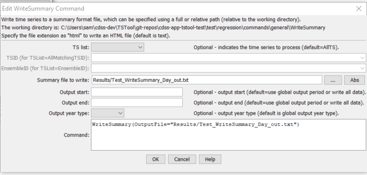

# TSTool / Command / WriteSummary #

*   [Overview](#overview)
*   [Command Editor](#command-editor)
*   [Command Syntax](#command-syntax)
*   [Examples](#examples)
*   [Troubleshooting](#troubleshooting)
*   [See Also](#see-also)

-------------------------

## Overview ##

The `WriteSummary` command writes time series to a summary report file, as text or HMTL.
The format of the file is a default for the data interval.
The total/average column in reports (if output) is based on the
units – a parameter may be added in the future to allow more flexibility.

## Command Editor ##

The command is available in the following TSTool menu:

*   ***Commands / Output Time Series***

The following dialog is used to edit the command and illustrates the syntax of the command.

**<p style="text-align: center;">

</p>**

**<p style="text-align: center;">
`WriteSummary` Command Editor (<a href="../WriteSummary.png">see also the full-size image</a>)
</p>**

## Command Syntax ##

The command syntax is as follows:

```text
WriteSummary(Parameter="Value",...)
```
**<p style="text-align: center;">
Command Parameters
</p>**

|**Parameter**&nbsp;&nbsp;&nbsp;&nbsp;&nbsp;&nbsp;&nbsp;&nbsp;&nbsp;&nbsp;&nbsp;&nbsp;&nbsp;|**Description**|**Default**&nbsp;&nbsp;&nbsp;&nbsp;&nbsp;&nbsp;&nbsp;&nbsp;&nbsp;&nbsp;&nbsp;&nbsp;&nbsp;&nbsp;&nbsp;&nbsp;&nbsp;&nbsp;&nbsp;&nbsp;&nbsp;&nbsp;&nbsp;&nbsp;&nbsp;&nbsp;&nbsp;|
|--------------|-----------------|-----------------|
|`OutputFile`<br>**required**|The summary file.  The path to the file can be absolute or relative to the working directory (command file location).  Specifying a filename with an “html” extension will result in HTML output, which is color-coded for missing values and has notes for flagged values.  Can be specified using `${Property}`.|None – must be specified.|
|`TSList`|Indicates the list of time series to be processed, one of:<br><ul><li>`AllMatchingTSID` – all time series that match the TSID (single TSID or TSID with wildcards) will be processed.</li><li>`AllTS` – all time series before the command.</li><li>`EnsembleID` – all time series in the ensemble will be processed (see the EnsembleID parameter).</li><li>`FirstMatchingTSID` – the first time series that matches the TSID (single TSID or TSID with wildcards) will be processed.</li><li>`LastMatchingTSID` – the last time series that matches the TSID (single TSID or TSID with wildcards) will be processed.</li><li>`SelectedTS` – the time series are those selected with the [`SelectTimeSeries`](../SelectTimeSeries/SelectTimeSeries.md) command.</li></ul> | `AllTS` |
|`TSID`|The time series identifier or alias for the time series to be processed, using the `*` wildcard character to match multiple time series.  Can be specified using `${Property}`.|Required if `TSList=*TSID`|
|`EnsembleID`|The ensemble to be processed, if processing an ensemble. Can be specified using `${Property}`.|Required if `TSList=*EnsembleID`|
|`OutputStart`|The date/time for the start of the output.   Can be specified using `${Property}`.|Use the global output period.|
|`OutputEnd`|The date/time for the end of the output.   Can be specified using `${Property}`.|Use the global output period.|
|`OutputYearType`|The output year type, in particular for formatting monthly and daily time series.|Calendar|

## Examples ##

See the [automated tests](https://github.com/OpenCDSS/cdss-app-tstool-test/tree/master/test/commands/WriteSummary).

A sample command file to process time series from the [State of Colorado’s HydroBase database](../../datastore-ref/CO-HydroBase/CO-HydroBase.md)
is as follows:

```text
SetOutputPeriod(OutputStart="1950-01",OutputEnd="2002-12")
# 08213500 - RIO GRANDE RIVER AT THIRTY MILE BRIDGE NEAR CREEDE
08213500.DWR.Streamflow.Month~HydroBase
# 08217000 - RIO GRANDE AT WASON, BELOW CREEDE, CO.
08217000.USGS.Streamflow.Month~HydroBase
WriteSummary(TSList=AllTS,OutputFile="RioGrandeStreamflow.txt",TSList="AllTS")
```

## Troubleshooting ##

See the main [TSTool Troubleshooting](../../troubleshooting/troubleshooting.md) documentation.

## See Also ##

*   [`SelectTimeSeries`](../SelectTimeSeries/SelectTimeSeries.md) command
