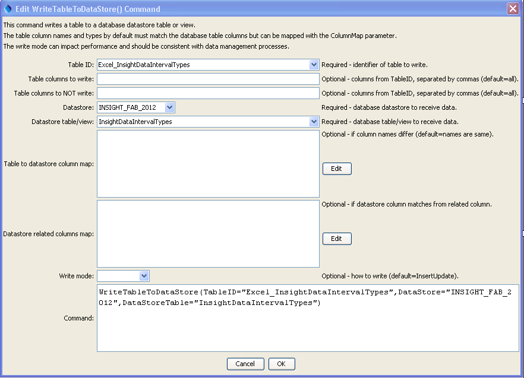

# TSTool / Command / WriteTableToDataStore #

* [Overview](#overview)
	+ [Relationship Example](#relationship-example)
* [Command Editor](#command-editor)
* [Command Syntax](#command-syntax)
* [Examples](#examples)
* [Troubleshooting](#troubleshooting)
* [See Also](#see-also)

-------------------------

## Overview ##

**This command is under development and has the following limitations:**

* **Although some error handling has been implemented, it is not very detailed.
Improvements will be made in response to exercising the command functionality.**
* **Write statements are created for each row of the table being written.
This is inefficient and slow.  Improvements will be made in future updates.**
* **Functionality has been tested mainly with SQL Server and SQLite.**
* **Handling of date objects has not been tested.**
* **Better handling of blank rows needs to be implemented.**

The `WriteTableToDataStore` command processes each row in a table and
executes an SQL statement to insert the row into a database datastore.
If database datastore support is not specifically provided by TSTool,
a generic datastore can be used (see the [GenericDatabase](../../datastore-ref/GenericDatabase/GenericDatabase.md)
Datastore appendix).
This command cannot be used with web service datastores and use with Excel datastores has not been tested.
This command is useful in particular for bulk data loading such as
for database initialization and when tight integration with TSTool is not required or has not been implemented via a specific API.
In the future, additional command parameters may be added to limit the rows that are being written.

General constraints on the query are as follows:

* the table or views being written must be writeable by the user specified
for the database connection (some databases restrict direct access to data and require using stored procedures)
* the table column names must match the database table column names, or use the `ColumnMap` parameter to
specify names in the datastore that are different than the table
* data types for table columns must closely match the database:
	+ internally an SQL statement is created in which data values are formatted
	as per the data type (e.g., strings are quoted);
	consequently column types must be appropriate to generate correct formatting
	+ the full precision of floating point numbers is passed to
	the database (formatting for display will not apply to values written to the database)
	+ null values in the table will transfer to null values in the database
	+ date/time columns in the table will be represented as such in the database table;
	however, it may not be possible to limit the precision of the date/time
	(i.e., hours, minutes, and seconds may be shown with default zero values in output)
*	the specified table columns are written (all are written by default)
	+ primary keys in the database table do not need to be specified
	(their values will be assigned automatically),
	although primary keys with special values, such as strings, can be specified
	+ table columns that correspond to related tables in the datastore
	table need to be mapped using the `DataStoreRelatedColumnsMap` command parameter

### Relationship Example ###

An example of column mapping to a related table is as follows,
using the notation `Table.Column` to fully identify columns:

* the string `TableID.DataType` column is in the input data
* an integer database table `TimeSeriesMeta.DataTypeID` column is a foreign key
to `DataTypes.DataTypeID`, and `DataTypes.Abbreviation` is the string data type – in other words,
the datastore column being written does not match the string data type,but uses a relationship to match the integer data type in a separate table

To handle this relationship:

* Use the `ColumnMap` parameter to tell the command that the `DataType` column in input table maps to the `DataTypeID` column in the datastore table:

```
ColumnMap=”DataType:DataTypeID”
```

* Use the `DataStoreRelatedColumnsMap` parameter to tell the command that the `DataTypeID`
column should be looked up the Abbreviation column, which is a second level of column mapping:

```
DataStoreRelatedColumnsMap=”DataTypeID:Abbreviation”
```

## Command Editor ##

The following dialog is used to edit the command and illustrates the command syntax.

**<p style="text-align: center;">

</p>**

**<p style="text-align: center;">
`WriteTableToDataStore` Command Editor (<a href="../WriteTableToDataStore.png">see also the full-size image</a>)
</p>**

## Command Syntax ##

The command syntax is as follows:

```text
WriteTableToDataStore(Parameter="Value",...)
```
**<p style="text-align: center;">
Command Parameters
</p>**

| **Parameter**&nbsp;&nbsp;&nbsp;&nbsp;&nbsp;&nbsp;&nbsp;&nbsp;&nbsp;&nbsp;&nbsp;&nbsp;&nbsp;&nbsp;&nbsp;&nbsp;&nbsp;&nbsp;&nbsp;&nbsp;&nbsp;&nbsp;&nbsp;&nbsp;&nbsp;&nbsp;&nbsp;&nbsp;&nbsp;&nbsp;&nbsp;&nbsp;&nbsp;&nbsp;&nbsp;&nbsp;&nbsp;&nbsp;&nbsp;&nbsp;&nbsp;&nbsp; | **Description** | **Default**&nbsp;&nbsp;&nbsp;&nbsp;&nbsp;&nbsp;&nbsp;&nbsp;&nbsp;&nbsp;&nbsp;&nbsp;&nbsp;&nbsp;&nbsp;&nbsp;&nbsp;&nbsp; |
| --------------|-----------------|----------------- |
|`TableID`<br>**required**|Identifier for table to write.|None – must be specified.|
|`IncludeColumns`|The names of the table columns to write, separated by commas.|All columns from `TableID` are written.|
|`ExcludeColumns`|The names of table columns NOT to write, separated by commas.  This will override `IncludeColumns.`|All columns from `TableID` are written.|
|`DataStore`<br>**required**|The name of a database datastore to receive data. |None – must be specified.|
|`DataStoreTable`<br>**required**|The name of the database table or view to receive data.|None – must be specified.|
|`ColumnMap`|Indicate which columns in `TableID` have different names in `DataStoreTable`, using the syntax:<br>`ColumnName:DatastoreTableName, ColumnName:DatastoreTableName,...`|DataStore `TableName` columns are assumed to match the column names in `TableID`.|
|`DataStoreRelatedColumnsMap`|Indicate datastore columns that need to match values in a related table in the datastore.  For example, `TableID` may contain a column “Abbreviation” but the corresponding column in `DataStoreTable` may refer to a related table using a foreign key relationship (matching integer column in both tables).  It is expected that the related table will have only one primary key column, which will be determined automatically.  However, a column mapping must be provided to tell the command which `DataStoreTable` column should be matched with the related table.  The syntax of the parameter is:<br>`DataStoreTableKeyCol1:RelatedTableValueCol1,DataStoreTableKeyCol2:RelatedTableValueCol2,...`<br>The above assumes that foreign keys have been defined in the `DataStoreTable` columns.  If the database does not explicitly define a foreign key relationship in the database design, then specify the right side of the map as:  `RelatedTable1.RelatedCol1`.  See the explanation below this table.|`DataStore` `TableName` columns are assumed to match the column names in TableID, with no need to perform reference table value matching.|
|`WriteMode`|The method used to write data, recognizing the databases use insert and update SQL statements, one of:<br><ul><li>`DeleteInsert` – delete the data first and then insert (all values will need to be matched to delete)</li><li>`Insert` – insert the data with no attempt to update if the insert fails</li><li>`InsertUpdate` – try inserting the data first and if that fails try to update</li><li>`Update` – update the data with no attempt to insert if the update fails</li><li>`UpdateInsert` – try updating the data first and if that fails try to insert</li></ul>|`UpdateInsert`|

## Examples ##

See the [automated tests](https://github.com/OpenCDSS/cdss-app-tstool-test/tree/master/test/regression/commands/general/WriteTableToDataStore).

### Writing a Table with Foreign Keys ###

To explain loading tables with foreign keys, consider the `DataTypes` definitions table used as a reference table:

|**Column**|**Description**|
|-----------|-----------|
|`DataTypeID`|Integer autonumber primary key for this record|
|`Abbreviation`|Varchar – what the user sees and what is referenced in other data (e.g., `Streamflow`)|
|`Name`|Varchar|
|`Definition`|Varchar|

Another `TimeSeriesMeta` table (below) may use the above table with a relationship to the `DataTypeID` column, as follows:

|**Column**|**Description**|
|-----------|-----------|
|`TimeSeriesMetaID`|Integer autonumber primary key for this record.|
|`DataTypeID`|Foreign key to `DataTypes.DataTypeID`|
|`Other`|...|

Time series being written to the `TimeSeriesMeta` table is specified with a data type of `Streamflow`
and the internal database keys are opaque (meaning the values are not used directly by software user).
If the `TimeSeriesMeta` table properties define the foreign key for `TimeSeriesMeta.DataTypeID`,
then the TSTool software can automatically determine the table relationship.
However, additional information is needed to indicate that the value for `DataTypes.Abbreviation`
specified in the load data should be used to complete the relationship.
Assume that the TSTool table being written is as per the following `TimeSeriesMeta_TSTool` table:

|**Column**|**Description**|
|------|------|
|`DataTypeAbbreviation`|Foreign key to `DataTypes.DataTypeID`|
|Other|...|	

In this case, the following command parameters are required to complete the TSTool table to datastore table mapping:

`TableID = “TimeSeriesMeta_TSTool”`<br>
`IncludeColumns = “DataTypeAbbreviation”` (or blank to write all TSTool table columns)<br>
`DataStore = as appropriate`<br>
`DataStoreTable = “TimeSeriesMeta”`<br>
`ColumnMap = “DataTypeAbbreviation:DataTypeID”` (to indicate column in TimeSeriesMeta)<br>
`DataStoreRelatedColumnMap = “DataTypeID:Abbreviation”` (to further indicate that the
record in the related table matching the foreign key should use the `DataTypes.Abbreviation`
column to look up the record to match the load data.
This assumes that a foreign key relationship is defined, which while provide the foreign table.
If a foreign key relationship is not defined, supply the foreign table, as in:<br>
`DataStoreRelatedColumnMap = “DataTypeID:DataTypes.Abbreviation”`

The internal code will essentially replace data table DataTypeID column values with `select primary_key from DataTypes where DataTypes.Abbrevation = DataTypeID`.

### Writing a Relationship (Association) Table ###

The command also can be used to write a relationship (association) table,
for example in the case where a one-to-many, or many-to-many relationship exists.
For example consider the following case, where a basin record can be associated with multiple subbasin records.
The `Basins` table may have a design similar to the following:

|**Column**|**Description**|
|---|----|
|`BasinsID`|Integer autonumber primary key for this record|
|`Abbreviation`|Varchar – what the user sees and what is referenced in other data (e.g., “Basin1”)|
|`Name`|Varchar|
|Other data||

The Subbasins table may have a design similar to the following:

|**Column**|**Description**|
|--------|----------|
|`SubbasinsID`|Integer autonumber primary key for this record|
|`Abbreviation`|Varchar – what the user sees and what is referenced in other data (e.g., “Subbasin1”)|
|`Name`|Varchar|
|`Other data||

An association table may have a design similar to the following `Basins_Subbasins_Relate` table:

|**Column**|**Description**|
|-----------|--------------|
|`BasinsID`|Integer autonumber primary key for this record|
|`SubbasinsID`|Integer autonumber primary key for this record|

In order to populate the association table from `Basins.Abbreviation` and
`Subbasins.Abbreviation` it is necessary to look up the `BasinsID` and `SubbasinsID`
values in the original tables and then insert into the association table.
Consequently the following command parameters are used,
assuming that the in-memory table columns include human-readable abbreviation values):

`TableID = “Basins_Subbasins”`<br>
`IncludeColumns = “BasinAbbreviation,SubbasinAbbreviation”`<br>
`DataStore = as appropriate`<br>
`DataStoreTable = “Basins_Subbasins”`<br>
`ColumnMap = “BasinAbbreviation:BasinsID,SubbasinAbbrevation:SubbasinsID”` (note that this map goes from human-readable column to an integer foreign key,
which is why `DataStoreRelatedColumnMap` is needed below)<br>
`DataStoreRelatedColumnMap = “BasinsID:Basins.Abbreviation,SubbasinsID:Subbasins.Abbreviation”`

The following issues should be considered when writing relationship tables:

* Because the relationship tables only contain integer foreign keys,
the contents of the table can become corrupted if out-of-date records are not removed or updated.
For example, changes in the keys of the original data should
be accompanied by updates to the relationship table.  For this reason,
the business processes associated with managing the data should have clear steps for updating the relationships.
* Do not use relationship tables where there is a clear one-to-one relationship.
In this case, the relationship table will add overhead and potentially confusion.

## Troubleshooting ##

## See Also ##

* [`ReadTableFromDataStore`](../ReadTableFromDataStore/ReadTableFromDataStore.md) command
