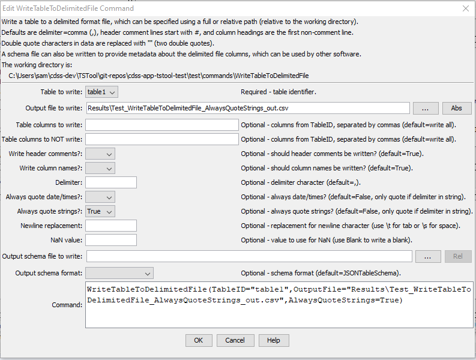

# TSTool / Command / WriteTableToDelimitedFile #

*   [Overview](#overview)
*   [Command Editor](#command-editor)
*   [Command Syntax](#command-syntax)
*   [Examples](#examples)
*   [Troubleshooting](#troubleshooting)
*   [See Also](#see-also)

-------------------------

## Overview ##

The `WriteTableToDelimitedFile` command writes a table to a delimited file.
This command is the analog to the
[`ReadTableFromDelimitedFile`](../ReadTableFromDelimitedFile/ReadTableFromDelimitedFile.md) command.
It can be used to provide tabular data to other programs, such as spreadsheet programs and geographic information systems.
It is also useful to write tables to delimited text files for automated tests.

The default is to write a standard file header using comment lines that start with the `#` character.
If available, column names will be written in double quotes as the first non-comment row.
Formatting for cell values is limited and the default precision of floating point numbers
may include too many digits – this will be addressed in future updates.

## Command Editor ##

The command is available in the following TSTool menu:

*   ***Commands(Table) / Output Table***

The following dialog is used to edit the command and illustrates the command syntax.

**<p style="text-align: center;">

</p>**

**<p style="text-align: center;">
`WriteTableToDelimitedFile` Command Editor (<a href="../WriteTableToDelimitedFile.png">see also the full-size image</a>)
</p>**

## Command Syntax ##

The command syntax is as follows:

```text
WriteTableToDelimitedFile(Parameter="Value",...)
```
**<p style="text-align: center;">
Command Parameters
</p>**

| **Parameter**&nbsp;&nbsp;&nbsp;&nbsp;&nbsp;&nbsp;&nbsp;&nbsp;&nbsp;&nbsp;&nbsp;&nbsp;&nbsp;&nbsp;&nbsp;&nbsp;&nbsp;&nbsp;&nbsp;&nbsp;&nbsp;&nbsp;&nbsp;&nbsp;&nbsp;&nbsp; | **Description** | **Default**&nbsp;&nbsp;&nbsp;&nbsp;&nbsp;&nbsp;&nbsp;&nbsp;&nbsp;&nbsp; |
| --------------|-----------------|----------------- |
|`TableID`<br>**required**|Identifier for the table to write.  Can be specified using processor `${Property}`.|None – must be specified.|
|`OutputFile`<br>**required**|The name of the file to write, as an absolute path or relative to the command file location.  Can be specified using processor `${Property}`.|None – must be specified.|
|`IncludeColumns`|The names of columns to write, separated by commas.|Write all of the columns.|
|`ExcludeColumns`|The names of columns to **not** write, separated by commas.|Write all of the included columns.|
|`WriteHeaderComments`|Indicates whether to write the header comments, `True` or `False`.  Some programs do not handle delimited files with comments.|`True`|
|`WriteColumnNames`|Indicates whether to write the column names, `True` or `False`.  Some programs do not handle column names. |`True`|
|`Delimiter`|Delimiter character to separate column values, must be a single character if specified |`,` (comma)|
|`AlwaysQuoteDateTimes`|Indicates whether values in date/times columns should always be surrounded by double quotes:<ul><li>`False` – only quote date/times that contain the delimiter</li><li>`True` – always quote date/times</li></ul><br>Quoting may impact how date/times are handled in other programs, for example in Excel.|`False`|
|`AlwaysQuoteStrings`|Indicates whether values in string columns should always be surrounded by double quotes:<ul><li>`False` – only quote strings that contain the delimiter</li><li>`True` – always quote strings</li></ul><br>An example of using `AlwaysQuoteStrings=True` is to quote identifiers that have a leading zero (e.g., `01234567`).  Not quoting may cause the values to be interpreted as integers when read from the delimited file.|`False`|
|`NewlineReplacement`|The string to replace newlines in string values, necessary to prevent unexpected line breaks in output rows.  In order to handle newlines from various systems, the following patterns are replaced in sequence:<ul><li>`\r\n`</li><li>`\n`</li><li>`\r`</li></ul><br>The following special parameter values are recognized:<ul><li>`\t` – replace newline with tab</li><li>`\s` – replace newline with space|Do not replace newlines (file format may be unusable because of unexpected line breaks)|
|`NaNValue`|The value to write for `NaN` data values.  Specify the word `Blank` to write a blank (empty string).|`NaN`|
|`OutputSchemaFile`|Name of schema file to write, useful to help other software understand contents of the delimited file.  See the `OutputSchemaFormat` parameter.  This is an experimental feature being evaluated to facilitate data exchange between software.|Do not create schema file.|
|`OutputSchemaFormat`|Schema format, one of the following, output is limited but will be expanded in the future:<ul><li>`JSONTableSchema` – see [frictionlessdata schema](https://specs.frictionlessdata.io/table-schema/)</li><li>`GoogleBigQuery` – see [Google big query](https://cloud.google.com/bigquery/docs/reference/rest/v2/tables)</li></ul>| `JSONTableSchema`|

## Examples ##

See the [automated tests](https://github.com/OpenCDSS/cdss-app-tstool-test/tree/master/test/commands/WriteTableToDelimitedFile).

## Troubleshooting ##

## See Also ##

*   [`ReadTableFromDelimitedFile`](../ReadTableFromDelimitedFile/ReadTableFromDelimitedFile.md) command
