# TSTool / Command / WriteTableToExcel #

*   [Overview](#overview)
*   [Command Editor](#command-editor)
*   [Command Syntax](#command-syntax)
*   [Examples](#examples)
*   [Troubleshooting](#troubleshooting)
*   [See Also](#see-also)

-------------------------

## Overview ##

The `WriteTableToExcel` command writes a table to a worksheet in a Microsoft Excel workbook file.
A contiguous block of cells (rectangle) must be specified in one of the following ways to receive the table:

*   Specify the upper-left cell in a range of cells using Excel address notation (e.g., `A1`)
*   Specify a range of cells using Excel address notation (e.g., `A1:D10`)
*   Specify the name of an Excel named range.
*   Specify a table name (essentially a named range).

TSTool uses the Apache POI software ([https://poi.apache.org](https://poi.apache.org))
to read/write the Excel file and consequently functionality is constrained by the features of that software package.

The following are limitations of this command:

*   Currently only the upper-left cell is utilized but in the future the range may be used to limit output.
*   Cell data types are determined from the table columns being written.  In the future a parameter may be provided to allow option of using original Excel formatting.

## Command Editor ##

The command is available in the following TSTool menu:

*   ***Commands / Spreadsheet Processing***
*   ***Commands(Table) / Output Table***

The following dialog is used to edit the command and illustrates the syntax for the command.

**<p style="text-align: center;">
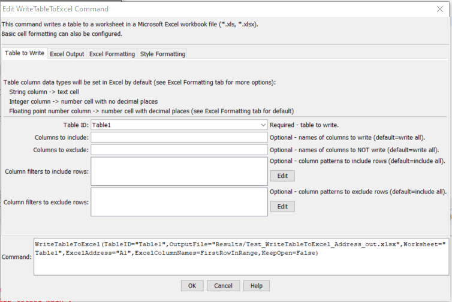
</p>**

**<p style="text-align: center;">
`WriteTableToExcel` Command Editor (<a href="../WriteTableToExcel.png">see also the full-size image</a>)
</p>**

The following dialog is used to edit the command and illustrates Excel output parameters.

**<p style="text-align: center;">
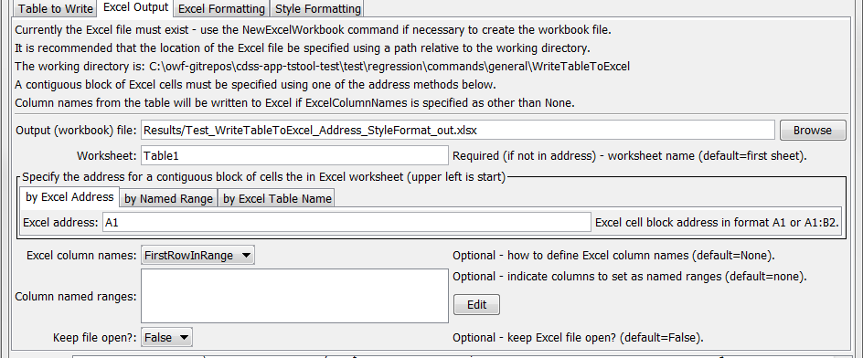
</p>**

**<p style="text-align: center;">
`WriteTableToExcel` Command Editor for Excel Output Parameters (<a href="../WriteTableToExcel_Excel.png">see also the full-size image</a>)
</p>**

The following dialog is used to edit the command and illustrates Excel formatting parameters.

**<p style="text-align: center;">
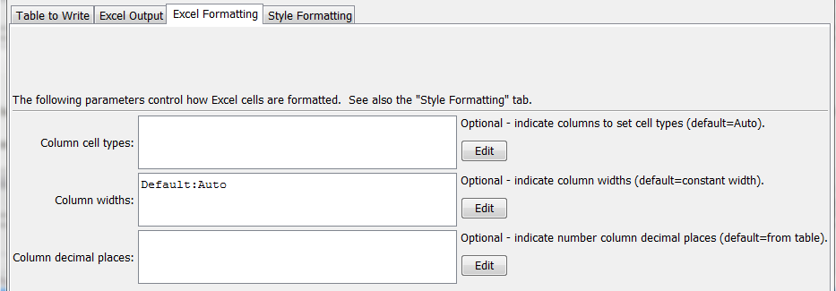
</p>**

**<p style="text-align: center;">
`WriteTableToExcel` Command Editor for Excel Formatting Parameters (<a href="../WriteTableToExcel_ExcelFormat.png">see also the full-size image</a>)
</p>**

The following dialog is used to edit the command and illustrates style formatting parameters.

**<p style="text-align: center;">
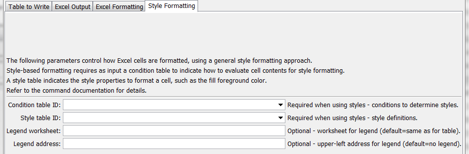
</p>**

**<p style="text-align: center;">
`WriteTableToExcel` Command Editor for Style Formatting Parameters (<a href="../WriteTableToExcel_Style.png">see also the full-size image</a>)
</p>**

## Command Syntax ##

The command syntax is as follows:

```text
WriteTableToExcel(Parameter="Value",...)
```
**<p style="text-align: center;">
Command Parameters
</p>**

|**Parameter**&nbsp;&nbsp;&nbsp;&nbsp;&nbsp;&nbsp;&nbsp;&nbsp;&nbsp;&nbsp;&nbsp;&nbsp;&nbsp;&nbsp;&nbsp;&nbsp;&nbsp;&nbsp;&nbsp;&nbsp;&nbsp;&nbsp;&nbsp;&nbsp;&nbsp;&nbsp; | **Description** | **Default**&nbsp;&nbsp;&nbsp;&nbsp;&nbsp;&nbsp;&nbsp;&nbsp;&nbsp;&nbsp; |
| --------------|-----------------|----------------- |
|`TableID`|Identifier for table to write.  Can specify using processor `${Property}`.|None – must be specified.|
|`IncludeColumns|Names of columns in table to write.|Write all columns.|
|`ExcludeColumns`|Names of columns in table to exclude from writing.|Write all columns.|
|`ColumnIncludeFilters`|Indicate table column names and pattern to use to include rows.  For example, include rows with blanks in columns.  The format of the parameter is:<br>`ColumnName1:Pattern1,`<br>`ColumnName2:Pattern2,`<br>where patterns can contain `*` to match a substring.|Include all rows.|
|`ColumnExcludeFilters`|Indicate table column names and pattern to use to exclude rows.  For example, exclude rows with blanks in columns.  The format of the parameter is:<br>`ColumnName1:Pattern1,`<br>`ColumnName2:Pattern2,`|<br>where patterns can contain `*` to match a substring.|Include all rows.|
|`OutputFile`|The name of the Excel workbook file (`*.xls` or `*.xlsx`) to write, as an absolute path or relative to the command file location.  If the Excel file does not exist it will be created.  Can specify using processor `${Property}`.|None – must be specified.|
|`Worksheet`|The name of the worksheet in the workbook to write.  If the worksheet does not exist it will be created.  Can specify using processor `${Property}`.|Write to the first worksheet.|
|`ExcelAddress`|Indicates the block of cells to write, using Excel address notation (e.g., `A1:D10`).|Must specify address using one of available address parameters.|
|`ExcelNamedRange`|Indicates the block of cells to write, using an Excel named range.|Must specify address using one of available address parameters.|
|`ExcelTableName`|Indicates the block of cells to write, using an Excel named range.|Must specify address using one of available address parameters.|
|`ExcelColumnNames`|Indicate how to determine the column names for the Excel table (in order to not overwrite with data rows), one of:<br><ul><li>`FirstRowInRange` – column names are written to the first row in the Excel address range</li><li>`None` – column names are not written</li><li>`RowBeforeRange` – column names are written to the row before the Excel address range</li></ul>|`None`|
|`ColumnNamedRanges`|The map of column names to named ranges, useful when the column of values is used as choices in Excel data validation.|No named ranges will be defined.|
|`KeepOpen`|Indicate whether to keep the Excel file open (`True`) or close after creating (`False`).  Keeping the file open will increase performance because later commands will not need to reread the workbook.  Make sure to close the file in the last Excel command.|`False`|
|`ColumnCellTypes`|Column names and corresponding cell types using notation: `ColumnName1:CellType1,ColumnName2:CellType2`<br>Column name can be Default to set the default for all output columns.  Supported cell types are:<ul><li>`Auto` – determine cell type from table column</li><li>`Text` – Excel text cell</li><ul>|`Auto`|
|`ColumnWidths`|Column names and corresponding widths using notation:<br>`ColumnName1:Width1,ColumnName2:Width2`<br>Column name can be `Default` to set the default for all output columns and `EmptyColumns` to set the width for columns with no data values.  Supported width values are:<br><ul><li>`Auto` – determine width from table contents</li><li>`N` – number of 1/256 of character widths (maximum is 256*256)|Default column with determined by Excel.|
|`ColumnDecimalPlaces`|Column names and corresponding number of decimal places, for floating point numbers, using notation:<br>`ColumnName1:Num1,ColumnName2:Num2`|Determine from table column precision, or 6 if unable to determine from table.|
|`ConditionTableID`|Identifier for condition table (see below).  Can be specified using processor `${Property}`.|Style formatting is not used.|
|`StyleTableID`|Identifier for style table (see below).  Can be specified using processor `${Property}`.|Style formatting is not used.|
|`LegendWorksheet`|Name of worksheet where the legend should be created.  The legend displays conditions and styles.|Data table worksheet.|
|`LegendAddress`|Address `A1`, etc. for upper-left of legend.|No legend will be created.|

Excel cell formatting consists of number formatting, cell colors, cell width, etc.
The ***Excel Formatting*** tab allows several formatting parameters to be specified.
However, a more general formatting capability based on styles is being phased in
and is configured using the ***Style Formatting*** tab.
Consider the following data table, where the goal is to write the TSTool table to Excel
and format cells to indicate specific conditions of interest.
This approach is implemented similarly in the [`WriteTimeSeriesToExcel`](../WriteTimeSeriesToExcel/WriteTimeSeriesToExcel.md) command.

**<p style="text-align: center;">
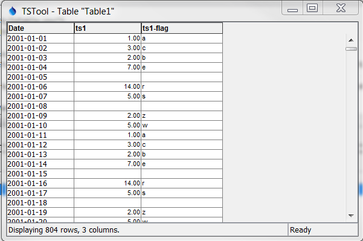
</p>**

**<p style="text-align: center;">
Data Table used with `WriteTableToExcel` Command
</p>**

To configure style-based formatting, a style table is defined listing properties for formatting a cell.
This table can be defined as a CSV file,
Excel worksheet or other format and read into TSTool using a suitable command.
The following figure illustrates a basic style table, which can be shared among commands.

**<p style="text-align: center;">
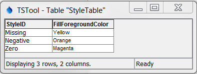
</p>**

**<p style="text-align: center;">
Style Table used with `WriteTableToExcel` Command
</p>**

The following style table column names are recognized.
The default values for cell style properties not listed in the table are those provided by Excel.

**<p style="text-align: center;">
Recognized Style Table Column Names
</p>**

|**Column Names**&nbsp;&nbsp;&nbsp;&nbsp;&nbsp;&nbsp;&nbsp;&nbsp;&nbsp;&nbsp;&nbsp;&nbsp;&nbsp;&nbsp;&nbsp;&nbsp;&nbsp;&nbsp;&nbsp;&nbsp;&nbsp;&nbsp;&nbsp;&nbsp;&nbsp;&nbsp;&nbsp;&nbsp;&nbsp;&nbsp;|**Description**|**Default**|
| --------------|-----------------|---|
|`StyleID`|An identifier for the style, which is used in the format table below.|None – must be specified.|
|`FillForegroundColor`|The foreground fill color as a named color (e.g., `Red`), RGB triplet (`255,255,255`), or hex color `0xFFFFFF`.  The following named colors are recognized:  `black`, `blue`, `cyan`, `darkgray`, `gray`, `green`, `lightgray`, `magenta`, `none`, `orange`, `pink`, `red`, `white`, `yellow`.|No fill color.|
|`FillPattern`|Fill pattern for cells using `FillForegroundColor` and `FillBackgroundColor`.|Currently always defaults to solid.|

The condition table indicates how table values should be evaluated to determine styles.
The following example indicates that any columns with names starting with `ts`
should be processed to evaluate for missing, negative, and zero values.

**<p style="text-align: center;">
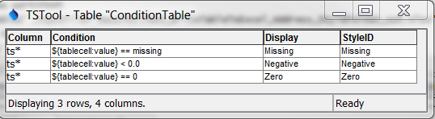
</p>**

**<p style="text-align: center;">
Condition Table used with `WriteTableToExcel` Command for Specific Checks and Formatting
</p>**

For the above style and format tables, the column names must be specified as shown.
The ***Condition*** column can contain the following specifiers:

*   `${tablecell:value}` – the cell value (raw value before any formatting)
*   `${tablecell:comment}` – the cell comment (currently not implemented in TSTool tables but is reserved for future implementation and Excel cell comments)

Values on the left and right of the operator must be separated with a space to facilitate parsing the condition.
The ***Condition*** column can contain the following operators.
Currently conditions can be specified for table column types double, float, integer, long, and string.

**<p style="text-align: center;">
Condition Table Operators
</p>**

|**Operator**|**Description**|
| --------------|-----------------|
|`<`|Less than.|
|`<=`|Less than or equal to.|
|`==`|Equal to.  Specify the right-side value as missing to check for missing.|
|`!=`|Not equal to.  Specify the right-side value as missing to check for missing.|
|`>`|Greater than.|
|`>=`|Greater than or equal to.|
|`contains`|Specify for string values to check for substring (case-dependent).|
|`startswith`|Specify for string values to check for substring at start (case-dependent).|
|`endswith`|Specify for string values to check for substring at end (case-dependent).|

Multiple conditions can be specified by using `AND` (surrounded by a single space) between conditions.
The ***Display*** column in the condition table is optional and provides test to use in the legend.
If the ***Display*** column is not provided, the ***Condition*** column contents will be used for the legend. 

The following figure illustrates the output from the above example.

**<p style="text-align: center;">
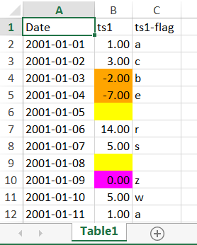
</p>**

**<p style="text-align: center;">
`WriteTableToExcel` Command Example Output for Specific Checks and Formatting
</p>**

The following example illustrates using multiple conditions to implement a color scale.

**<p style="text-align: center;">
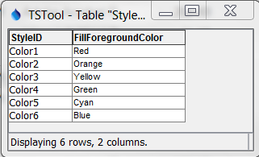
</p>**

**<p style="text-align: center;">
Style Table used with `WriteTableToExcel` Command for a Color Scale
</p>**

**<p style="text-align: center;">
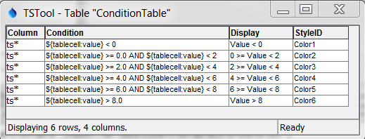
</p>**

**<p style="text-align: center;">
Condition Table used with `WriteTableToExcel` Command for a Color Scale
</p>**

**<p style="text-align: center;">
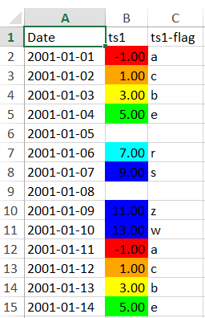
</p>**

**<p style="text-align: center;">
`WriteTableToExcel` Command Example Output for a Color Scale
</p>**

## Examples ##

See the [automated tests](https://github.com/OpenCDSS/cdss-app-tstool-test/tree/master/test/commands/WriteTableToExcel).

## Troubleshooting ##

## See Also ##

*   [`ReadTableFromDelimitedFile`](../ReadTableFromDelimitedFile/ReadTableFromDelimitedFile.md) command
*   [`WriteTableToExcel`](../WriteTableToExcel/WriteTableToExcel.md) command
*   [`WriteTimeSeriesToExcel`](../WriteTimeSeriesToExcel/WriteTimeSeriesToExcel.md) command
