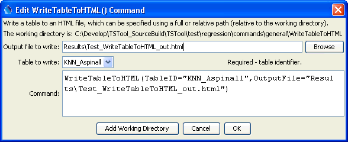

# TSTool / Command / WriteTableToHTML #

*   [Overview](#overview)
*   [Command Editor](#command-editor)
*   [Command Syntax](#command-syntax)
*   [Examples](#examples)
*   [Troubleshooting](#troubleshooting)
*   [See Also](#see-also)

-------------------------

## Overview ##

The `WriteTableToHTML` command writes a table to an HTML file.
It can be used to publish tables for the web.

Table column names are output as the HTML table column headers.
Formatting for cell values is based on the precision of the original table data.
Default styles are written at the top of the HTML.  In the future the command may accept styles as input.

## Command Editor ##

The command is available in the following TSTool menu:

*   ***Commands(Table) / Output Table***

The following dialog is used to edit the command and illustrates the command syntax.

**<p style="text-align: center;">

</p>**

**<p style="text-align: center;">
`WriteTableToHTML` Command Editor (<a href="../WriteTableToHTML.png">see also the full-size image</a>)
</p>**

## Command Syntax ##

The command syntax is as follows:

```text
WriteTableToHTML(Parameter="Value",...)
```
**<p style="text-align: center;">
Command Parameters
</p>**

| **Parameter**&nbsp;&nbsp;&nbsp;&nbsp;&nbsp;&nbsp;&nbsp;&nbsp;&nbsp;&nbsp;&nbsp;&nbsp;&nbsp;&nbsp;&nbsp;&nbsp;&nbsp;&nbsp; | **Description** | **Default**&nbsp;&nbsp;&nbsp;&nbsp;&nbsp;&nbsp;&nbsp;&nbsp;&nbsp;&nbsp; |
| --------------|-----------------|----------------- |
|`TableID`<br>**required**|Identifier for the table to write.  Can be specified using processor `${Property}`.|None – must be specified.|
|`OutputFile`<br>**required**|The name of the file to write, as an absolute path or relative to the command file location.  Can be specified using processor `${Property}`.|None – must be specified.|

## Examples ##

See the [automated tests](https://github.com/OpenCDSS/cdss-app-tstool-test/tree/master/test/commands/WriteTableToHTML).

## Troubleshooting ##

See the main [TSTool Troubleshooting](../../troubleshooting/troubleshooting.md) documentation.

## See Also ##

*   [`ReadTableFromDelimitedFile`](../ReadTableFromDelimitedFile/ReadTableFromDelimitedFile.md) command
