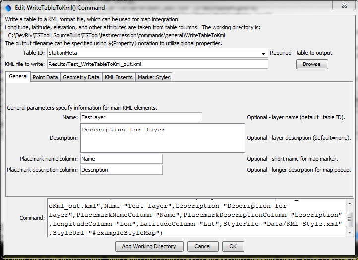
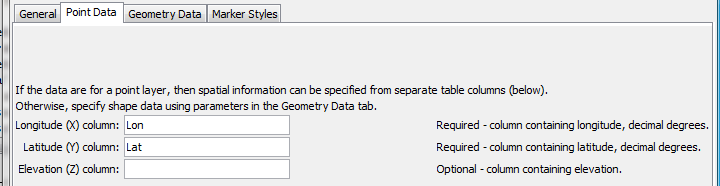
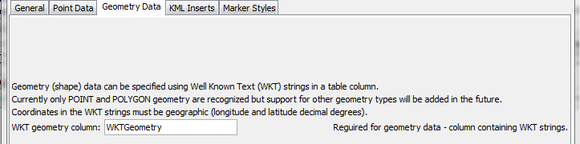
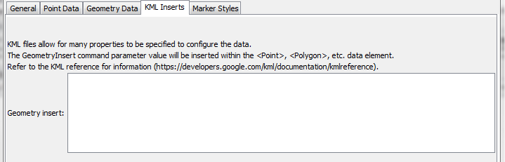
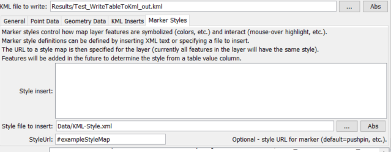

# TSTool / Command / WriteTableToKml #

*   [Overview](#overview)
*   [Command Editor](#command-editor)
*   [Command Syntax](#command-syntax)
*   [Examples](#examples)
*   [Troubleshooting](#troubleshooting)
*   [See Also](#see-also)

-------------------------

## Overview ##

The `WriteTableToKml` command writes a table to a Keyhole Markup Language (KML) file,
which is a spatial data format used by Google Earth and web mapping software.  See:

*   [Keyhole Markup Language Developer's Guide](https://developers.google.com/kml/documentation/topicsinkml)

The table must include columns for longitude and latitude or a column containing Well Known Text (WKT) geometry strings.  See:

*   [Well-known Text on WikiPedia](https://en.wikipedia.org/wiki/Well-known_text)

Currently only point and polygon data can be processed but in the future
support for well-known text for other geometry types will be added.

## Command Editor ##

The command is available in the following TSTool menu:

*   ***Commands / Spatial Data Processing***

The following dialog is used to edit the command and illustrates the syntax of the command for general parameters.

**<p style="text-align: center;">

</p>**

**<p style="text-align: center;">
`WriteTableToKml` Command Editor for General Parameters (<a href="../WriteTableToKml.png">see also the full-size image</a>)
</p>**

The following figure illustrates the command syntax for point data in separate columns.

**<p style="text-align: center;">

</p>**

**<p style="text-align: center;">
`WriteTableToKml` Command Editor for Point Data Parameters (<a href="../WriteTableToKml_Point.png">see also the full-size image</a>)
</p>**

The following figure illustrates the command syntax for layers specified with a geometry data column.

**<p style="text-align: center;">

</p>**

**<p style="text-align: center;">
`WriteTableToKml` Command Editor for Geometry Data Parameters (<a href="../WriteTableToKml_Geometry.png">see also the full-size image</a>)
</p>**

The following figure illustrates the command syntax for KML inserts.  This allows KML elements to be inserted in the KML file.

**<p style="text-align: center;">

</p>**

**<p style="text-align: center;">
`WriteTableToKml` Command Editor for KML Insert Parameters (<a href="../WriteTableToKml_KmlInsert.png">see also the full-size image</a>)
</p>**

The following figure illustrates the command syntax for marker style parameters.

**<p style="text-align: center;">

</p>**

**<p style="text-align: center;">
`WriteTableToKml` Command Editor for Marker Style Parameters (<a href="../WriteTableToKml_Styles.png">see also the full-size image</a>)
</p>**

## Command Syntax ##

The command syntax is as follows:

```text
WriteTableToKml(Parameter="Value",...)
```
**<p style="text-align: center;">
Command Parameters
</p>**

|**Parameter**&nbsp;&nbsp;&nbsp;&nbsp;&nbsp;&nbsp;&nbsp;&nbsp;&nbsp;&nbsp;&nbsp;&nbsp;&nbsp;&nbsp;&nbsp;&nbsp;&nbsp;&nbsp;&nbsp;&nbsp;&nbsp;&nbsp;&nbsp;&nbsp;&nbsp;&nbsp;&nbsp;&nbsp;&nbsp;&nbsp;&nbsp;&nbsp;&nbsp;&nbsp;&nbsp;&nbsp;&nbsp;&nbsp;&nbsp;|**Description**|**Default**&nbsp;&nbsp;&nbsp;&nbsp;&nbsp;&nbsp;&nbsp;&nbsp;&nbsp;&nbsp;&nbsp;&nbsp;&nbsp;&nbsp;&nbsp;&nbsp;&nbsp;&nbsp;&nbsp;&nbsp;&nbsp;&nbsp;&nbsp;&nbsp;&nbsp;&nbsp;&nbsp;|
|--------------|-----------------|-----------------|
|`TableID`|Identifier for the table to write.|None – must be specified.|
|`OutputFile`|The name of the KML file to write, as an absolute path or relative to the command file location.|None – must be specified.|
|`Name`|The name of the layer, corresponding to the `<name>` KML element.|Table ID.|
|`Description`|The description for the layer, corresponding to the `<description>` KML element.  The text can contain HTML markup.|Blank|
|`PlacemarkNameColumn`|The name of the table column that contains placemark names, corresponding to the KML `<Placemark><name>` element.|Blank|
|`PlacemarkDescriptionColumn`|The name of the table column that contains placemark descriptions, corresponding to the KML `<Placemark><description>` element.  The description text in the table can contain HTML markup.|Blank|
|`LongitudeColumn`|The name of the table column that contains longitude, corresponding to the KML `<Point><coordinates>` element.|None – must be specified.|
|`LatitudeColumn`|The name of the table column that contains latitude, corresponding to the KML `<Point><coordinates>` element.|None – must be specified.|
|`ElevationColumn`|The name of the table column that contains elevation, corresponding to the KML `<Point><coordinates>` element.|Elevation is omitted.|
|`WKTGeometryColumn`|The name of the table column that contains Well Known Text (WKT) geometry strings.||
|`GeometryInsert`|Text containing KML elements to insert after `<Point>`, `<Polygon>` or other elements, used to configure the KML data.|No inserts.|
|`StyleInsert`|Text containing `<Style>` and `<StyleMap>` element text, which will be inserted in the KML file.|No styles.|
|`StyleFile`|Similar to `StyleInsert`; however, the style information to be inserted is read from the specified file.||
|`StyleUrl`|Specifies the `<StyleMap id=”myStyleMap”>` or `<Style id=”myStyle”>` element to use for each placemark in the layer.  For example, specify as `#myStyleMap` to match a style map included in the KML file with the `StyleInsert` or `StyleFile` parameter, where the URL matches the id attribute.|Default KML style.|

## Examples ##

See the [automated tests](https://github.com/OpenCDSS/cdss-app-tstool-test/tree/master/test/commands/WriteTableToKml).

The following is an example of a style insert file (refer to KML reference documentation for explanation).  The last style is for polygons.

```
<Style id="highlightPlacemark">
  <IconStyle>
    <Icon>
      <href>https://maps.google.com/mapfiles/kml/paddle/red-stars.png</href>
    </Icon>
  </IconStyle>
</Style>
<Style id="normalPlacemark">
  <IconStyle>
    <Icon>
      <href>https://maps.google.com/mapfiles/kml/paddle/wht-blank.png</href>
    </Icon>
  </IconStyle>
</Style>
<StyleMap id="exampleStyleMap">
  <Pair>
    <key>normal</key>
    <styleUrl>#normalPlacemark</styleUrl>
  </Pair>
  <Pair>
    <key>highlight</key>
    <styleUrl>#highlightPlacemark</styleUrl>
  </Pair>
</StyleMap>
<Style id="polygonFillStyle">
  <PolyStyle>
    <color>ff0000ff</color>
    <outline>0</outline>
    <fill>1</fill>
  </PolyStyle>
</Style>
```

The following is an example of the resulting KML file:

```
<?xml version="1.0" encoding="UTF-8"?>
<kml xmlns="https://www.opengis.net/kml/2.2">
 <Document>
  <name>Test layer</name>
  <description>Description for layer</description>
  <Style> …. Omitted … see example above
  </Style>
  <StyleMap>  … Omitted … see example above
  </SyleMap>
  <Placemark>
   <name>ANTERO RSVR</name>
   <description>Description:  ANTERO RSVR</description>
   <styleUrl>#exampleStyleMap</styleUrl>
   <Point>
    <coordinates>-105.89194,38.99333,0</coordinates>
   </Point>
   </Placemark>
   <Placemark>
   <name>BAILEY</name>
   <description>Description:  BAILEY</description>
   <styleUrl>#exampleStyleMap</styleUrl>
   <Point>
    <coordinates>-105.47667,39.40472,0</coordinates>
   </Point>
  </Placemark>
 </Document>
</kml>
```

The following example illustrates a CSV table that specifies WKT for points (see `WKTGeometry` column):

```
"ID","ID_text","Lon","Lat","Name","WKTGeometry"
50263,050263,-105.891940,38.993330,ANTERO RSVR,POINT (-105.891940 38.993330)
50454,050454,-105.476670,39.404720,BAILEY,POINT (-105.476670 39.404720)
50848,050848,-105.266670,39.991940,BOULDER,POINT (-105.266670 39.991940)
```

The following example illustrates a CSV table that specifies WKT for polygons:

```
"ID","ID_text","Lon","Lat","Name","WKTGeometry"
50263,050263,-105.891940,38.993330,ANTERO RSVR,"POLYGON (-105.891940 38.993330,-106 39,-106 37.5)"
50454,050454,-105.476670,39.404720,BAILEY,"POLYGON (-105.476670 39.404720, -104 39, -103 37.5)"
```

## Troubleshooting ##

## See Also ##

*   [`WriteTableToGeoJSON`](../WriteTableToGeoJSON/WriteTableToGeoJSON.md) command
*   [`WriteTableToShapefile`](../WriteTableToShapefile/WriteTableToShapefile.md) command
