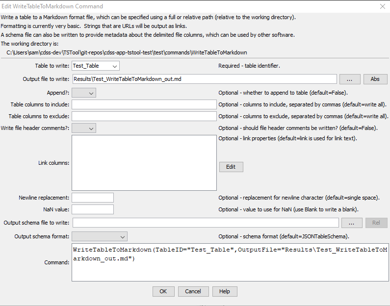

# TSTool / Command / WriteTableToMarkdown #

*   [Overview](#overview)
*   [Command Editor](#command-editor)
*   [Command Syntax](#command-syntax)
*   [Examples](#examples)
*   [Troubleshooting](#troubleshooting)
*   [See Also](#see-also)

-------------------------

## Overview ##

The `WriteTableToMarkdown` command writes a table to a Markdown format file. See:

*   [Markdown (Wikipedia)](https://en.wikipedia.org/wiki/Markdown)
*   [Markdown Guide](https://www.markdownguide.org/)

It can be used to provide tabular data for documentation.
It is also useful to write tables to Markdown text files for automated tests.

The default is to use `|` as the column separator without any column justification specified.

## Command Editor ##

The command is available in the following TSTool menu:

*   ***Commands(Table) / Output Table***

The following dialog is used to edit the command and illustrates the command syntax.

**<p style="text-align: center;">

</p>**

**<p style="text-align: center;">
`WriteTableToMarkdown` Command Editor (<a href="../WriteTableToMarkdown.png">see also the full-size image</a>)
</p>**

## Command Syntax ##

The command syntax is as follows:

```text
WriteTableToMarkdown(Parameter="Value",...)
```
**<p style="text-align: center;">
Command Parameters
</p>**

| **Parameter**&nbsp;&nbsp;&nbsp;&nbsp;&nbsp;&nbsp;&nbsp;&nbsp;&nbsp;&nbsp;&nbsp;&nbsp;&nbsp;&nbsp;&nbsp;&nbsp;&nbsp;&nbsp;&nbsp;&nbsp;&nbsp;&nbsp;&nbsp;&nbsp;&nbsp;&nbsp; | **Description** | **Default**&nbsp;&nbsp;&nbsp;&nbsp;&nbsp;&nbsp;&nbsp;&nbsp;&nbsp;&nbsp;&nbsp;&nbsp;&nbsp;&nbsp;&nbsp;&nbsp; |
| --------------|-----------------|----------------- |
|`TableID`<br>**required**|Identifier for the table to write.  Can be specified using processor `${Property}`.|None – must be specified.|
|`OutputFile`<br>**required**|The name of the file to write, as an absolute path or relative to the command file location.  Can be specified using processor `${Property}`.|None – must be specified.|
|`Append`|Whether to append to an existing file (`True`) or write a new file (`False`). | `False` |
|`IncludeColumns`|The names of columns to write, separated by commas.|Write all of the columns.|
|`ExcludeColumns`|The names of columns to **not** write, separated by commas.|Write all of the included columns.|
|`WriteHeaderComments`|Indicates whether to write the file header comments, `True` or `False`. File header comments include information about the creator of the file.  Comments are written as HTML `<!-- -->` comment, which typically passes through software that converts Markdown to HTML for viewing.| `False`|
|`LinkColumns` | Indicate columns that are links and specify the corresponding column containing the link text, using the format: `LinkColumn1:LinkTextColumn1,LinkColumn2:LinkTextColumn2,...` | Links are automatically detected and the link text is the same as the link URI. |
|`NaNValue`|The value to write for `NaN` data values.  Specify the word `Blank` to write a blank (empty string).|`NaN`|
|`OutputSchemaFile`|Name of schema file to write, useful to help other software understand contents of the delimited file.  See the `OutputSchemaFormat` parameter.  This is an experimental feature being evaluated to facilitate data exchange between software.|Do not create schema file.|
|`OutputSchemaFormat`|Schema format, one of the following, output is limited but will be expanded in the future:<ul><li>`JSONTableSchema` – see [frictionlessdata schema](https://specs.frictionlessdata.io/table-schema/)</li><li>`GoogleBigQuery` – see [Google big query](https://cloud.google.com/bigquery/docs/reference/rest/v2/tables)</li></ul>| `JSONTableSchema`|

## Examples ##

See the [automated tests](https://github.com/OpenCDSS/cdss-app-tstool-test/tree/master/test/commands/WriteTableToMarkdown).

## Troubleshooting ##

## See Also ##

*   [`WriteTableToDelimitedFile`](../WriteTableToDelimitedFile/WriteTableToDelimitedFile.md) command
