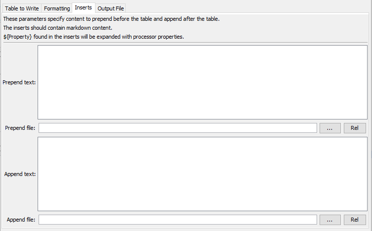

# TSTool / Command / WriteTableToMarkdown #

*   [Overview](#overview)
*   [Command Editor](#command-editor)
*   [Command Syntax](#command-syntax)
*   [Examples](#examples)
*   [Troubleshooting](#troubleshooting)
*   [See Also](#see-also)

-------------------------

## Overview ##

The `WriteTableToMarkdown` command writes a table to a Markdown format file. See:

*   [Markdown (Wikipedia)](https://en.wikipedia.org/wiki/Markdown)
*   [Markdown Guide](https://www.markdownguide.org/)

It can be used to provide tabular data for documentation.
It is also useful to write tables to Markdown text files for automated tests.

The default is to use `|` as the column separator without any column justification specified.

## Command Editor ##

The command is available in the following TSTool menu:

*   ***Commands(Table) / Output Table***

The following dialog is used to edit the command and illustrates the command syntax.

**<p style="text-align: center;">

</p>**

**<p style="text-align: center;">
`WriteTableToMarkdown` Command Editor for Table Parameters (<a href="../WriteTableToMarkdown-Table.png">see full-size image</a>)
</p>**

**<p style="text-align: center;">

</p>**

**<p style="text-align: center;">
`WriteTableToMarkdown` Command Editor for Formatting Parameters (<a href="../WriteTableToMarkdown-Formatting.png">see full-size image</a>)
</p>**

**<p style="text-align: center;">

</p>**

**<p style="text-align: center;">
`WriteTableToMarkdown` Command Editor for Inserts Parameters (<a href="../WriteTableToMarkdown-Inserts.png">see full-size image</a>)
</p>**

**<p style="text-align: center;">

</p>**

**<p style="text-align: center;">
`WriteTableToMarkdown` Command Editor for Output File Parameters (<a href="../WriteTableToMarkdown-Output.png">see full-size image</a>)
</p>**

## Command Syntax ##

The command syntax is as follows:

```text
WriteTableToMarkdown(Parameter="Value",...)
```
**<p style="text-align: center;">
Command Parameters
</p>**

| **Tab** | **Parameter**&nbsp;&nbsp;&nbsp;&nbsp;&nbsp;&nbsp;&nbsp;&nbsp;&nbsp;&nbsp;&nbsp;&nbsp;&nbsp;&nbsp;&nbsp;&nbsp;&nbsp;&nbsp;&nbsp;&nbsp;&nbsp;&nbsp;&nbsp;&nbsp;&nbsp;&nbsp; | **Description** | **Default**&nbsp;&nbsp;&nbsp;&nbsp;&nbsp;&nbsp;&nbsp;&nbsp;&nbsp;&nbsp;&nbsp;&nbsp;&nbsp;&nbsp;&nbsp;&nbsp; |
| -- | --------------|-----------------|----------------- |
| ***Table to Write*** | `TableID`<br>**required**|Identifier for the table to write.  Can be specified using `${Property}` syntax.|None – must be specified.|
||`IncludeColumns`|The names of columns to write, separated by commas.|Write all of the columns.|
||`ExcludeColumns`|The names of columns to **not** write, separated by commas.|Write all of the included columns.|
|***Formatting***|`LinkColumns` | Indicate columns that are links and specify the corresponding column containing the link text, using the format: `LinkColumn1:LinkTextColumn1,LinkColumn2:LinkTextColumn2,...` | Links are automatically detected and the link text is the same as the link URI. |
||`NewlineReplacement`|The string to replace newlines in string values, necessary to prevent unexpected line breaks in output rows.  In order to handle newlines from various systems, the following patterns are replaced in sequence:<ul><li>`\r\n`</li><li>`\n`</li><li>`\r`</li></ul><br>Use `<br>` to replace newlines with the HTML line break element, which will typically pass through viewing software to display a line break within a table cell. The following special parameter values are recognized:<ul><li>`\t` – replace newline with tab</li><li>`\s` – replace newline with space</li></ul>| Space. |
||`NaNValue`|The value to write for `NaN` data values.  Specify the word `Blank` to write a blank (empty string).|`NaN`|
|***Inserts*** | `PrependText` | Text to prepend to the output file before the table.  Line breaks can be inserted using the `Return` key. Can be specified using `${Property}` syntax. | |
| | `PrependFile` | Path to a file containing text to prepend to the output file before the table.  Can be specified using `${Property}` syntax. | |
| | `AppendText` | Text to append to the output file after the table.  Line breaks can be inserted using the `Return` key. Can be specified using `${Property}` syntax. | |
| | `AppendFile` | Path to a file containing text to append to the output file after the table.  Can be specified using `${Property}` syntax. | |
|***Output File***|`OutputFile`<br>**required**|The name of the file to write, as an absolute path or relative to the command file location.  Can be specified using processor `${Property}`.|None – must be specified.|
||`Append`|Whether to append to an existing file (`True`) or write a new file (`False`). | `False` |
||`WriteHeaderComments`|Indicates whether to write the file header comments, `True` or `False`. File header comments include information about the creator of the file.  Comments are written as HTML `<!-- -->` comment, which typically passes through software that converts Markdown to HTML for viewing.  The comments are therefore included in the markdown file for information but are not visible but are not visible in a markdown viewer. | `False`|

## Examples ##

See the [automated tests](https://github.com/OpenCDSS/cdss-app-tstool-test/tree/master/test/commands/WriteTableToMarkdown).

## Troubleshooting ##

See the main [TSTool Troubleshooting](../../troubleshooting/troubleshooting.md) documentation.

## See Also ##

*   [`WriteTableToDelimitedFile`](../WriteTableToDelimitedFile/WriteTableToDelimitedFile.md) command
