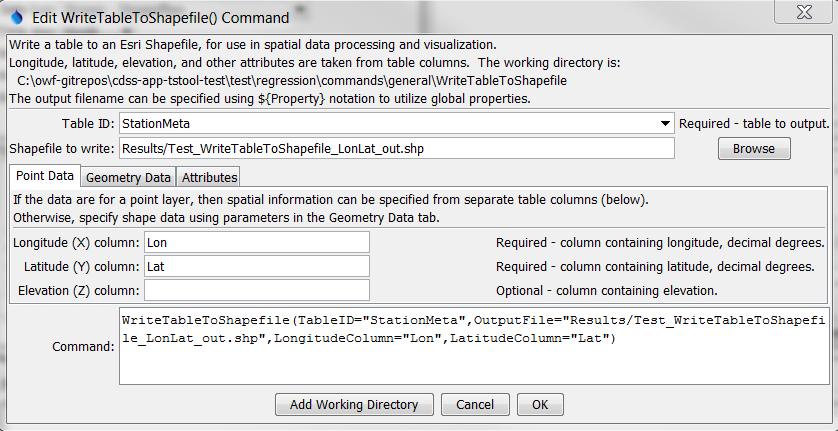
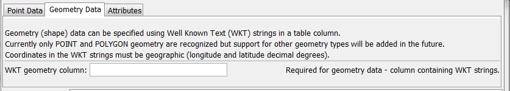
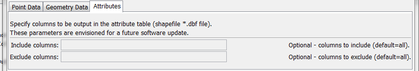

# TSTool / Command / WriteTableToShapefile #

*   [Overview](#overview)
*   [Command Editor](#command-editor)
*   [Command Syntax](#command-syntax)
*   [Examples](#examples)
*   [Troubleshooting](#troubleshooting)
*   [See Also](#see-also)

-------------------------

## Overview ##

The `WriteTableToShapefile` command writes a table to an Esri Shapefile,
which is a spatial data format that can be viewed in geographic information system (GIS) software and other visualization tools.  See:

*   [Shapefile on Wikipedia](https://en.wikipedia.org/wiki/Shapefile)

The table must include columns for longitude and latitude or a column containing Well Known Text (WKT) geometry strings.  See:

*   [Well-known Text on Wikipedia](https://en.wikipedia.org/wiki/Well-known_text)

Currently only point and polygon data can be processed but in the future support
for well-known text for other geometry types will be added.
A future enhancement of this command will allow the geometry feature data to be read
from an existing shapefile or other standard spatial data format.

## Command Editor ##

The command is available in the following TSTool menu:

*   ***Commands / Spatial Data Processing***

The following dialog is used to edit the command and illustrates the syntax of the command.

**<p style="text-align: center;">

</p>**

**<p style="text-align: center;">
`WriteTableToShapefile` Command Editor (<a href="../WriteTableToShapefile.png">see also the full-size image</a>)
</p>**

The following figure illustrates the command syntax for layers specified with a geometry data column.

**<p style="text-align: center;">

</p>**

**<p style="text-align: center;">
`WriteTableToShapefile` Command Editor for Geometry Data Parameters (<a href="../WriteTableToShapefile_WKT.png">see also the full-size image</a>)
</p>**

The following figure illustrates the command syntax for specifying columns to include as attributes.

**<p style="text-align: center;">

</p>**

**<p style="text-align: center;">
`WriteTableToShapefile` Command Editor for Attribute Parameters (<a href="../WriteTableToShapefile_Attributes.png">see also the full-size image</a>)
</p>**

## Command Syntax ##

The command syntax is as follows:

```text
WriteTableToShapefile(Parameter="Value",...)
```
**<p style="text-align: center;">
Command Parameters
</p>**

|**Parameter**&nbsp;&nbsp;&nbsp;&nbsp;&nbsp;&nbsp;&nbsp;&nbsp;&nbsp;&nbsp;&nbsp;&nbsp;&nbsp;&nbsp;&nbsp;&nbsp;&nbsp;&nbsp;&nbsp;&nbsp;&nbsp;&nbsp;&nbsp;&nbsp;&nbsp;|**Description**|**Default**&nbsp;&nbsp;&nbsp;&nbsp;&nbsp;&nbsp;&nbsp;&nbsp;&nbsp;&nbsp;&nbsp;&nbsp;&nbsp;&nbsp;&nbsp;&nbsp;&nbsp;&nbsp;&nbsp;&nbsp;&nbsp;&nbsp;&nbsp;&nbsp;&nbsp;&nbsp;&nbsp;|
|--------------|-----------------|-----------------|
|`TableID`|Identifier for the table to write.  Can be specified using `${Property}` notation.|None – must be specified.|
|`OutputFile`|The name of the shapefile file to write, as an absolute path or relative to the command file location.  Can be specified using `${Property}` notation.|None – must be specified.|
|`LongitudeColumn`|The name of the table column that contains longitude.|None – must be specified.|
|`LatitudeColumn`|The name of the table column that contains latitude.|None – must be specified.|
|`ElevationColumn`|The name of the table column that contains elevation.|Elevation is omitted.|
|`WKTGeometryColumn`|The name of the table column that contains Well Known Text (WKT) geometry strings.||
|`IncludeColumns`|List of column-separated table column names to include as attributes.  Currently not enabled.|Include all columns.|
|`ExcludeColumns`|List of column-separated table column names to exclude as attributes.  Currently not enabled.|Include all columns.|

## Examples ##

See the [automated tests](https://github.com/OpenCDSS/cdss-app-tstool-test/tree/master/test/commands/WriteTableToShapefile).

The following example illustrates a CSV table that specifies WKT for points (see WKTGeometry column):

```
"ID","ID_text","Lon","Lat","Name","WKTGeometry"
50263,050263,-105.891940,38.993330,ANTERO RSVR,POINT (-105.891940 38.993330)
50454,050454,-105.476670,39.404720,BAILEY,POINT (-105.476670 39.404720)
50848,050848,-105.266670,39.991940,BOULDER,POINT (-105.266670 39.991940)
```

The following example illustrates a CSV table that specifies WKT for polygons:

```
"ID","ID_text","Lon","Lat","Name","WKTGeometry"
50263,050263,-105.891940,38.993330,ANTERO RSVR,"POLYGON (-105.891940 38.993330,-106 39,-106 37.5)"
50454,050454,-105.476670,39.404720,BAILEY,"POLYGON (-105.476670 39.404720, -104 39, -103 37.5)"
```

## Troubleshooting ##

See the main [TSTool Troubleshooting](../../troubleshooting/troubleshooting.md) documentation.

## See Also ##

*   [`WriteTableToGeoJSON`](../WriteTableToGeoJSON/WriteTableToGeoJSON.md) command
*   [`WriteTableToKml`](../WriteTableToKml/WriteTableToKml.md) command
