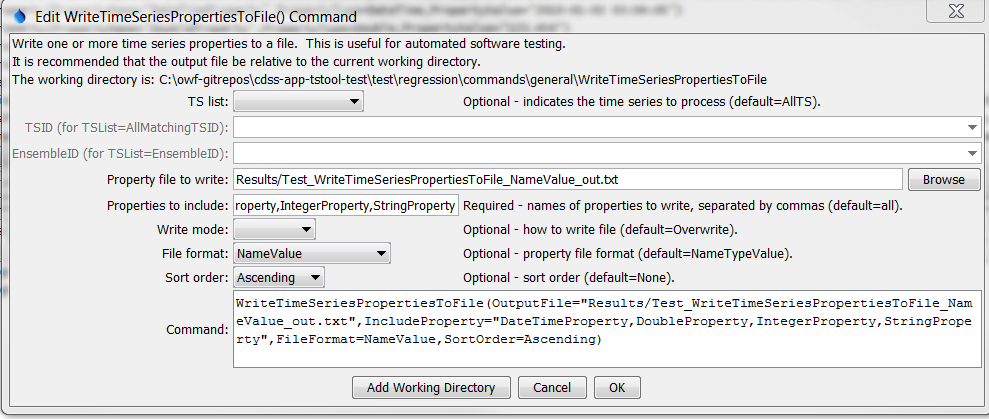

# TSTool / Command / WriteTimeSeriesPropertiesToFile #

* [Overview](#overview)
* [Command Editor](#command-editor)
* [Command Syntax](#command-syntax)
* [Examples](#examples)
* [Troubleshooting](#troubleshooting)
* [See Also](#see-also)

-------------------------

## Overview ##

The `WriteTimeSeriesPropertiesToFile` command writes the value of time series properties to a file.
This command should not be confused with the [`WritePropertiesToFile`](../WritePropertiesToFile/WritePropertiesToFile.md) command,
which writes processor properties.
This command is useful for testing whether properties are being set.
It can also be used to pass information from TSTool to another program.  

A number of property formats are supported as listed in the following table.

**<p style="text-align: center;">
Property File Formats
</p>**

| **Format**&nbsp;&nbsp;&nbsp;&nbsp;&nbsp;&nbsp;&nbsp;&nbsp;&nbsp;&nbsp;&nbsp;&nbsp;&nbsp;&nbsp;&nbsp;&nbsp;&nbsp;&nbsp;&nbsp;&nbsp;&nbsp;&nbsp;&nbsp;&nbsp;&nbsp;&nbsp;&nbsp;&nbsp;&nbsp; | **Description** |
|-----------------------|-----------------|
| `NameValue`           | Simple format, all properties handled as text:<br><br>`PropertyName=PropertyValue`<br>`PropertyName="Property value, quoted if necessary"` |
| `NameTypeValue`       | Same as `NameValue` format, with non-primitive objects treated as simple constructors:<br><br>`PropertyName=PropertyValue`<br>`DateTimeProperty=DateTime("2010-10-01 12:30")`|
| `NameTypeValuePython` | Similar to the `NameTypeValue` format; however, objects are represented using “Pythonic” notation, to allow the file to be used directly by Python scripts:<br><br>`PropertyName="PropertyValue"`<br>`DateTimeProperty=DateTime(2010,10,1,12,30)` |

## Command Editor ##

The following dialog is used to edit the command and illustrates the command syntax.

**<p style="text-align: center;">

</p>**

**<p style="text-align: center;">
`WriteTimeSeriesPropertiesToFile` Command Editor (<a href="../WriteTimeSeriesPropertiesToFile.png">see also the full-size image</a>)
</p>**

## Command Syntax ##

The command syntax is as follows:

```text
WriteTimeSeriesPropertiesToFile(Parameter="Value",...)
```
**<p style="text-align: center;">
Command Parameters
</p>**

| **Parameter**&nbsp;&nbsp;&nbsp;&nbsp;&nbsp;&nbsp;&nbsp;&nbsp;&nbsp;&nbsp;&nbsp;&nbsp;&nbsp;&nbsp;&nbsp;&nbsp;&nbsp;&nbsp;&nbsp;&nbsp;&nbsp; | **Description** | **Default**&nbsp;&nbsp;&nbsp;&nbsp;&nbsp;&nbsp;&nbsp;&nbsp;&nbsp;&nbsp;&nbsp;&nbsp;&nbsp;&nbsp;&nbsp;&nbsp;&nbsp;&nbsp;&nbsp;&nbsp;&nbsp;&nbsp;&nbsp;&nbsp;&nbsp;&nbsp;&nbsp;&nbsp; |
| --------------|-----------------|----------------- |
| `TSList`|Indicates the list of time series to be processed, one of:<br><ul><li>`AllMatchingTSID` – all time series that match the TSID (single TSID or TSID with wildcards) will be processed.</li><li>`AllTS` – all time series before the command.</li><li>`EnsembleID` – all time series in the ensemble will be processed (see the EnsembleID parameter).</li><li>`FirstMatchingTSID` – the first time series that matches the TSID (single TSID or TSID with wildcards) will be processed.</li><li>`LastMatchingTSID` – the last time series that matches the TSID (single TSID or TSID with wildcards) will be processed.</li><li>`SelectedTS` – the time series are those selected with the [`SelectTimeSeries`](../SelectTimeSeries/SelectTimeSeries.md) command.</li></ul> | `AllTS` |
| `TSID`|The time series identifier or alias for the time series to be processed, using the `*` wildcard character to match multiple time series.  Can be specified using `${Property}`.|Required if `TSList=*TSID`|
| `EnsembleID`|The ensemble to be processed, if processing an ensemble. Can be specified using `${Property}`.|Required if `TSList=*EnsembleID`|
|`OutputFile`<br>**required**| The property file to write, as an absolute path or relative to the command file, can use `${Property}`. | None - must be specified. |
|`IncludeProperties` | The names of properties to write, separated by commas.  The `*` wildcard can be used to indicate multiple properties. | If not specified, all processor properties will be written.|
|`WriteMode`|Indicates how the file should be written:<br><ul><li>`Append` – append the properties to the file without checking for matches (create the file if it does not exist)</li><li>`Overwrite` – overwrite the properties file</li><li>`Update` – update the properties in the file by first checking for matching property names (which will be updated) and then appending unmatched properties (not yet implemented)</li></ul>|`Overwrite`|
|`FileFormat`|Format of the properties file (see descriptions in the above **Property File Formats** table):<ul><li>`NameValue`</li><li>`NameTypeValue`</li><li>`NameTypeValuePython`|`NameValue`|
|`SortOrder`|The order to sort properties:<br><ul><li>`Ascending`</li><li>`Descending`</li><li>`None`</li></ul>|None – order depends on order in processor.|

## Examples ##

See the [automated tests](https://github.com/OpenCDSS/cdss-app-tstool-test/tree/master/test/regression/commands/general/WritePropertiesToFile).

## Troubleshooting ##

## See Also ##

* [`SelectTimeSeries`](../SelectTimeSeries/SelectTimeSeries.md) command
* [`SetProperty`](../SetProperty/SetProperty.md) command
* [`SetPropertyFromTimeSeries`](../SetPropertyFromTimeSeries/SetPropertyFromTimeSeries.md) command
