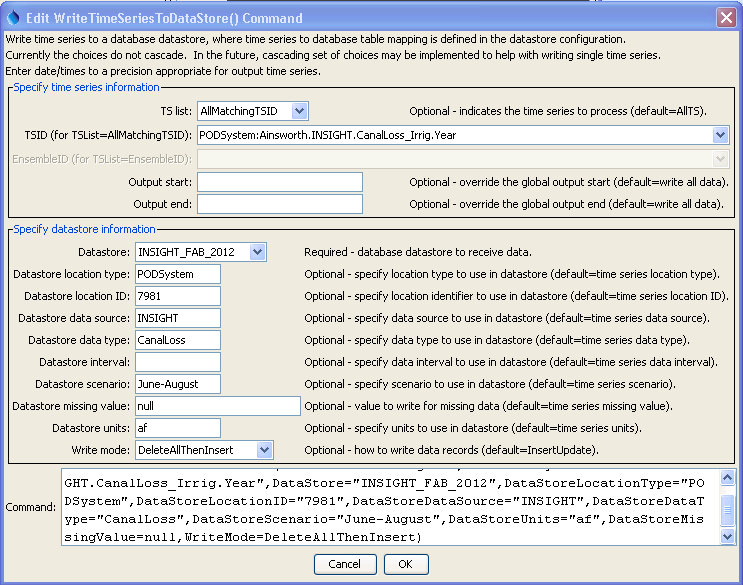

# TSTool / Command / WriteTimeSeriesToDataStore #

*   [Overview](#overview)
*   [Command Editor](#command-editor)
*   [Command Syntax](#command-syntax)
*   [Examples](#examples)
*   [Troubleshooting](#troubleshooting)
*   [See Also](#see-also)

-------------------------

## Overview ##

The `WriteTimeSeriesToDataStore` command writes time series to the specified database datastore.
This command can only write to databases that have a supported design structure.
Currently this command is only available for generic datastores (see the
[Generic Database Datastore appendix](../../datastore-ref/GenericDatabase/GenericDatabase.md)
 for information about supported database designs and datastore configuration properties).
This command cannot be used with web service datastores and use with Excel datastores has not been tested.
This command is useful in particular for bulk data loading such as for database
initialization and when tight integration with TSTool is not required or has not been implemented.

## Command Editor ##

The command is available in the following TSTool menu:

*   ***Commands / Output Time Series***

The following dialog is used to edit the command and illustrates the syntax of the command.

**<p style="text-align: center;">

</p>**

**<p style="text-align: center;">
`WriteTimeSeriesToDataStore` Command Editor (<a href="../WriteTimeSeriesToDataStore.png">see also the full-size image</a>)
</p>**

## Command Syntax ##

The command syntax is as follows:

```text
WriteTimeSeriesToDataStore(Parameter="Value",...)
```
**<p style="text-align: center;">
Command Parameters
</p>**

|**Parameter**&nbsp;&nbsp;&nbsp;&nbsp;&nbsp;&nbsp;&nbsp;&nbsp;&nbsp;&nbsp;&nbsp;&nbsp;&nbsp;&nbsp;&nbsp;&nbsp;&nbsp;&nbsp;&nbsp;&nbsp;&nbsp;&nbsp;&nbsp;&nbsp;&nbsp;&nbsp;&nbsp;|**Description**|**Default**&nbsp;&nbsp;&nbsp;&nbsp;&nbsp;&nbsp;&nbsp;&nbsp;&nbsp;&nbsp;&nbsp;&nbsp;&nbsp;&nbsp;&nbsp;&nbsp;&nbsp;&nbsp;&nbsp;&nbsp;&nbsp;&nbsp;&nbsp;&nbsp;&nbsp;&nbsp;&nbsp;|
|--------------|-----------------|-----------------|
|`TSList`|Indicates the list of time series to be processed, one of:<br><ul><li>`AllMatchingTSID` – all time series that match the TSID (single TSID or TSID with wildcards) will be processed.</li><li>`AllTS` – all time series before the command.</li><li>`EnsembleID` – all time series in the ensemble will be processed (see the EnsembleID parameter).</li><li>`FirstMatchingTSID` – the first time series that matches the TSID (single TSID or TSID with wildcards) will be processed.</li><li>`LastMatchingTSID` – the last time series that matches the TSID (single TSID or TSID with wildcards) will be processed.</li><li>`SelectedTS` – the time series are those selected with the [`SelectTimeSeries`](../SelectTimeSeries/SelectTimeSeries.md) command.</li></ul> | `AllTS` |
|`TSID`|The time series identifier or alias for the time series to be processed, using the `*` wildcard character to match multiple time series.  Can be specified using `${Property}`.|Required if `TSList=*TSID`|
|`EnsembleID`|The ensemble to be processed, if processing an ensemble. Can be specified using `${Property}`.|Required if `TSList=*EnsembleID`|
|`OutputStart`|The date/time for the start of the output.  Can be specified using `${Property}` notation.|Use the global output period.|
|`OutputEnd`|The date/time for the end of the output.  Can be specified using `${Property}` notation.|Use the global output period.|
|`DataStore`<br>**required**|The name of a database datastore to receive data.|None – must be specified.|
|`DataStoreLocationType`|The location type to match in the datastore.  Can be specified using `${Property}` notation.|Location type from time series is used.|
|`DataStoreLocationID`|The location identifier to match in the datastore.  Can be specified using `${Property}` notation.|Location identifier from time series is used.|
|`DataStoreDataSource`|The data source (provider) to match in the datastore.  Can be specified using `${Property}` notation.|Data source from time series is used.|
|`DataStoreDataType`|The data type to match in the datastore.  Can be specified using `${Property}` notation.|Data type from time series is used.|
|`DataStoreInterval`|The data interval to match in the datastore.  Can be specified using `${Property}` notation.|Data interval from time series is used.|
|`DataStoreScenario`|The scenario to match in the datastore.  Can be specified using `${Property}` notation.|Scenario from time series is used.|
|`DataStoreMissingValue`|The value to write to the datastore to indicate a missing value in the time series.  Specify null to write null to the database.|Missing value used for the time series will be used (e.g., `NaN`, `-999`).|
|`DataStoreUnits`|Units to use for time series in the database, currently not used.  Time series data must match the time series as defined in the database.  Can be specified using `${Property}` notation.||
|`WriteMode`|The method used to write time series data records, recognizing the databases use insert and update SQL statements.  Note that any insert/update actions only occur on exact matches of date/time, not on a period.  For example, DeleteInsert only deletes records that match the specific date/time of a value in the time series.  Specify WriteMode as:<ul><li>`DeleteAllThenInsert` – delete all the data records for the time series and then insert the time series data records, useful for bulk loading</li><li>`DeletePeriodThenInsert` – delete the data records in the specified output period and then insert the time series data records, useful for bulk loading</li><li>`DeleteInsert` – delete the data first and then insert (all values will need to be matched to delete)</li><li>`Insert` – insert the data with no attempt to update if the insert fails</li><li>`InsertUpdate` – try inserting the data first and if that fails try to update</li><li>`Update` – update the data with no attempt to insert if the update fails</li><li>`UpdateInsert` – try updating the data first and if that fails try to insert</li></ul>|`InsertUpdate`|

## Examples ##

See the [automated tests](https://github.com/OpenCDSS/cdss-app-tstool-test/tree/master/test/commands/WriteTimeSeriesToDataStore).

## Troubleshooting ##

## See Also ##

*   [`ReadTimeSeriesFromDataStore`](../ReadTimeSeriesFromDataStore/ReadTimeSeriesFromDataStore.md) command
*   [`SelectTimeSeries`](../SelectTimeSeries/SelectTimeSeries.md) command
