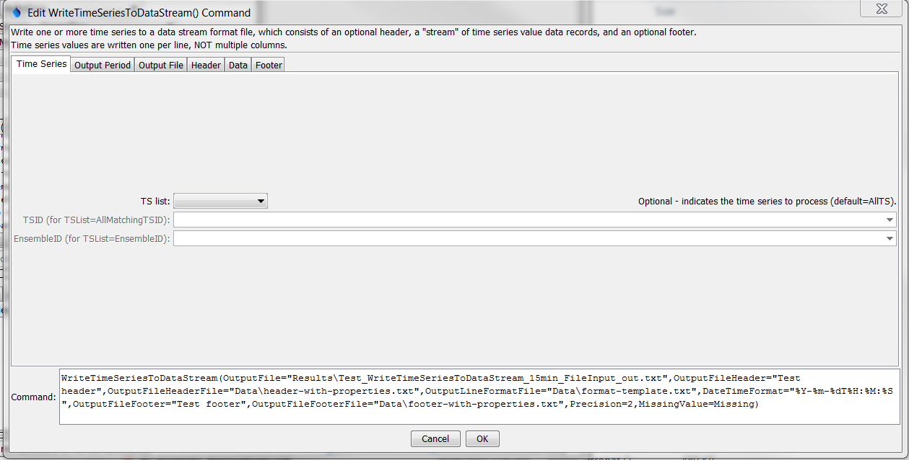
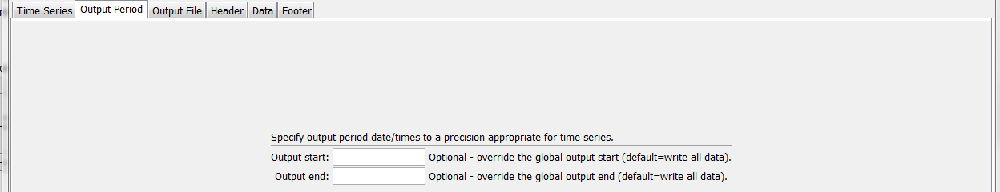
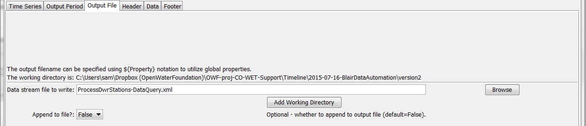
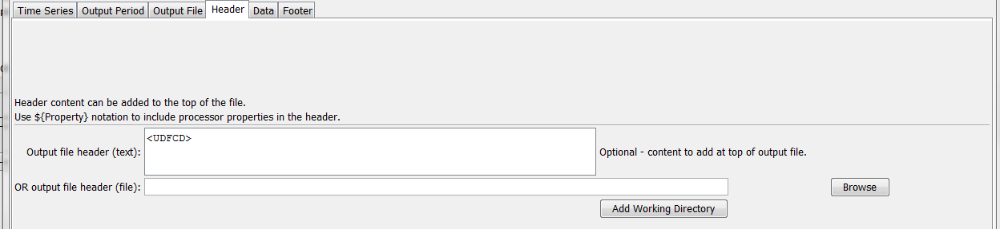
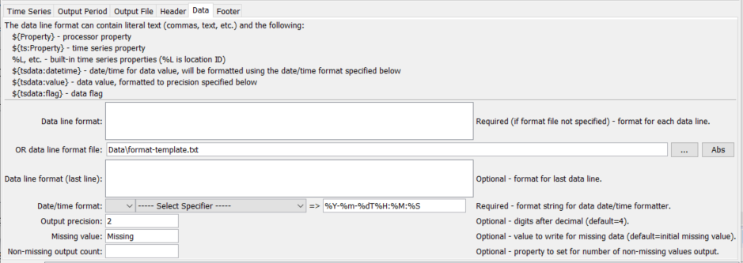
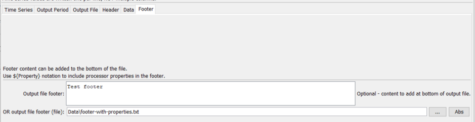

# TSTool / Command / WriteTimeSeriesToDataStream #

* [Overview](#overview)
* [Command Editor](#command-editor)
* [Command Syntax](#command-syntax)
* [Examples](#examples)
* [Troubleshooting](#troubleshooting)
* [See Also](#see-also)

-------------------------

## Overview ##

The `WriteTimeSeriesToDataStream` command
writes time series to a file as a sequential “stream” of formatted data lines.
This command is useful for processing data that are input to a data management system.
Each time series is written as a single data value per line, not as columns for multiple time series.

The example shown in the command editor (below) uses a file to specify the format of data lines,
as shown below (see the `OutputLineFormatFile` parameter):

```text
<gage_wl id="${ts:NovaStarID}" last_rpt="${tsdata:datetime}" ${ts:NovaStarDataType}="${tsdata:value}" shef_id="${ts:SHEFID}" name="${ts:NAME}" lat="${ts:LAT}" lon="${ts:LON}" qtime="${RunStart}"/>
```

The command expands the output format line for each time series value being output, as follows:

* The notation `${Property}` is replaced with the corresponding TSTool global property.
These properties can be set with [`SetProperty`](../SetProperty/SetProperty.md),
[`FormatDateTimeProperty`](../FormatDateTimeProperty/FormatDateTimeProperty.md),
[`ReadPropertiesFromFile`](../ReadPropertiesFromFile/ReadPropertiesFromFile.md), and other commands.
* The notation `${ts:Property}` is replaced with the corresponding property from the time series that is being processed.
Time series properties are set when a time series is read,
depending on data that are available from a particular data source.
The [`SetTimeSeriesPropertiesFromTable`](../SetTimeSeriesPropertiesFromTable/SetTimeSeriesPropertiesFromTable.md)
command can also be used, for example in cases where time series metadata are available in a table.
* The notation `%L` (for location identifier), etc. also is replaced with standard time series properties.
See read commands that have Alias parameters for a list of possible values.
In the future corresponding standard `${ts:Property}` values may be defined.
* The notation `${tsdata:Property}` is replaced with the corresponding data from time series data records, in particular:
	+ `${tsdata:datetime}` – corresponds to the date/time of the measurement (see the
	`DateTimeFormatterType` and `DateTimeFormat` command parameters)
	+ `${tsdata:value}` – corresponds to the time series data value at a date/time
	(see the `Precision` and `MissingValue` command parameters)
	+ `${tsdata:flag}` – corresponds to the time series flag at a date/time
* Any properties that are not found will result in output including the property name notation in the output.

## Command Editor ##

The following dialog is used to edit the command and illustrates the syntax of the command, in this case writing time series to an XML file.



**<p style="text-align: center;">
`WriteTimeSeriesToDataStream` Command Editor for Time Series Parameters (<a href="../WriteTimeSeriesToDataStream.png">see also the full-size image</a>)
</p>**

The following dialog is used to edit the command and illustrates output period parameters.



**<p style="text-align: center;">
`WriteTimeSeriesToDataStream` Command Editor for Output Period Parameters (<a href="../WriteTimeSeriesToDataStream_Period.png">see also the full-size image</a>)
</p>**

The following dialog is used to edit the command and illustrates output file parameters.



**<p style="text-align: center;">
`WriteTimeSeriesToDataStream` Command Editor for Output File Parameters (<a href="../WriteTimeSeriesToDataStream_File.png">see also the full-size image</a>)
</p>**

The following dialog is used to edit the command and illustrates output file header parameters.



**<p style="text-align: center;">
`WriteTimeSeriesToDataStream` Command Editor for Output File Header Parameters (<a href="../WriteTimeSeriesToDataStream_Header.png">see also the full-size image</a>)
</p>**

The following dialog is used to edit the command and illustrates data parameters.



**<p style="text-align: center;">
`WriteTimeSeriesToDataStream` Command Editor for Data Parameters (<a href="../WriteTimeSeriesToDataStream_Data.png">see also the full-size image</a>)
</p>**

The following dialog is used to edit the command and illustrates output file footer parameters.



**<p style="text-align: center;">
`WriteTimeSeriesToDataStream` Command Editor for Output File Footer Parameters (<a href="../WriteTimeSeriesToDataStream_Footer.png">see also the full-size image</a>)
</p>**

## Command Syntax ##

The command syntax is as follows:

```text
WriteTimeSeriesToDataStream(Parameter="Value",...)
```
**<p style="text-align: center;">
Command Parameters
</p>**

|**Parameter**&nbsp;&nbsp;&nbsp;&nbsp;&nbsp;&nbsp;&nbsp;&nbsp;&nbsp;&nbsp;&nbsp;&nbsp;&nbsp;&nbsp;&nbsp;&nbsp;&nbsp;&nbsp;&nbsp;&nbsp;&nbsp;&nbsp;&nbsp;&nbsp;&nbsp;&nbsp;&nbsp;&nbsp;&nbsp;|**Description**|**Default**&nbsp;&nbsp;&nbsp;&nbsp;&nbsp;&nbsp;&nbsp;&nbsp;&nbsp;&nbsp;&nbsp;&nbsp;&nbsp;&nbsp;&nbsp;&nbsp;&nbsp;&nbsp;&nbsp;&nbsp;&nbsp;&nbsp;&nbsp;&nbsp;&nbsp;&nbsp;&nbsp;|
|--------------|-----------------|-----------------|
|`TSList`|Indicates the list of time series to be processed, one of:<br><ul><li>`AllMatchingTSID` – all time series that match the TSID (single TSID or TSID with wildcards) will be processed.</li><li>`AllTS` – all time series before the command.</li><li>`EnsembleID` – all time series in the ensemble will be processed (see the EnsembleID parameter).</li><li>`FirstMatchingTSID` – the first time series that matches the TSID (single TSID or TSID with wildcards) will be processed.</li><li>`LastMatchingTSID` – the last time series that matches the TSID (single TSID or TSID with wildcards) will be processed.</li><li>`SelectedTS` – the time series are those selected with the [`SelectTimeSeries`](../SelectTimeSeries/SelectTimeSeries.md) command.</li></ul> | `AllTS` |
|`TSID`|The time series identifier or alias for the time series to be processed, using the `*` wildcard character to match multiple time series.  Can be specified using `${Property}`.|Required if `TSList=*TSID`|
|`EnsembleID`|The ensemble to be processed, if processing an ensemble. Can be specified using `${Property}`.|Required if `TSList=*EnsembleID`|
|`OutputFile`|The output file.  The path to the file can be absolute or relative to the working directory (command file location).  Global properties can be used to specify the filename, using the `${Property}` syntax.|None – must be specified.|
|`Append`|Indicate whether content should be appended to existing file.  This may be appropriate but output files with header and footer text will need to be handled appropriately with the first and last additions to the output file.|`False`|
|`OutputFileHeader`|Text that will be added to the top of the output file.  Can contain `${Property}`.|Do not include header content.  See below.|
|`OutputFileHeaderFile`|Name of file containing text that will be added to the top of the output file.  Can be specified with and contain `${Property}`.||
|`OutputLineFormat`|Format that is used for each data value.  Do not specify if `OutputLineFormatFile` is specified.|`${tsdata:datetime} ${tsdata:value}`|
|`OutputLineFormatFile`|The name of the file that contains the output line format specifiers.  Do not specify if `OutputLineFormat` is specified.  The output format file will be used as a template and expanded according to the explanation provided above this table.  In particular, use a file for the format template if the template contains special characters that cannot be included in a parameter value.||
|`LastOutputLineFormat`|Similar to `OutputLineFormat`, but if specified will be used only for the last data line.||
|`DateTimeFormatterType`|Specify the date/time formatter type, which indicates the syntax for `DateTimeFormat`.  Currently, only `C` is supported, corresponding to the C programming language [strftime() function]((http://man7.org/linux/man-pages/man1/date.1.html), which is also used by other software (see Linux date command).|`C`|
|`DateTimeFormat`|The format used to expand the date/time corresponding to each time series data value.  The format string can contain literal strings and specifiers supported by the `DateTimeFormatterType`.||
|`OutputFileFooter`|Text that will be added to the bottom of the output file.  Can contain `${Property}`.|Do not include footer content.  See below.|
|`OutputFileFooterFile`|Name of file containing text that will be added to the bottom of the output file.  Can be specified with and contain `${Property}`.||
|`Precision`|The number of digits after the decimal for formatting time series values.|`4` (in the future may default based on data type)|
|`MissingValue`|The value to write to the file to indicate a missing value in the time series.  The value will be output literally and consequently string values are allowed.  Specify the value as `Blank` to cause blanks to be used for missing values.|As initialized when reading the time series or creating a new time series, typically `-999`, `NaN`, or another value that is not expected in data.|
|`OutputStart`|The date/time for the start of the output.|Use the global output period.|
|`OutputEnd`|The date/time for the end of the output.|Use the global output period.|
|`NonMissingOutputCount`|The number of non-missing values to write.  Specify as a negative number to write the values from the end (newest values).  For example, `-1` will write only the most recent non-missing value.|Write all the values.|

## Examples ##

See the [automated tests](https://github.com/OpenCDSS/cdss-app-tstool-test/tree/master/test/regression/commands/general/WriteTimeSeriesToDataStream).

The following example illustrates how to create a simple JSON output file:

```
WriteTimeSeriesToDataStream(OutputFile="Results/Test_WriteTimeSeriesToDataStream_Irregular15min_jqPlot_out.txt",OutputFileHeader="var timeseries[",OutputLineFormat="[\"${tsdata:datetime}\",${tsdata:value}],",LastOutputLineFormat="[\"${tsdata:datetime}\",${tsdata:value}]",DateTimeFormat="%Y-%m-%d %H:%M:%S",OutputFileFooter="]")
```

```
var timeseries=[
["1950-01-01 00:00:00",5.0000],
["1950-01-01 00:15:00",10.0000],
["1950-01-01 00:30:00",12.0000],
["1950-01-01 00:45:00",13.0000],
…
["1950-01-05 11:45:00",10.0000],
["1950-01-05 12:00:00",12.0000]
]
```

## Troubleshooting ##

## See Also ##

* [`FormatDateTimeProperty`](../FormatDateTimeProperty/FormatDateTimeProperty.md) command
* [`ReadPropertiesFromFile`](../ReadPropertiesFromFile/ReadPropertiesFromFile.md) command
* [`SetProperty`](../SetProperty/SetProperty.md) command
* [`SetTimeSeriesPropertiesFromTable`](../SetTimeSeriesPropertiesFromTable/SetTimeSeriesPropertiesFromTable.md) command
