# TSTool / Command / WriteTimeSeriesToExcel #

*   [Overview](#overview)
*   [Command Editor](#command-editor)
*   [Command Syntax](#command-syntax)
*   [Examples](#examples)
*   [Troubleshooting](#troubleshooting)
*   [See Also](#see-also)

-------------------------

## Overview ##

The `WriteTimeSeriesToExcel` command writes one or more time series to an Excel workbook.  The following functionality is provided:

*   Time series are written in columns (see
    [`WriteTimeSeriesToExcelBlock`](../WriteTimeSeriesToExcelBlock/WriteTimeSeriesToExcelBlock.md) for alternate formatting options).
*   The worksheet and position in worksheet can be specified.
*   The output can be created or appended.
*   Separate columns can be written for date/time, date, and/or time.
    Currently date/time values are written as strings but Excel date objects will be enabled in the future.
*   Cell comments can be formatted using data flags and other time series properties.

TSTool uses the [Apache POI software](https://poi.apache.org) to read/write the Excel file
and consequently functionality is constrained by the features of that software package.

## Command Editor ##

The command is available in the following TSTool menu:

*   ***Commands / Spreadsheet Processing***

The following dialog is used to edit the command and illustrates the syntax of the command.

**<p style="text-align: center;">
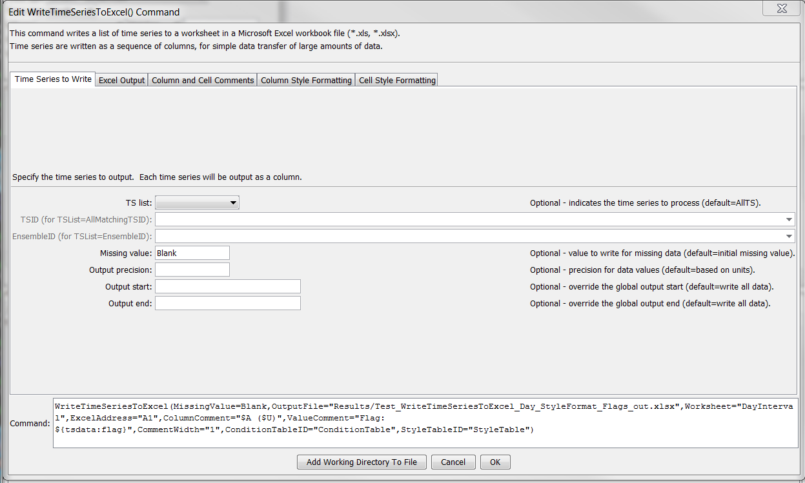
</p>**

**<p style="text-align: center;">
`WriteTimeSeriesToExcel` Command Editor (<a href="../WriteTimeSeriesToExcel.png">see full-size image</a>)
</p>**

The following dialog is used to edit the command and illustrates the syntax of the command for output parameters.

**<p style="text-align: center;">
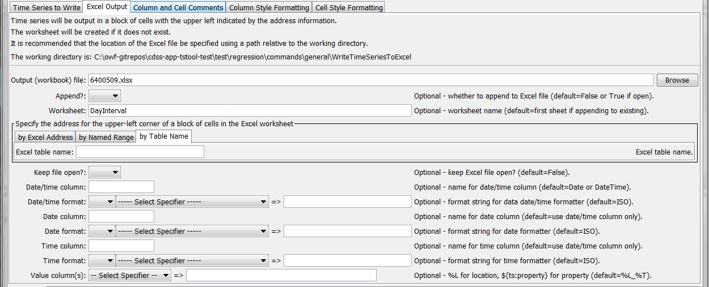
</p>**

**<p style="text-align: center;">
`WriteTimeSeriesToExcel` Command Editor for Output Parameters (<a href="../WriteTimeSeriesToExcel_ExcelOutput.png">see full-size image</a>)
</p>**

The following dialog is used to edit the command and illustrates the syntax of the command for column and cell comment parameters.

**<p style="text-align: center;">
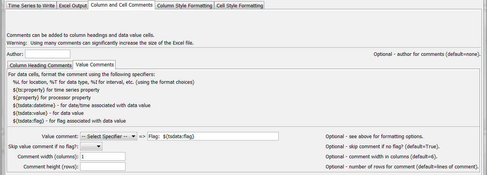
</p>**

**<p style="text-align: center;">
`WriteTimeSeriesToExcel` Command Editor for Column and Cell Comments Parameters (<a href="../WriteTimeSeriesToExcel_CellComments0.png">ee also the full-size image</a>)
</p>**

The following dialog is used to edit the command and illustrates the syntax of the command for column style formatting parameters.

**<p style="text-align: center;">
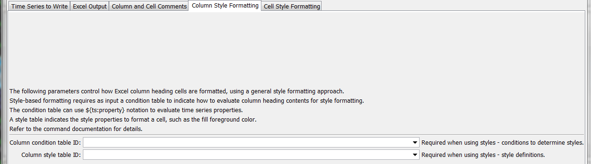
</p>**

**<p style="text-align: center;">
`WriteTimeSeriesToExcel` Command Editor for Column Style Formatting Parameters (<a href="../WriteTimeSeriesToExcel_ColumnStyleFormat.png">see full-size image</a>)
</p>**

The following dialog is used to edit the command and illustrates the syntax of the command for data value cell style formatting parameters.

**<p style="text-align: center;">
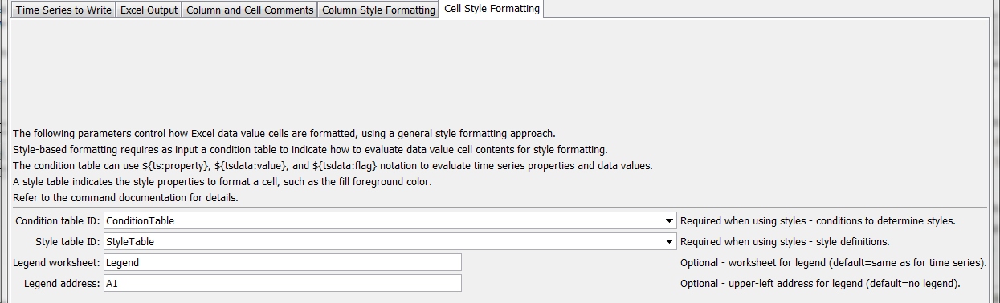
</p>**

**<p style="text-align: center;">
`WriteTimeSeriesToExcel` Command Editor for Data Value Cell Style Formatting Parameters (<a href="../WriteTimeSeriesToExcel_StyleFormat.png">see full-size image</a>)
</p>**

## Command Syntax ##

The command syntax is as follows:

```text
WriteTimeSeriesToExcel(Parameter="Value",...)
```
**<p style="text-align: center;">
Command Parameters
</p>**

|**Parameter**&nbsp;&nbsp;&nbsp;&nbsp;&nbsp;&nbsp;&nbsp;&nbsp;&nbsp;&nbsp;&nbsp;&nbsp;&nbsp;&nbsp;&nbsp;&nbsp;&nbsp;&nbsp;&nbsp;&nbsp;&nbsp;&nbsp;&nbsp;&nbsp;&nbsp;&nbsp;&nbsp;&nbsp;&nbsp;&nbsp;&nbsp;&nbsp;&nbsp;|**Description**|**Default**&nbsp;&nbsp;&nbsp;&nbsp;&nbsp;&nbsp;&nbsp;&nbsp;&nbsp;&nbsp;&nbsp;&nbsp;&nbsp;&nbsp;&nbsp;&nbsp;&nbsp;&nbsp;&nbsp;&nbsp;&nbsp;&nbsp;&nbsp;&nbsp;&nbsp;&nbsp;&nbsp;|
|--------------|-----------------|-----------------|
|`TSList`|Indicates the list of time series to be processed, one of:<br><ul><li>`AllMatchingTSID` – all time series that match the TSID (single TSID or TSID with wildcards) will be processed.</li><li>`AllTS` – all time series before the command.</li><li>`EnsembleID` – all time series in the ensemble will be processed (see the EnsembleID parameter).</li><li>`FirstMatchingTSID` – the first time series that matches the TSID (single TSID or TSID with wildcards) will be processed.</li><li>`LastMatchingTSID` – the last time series that matches the TSID (single TSID or TSID with wildcards) will be processed.</li><li>`SelectedTS` – the time series are those selected with the [`SelectTimeSeries`](../SelectTimeSeries/SelectTimeSeries.md) command.</li></ul> | `AllTS` |
|`TSID`|The time series identifier or alias for the time series to be processed, using the `*` wildcard character to match multiple time series.  Can be specified using `${Property}`.|Required if `TSList=*TSID`|
|`EnsembleID`|The ensemble to be processed, if processing an ensemble. Can be specified using `${Property}`.|Required if `TSList=*EnsembleID`|
|`MissingValue`|Value to write to Excel for missing data values.|Original missing value.|
|`Precision`|The number of digits after the decimal for data values.|Determine from units.|
|`OutputStart`|The date/time for the start of the output.  Can be specified using processor `${Property}`.|Use the global output period.|
|`OutputEnd`|The date/time for the end of the output.  Can be specified using processor `${Property}`.|Use the global output period.|
|`OutputFile`<br>**required**|The name of the Excel workbook file (`*.xls` or `*.xlsx`) to write, as an absolute path or relative to the command file location.  If the Excel file does not exist it will be created.  Can be specified using processor `${Property}`.|None – must be specified.|
|`Append`|Indicate whether the sheet being written should appended to an existing workbook.|`False` – create a new workbook.|
|`Worksheet`|The name of the worksheet in the workbook to write.  If the worksheet does not exist it will be created.  Can be specified using processor `${Property}`.|Write to the first worksheet.|
|`ExcelAddress`|Indicates the block of cells to write, using Excel address notation (e.g., `A1:D10`).|Must specify address using one of available address parameters.|
|`ExcelNamedRange`|Indicates the block of cells to write, using an Excel named range.|Must specify address using one of available address parameters.|
|`ExcelTableName`|Indicates the block of cells to write, using an Excel named range.|Must specify address using one of available address parameters.|
|`KeepOpen`|Indicate whether to keep the Excel file open (`True`) or close after creating (`False`).  Keeping the file open will increase performance because later commands will not need to reread the workbook.  Make sure to close the file in the last Excel command.|`False`|
|`DateTimeColumn`|The name of the column for the date/time.|Date if day, month, or year interval, `DateTime` otherwise.|
|`DateTimeFormatterType`|Specify the date/time formatter type, which indicates the syntax for `DateTimeFormat`.  Currently, only `C` is supported, corresponding to the C programming language [strftime() function](https://man7.org/linux/man-pages/man3/strftime.3.html), which is also used by other software.|`C`|
|`DateTimeFormat`|The format used to expand the date/time corresponding to each time series data value.  The format string can contain literal strings and specifiers supported by the `DateTimeFormatterType`.||
|`DateColumn`|The name of the column for the date, if date and time need to be in separate columns.|`Date`|
|`DateFormatterType`|Specify the date/time formatter type, which indicates the syntax for `DateFormat`.  Currently, only `C` is supported, corresponding to the C programming language [strftime() function](https://man7.org/linux/man-pages/man3/strftime.3.html), which is also used by other software.|`C`|
|`DateFormat`|The format used to expand the date/time corresponding to each time series data value.  The format string can contain literal strings and specifiers supported by the `DateFormatterType`.||
|`TimeColumn`|The name of the column for the time, if date and time need to be in separate columns.|`Time`|
|`TimeFormatterType`|Specify the date/time formatter type, which indicates the syntax for `TimeFormat`.  Currently, only `C` is supported, corresponding to the C programming language [strftime() function](https://man7.org/linux/man-pages/man3/strftime.3.html), which is also used by other software.|`C`|
|`TimeFormat`|The format used to expand the date/time corresponding to each time series data value.  The format string can contain literal strings and specifiers supported by the `TimeFormatterType`.||
|`ValueColumns`|The name(s) of the column(s) corresponding to each time series, to use for the values.  Specify with `%` formatters, `${ts:property}` and `${property}`.  In the future a parameter may be added to more specifically define the column names.|`%L_%T`|
|`Author`|Name to use in comments for author.|No author|
|`ColumnComment`|A string to format for column heading comments for each time series.  See `ValueColumns` for formatting options.|No comments.|
|`ColumnCommentWidth`|Width of column comments (number of columns).|`6`|
|`ColumnCommentHeight`|Height of column comments (number of rows).|Number of lines in comment.|
|`ValueComment`|See `ValueColumns` for formatting options.   The string `${tsdata:flag}` can also be specified to include the data flag for the cell.|No comments.|
|`SkipValueCommentIfNoFlag`|Indicate whether the `ValueComment` should be skipped if the data flag for a cell is blank.|`True`|
|`CommentWidth`|Width of data value comments (number of columns).|`6`|
|`CommentHeight`|Height of data value comments (number of rows).|Number of lines in comment.|
|`ColumnConditionTableID`|Identifier for condition table used to format column headings (see below).  Can be specified using processor `${Property}`.|Style formatting is not used.|
|`ColumnStyleTableID`|Identifier for style table used to format column headings (see below).  Can be specified using processor `${Property}`.|Style formatting is not used.|
|`ConditionTableID`|Identifier for condition table used to format data value cells (see below).  Can be specified using processor `${Property}`.|Style formatting is not used.|
|`StyleTableID`|Identifier for style table used to format data value cells (see below).  Can be specified using processor `${Property}`.|Style formatting is not used.|
|`LegendWorksheet`|Name of worksheet where the legend should be created.  The legend displays conditions and styles. |Time series worksheet.|
|`LegendAddress`|Address `A1`, etc. for upper-left of legend.|No legend will be created.|

Excel cell formatting consists of number formatting, cell colors, cell width, etc.
The ***Style Formatting*** tab provides general formatting capabilities for data cells.
Consider the following time series data table,
where the goal is to write the TSTool time series to Excel and format cells to indicate specific conditions of interest.
This approach is implemented similarly in the
[`WriteTableToExcel`](../WriteTableToExcel/WriteTableToExcel.md) command.

**<p style="text-align: center;">
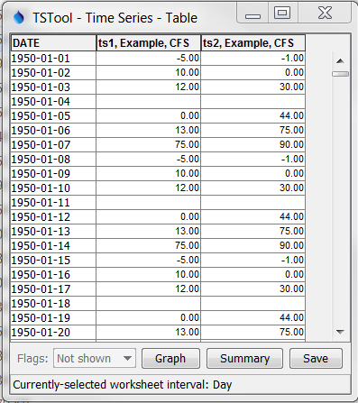
</p>**

**<p style="text-align: center;">
Data Table used with `WriteTimeSeriesToExcel` Command Style Formatting (<a href="../WriteTimeSeriesToExcel_DataTable.png">see full-size image</a>)
</p>**

To configure style-based formatting, a style table is defined listing properties for formatting cells.
This table can be defined as a CSV file, Excel worksheet or other format and read into TSTool using a suitable command.
The following figure illustrates a basic style table, which can be shared among commands.

**<p style="text-align: center;">

</p>**

**<p style="text-align: center;">
Style Table used with `WriteTimeSeriesToExcel` Command for Specific Checks and Formatting (<a href="../WriteTimeSeriesToExcel_StyleTable.png">see full-size image</a>)
</p>**

The following style table column names are recognized.
The default values for cell style properties not listed in the table are those provided by Excel.

**<p style="text-align: center;">
Recognized Style Table Column Names
</p>**

|**Column Name**&nbsp;&nbsp;&nbsp;&nbsp;&nbsp;&nbsp;&nbsp;&nbsp;&nbsp;&nbsp;&nbsp;&nbsp;&nbsp;&nbsp;&nbsp;&nbsp;&nbsp;&nbsp;&nbsp;&nbsp;&nbsp;&nbsp;&nbsp;&nbsp;&nbsp;&nbsp;&nbsp;&nbsp;&nbsp;&nbsp;&nbsp;&nbsp;&nbsp;&nbsp;&nbsp;&nbsp;&nbsp;&nbsp;&nbsp;&nbsp;|**Description**|**Default**&nbsp;&nbsp;&nbsp;&nbsp;&nbsp;&nbsp;&nbsp;&nbsp;|
|--|--|--|
|`StyleID`|An identifier for the style, which is used in the format table below.|None – must be specified.|
|`FillForegroundColor`|The foreground fill color as a named color (e.g., `Red`), RGB triplet (`255,255,255`), or hex color `0xFFFFFF`.  The following named colors are recognized:  `black`, `blue`, `cyan`, `darkgray`, `gray`, `green`, `lightgray`, `magenta`, `none`, `orange`, `pink`, `red`, `white`, `yellow`.|No fill color.|
|`FillPattern`|Fill pattern for cells using `FillForegroundColor` and `FillBackgroundColor`.|Currently always defaults to solid - fill pattern is ignored.|

The condition table indicates how the styles are used for time series data.
The following example indicates that any time series with identifier (or alias)
starting with `ts` should be processed to evaluate for missing, negative, and zero values.

**<p style="text-align: center;">
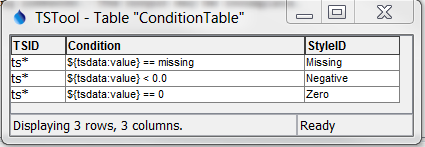
</p>**

**<p style="text-align: center;">
Condition Table used with `WriteTimeSeriesToExcel` Command for Specific Checks and Formatting (<a href="../WriteTimeSeriesToExcel_ConditionTable.png">see full-size image</a>)
</p>**

The column names for the condition table must be specified as shown.
The ***Condition*** column recognizes the following specifiers:

*   `${ts:property}` – a time series property, which can be used to format comments for column headings or data value cells
*   `${tsdata:value}` – the time series data value, used to evaluate numerical conditions (cannot be used to format column headings)
*   `${tsdata:flag}` – the time series flag, used to evaluate string conditions (cannot be used to format column headings)

Values on the left and right of the operator must be
separated with spaces to facilitate parsing the condition.
The ***Condition*** column recognizes the following operators:

**<p style="text-align: center;">
Condition Table Operators
</p>**

|**Operator**|Description**|
|--|--|
|`<`|Less than.|
|`<=`|Less than or equal to.|
|`==`|Equal to.  Specify the right-side value as missing to check for missing.|
|`!=`|Not equal to.  Specify the right-side value as missing to check for missing.|
|`>`|Greater than.|
|`>=`|Greater than or equal to.|
|`contains`|Specify for string values to check for substring (case-dependent).|
|`startswith`|Specify for string values to check for substring at start (case-dependent).|
|`endswith`|Specify for string values to check for substring at end (case-dependent).|

Multiple conditions can be specified by using AND (surrounded by a single space) between conditions.

The following figure illustrates the output from the above example.

**<p style="text-align: center;">
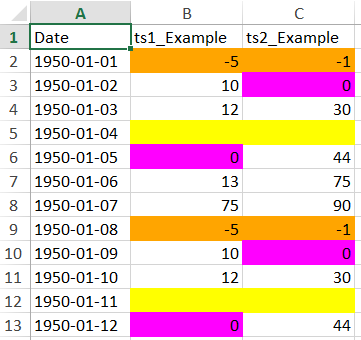
</p>**

**<p style="text-align: center;">
`WriteTimeSeriesToExcel` Command Example Output for Specific Checks and Formatting (<a href="../WriteTimeSeriesToExcel_Output.png">see full-size image</a>)
</p>**

The following example illustrates using multiple conditions to implement a color scale.

**<p style="text-align: center;">
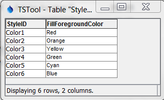
</p>**

**<p style="text-align: center;">
Style Table used with `WriteTimeSeriesToExcel` Command for a Color Scale (<a href="../WriteTimeSeriesToExcel_StyleTable2.png">see full-size image</a>)
</p>**

**<p style="text-align: center;">
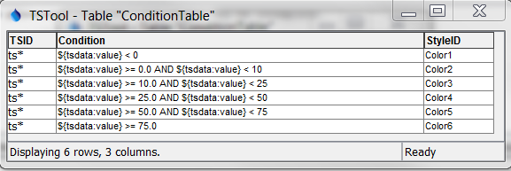
</p>**

**<p style="text-align: center;">
Condition Table used with `WriteTimeSeriesToExcel` Command for a Color Scale
</p>**

The following is the output.

**<p style="text-align: center;">
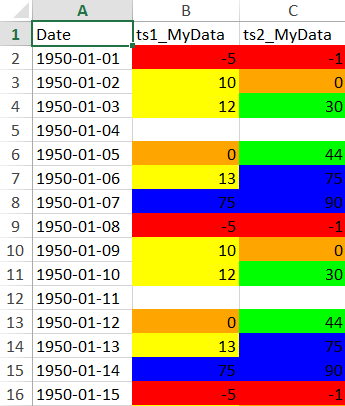
</p>**

**<p style="text-align: center;">
`WriteTimeSeriesToExcel` Command Example Output for Style Formatting (<a href="../WriteTimeSeriesToExcel_Output2.png">see full-size image</a>)
</p>**

## Examples ##

See the [automated tests](https://github.com/OpenCDSS/cdss-app-tstool-test/tree/master/test/commands/WriteTimeSeriesToExcel).

## Troubleshooting ##

See the main [TSTool Troubleshooting](../../troubleshooting/troubleshooting.md) documentation.

## See Also ##

*   [`SelectTimeSeries`](../SelectTimeSeries/SelectTimeSeries.md) command
*   [`WriteTableToExcel`](../WriteTableToExcel/WriteTableToExcel.md) command
*   [`WriteTimeSeriesToExcelBlock`](../WriteTimeSeriesToExcelBlock/WriteTimeSeriesToExcelBlock.md) command
