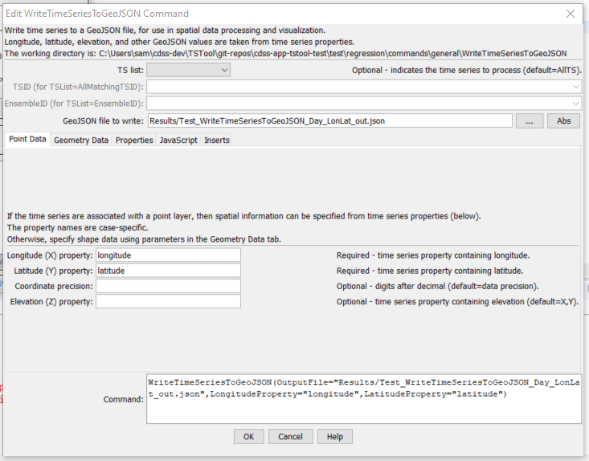
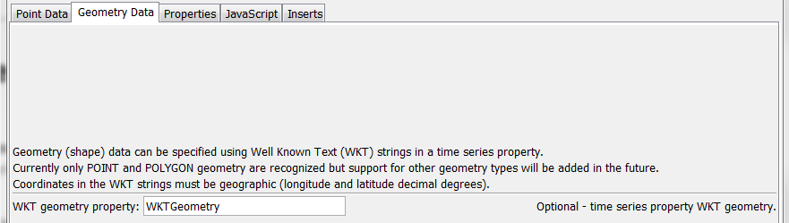
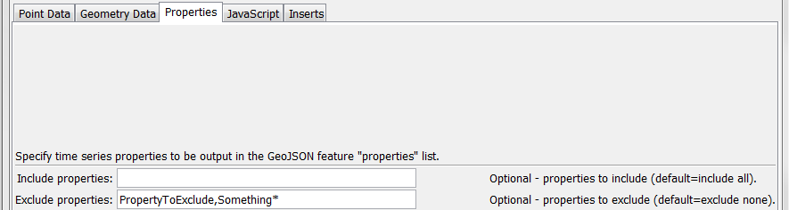
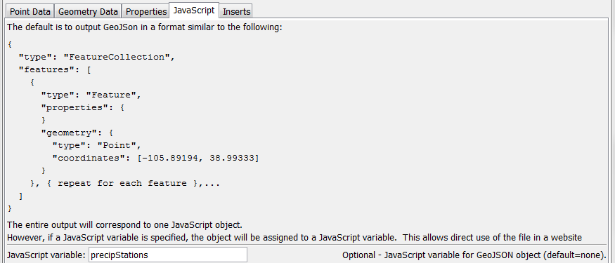
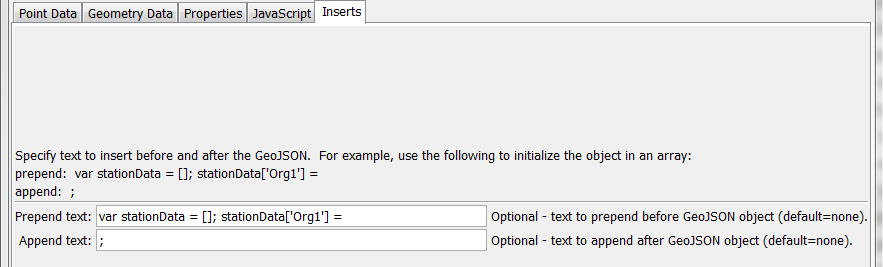

# TSTool / Command / WriteTimeSeriesToGeoJSON #

* [Overview](#overview)
* [Command Editor](#command-editor)
* [Command Syntax](#command-syntax)
* [Examples](#examples)
* [Troubleshooting](#troubleshooting)
* [See Also](#see-also)

-------------------------

## Overview ##

The `WriteTimeSeriesToGeoJSON` command writes time series to a GeoJSON file,
which is a spatial data format that can be viewed in geographic information system (GIS) software and other visualization tools.  See:

* [GeoJSON specification](http://geojson.org/geojson-spec.html)

The time series must have properties for longitude and latitude or Well Known Text (WKT) geometry string.  See:

* [Well-known Text on Wikipedia](http://en.wikipedia.org/wiki/Well-known_text)

Currently only point and polygon data can be processed but in the future support for
well-known text for other geometry types will be added.
A future enhancement of this command will allow the geometry feature data to be read from other spatial formats.

## Command Editor ##

The following dialog is used to edit the command and illustrates the syntax of the command.
<a href="../WriteTimeSeriesToGeoJSON.png">See also the full-size image.</a>



**<p style="text-align: center;">
`WriteTimeSeriesToGeoJSON` Command Editor
</p>**

The following figure illustrates the command syntax for layers specified with a WKT geometry property.
<a href="../WriteTimeSeriesToGeoJSON_WKT.png">See also the full-size image.</a>



**<p style="text-align: center;">
`WriteTimeSeriesToGeoJSON` Command Editor for WKT Geometry Data Parameters
</p>**
	
The following figure illustrates the command syntax for specifying time series properties to include as properties in the GeoJSON output.
<a href="../WriteTimeSeriesToGeoJSON_Properties.png">See also the full-size image.</a>



**<p style="text-align: center;">
`WriteTimeSeriesToGeoJSON` Command Editor for Property Parameters
</p>**
	
The following figure illustrates the command syntax for specifying the JavaScript variable for the output.
<a href="../WriteTimeSeriesToGeoJSON_JavaScriptVar.png">See also the full-size image.</a>



**<p style="text-align: center;">
`WriteTimeSeriesToGeoJSON` Command Editor for JavaScript Parameters
</p>**
	
The following figure illustrates the command syntax for specifying inserts around the GeoJSON content.
<a href="../WriteTimeSeriesToGeoJSON_Inserts.png">See also the full-size image.</a>



**<p style="text-align: center;">
`WriteTimeSeriesToGeoJSON` Command Editor for Text Insert Parameters
</p>**

## Command Syntax ##

The command syntax is as follows:

```text
WriteTimeSeriesToGeoJSON(Parameter="Value",...)
```
**<p style="text-align: center;">
Command Parameters
</p>**

|**Parameter**&nbsp;&nbsp;&nbsp;&nbsp;&nbsp;&nbsp;&nbsp;&nbsp;&nbsp;&nbsp;&nbsp;&nbsp;&nbsp;&nbsp;&nbsp;&nbsp;&nbsp;&nbsp;&nbsp;&nbsp;&nbsp;&nbsp;&nbsp;|**Description**|**Default**&nbsp;&nbsp;&nbsp;&nbsp;&nbsp;&nbsp;&nbsp;&nbsp;&nbsp;&nbsp;&nbsp;&nbsp;&nbsp;&nbsp;&nbsp;&nbsp;&nbsp;&nbsp;&nbsp;&nbsp;&nbsp;&nbsp;&nbsp;&nbsp;&nbsp;&nbsp;&nbsp;|
|--------------|-----------------|-----------------|
|`TSList`|Indicates the list of time series to be processed, one of:<br><ul><li>`AllMatchingTSID` – all time series that match the TSID (single TSID or TSID with wildcards) will be processed.</li><li>`AllTS` – all time series before the command.</li><li>`EnsembleID` – all time series in the ensemble will be processed (see the EnsembleID parameter).</li><li>`FirstMatchingTSID` – the first time series that matches the TSID (single TSID or TSID with wildcards) will be processed.</li><li>`LastMatchingTSID` – the last time series that matches the TSID (single TSID or TSID with wildcards) will be processed.</li><li>`SelectedTS` – the time series are those selected with the [`SelectTimeSeries`](../SelectTimeSeries/SelectTimeSeries) command.</li></ul> | `AllTS` |
|`TSID`|The time series identifier or alias for the time series to be processed, using the `*` wildcard character to match multiple time series.  Can be specified using `${Property}`.|Required if `TSList=*TSID`|
|`EnsembleID`|The ensemble to be processed, if processing an ensemble. Can be specified using `${Property}`.|Required if `TSList=*EnsembleID`|
|`OutputFile`|The GeoJSON output file.  The path to the file can be absolute or relative to the working directory (command file location).  Global properties can be used to specify the filename, using the `${Property}` syntax.|None – must be specified.|
|`Append`|Indicate whether to append the GeoJSON content to the output file, `True` or `False`.|`False`|
|`LongitudeProperty`|The name of the time series property containing the longitude to use for the GeoJSON.  Can be specified using `${Property}`.|Required unless WKT geometry is specified.|
|`LatitudeProperty`|The name of the time series property containing the latitude to use for the GeoJSON.  Can be specified using `${Property}`.|Required unless WKT geometry is specified.|
|`ElevationProperty`|The name of the time series property containing the elevation to use for the GeoJSON.  Can be specified using `${Property}`.|Omitted|
|`WKTGeometryProperty`|The name of the time series property that contains Well Known Text (WKT) geometry strings.  Can be specified using `${Property}`.|Will use point data properties|
|`IncludeColumns`|List of comma-separated time series property names to include as feature properties, using * for wildcard.  Can be specified using `${Property}`.|Include all columns.|
|`ExcludeColumns`|List of comma-separated time series property names to exclude as feature properties.  Can be specified using `${Property}`.|Exclude no columns.|
|`JavaScriptVar`|Name of JavaScript variable to assign object to in output.  This parameter will be ignored if `PrependText` or `AppendText` are specified.  Can be specified using `${Property}`.|Output GeoJSON object surrounded by `{ }`.|
|`PrependText`|Provide text to insert before the GeoJSON object, for example to provide custom JavaScript.  Can be specified using `${Property}` notation.|No insert.|
|`AppendText`|Provide text to append after the GeoJSON object, for example to provide custom JavaScript.  Can be specified using `${Property}` notation.|No insert.|

## Examples ##

See the [automated tests](https://github.com/OpenWaterFoundation/cdss-app-tstool-test/tree/master/test/regression/commands/general/WriteTimeSeriesToGeoJSON).

## Troubleshooting ##

## See Also ##

* [`WriteTimeSeriesToKml`](../WriteTimeSeriesToKml/WriteTimeSeriesToKml) command
