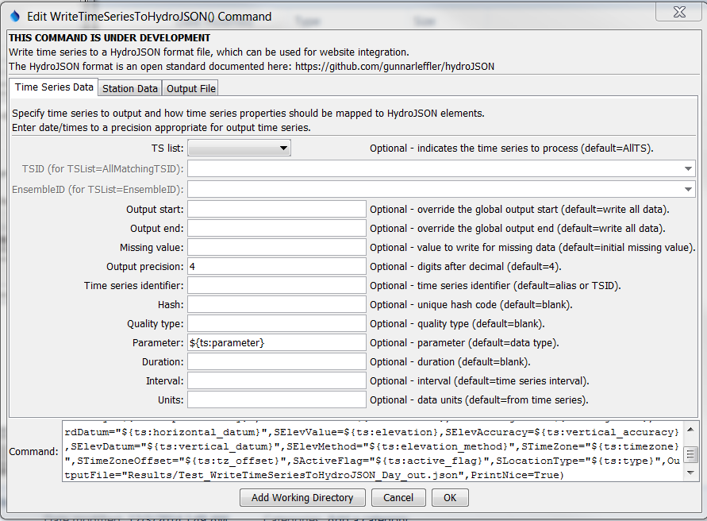
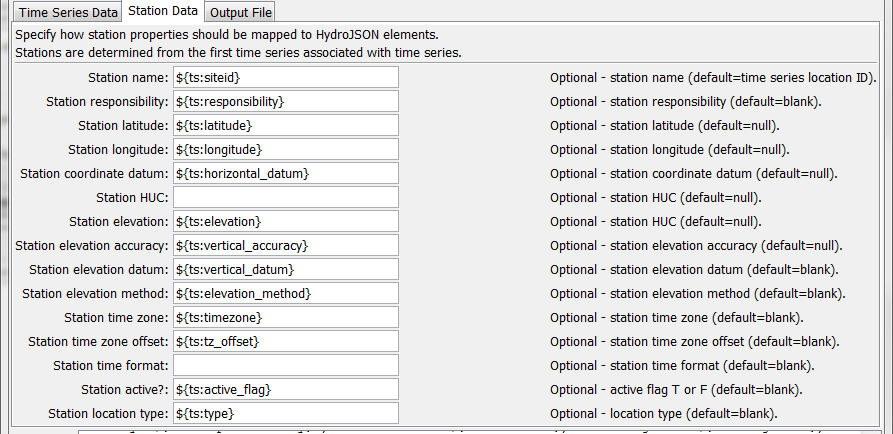
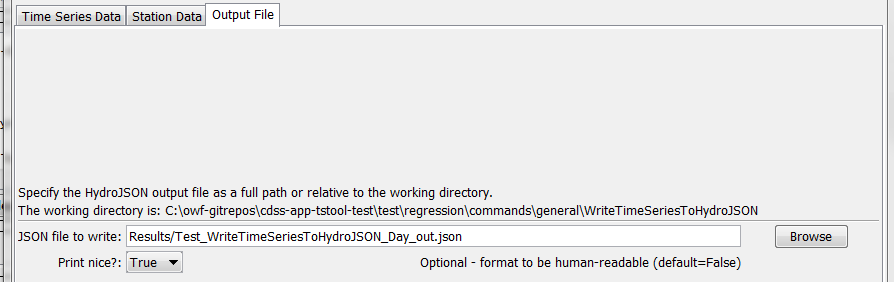

# TSTool / Command / WriteTimeSeriesToHydroJSON #

*   [Overview](#overview)
*   [Command Editor](#command-editor)
*   [Command Syntax](#command-syntax)
*   [Examples](#examples)
*   [Troubleshooting](#troubleshooting)
*   [See Also](#see-also)

-------------------------

## Overview ##

**This command is under development.
The HydroJSON format is a new open data format that is being developed by USGS, Army Corps, and Reclamation agencies for data exchange.
It is not clear how much support this format has.**

The `WriteTimeSeriesToHydroJSON` command writes time series to a file using HydroJSON format,
which adheres to JSON (JavaScript Object Notation) notation.
The file can be included in a JavaScript script to instantiate data objects.
Refer to the [HydroJSON Input Type Appendix](../../datastore-ref/HydroJSON/HydroJSON.md)
for more information about the format.
The main complexity with writing the file is that the HydroJSON format has elements that
cannot be mapped to standard TSTool time series properties.
Consequently, default mapping is implemented where obvious and the ability to
override with time series properties is provided for many HydroJSON elements.
The following figures illustrate how such mapping can occur.

## Command Editor ##

The command is available in the following TSTool menu:

*   ***Commands / Output Time Series***

The following dialog is used to edit the command and illustrates the syntax of the command for time series parameters.

**<p style="text-align: center;">

</p>**

**<p style="text-align: center;">
`WriteTimeSeriesToHydroJSON` Command Editor for Time Series Parameters (<a href="../WriteTimeSeriesToHydroJSON_TS.png">see full-size image</a>)
</p>**

The following dialog is used to edit the command and illustrates the syntax of the command for station parameters.

**<p style="text-align: center;">

</p>**

**<p style="text-align: center;">
`WriteTimeSeriesToHydroJSON` Command Editor for Station Parameters (<a href="../WriteTimeSeriesToHydroJSON_Station.png">see full-size image</a>)
</p>**

The following dialog is used to edit the command and illustrates the syntax of the command for output parameters.

**<p style="text-align: center;">

</p>**

**<p style="text-align: center;">
`WriteTimeSeriesToHydroJSON` Command Editor for Output Parameters (<a href="../WriteTimeSeriesToHydroJSON_File.png">see full-size image</a>)
</p>**

## Command Syntax ##

The command syntax is as follows:

```text
WriteTimeSeriesToHydroJSON(Parameter="Value",...)
```
**<p style="text-align: center;">
Command Parameters
</p>**

|**Parameter**&nbsp;&nbsp;&nbsp;&nbsp;&nbsp;&nbsp;&nbsp;&nbsp;&nbsp;&nbsp;&nbsp;&nbsp;&nbsp;&nbsp;&nbsp;&nbsp;|**Description**|**Default**&nbsp;&nbsp;&nbsp;&nbsp;&nbsp;&nbsp;&nbsp;&nbsp;&nbsp;&nbsp;&nbsp;&nbsp;&nbsp;&nbsp;&nbsp;&nbsp;&nbsp;&nbsp;&nbsp;&nbsp;&nbsp;&nbsp;&nbsp;&nbsp;&nbsp;&nbsp;&nbsp;|
|--------------|-----------------|-----------------|
|`TSList`|Indicates the list of time series to be processed, one of:<br><ul><li>`AllMatchingTSID` – all time series that match the TSID (single TSID or TSID with wildcards) will be processed.</li><li>`AllTS` – all time series before the command.</li><li>`EnsembleID` – all time series in the ensemble will be processed (see the EnsembleID parameter).</li><li>`FirstMatchingTSID` – the first time series that matches the TSID (single TSID or TSID with wildcards) will be processed.</li><li>`LastMatchingTSID` – the last time series that matches the TSID (single TSID or TSID with wildcards) will be processed.</li><li>`SelectedTS` – the time series are those selected with the [`SelectTimeSeries`](../SelectTimeSeries/SelectTimeSeries.md) command.</li></ul> | `AllTS` |
|`TSID`|The time series identifier or alias for the time series to be processed, using the `*` wildcard character to match multiple time series.  Can be specified using `${Property}`.|Required if `TSList=*TSID`|
|`EnsembleID`|The ensemble to be processed, if processing an ensemble. Can be specified using `${Property}`.|Required if `TSList=*EnsembleID`|
|`OutputStart`|The date/time for the start of the output. [start_timestep]|Use the global output period.|
|`OutputEnd`|The date/time for the end of the output. [end_timestep]|Use the global output period.|
|`MissingValue`|The value to write to the file to indicate a missing value in the time series, must be a number or `NaN`.| Currently not enabled.|
|`Precision`|The number of digits after the decimal for numerical output.|Currently not enabled.|
|`TIdentifier`|The time series identifier for HydroJSON output.  Can specify using `${Property}` and `${ts:Property}`. `[tsid?]`|Alias if available, or time series identifier (TSID).|
|`THash`|Hash code that uniquely identifies the time series.  Can specify using `${Property}` and `${ts:Property}`. [hash]|Blank|
|`TQualityType`|Time series quality type? [quality_type]|Blank|
|`TParameter`|Time series parameter (data type).  Can specify using `${Property}` and `${ts:Property}`. [parameter]|Time series data type.|
|`TDuration`|Time series duration.  Can specify using `${Property}` and `${ts:Property}`. [duration]|Blank|
|`TInterval`|Time series interval.  Can specify using `${Property}` and `${ts:Property}`. [interval]|Blank|
|`TUnits`|Time series data units.  Can specify using `${Property}` and `${ts:Property}`. [units]|Time series data units|
|`SName`|Station name.   Can specify using `${Property} and ${ts:Property}. [name]|Location part of time series.|
|`SResponsibility`|Agency responsible for station.   Can specify using `${Property}` and `${ts:Property}`. [responsibility]|Blank|
|`SCoordLatitude`|Station latitude.   Can specify using `${Property}` and `${ts:Property}`. [latitude]|null|
|`SCoordLongitude`|Station longitude.   Can specify using `${Property}` and `${ts:Property}`. [longitude]|null|
|`SCoordDatum`|Station horizontal datum.   Can specify using `${Property} and `${ts:Property}`. [datum]|Blank|
|`SHUC`|Station hydrologic unit code.   Can specify using `${Property}` and `${ts:Property}`. [huc]|Blank|
|`SElevValue`|Station elevation.   Can specify using `${Property}` and `${ts:Property}`. [value]|null|
|`SElevAccuracy`|Station elevation accuracy.   Can specify using `${Property}` and `${ts:Property}`. [accuracy]|null|
|`SElevDatum`|Station vertical datum.   Can specify using `${Property}` and `${ts:Property}`. [datum]|Blank|
|`SElevMethod`|Station elevation method.   Can specify using `${Property}` and `${ts:Property}`. [method]|Blank|
|`STimeZone`|Station time zone.   Can specify using `${Property}` and `${ts:Property}`. [timezone]|Blank|
|`STimeZoneOffset`|Station time zone offset.   Can specify using `${Property}` and `${ts:Property}`. [tz_offset]|Blank|
|`STimeFormat`|Format used for timestamps in file. [time_format]|Blank|
|`SActiveFlag`|Flag indicating whether station is active, T or F. [active_flag]|Blank|
|`SLocationType`|Station location type.   Can specify using `${Property}` and `${ts:Property}`. [location_type]|Blank|
|`OutputFile`<br>**required**|The JSON output file.  The path to the file can be absolute or relative to the working directory (command file location).  Global properties can be used to specify the filename, using the `${Property}` syntax.|None – must be specified.|
|`PrintNice`|If `True`, format HydroJSON with line breaks so that output is human-readable. If `False`, minimal formatting occurs, suitable for website products.|`False`|

In addition to the HydroJSON properties that can be specified above, the following values are automatically calculated:

|**HydroJSON Value**|**Description**|
|--|--|
|`values`|Time series values are taken from time series date/time, value, and flag.|
|`count`|Number of non-missing and missing values (?).|
|`min_value`|Minimum value in time series in output period.|
|`max_value`|Maximum value in time series in output period.|

## Examples ##

See the [automated tests](https://github.com/OpenCDSS/cdss-app-tstool-test/tree/master/test/commands/WriteTimeSeriesToHydroJSON).

## Troubleshooting ##

See the main [TSTool Troubleshooting](../../troubleshooting/troubleshooting.md) documentation.

## See Also ##

*   [`SelectTimeSeries`](../SelectTimeSeries/SelectTimeSeries.md) command
*   [`WriteTimeSeriesToJson`](../WriteTimeSeriesToJson/WriteTimeSeriesToJson.md) command
