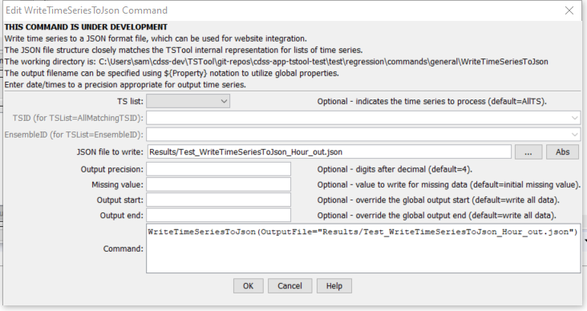

# TSTool / Command / WriteTimeSeriesToJson #

* [Overview](#overview)
* [Command Editor](#command-editor)
* [Command Syntax](#command-syntax)
* [Examples](#examples)
* [Troubleshooting](#troubleshooting)
* [See Also](#see-also)

-------------------------

## Overview ##

**This command is under development.
The JSON format will change as feedback is received and additional
time series information is added to the output (e.g., comments, properties).**

The `WriteTimeSeriesToJson` command writes time series to a file using JSON (JavaScript Object Notation) format.
The file can be included in a JavaScript script to instantiate data objects.
The following example illustrates the format of the JSON file,
with two hour-interval time series, one without data flags, and one with data flags.
The JSON format closely matches time series data management conventions used by TSTool.
In the future, support for writing time series data values in parallel
(via `overlap=true` property for the list) may be implemented in order to save space in the file.
JSON files can be viewed/edited by online tools such as [http://jsoneditoronline.org](http://jsoneditoronline.org).

```json
	{
	 "timeSeriesList": {
	  "numTimeSeries": 2,
	  "overlap": false,
	  "timeSeries": [
	   {
	    "timeSeriesMeta": {
	     "tsid": "MyLoc1..MyDataType.Hour",
	     "alias": "MyLoc1",
	     "description": "Test data, pattern",
	     "locationType": "",
	     "locationId": "MyLoc1",
	     "dataSource": "",
	     "dataType": "MyDataType",
	     "scenario": "",
	     "missingVal": -999.0,
	     "units": "CFS",
	     "unitsOriginal": "CFS",
	     "start": "1950-01-01 00",
	     "end": "1950-01-03 12",
	     "startOriginal": "1950-01-01 00",
	     "endOriginal": "1950-01-03 12",
	     "hasDataFlags": false
	    },
	    "timeSeriesData": [
	     { "dt": "1950-01-01 00", "value": 5.0000 },
	     { "dt": "1950-01-01 01", "value": 10.0000 },
	     { "dt": "1950-01-01 02", "value": 12.0000 },
	… omitted …
	     { "dt": "1950-01-03 11", "value": 75.0000 },
	     { "dt": "1950-01-03 12", "value": 5.0000 }
	    ]
	   },
	   {
	    "timeSeriesMeta": {
	     "tsid": "MyLoc2..MyData.Hour",
	     "alias": "MyLoc2",
	     "description": "Test data, pattern",
	     "locationType": "",
	     "locationId": "MyLoc2",
	     "dataSource": "",
	     "dataType": "MyData",
	     "scenario": "",
	     "missingVal": -999.0,
	     "units": "CFS",
	     "unitsOriginal": "CFS",
	     "start": "1950-01-01 00",
	     "end": "1950-01-04 12",
	     "startOriginal": "1950-01-01 00",
	     "endOriginal": "1950-01-04 12",
	     "hasDataFlags": true
	    },
	    "timeSeriesData": [
	     { "dt": "1950-01-01 00", "value": 7.0000, "flag": "A" },
	     { "dt": "1950-01-01 01", "value": 12.0000, "flag": "B" },
	     { "dt": "1950-01-01 02", "value": 14.0000, "flag": "" },
	…omitted…
	     { "dt": "1950-01-04 11", "value": -999.0000, "flag": "D" },
	     { "dt": "1950-01-04 12", "value": 77.0000, "flag": "E" }
	    ]
	   }
	  ]
	 }
	}

```

## Command Editor ##

The following dialog is used to edit the command and illustrates the syntax of the command.

**<p style="text-align: center;">

</p>**

**<p style="text-align: center;">
`WriteTimeSeriesToJson` Command Editor (<a href="../WriteTimeSeriesToJson.png">see also the full-size image</a>)
</p>**

## Command Syntax ##

The command syntax is as follows:

```text
WriteTimeSeriesToJson(Parameter="Value",...)
```
**<p style="text-align: center;">
Command Parameters
</p>**

|**Parameter**&nbsp;&nbsp;&nbsp;&nbsp;&nbsp;&nbsp;&nbsp;&nbsp;&nbsp;&nbsp;&nbsp;|**Description**|**Default**&nbsp;&nbsp;&nbsp;&nbsp;&nbsp;&nbsp;&nbsp;&nbsp;&nbsp;&nbsp;&nbsp;&nbsp;&nbsp;&nbsp;&nbsp;&nbsp;&nbsp;&nbsp;&nbsp;&nbsp;&nbsp;&nbsp;&nbsp;&nbsp;&nbsp;&nbsp;&nbsp;|
|--------------|-----------------|-----------------|
|`TSList`|Indicates the list of time series to be processed, one of:<br><ul><li>`AllMatchingTSID` – all time series that match the TSID (single TSID or TSID with wildcards) will be processed.</li><li>`AllTS` – all time series before the command.</li><li>`EnsembleID` – all time series in the ensemble will be processed (see the EnsembleID parameter).</li><li>`FirstMatchingTSID` – the first time series that matches the TSID (single TSID or TSID with wildcards) will be processed.</li><li>`LastMatchingTSID` – the last time series that matches the TSID (single TSID or TSID with wildcards) will be processed.</li><li>`SelectedTS` – the time series are those selected with the [`SelectTimeSeries`](../SelectTimeSeries/SelectTimeSeries.md) command.</li></ul> | `AllTS` |
|`TSID`|The time series identifier or alias for the time series to be processed, using the `*` wildcard character to match multiple time series.  Can be specified using `${Property}`.|Required if `TSList=*TSID`|
|`EnsembleID`|The ensemble to be processed, if processing an ensemble. Can be specified using `${Property}`.|Required if `TSList=*EnsembleID`|
|`OutputFile`<br>**required**|The JSON output file.  The path to the file can be absolute or relative to the working directory (command file location).  Global properties can be used to specify the filename, using the `${Property}` syntax.|None – must be specified.|
|`Precision`|The number of digits after the decimal for numerical output.|`4` (in the future may default based on data type)|
|`MissingValue`|The value to write to the file to indicate a missing value in the time series, must be a number or `NaN`.|As initialized when reading the time series or creating a new time series, typically `-999`, `NaN`, or another value that is not expected in data.|
|`OutputStart`|The date/time for the start of the output.|Use the global output period.|
|`OutputEnd`|The date/time for the end of the output.|Use the global output period.|

## Examples ##

See the [automated tests](https://github.com/OpenCDSS/cdss-app-tstool-test/tree/master/test/regression/commands/general/WriteTimeSeriesToJson).

## Troubleshooting ##

## See Also ##

* [`SelectTimeSeries`](../SelectTimeSeries/SelectTimeSeries.md) command
