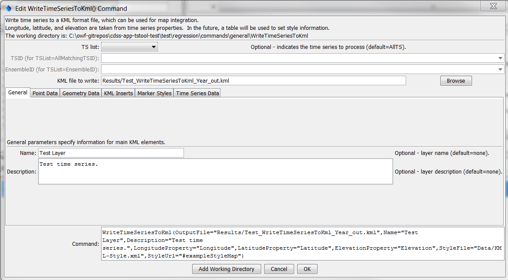
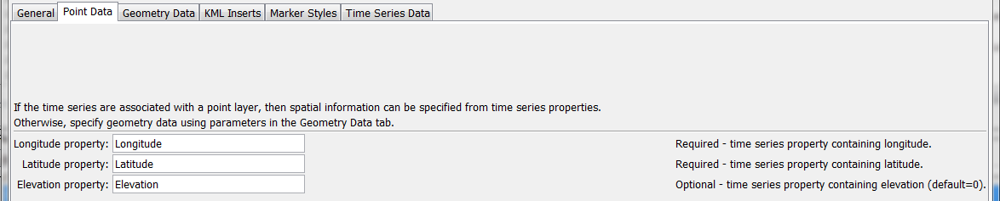
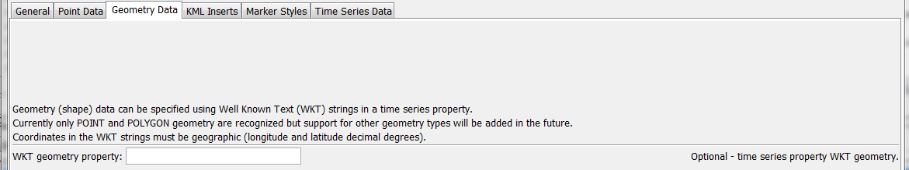
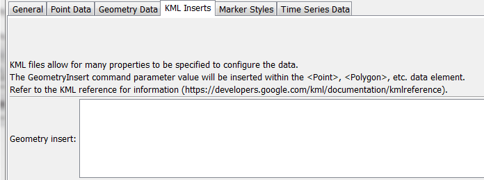
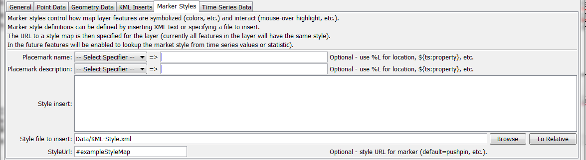
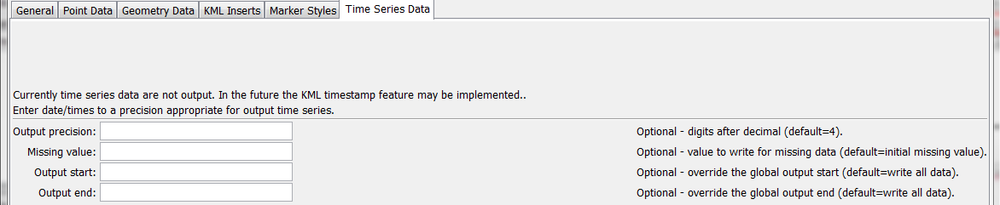

# TSTool / Command / WriteTimeSeriesToKml #

*   [Overview](#overview)
*   [Command Editor](#command-editor)
*   [Command Syntax](#command-syntax)
*   [Examples](#examples)
*   [Troubleshooting](#troubleshooting)
*   [See Also](#see-also)

-------------------------

## Overview ##

The `WriteTimeSeriesToKml` command writes time series to a Keyhole Markup Language (KML),
which is a spatial data format used by Google Earth and web mapping software.
At a minimum, the locations associated with the time series can be written as spatial data.
In the future, the time series values will be used to color the layer symbols and animate the data.  See:

*   [Keyhole Markup Language Developer's Guide](https://developers.google.com/kml/documentation/topicsinkml)

Spatial data are taken from time series properties and must include columns for
longitude and latitude or Well Known Text (WKT) geometry strings.  See:

*   [Well-known Text on Wikipedia](https://en.wikipedia.org/wiki/Well-known_text)

Currently only point and polygon data can be processed but in the future support
for well-known text for other geometry types will be added.
Other features that are envisioned in the future include;

*   Providing the option to output the time series using the timestamp and timespan KML features.
*   Providing the option to specify style information with a table,
    for example using the data type to indicate the symbol and icon.

## Command Editor ##

The command is available in the following TSTool menu:

*   ***Commands / Spatial Data Processing***

The following dialog is used to edit the command and illustrates the syntax of the command.

**<p style="text-align: center;">

</p>**

**<p style="text-align: center;">
`WriteTimeSeriesToKml` Command Editor (<a href="../WriteTimeSeriesToKml.png">see also the full-size image</a>)
</p>**

The following figure illustrates the command syntax for point data specified with time series properties.

**<p style="text-align: center;">

</p>**

**<p style="text-align: center;">
`WriteTimeSeriesToKml` Command Editor for Point Data Parameters (<a href="../WriteTimeSeriesToKml_Point.png">see also the full-size image</a>)
</p>**

The following figure illustrates the command syntax for layers specified with a WKT geometry property.

**<p style="text-align: center;">

</p>**

**<p style="text-align: center;">
`WriteTimeSeriesToKml` Command Editor for WKT Geometry Data Parameters (<a href="../WriteTimeSeriesToKml_Geometry.png">see also the full-size image</a>)
</p>**

The following figure illustrates the command syntax for KML inserts.  This allows KML elements to be inserted in the KML file.

**<p style="text-align: center;">

</p>**

**<p style="text-align: center;">
`WriteTimeSeriesToKml` Command Editor for KML Insert Parameters (<a href="../WriteTimeSeriesToKml_KmlInsert.png">see also the full-size image</a>)
</p>**

The following figure illustrates the command syntax for marker style parameters.

**<p style="text-align: center;">

</p>**

**<p style="text-align: center;">
`WriteTimeSeriesToKml` Command Editor for Marker Style Parameters (<a href="../WriteTimeSeriesToKml_Styles.png">see also the full-size image</a>)
</p>**

The following figure illustrates the command syntax for time series data parameters.
In the future this tab will be used to control how time series values are used to animate a KML layer.

**<p style="text-align: center;">

</p>**

**<p style="text-align: center;">
`WriteTimeSeriesToKml` Command Editor for Time Series Data Parameters (<a href="../WriteTimeSeriesToKml_TimeSeries.png">see also the full-size image</a>)
</p>**

## Command Syntax ##

The command syntax is as follows:

```text
WriteTimeSeriesToKml(Parameter="Value",...)
```
**<p style="text-align: center;">
Command Parameters
</p>**

|**Parameter**&nbsp;&nbsp;&nbsp;&nbsp;&nbsp;&nbsp;&nbsp;&nbsp;&nbsp;&nbsp;&nbsp;&nbsp;&nbsp;&nbsp;&nbsp;&nbsp;&nbsp;&nbsp;&nbsp;&nbsp;&nbsp;&nbsp;&nbsp;&nbsp;&nbsp;|**Description**|**Default**&nbsp;&nbsp;&nbsp;&nbsp;&nbsp;&nbsp;&nbsp;&nbsp;&nbsp;&nbsp;&nbsp;&nbsp;&nbsp;&nbsp;&nbsp;&nbsp;&nbsp;&nbsp;&nbsp;&nbsp;&nbsp;&nbsp;&nbsp;&nbsp;&nbsp;&nbsp;&nbsp;|
|--------------|-----------------|-----------------|
|`TSList`|Indicates the list of time series to be processed, one of:<br><ul><li>`AllMatchingTSID` – all time series that match the TSID (single TSID or TSID with wildcards) will be processed.</li><li>`AllTS` – all time series before the command.</li><li>`EnsembleID` – all time series in the ensemble will be processed (see the EnsembleID parameter).</li><li>`FirstMatchingTSID` – the first time series that matches the TSID (single TSID or TSID with wildcards) will be processed.</li><li>`LastMatchingTSID` – the last time series that matches the TSID (single TSID or TSID with wildcards) will be processed.</li><li>`SelectedTS` – the time series are those selected with the [`SelectTimeSeries`](../SelectTimeSeries/SelectTimeSeries.md) command.</li></ul> | `AllTS` |
|`TSID`|The time series identifier or alias for the time series to be processed, using the `*` wildcard character to match multiple time series.  Can be specified using `${Property}`.|Required if `TSList=*TSID`|
|`EnsembleID`|The ensemble to be processed, if processing an ensemble. Can be specified using `${Property}`.|Required if `TSList=*EnsembleID`|
|`OutputFile`|The KML output file.  The path to the file can be absolute or relative to the working directory (command file location).  Global properties can be used to specify the filename, using the `${Property}` syntax.|None – must be specified.|
|`Name`|The name of the layer, corresponding to the <name> KML element.  Can be specified using `${Property}`.|Blank|
|`Description`|The description for the layer, corresponding to the `<description>` KML element.  The text can contain HTML markup.  Can be specified using `${Property}`.|Blank|
|`LongitudeProperty`|The name of the time series property containing the longitude to use for the KML.  Can be specified using `${Property}`.|Required unless WKT geometry is specified.|
|`LatitudeProperty`|The name of the time series property containing the latitude to use for the KML.  Can be specified using `${Property}`.|Required unless WKT geometry is specified.|
|`ElevationProperty`|The name of the time series property containing the elevation to use for the KML.  Can be specified using `${Property}`.|Omitted|
|`WKTGeometryProperty`|The name of the time series property that contains Well Known Text (WKT) geometry strings.  Can be specified using `${Property}`.|Will use point data properties|
|`GeometryInsert`|Text containing KML elements to insert after `<Point>`, `<Polygon>` or other elements, used to configure the KML data.  Can be specified using `${Property}`.|No inserts.|
|`PlacemarkName`|The placemark name, corresponding to the KML `<Placemark><name>` element.  Specify a literal string or use the `%` and `${ts:property}` specifiers to use time series properties.  HTML will be properly handled in the KML.|Time series location ID.|
|`PlacemarkDescription`|The placemark description, corresponding to the KML `<Placemark><description>` element.  Specify a literal string or use the `%` and `${ts:property}` specifiers to use time series properties.  HTML will be properly handled in the KML.|Time series description.|
|`StyleInsert`|Text containing `<Style>` and `<StyleMap>` element text, which will be inserted in the KML file.  Can be specified using `${Property}`.|No styles.|
|`StyleFile`|Similar to StyleInsert; however, the style information to be inserted is read from the specified file.  Can be specified using `${Property}`.||
|`StyleUrl`|Specifies the `<StyleMap id=”myStyleMap”>` or `<Style id=”myStyle”>` element to use for each placemark in the layer.  For example, specify as `#myStyleMap` to match a style map included in the KML file with the `StyleInsert` or `StyleFile` parameter, where the URL matches the id attribute.  Can be specified using `${Property}`.|Default KML style.|
|`Precision`|The number of digits after the decimal for numerical output.  Not currently enabled.|`4` (in the future may default based on data type)|
|`MissingValue`|The value to write to the file to indicate a missing value in the time series, must be a number or `NaN`.  Not currently enabled.|As initialized when reading the time series or creating a new time series, typically `-999`, `NaN`, or another value that is not expected in data.|
|`OutputStart`|The date/time for the start of the output, used with KML timestamp.  Not currently enabled.|Use the global output period.|
|`OutputEnd`|The date/time for the end of the output, used with KML timestamp.  Not currently enabled.|Use the global output period.|

## Examples ##

See the [automated tests](https://github.com/OpenCDSS/cdss-app-tstool-test/tree/master/test/commands/WriteTimeSeriesToKml).

## Troubleshooting ##

## See Also ##

*   [`WriteTimeSeriesToGeoJSON`](../WriteTimeSeriesToGeoJSON/WriteTimeSeriesToGeoJSON.md) command
