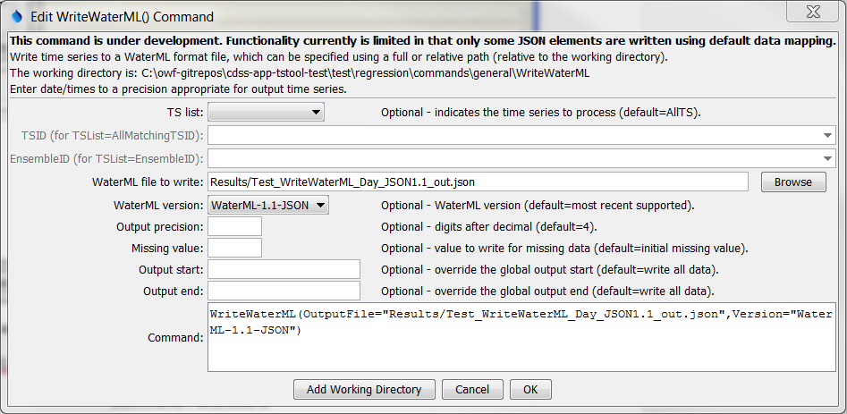

# TSTool / Command / WriteWaterML #

*   [Overview](#overview)
*   [Command Editor](#command-editor)
*   [Command Syntax](#command-syntax)
*   [Examples](#examples)
*   [Troubleshooting](#troubleshooting)
*   [See Also](#see-also)

-------------------------

## Overview ##

**This command is under development.  In particular, an evaluation is determining how best to
map internal time series properties to the WaterML specification,
including selecting reasonable defaults while allowing override of defaults.
Recent work has focused on WaterML 2.**

The `WriteWaterML` command writes time series to a WaterML XML and JSON format file.
See the [WaterML Input Type Appendix](../../datastore-ref/WaterML/WaterML.md) for more information about the file format.
See also the [`WriteWaterML2`](../WriteWaterML2/WriteWaterML2.md) command, which focuses on WaterML 2.

## Command Editor ##

The command is available in the following TSTool menu:

*   ***Commands / Output Time Series***

The following dialog is used to edit the command and illustrates the command syntax.

**<p style="text-align: center;">

</p>**

**<p style="text-align: center;">
`WriteWaterML` Command Editor (<a href="../WriteWaterML.png">see also the full-size image</a>)
</p>**

## Command Syntax ##

The command syntax is as follows:

```text
WriteWaterML(Parameter="Value",...)
```
**<p style="text-align: center;">
Command Parameters
</p>**

|**Parameter**&nbsp;&nbsp;&nbsp;&nbsp;&nbsp;&nbsp;&nbsp;&nbsp;&nbsp;&nbsp;&nbsp;&nbsp;&nbsp;&nbsp;&nbsp;&nbsp;&nbsp;&nbsp;&nbsp;&nbsp;&nbsp;&nbsp;&nbsp;&nbsp;&nbsp;|**Description**|**Default**&nbsp;&nbsp;&nbsp;&nbsp;&nbsp;&nbsp;&nbsp;&nbsp;&nbsp;&nbsp;&nbsp;&nbsp;&nbsp;&nbsp;&nbsp;&nbsp;&nbsp;&nbsp;&nbsp;&nbsp;&nbsp;&nbsp;&nbsp;&nbsp;&nbsp;&nbsp;&nbsp;|
|--------------|-----------------|-----------------|
| `Parameter` | Description | Default |
| `TSList` | Indicates the list of time series to process, one of:<ul><li> `AllMatchingTSID` – all time series that match the TSID (single TSID or TSID with wildcards) will be processed.</li><li> `AllTS` – all time series before the command.</li><li> `EnsembleID` – all time series in the ensemble will be processed.</li><li> `FirstMatchingTSID` – the first time series that matches the TSID (single TSID or TSID with wildcards) will be processed.</li><li> `LastMatchingTSID` – the last time series that matches the TSID (single TSID or TSID with wildcards) will be processed.</li><li> `SelectedTS` – the time series are those selected with the [`SelectTimeSeries`](../SelectTimeSeries/SelectTimeSeries.md) command. | `AllTS` |
| `TSID` | The time series identifier or alias for the time series to be processed, using the `*` wildcard character to match multiple time series. | Required if `TSList=*TSID`. |
| `EnsembleID` | The ensemble to process, if processing an ensemble. | Required if `TSList= EnsembleID`. |
| `OutputFile` | The WaterML output file.  The path to the file can be absolute or relative to the working directory (command file location).  Can be specified using `${Property}` notation. | None – must be specified. |
| `Version` | The WaterML version to write:<ul><li> WaterML-1.1- JSON</li><li> WaterML-2.0 – see [`WriteWaterML2`](../WriteWaterML2/WriteWaterML2.md) command, which is being phased in. | WaterML-2.0 |
| `Precision` | The number of digits after the decimal for numerical output. | `4` (in the future may default based on data type) |
| `MissingValue` | The value to write to the file to indicate a missing value in the time series. | As initialized when reading the time series or creating a new time series, typically `-999`, `NaN`, or another value that is not expected in data. |
| `OutputStart` | The date/time for the start of the output. | Use the global output period. |
| `OutputEnd` | The date/time for the end of the output. | Use the global output period. |

## Examples ##

See the [automated tests](https://github.com/OpenCDSS/cdss-app-tstool-test/tree/master/test/commands/WriteWaterML).

## Troubleshooting ##

See the main [TSTool Troubleshooting](../../troubleshooting/troubleshooting.md) documentation.

## See Also ##

*   [`ReadWaterML`](../ReadWaterML/ReadWaterML.md) command
*   [`WriteWaterML2`](../WriteWaterML2/WriteWaterML2.md) command
