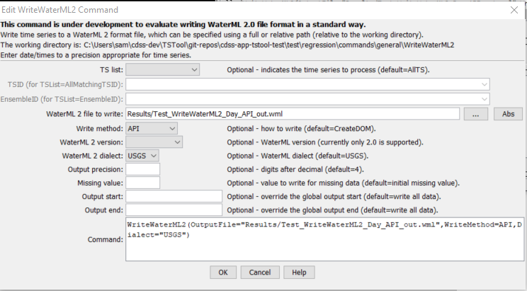

# TSTool / Command / WriteWaterML2 #

* [Overview](#overview)
* [Command Editor](#command-editor)
* [Command Syntax](#command-syntax)
* [Examples](#examples)
* [Troubleshooting](#troubleshooting)
* [See Also](#see-also)

-------------------------

## Overview ##

**This command is under development.  In particular, an evaluation is determining how best to map
internal time series properties to the WaterML specification,
including selecting reasonable defaults while allowing override of defaults.**

The `WriteWaterML2` command writes time series to a WaterML 2 XML format file.
See the [WaterML2 Input Type Appendix](../../datastore-ref/WaterML2/WaterML2.md) for more information about the file format.
This command is under development because there is interpretation of how the
specification should be implemented, resulting in various dialects of WaterML 2 files.
These dialects require that software such as TSTool understand the dialect and be able to produce it accurately.

## Command Editor ##

The following dialog is used to edit the command and illustrates the command syntax.

**<p style="text-align: center;">

</p>**

**<p style="text-align: center;">
`WriteWaterML2` Command Editor (<a href="../WriteWaterML2.png">see also the full-size image</a>)
</p>**

## Command Syntax ##

The command syntax is as follows:

```text
WriteWaterML2(Parameter="Value",...)
```
**<p style="text-align: center;">
Command Parameters
</p>**

|**Parameter**&nbsp;&nbsp;&nbsp;&nbsp;&nbsp;&nbsp;&nbsp;&nbsp;&nbsp;&nbsp;&nbsp;&nbsp;&nbsp;&nbsp;&nbsp;&nbsp;&nbsp;&nbsp;&nbsp;&nbsp;&nbsp;&nbsp;&nbsp;&nbsp;&nbsp;|**Description**|**Default**&nbsp;&nbsp;&nbsp;&nbsp;&nbsp;&nbsp;&nbsp;&nbsp;&nbsp;&nbsp;&nbsp;&nbsp;&nbsp;&nbsp;&nbsp;&nbsp;&nbsp;&nbsp;&nbsp;&nbsp;&nbsp;&nbsp;&nbsp;&nbsp;&nbsp;&nbsp;&nbsp;|
|--------------|-----------------|-----------------|
| `TSList` | Indicates the list of time series to process, one of:<ul><li> `AllMatchingTSID` – all time series that match the TSID (single TSID or TSID with wildcards) will be processed.</li><li> `AllTS` – all time series before the command.</li><li> `EnsembleID` – all time series in the ensemble will be processed.</li><li> `FirstMatchingTSID` – the first time series that matches the TSID (single TSID or TSID with wildcards) will be processed.</li><li> `LastMatchingTSID` – the last time series that matches the TSID (single TSID or TSID with wildcards) will be processed.</li><li> `SelectedTS` – the time series are those selected with the [`SelectTimeSeries`](../SelectTimeSeries/SelectTimeSeries.md) command. | `AllTS` |
| `TSID` | The time series identifier or alias for the time series to be processed, using the `*` wildcard character to match multiple time series. | Required if `TSList=*TSID`. |
| `EnsembleID` | The ensemble to process, if processing an ensemble. | Required if `TSList= EnsembleID`. |
| `OutputFile` | TheWaterML 2 output file.  The path to the file can be absolute or relative to the working directory (command file location).  Can be specified using `${Property}` notation. | None – must be specified. |
| `WriteMethod` | The method used to write the file, used by developers and may have an impact on features and performance:<ul><li> `CreateDOM` – write the XML document object model (DOM) directly</li><li> `API` – use the WaterML 2.0 auto-generated API to write (less flexibility to control output since code is generated from schema) | `CreateDOM` |
| `Version` | The WaterML 2 version to write:<ul><li> `WaterML-2.0` | `WaterML-2.0` |
| `Dialect` | The WaterML 2 dialect, reflecting implementation by different organizations:<ul><li>`USGS` – United States Geological Survey, as used with National Water Information System (NWIS) | `USGS` |
| `Precision` | The number of digits after the decimal for numerical output. | `4` (in the future may default based on data type) |
| `MissingValue` | The value to write to the file to indicate a missing value in the time series. | As initialized when reading the time series or creating a new time series, typically `-999`, `NaN`, or another value that is not expected in data. |
| `OutputStart` | The date/time for the start of the output. | Use the global output period. |
| `OutputEnd` | The date/time for the end of the output. | Use the global output period. |

## Examples ##

See the [automated tests](https://github.com/OpenCDSS/cdss-app-tstool-test/tree/master/test/regression/commands/general/WriteWaterML2).

## Troubleshooting ##

## See Also ##

* [`ReadWaterML2`](../ReadWaterML/ReadWaterML.md) command
