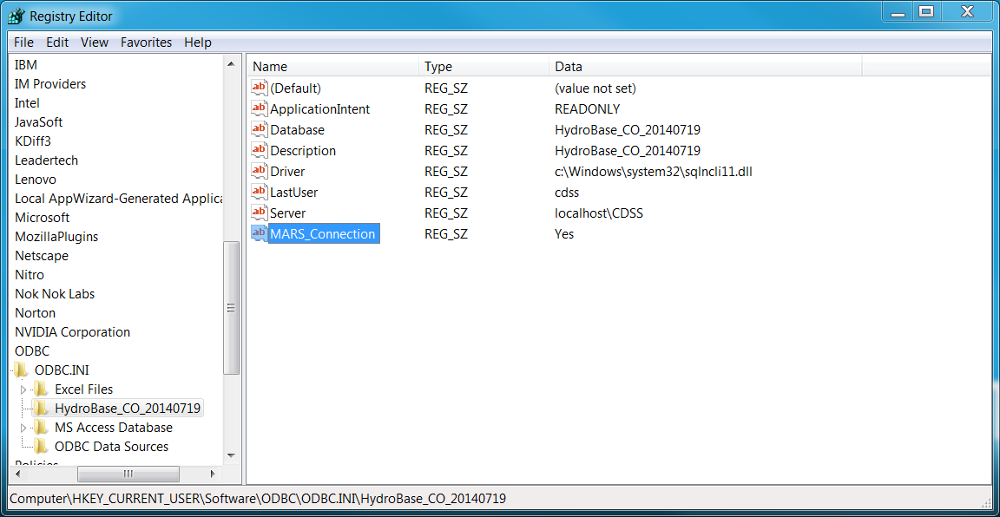

# TSTool / Datastore Reference / Colorado HydroBase #

* [Overview](#overview)
	+ [Database Contents](#database-contents)
	+ [Database Connections](#database-connections)
* [Standard Time Series Properties](#standard-time-series-properties)
* [Limitations](#limitations)
* [Datastore Configuration File](#datastore-configuration-file)
* [Troubleshooting](#troubleshooting)
* [Available Time Series by Data Type Categories](#available-time-series-by-data-type-categories)
	+ [Agricultural Crop and Livestock Data](#agricultural-crop-and-livestock-data)
	+ [Climate Data](#climate-data)
	+ [Demographic Data](#demographic-data)
	+ [Diversion Data](#diversion-data)
	+ [Hardware Data](#hardware-data)
	+ [Reservoir Data](#reservoir-data)
	+ [Stream Data](#stream-data)
	+ [Water Information Sheet Data](#water-information-sheet-data)
	+ [Well Data](#well-data)

------------

## Overview ##

This appendix describes the HydroBase datastore,
which is being phased in to replace the HydroBase “input type”.

### Database Contents ###

The State of Colorado’s HydroBase database stores a variety of time series data.
The time series conventions described here, in particular for time series identifiers,
are consistent for major CDSS software components including TSTool, StateDMI, StateView/CWRAT, and StateMod GUI.
This allows for consistent features and sharing of data between software tools.

The current database design splits time series into three main categories:

1. **Data related to structures or administrative data** maintained by the State of Colorado (e.g., diversions, reservoirs).
Structure locations are typically identified using a water district identifier (WDID),
consisting of a two-digit State of Colorado water district number
and a trailing structure identifier (which in the past was four digits
but has been increased to five or more digits to support longer identifiers).
Although a single WDID identifier is used when identifying time series,
the separate WD and ID fields are generally also available in HydroBase.
2. **Data for stations**, consisting mainly of location information and time series (e.g.,
NOAA precipitation data, USGS streamflow).
Station locations are typically identified using a station identifier from the data source.
For example, stations can use a USGS identifier,
a State of Colorado Satellite Monitoring System abbreviation, or other identifier.
3. **Data recorded at locations that are not stations or structures**.
For example, well permits that do not have WDID identifiers and county data such as
agricultural statistics.

A structure or station may have more than one identifier depending on the number of agencies
involved with data collection, etc.
For example, a reservoir may have a State of Colorado WDID because it has water rights,
a Bureau of Reclamation identifier, a US Geological Survey identifier,
and a second State of Colorado identifier corresponding to a real-time data station.
HydroBase collects data from many sources; however,
the State has not attempted in all cases to cross-references the identifiers.
For example, a streamflow station may have a partial time series record with a
“USGS” data source and identifier and a partial time series record
with a “DWR” (Division of Water Resources) data source and identifier – the
user must recognize that this may be the same station, under different management at different times.

HydroBase downloads are updated for release to the public at least once per year,
although internal updates occur year-round.
Time series are used with CDSS (Colorado's Decision Support Systems)
applications and follow basic time series standards when used by TSTool and other software.
See the [Available Time Series by Data Type Categories](#available-time-series-by-data-type-categories)
section for a list of available time series.

### Database Connections ###

The newer datastore design is more flexible than older input type design.
The HydroBase datastore is a direct database connection that requires installing HydroBase on a local computer
(such as for StateCU and StateMod modelers)
or server that is accessible in a local network (such as for State of Colorado offices).
This datastore provides the fastest performance and most flexibility when processing HydroBase data because the
[ColoradoHydroBaseRest web service datastore](../ColoradoHydroBaseRest/ColoradoHydroBaseRest.md) is limited by internet technologies performance and may not provide
services for all HydroBase database tables and views.

Some issues remain before moving completely to the datastore concept and consequently
the configuration of a HydroBase datastore is an optional feature that is not enabled by default.
To enable, it is recommended to:

1. Copy the installation datastore configuration file (`C:/CDSS/TSTool-NN.NN.NN/datastores/HydroBase.cfg`) to
user datastore configuration file (`C:/Users/user/.tstool/NN/datastores/HydroBase.cfg`).
The configuration file distributed with the software uses `Enabled=False` so it will not result in a database connection.
This only needs to be done for each major TSTool version (first number in version).
2. In the user configuration file (`C:/Users/user/.tstool/NN/datastores/HydroBase.cfg`):
	1. Comment out the `Enabled=False` property or change to `Enabled=True`.
	2. Edit the `DatabaseName=HydroBase_CO_YYYYMMDD` property to match the HydroBase version that has been installed with
	HydroBase Database Manager tool.
	The connection to this database will be made automatically when TSTool starts.
	If the configuration is incorrect, see ***View / Datastores*** for troubleshooting information.
	This connection is independent of the HydroBase selector dialog shown at startup.
	Use the HydroBase selector to list HydroBase names that are available.
	See also the [Datastore Configuration File](#datastore-configuration-file) section.

The database selected with the HydroBase selector when TSTool starts results
in a separate database connection using the `cdss` login (HydroBase logins are explained below) and is listed as an ***Input type***.
Commands such as `ReadHydroBase` and time series identifiers ending in `~HydroBase` will first
search for a datastore named `HydroBase` and if not found will use the database connection
from the selector dialog (input type).
Consequently, a `HydroBase` datastore will take precedence over the database connection
from the interactive HydroBase selection at TSTool startup.

Technical issues with fully moving to datastore include how to change the traditional HydroBase
login dialog and implement best practices for naming datastores when dealing with dated versions of HydroBase.

The HydroBase database contains stored procedures and views suitable for the following users (accounts):

* **CDSS user** (SQL Server login `cdss`, password `cdss%tools`) - is a service account that exposes
HydroBase data through stored procedures and views appropriate for decision support system projects.
HydroBase CDSS view names have the prefix `vw_CDSS` (e.g., structures are in a view or table `vw_CDSS_Structure`).
This is the default account when using the HydroBase datastore.
* **HBGuest user** (SQL Server login `HBGuest`, password `1HBGuest`) - 
is a read-only service account that exposes HydroBase data through stored procedures
and views appropriate for general database users.
HydroBase HBGuest view names do not have the prefix `vw_CDSS` (e.g., structures are in a view or table `structure`).
See the [HBGuest User Manual](http://www.dwr.state.co.us/HBGuest/Documents/ColoradoHBGuestWebService.pdf)
for an overview of HBGuest configuration and database access.

A general rule of thumb is that the CDSS account should be used for full TSTool functionality;
however, the HBGuest account can be used to query views that are not available via the
CDSS account (e.g., the `vw_HBGuest_StructureAssocWDID` table provides
information about augmentation plans and other structure groups).

TSTool connections for the above HydroBase accounts can be figured in several ways.
Refer to the recommended approach at the top of this section and details in the
[Datastore Configuration File](#datastore-configuration-file) section.

* CDSS user:
	+ Configure as the HydroBase “input type”.
	This is the default legacy behavior when HydroBase is enabled,
	and relies on the user selecting a HydroBase database via the HydroBase selection dialog.
	This approach may be phased out in the future in favor of the more generic datastore approach.
	+ Configure a HydroBase CDSS datastore using a HydroBase datastore configuration file.
	If the datastore name is configured as “HydroBase”,
	this connection will supersede the “input type” when encountered in time series identifiers.
	The account will default to the CDSS service account.
	An example configuration file is shown in the [Datastore Configuration File](#datastore-configuration-file) section below.
	+ Configure a HydroBase CDSS datastore using a configuration file with an ODBC DSN.
	In this case, the ODBC DSN must be configured using a SQL Server driver
	with login `cdss` and password `cdss%tools`.
	An example configuration file is shown in the [Datastore Configuration File](#datastore-configuration-file) section below.
* HBGuest user:
	+ Configure a Generic Database datastore using a HydroBase datastore configuration file.
	See the [Datastore Configuration File](#datastore-configuration-file) section below).
	This approach may be needed if the ODBC DSN configuration (next item) results in errors,
	and the text configuration file may be more transparent than the ODBC DSN.
	+ Configure a HydroBase datastore using a configuration file with an ODBC DSN.
	In this case, the ODBC DSN must be configured using a SQL Server
	driver with login HBGuest and password 1HBGuest.
	See the example for the CDSS account in the [Datastore Configuration File](#datastore-configuration-file) section below.

## Standard Time Series Properties ##

The standard time series identifier format for HydroBase datastore time series is of the form:

```
Location.DataSource.DataType.Interval~DataStoreName
```

Due to the variety of data types, sources, and formats in HydroBase,
time series properties can be set a number of ways.   General guidelines are as follows:

* The location part of the time series identifier is set to a station or structure identifier,
which is typically the identifier used by the managing agency.
For example, USGS stream gages use the 8-digit USGS identifier and State of Colorado diversions
use a 7-character zero-padded structure WDID (water district identifier).
Wells often use the latitude and longitude merged together (see additional comments in the wells section).
* The source part of the time series identifier corresponds to a data provider abbreviation.
For example, if the current provider for a time series is the USGS, then the data source will be USGS.
If the State of Colorado has at some point taken over maintenance of a station from the USGS,
then the data source will be DWR.  Individual data records may indicate a variety of data sources.
The convention in HydroBase is to store the data records under the current data source,
rather than force the user to query more than one time series and merge the time series.
If, however, a station has moved, then separate time series typically will be available,
likely under different identifiers.
For this reason, the location of the station or structure is important in understanding historical records.
* The data type part of the time series identifier as much as possible uses the
“measurement type” information in HydroBase or a readable and reasonable data type phrase.
For example `Precip` is a measurement type for station data and `DivTotal` (diversion total)
is a measurement type for diversion data.
In some cases, especially with real-time data, the data type may not exactly match HydroBase.
For example, HydroBase uses a measurement type `RT_Rate` for multiple stream related data types.
TSTool uses a data type of Streamflow.
The tables at the end of this appendix describe all available HydroBase
data types and provides guidance for upgrading from old data types.
* Data intervals are set based on the tables that are being queried.
In most cases, a regular interval like `Day` or `Month` is used.
`Irregular` is used for real-time data because there currently is no way to know
without doubt what the regular data interval is (e.g., `15MIN`).
Data that are measured infrequently (e.g., reservoir field measurements)
typically are stored as a regular interval time series with interval `Day`.
This allows more flexibility in data processing and filling.
* In older versions of TSTool, the scenario part of the identifier (after the interval)
was sometimes used to supplement the data type information.
For example, real-time flow data in the database has a number of attributes (`Streamflow`, `RT_Rate`, `DISCHRG`)
that cannot easily fit into the standard time series identifier.
The current version of TSTool uses `datatype-subdatatype` where necessary and generally
does not use the scenario for normal time series identifiers (WIS time series are an exception)
and this field is being reserved to possibly indicate historical data, filled data, etc.
* Units are set based on the database table definitions.
* Period of record is set based on the available database contents.
Periods displayed when listing stations and time series typically are not
determined by checking the data because this would require querying large amounts of data.
Instead, periods are determined from summary information available in the database.
In some cases, the period of record information is not saved at a precision sufficient to
accurately represent the true period (e.g., the database may indicate data for years but not months).
Therefore, the true period will only be available when time series data values are queried.
* Missing data typically are set to `-999` in time series but are stored as nulls in the database.
TSTool does allow `NaN` (not a number) to be used but `-999` continues to be used to match legacy conventions.
* The input type of the time series identifier is set to the datastore name,
which typically is HydroBase for a default connection.
If multiple HydroBase connections are needed,
the datastore configuration information is used to assign an appropriate name.
* The time scale for data (whether accumulated [`ACCM`], instantaneous [`INST`], or mean [`MEAN`])
is not automatically determined from the data type and interval but must be understood from the data type.

Diversion data may be retrieved from several tables in HydroBase,
including daily and monthly detailed records, infrequent values, diversion comments, and currently in use values.
The TSTool [`ReadHydroBase`](../../command-ref/ReadHydroBase/ReadHydroBase.md)
command provides several options for handling data and the
[`FillUsingDiversionComments`](../../command-ref/FillUsingDiversionComments/FillUsingDiversionComments.md)
command can be used to fill with additional zero values.
When using time series identifiers to read time series, the following defaults are used:

* Daily `DivClass` and `DivTotal` time series are filled using the carry-forward
technique implemented by the State of Colorado.  Missing irrigation years remain missing.
Years with data are filled with zeros at the start and values are carried
forward until another observation is found, or to the end of the irrigation year.
* Diversion comments and “currently in use” flag are NOT automatically applied.
This default may change in the future but is retained for historical data processing reasons.

## Limitations ##

HydroBase has the following limitations related to time series storage:

* The station and structure measurement types and time series tables defined in HydroBase
do not always allow information to be determined from database records.
Instead, some time series properties must be hard-coded based on the table design.
For example, the `meas_type` table has a `MeanTemp`, `MaxTemp`, `MinTemp` types defined,
but these refer primarily to the separate daily tables for such data.
The `monthly_temp` table includes `avg_max_t`, `avg_min_t`, and `mean_t` columns
that do not correspond one-to-one with `meas_type` values.
Therefore, applications like TSTool use data types that are not specifically defined as strings in HydroBase,
which have consequently been hard-coded.  This is an issue with station and structure time series.
* Real-time data types in HydroBase do not directly translate to time series data types used in TSTool.
An effort has been made to be as consistent as possible while using data types that can be understood by users.
* Data units are not defined consistently in tables.
Some tables have a units string and others do not and the units abbreviations are
not always consistent (units of `A` are often used for acre-feet and `C` for `CFS`).
A master units table is not used in HydroBase to enforce data units consistency throughout the database.
* The time scale for time series (whether accumulated, instantaneous, or mean)
is not automatically determined from the data type and interval.
Users much understand how to interpret the data, in particular when changing the data interval.

## Datastore Configuration File ##

A datastore is configured by enabling HydroBase features in the main `TSTool.cfg` configuration
file and creating a datastore configuration file for each connection.
Configurations are processed at software startup to enable datastores.
An example of the TSTool configuration file is shown below.
Use the `HydroBaseEnabled` property to enable/disable HydroBase features in TSTool,
such as commands shown in interface menus.
Multiple datastores can be configured.
Properties for each datastore are specified in an
accompanying configuration file described after the following example.

```
# Configuration file for TSTool

[TSTool]

HydroBaseEnabled = true
```
**<p style="text-align: center;">
TSTool Configuration File with HydroBase Properties
</p>**

### HydroBase Datastore Using CDSS Account ###

The following illustrates the HydroBase datastore configuration file format
for the CDSS account.
The configuration file is typically named as follows:

* `C:\CDSS\TSTool-Version\datastores\HydroBase.cfg` - installation HydroBase datastore configuration
* `C:\Users\user\.tstool\NN\datastores\HydroBase.cfg` - user's HydroBase datastore configuration

The default `cdss` service account is used for authentication and allows read-only access to the database.

```text
# Configuration information for HydroBase database datastore, CDSS account.
#
# The user will see the following when interacting with the datastore:
#
# Name - datastore identifier used in applications, for example as the
#     input type information for time series identifiers (usually a short string)
# Description - datastore description for reports and user interfaces (short phrase)
#
# The following are needed to make database connections in the software
#
# Type - must be HydroBaseDataStore
# DatabaseEngine - the database software (SqlServer is current standard)
# DatabaseServer - IP or string address for database server, with instance name
#                  (e.g., "localhost\CDSS" can be used for local computer).  Omitting
#                  the instance name will result in default port numbers being tried
#                  until one works.
# DatabaseName - database name used by the server (e.g., HydroBase_CO_20120722)
# SystemLogin - service account login (omit for default)
# SystemPassword - service account password (omit for default)
# Enabled - if True then datastore will be enabled when software starts, False to disable
Type = "HydroBaseDataStore"
Name = "HydroBase"
Description = "HydroBase Datastore"
DatabaseEngine = "SqlServer"
# Local SQL Server Express installation...
DatabaseServer = "localhost\CDSS"
# Or a specific server...
#DatabaseServer = "amazon\CDSS"
DatabaseName = "HydroBase_CO_20120722"
```
**<p style="text-align: center;">
HydroBase Datastore Configuration File for Default CDSS Account (no ODBC DSN)
</p>**

### HydroBase Datastore Using CDSS Account and ODBC DSN ###

The following illustrates the HydroBase datastore configuration file format for the CDSS account using an ODBC DSN.
The configuration file is located in the same folder as the TSTool configuration file and
configures a datastore named `HydroBase-DSN`.
The ODBC DSN generally is configured using SQL Server authentication and the `cdss` account information.
If for some reason HydroBase did not fully install resulting in accounts not being configured,
then Windows authentication can be used.
Using an ODBC DSN can be problematic if the ODBC driver, authentication, method,
or other SQL Server configuration information is in error.

```text
# Configuration information for HydroBase database datastore, CDSS account, using ODBC DSN.
#
# The user will see the following when interacting with the datastore:
#
# Name - datastore identifier used in applications, for example as the
#     input type information for time series identifiers (usually a short string)
# Description - datastore description for reports and user interfaces (short phrase)
#
# The following are needed to make database connections in the software
#
# Type - must be GenericDatabaseDataStore
# DatabaseEngine - the database software (SqlServer is current standard)
# OdbcName - the Open Database Connectivity Data Source Name (ODBC DSN), configured
#     in Windows Control Panel
# Enabled - if True then datastore will be configured when software starts, False to disable

Enabled = True
Type = "HydroBaseDataStore"
Name = "HydroBase-DSN"
Description = "HydroBase Datastore using ODBC DSN"
DatabaseEngine = "SqlServer"
OdbcName = "HydroBase-DSN"
# Yse the following to set additional SQL Server driver properties, used for troubleshooting
#ConnectionProperties = "SomeProp=Value;SomeProp=Value"
```

**<p style="text-align: center;">
HydroBase Datastore Configuration File for CDSS Account Using ODBC DSN
</p>**

The above approach may result in database query errors in the TSTool log file:

```
Connection is busy with results for another command
```

In this case it is necessary to edit the registry with the `regedit` program as follows solved the problem.
Search for the ODBC name that was assigned to find the registry settings to edit.
An attempt was made to determine how to set the property in the connection URL but no documentation could be found.
See the following for background.  <a href="../mars-regedit.png">See also the full-size image.</a>

* [ODBC (SQL Server): How do I turn on Multiple Active Result Sets(MARS) for a System DSN?](http://serverfault.com/questions/302169/odbc-sql-server-how-do-i-turn-on-multiple-active-result-setsmars-for-a-syst)

**<p style="text-align: center;">

</p>**

### HydroBase Datastore Using HBGuest Account and Generic Database Datastore ###

The following illustrates the Generic Database datastore configuration file format
for the HBGuest account NOT using an ODBC DSN (see also the [Generic Database Datastore appendix](../GenericDatabase/GenericDatabase.md).
The configuration file is located in the same folder as the TSTool configuration file and
configures a datastore named `HydroBase-HBGuest`.
The `HBGuest` service account is used for authentication and allows read-only access to the database.

```text
# Configuration information for HydroBase database HBGuest datastore,
# using generic database datastore.
#
# The user will see the following when interacting with the datastore:
#
# Name - datastore identifier used in applications, for example as the
#     input type information for time series identifiers (usually a short string)
# Description - datastore description for reports and user interfaces (short phrase)
#
# The following are needed to make database connections in the software
#
# Type - must be GenericDatabaseDataStore
# DatabaseEngine - the database software (SqlServer is current standard)
# DatabaseServer - IP or string address for database server, with instance name
#                  (e.g., "localhost\CDSS" can be used for local computer)
# DatabaseName - database name used by the server (e.g., HydroBase_CO_20120722)
# SystemLogin - service account login (specify for HBGuest account)
# SystemPassword - service account password (specify for HBGuest account)

Enabled = True
Type = "GenericDatabaseDataStore"
Name = "HydroBase-HBGuest"
Description = "HydroBase HBGuest Datastore"
DatabaseEngine = "SqlServer"
# Local SQL Server Express installation...
DatabaseServer = "localhost\CDSS"
DatabaseName = "HydroBase_CO_20121126"
# Specify HBGuest login...
SystemLogin = "HBGuest"
SystemPassword = "1HBGuest"
```

**<p style="text-align: center;">
Generic Database Datastore Configuration File for HydroBase HBGuest Account
</p>**

## Troubleshooting ##

The following table lists errors that may result from connecting to or using HydroBase,
and potential solutions to address the errors.
See also the main [TSTool Troubleshooting](../../troubleshooting/troubleshooting.md) section.

**<p style="text-align: center;">
HydroBase Connection Errors and Possible Solutions
</p>**

|**Error**|**Possible solutions**|
|--|--|
|A HydroBase datastore configuration generates errors.|<ol><li>Use the ***View / Datastores*** menu to display datastore information, including configuration error and location of configuration file.  Resolve issues based on provided information.</li><li>If the DatabaseServer has been specified with an instance name (e.g., `ServerName\CDSS`, then the server computer (even if the local computer) must be running the SQL Server Browser process.  Otherwise, the port number cannot be determined from the instance name.  The SQL Server Browser process is started as a service under ***Windows Control Panel / Administrative Tools / Services***.  Locate the ***Sql Server Browser*** entry, edit its properties, and set the ***Startup type*** to ***Automatic*** and press ***Start*** to start the service.  You must have administrator privileges to make this change.</li><li>Verify that the configuration information specified in the HydroBase datastore configuration file is correct by using another tool to connect to the database:<ol><li>Sequel Server Management Studio (SSMS)</li><li>Create an Open Database Connectivity Data Source Name (ODBC DSN).</li><li>Use a database tools such as [SQuirreL](http://squirrel-sql.sourceforge.net/).</li></ol></ol>|
|A specific requested time series is not returned from the HydroBase database.|Time series in HydroBase are associated with the data source (e.g., `USGS`).  These data source abbreviations or their handling by software may have changed over time and a data source in a time series identifier may not be valid.  Current software requires the data source for HydroBase time series, if a data source is used with the data type in HydroBase.  Try interactively querying the time series to see if the data source has changed.|

## Available Time Series by Data Type Categories ##

The following tables present a summary of time series identifier fields for the HydroBase data types.
Data sources may be added and/or removed with data updates.
Data types are listed by major group and are alphabetized by the data type description within the group.
The time scale is provided to facilitate data use, in particular when changing the time interval.
 
### Agricultural Crop and Livestock Data ###

|**Data Group**|**Data Type Description**|**Location**|**Data Source**|**Data Type**&nbsp;&nbsp;&nbsp;&nbsp;&nbsp;&nbsp;&nbsp;&nbsp;&nbsp;&nbsp;&nbsp;&nbsp;&nbsp;&nbsp;&nbsp;&nbsp;&nbsp;&nbsp;&nbsp;&nbsp;&nbsp;&nbsp;&nbsp;&nbsp;|**Available Intervals and Time Scale**|**Comments**|
|--|--|--|--|--|--|--|
|Agricultural/ CASS|Colorado Agricultural Statistics Service crop area harvested|County Name|`CASS`|`CropAreaHarvested-Commodity_Practice`<br>Commodity and practice are from available values in HydroBase.|`Year` `INST`|See NASS data for orchards, pasture, and vegetables.  Perennial crops usually have only harvested value.|
||CASS area planted|County Name|`CASS`|`CropAreaPlanted-Commodity_Practice`<br>Commodity and practice are from available values in HydroBase.|`Year` `INST`|Annual crops should have planted value but use maximum of planted and harvested if necessary.|
||CASS livestock head|County Name|`CASS`|`LivestockHead-Commodity_Type`<br>Commodity and type are from available values in HydroBase.|`Year` `INST`|For each commodity (e.g., sheep), multiple types (e.g. sheep at various maturity levels).|
|Agricultural/ GIS|CDSS irrigated lands assessment result.<br>See also Diversion Comments below.|`WDID`|`CDSSGIS`|`CropAreaAllIrrigation-CropType`<br>`CropAreaDrip-CropType`<br>`CropAreaFlood-CropType`<br>`CropAreaFurrow-CropType`<br>`CropAreaSprinkler-CropType`<br>CropType is taken from available values in HydroBase.|`Year` `INST`|Data are only available for years where DSS projects or data refreshes have occurred.  Partial data for intermediate years may be available in spatial data layer attributes but not HydroBase.  Data are available for lands served by surface water structures, listed by crop/year/irrigation type.|
|Agricultural/ NASS|`CropArea`|County Name|`NASS`|`CropArea-Commodity`<br>Commodity is taken from available values in HydroBase.|`Year` `INST`|See CASS data where available.  NASS does not distinguish between planted and harvested.  NASS data are useful for orchards, pasture, and vegetables, which may not be reported in CASS.|

### Climate Data ###

|**Data Group**|**Data Type Description**|**Location**|**Data Source**|**Data Type**&nbsp;&nbsp;&nbsp;&nbsp;&nbsp;&nbsp;&nbsp;&nbsp;&nbsp;&nbsp;&nbsp;&nbsp;&nbsp;&nbsp;&nbsp;&nbsp;&nbsp;&nbsp;&nbsp;&nbsp;&nbsp;&nbsp;&nbsp;&nbsp;|**Available Intervals and Time Scale**|**Comments**|
|--|--|--|--|--|--|--|
|Climate|Evaporation (Pan)|Station ID|`NOAA`|`EvapPan`<br>Old (obsolete) data type was `EPAN`.|`Day` `ACCM`,<br>`Month` `ACCM`||
||Frost Dates<br>(derived from temperatures)|Station ID|`COAGM`<br>`NOAA`|`FrostDateL28S`,<br>`FrostDateL32S`,<br>`FrostDateF28F`,<br>`FrostDateF32F`<br>Old (obsolete) data type was `FrostDate` or `FrostDates`.|`Year` `INST`|Time series in software are the Julian day of the year (1-366) to allow graphing, filling, and manipulation.|
||Precipitation|Station ID|`COAGM`<br>`NOAA`|`Precip`<br>Old (obsolete) data type was `PTPX`.|`Day` `ACCM`,<br>`Month` `ACCM`,<br>`Irregular` `ACCM`|Irregular data are real-time increments.|
||Snow (accumulation on ground during interval).|Station ID|`NOAA`|`Snow`<br>Old (obsolete) data type was `SNOG`.|`Day` `ACCM`,<br>`Month` `ACCM`||
||Snow course depth and snow water equivalent|Station ID|`SCS`|`SnowCourseDepth`,<br>`SnowCourseSWE`<br>Old (obsolete) data type was `SnowCrse`, `SNWE`.|`Day` `INST`|Values are recorded on a day, with one or more times a month.|
||Solar radiation|Station ID|`COAGM`|`Solar`<br>Old (obsolete) data type was `RADS`.|`Day` `ACCM`||	
||Temperature (instantaneous)|Station ID|various|`Temp`|`Irregular` `INST`||
||Temperature (maximum)|Station ID|`COAGM`,<br>`NOAA`|`TempMax`<br>Old (obsolete) data type was `MaxTemp`, TAMX.|`Day` `INST`||
||Temperature (mean of maximum daily values)|Station ID|`COAGM`,<br>`NOAA`|`TempMeanMax`<br>Old (obsolete) data type was `MaxTemp`, `TAMX` with monthly interval.|`Month` `MEAN`||
||Temperature (mean)|Station ID|`COAGM`,<br>`NOAA`|`TempMean`<br>Old (obsolete) data type was `MeanTemp`, `TAVG`.|`Month` `MEAN`||
||Temperature (minimum)|Station ID|`COAGM`,<br>`NOAA`|`TempMin`<br>Old (obsolete) data type was `MinTemp`, `TAMN`.|`Day` `INST`||	
||Temperature (mean of minimum daily values)|Station ID|`COAGM`<br>, `NOAA`|`TempMeanMin`<br>Old (obsolete) data type was `MinTemp`, `TAMN` with monthly interval.|`Month` `MEAN`||
||Vapor pressure (mean daily)|StationID|`COAGM`|`VaporPressure`<br>Old (obsolete) data type was `VP`, `MVP`.|`Day` `MEAN`||
||Wind run|Station ID|`AGRO`,<br>`COAGM`|`Wind`<br>Old (obsolete) data type was `UDIS`.|`Day` `ACCM`||

### Demographic Data ###

Demographic data are related to human population.  See the Agricultural Data above for livestock population.

|**Data Group**|**Data Type Description**|**Location**|**Data Source**|**Data Type**|**Available Intervals and Time Scale**|**Comments**|
|--|--|--|--|--|--|--|
|Demographics|Human population (persons)|`Area_type-Area_name`<br>The type indicates whether a county, municipality, state, etc.<br>The name agrees with the type.<br>The combination defines a unique location.|(blank)<br>This could be assumed from the `Pop_type` part of the data type; however, the data source is not readily available in HydroBase.|`HumanPopulation-Pop_type`<br>The population type is `Census`, `Estimated`, etc.|`Year` `INST`|See CDSS documents for information on how population estimates are determined.|
 
### Diversion Data ###

See more information after the following table.

|**Data Group**|**Data Type Description**|**Location**|**Data Source**|**Data Type**|**Available Intervals and Time Scale**|**Comments**|
|--|--|--|--|--|--|--|
|Diversion<br>May include records for reservoir and well structures, as per State of Colorado administration practices.<br>See also reservoir data.|Diversion Class (showing water color)|`WDID`|`DWR`|`DivClass-SFUT`<br>Old (obsolete) data type was `DQME`, `Div`, or `Diversion`.|`Day` `MEAN`,<br>`Month` `INST`or `ACCM`,<br>`Year` `INST` or `ACCM`|`SFUT` is encoded as:<br>`S:s F:f U:u T:t`<br>`s` = source<br>`f` = from<br>`u` = use<br>`t` = type<br>Annual values are for irrigation year (Nov-Oct).|
||Diversion Comment (the acreage for a diversion and string data flag indicating whether a structure irrigated in a year)|WDID|`DWR`|`DivComment`|`Year` `INST` or `ACCM`|The numerical time series value is set to the acreage for the year.  The data quality flag is set to the HydroBase `diversion_comment` `not_used` flag.  Therefore, this time series can be used to extract total acreage for a structure and determine if diversions should be zero for a year.<br>Annual values are for irrigation year (Nov-Oct).|
||Diversion Total (sum of all `DivClass` records for a structure).|WDID|`DWR`|`DivTotal`<br>Old (obsolete) data type was `DQME`, `Div`, or `Diversion`.|`Day` `MEAN`,<br>`Month` `INST` or `ACCM`,<br>`Year` `INST` or `ACCM`|Annual values are for irrigation (Nov-Oct) year.|

The above table summarizes how diversion records are available as time series.
However, to determine a complete diversion time series,
it is necessary to understand the various ways that diversion records can be stored.
See also the [State of Colorado’s Diversion Record Standard](http://hermes.cde.state.co.us/drupal/islandora/object/co%3A20416).

Raw data observations for a diversion structure are stored as one or more of the following forms in HydroBase:

* **Daily water class time series**.  These data are recorded using irrigation year (November to October).
If one or more values have been entered in a month, then HydroBase will include a full month of data.
Days at the beginning of the irrigation year that have no observed
values at the start of the year should be considered to be zero,
regardless of values found in previous irrigation years.  Once an observation occurs,
then days within the month where an observation was not recorded are set to the last observed value.
Therefore, if an irrigation year contains at least one value,
that irrigation year will have at least one month of values (with no missing in the month).
To preserve space in HydroBase, months with no observations are not included in the daily data in the database.
If a year has no observation, then no data are available in HydroBase for the year and a
determination of whether the data values should be zero or other must be determined
using other data (see below) or engineering judgment.
**TSTool and StateView by default implement the carry-forward procedure within irrigation years.**
* **Diversion comments**.  Diversion comments may be included for an irrigation year.
The `not_used` flag indicates if a diversion was not used in a year.
If this is the case, then daily diversion records should not be available
and a zero value can be assumed for the water year.
**TSTool and StateView DO NOT by default use diversion comments when providing daily or monthly time series.**
* **Infrequent water class**.  Infrequent water class values can be
entered as an annual value for the irrigation year, or as a monthly value.
The data can be accessed as time series in TSTool, although no specific
capabilities have been implemented to supplement the daily or monthly time series.

Processed (derived) data records are created as follows:

* **Daily total diversion**.  Daily water class values are accumulated to daily total records.
Similar to the daily water class,
any month that has at least one value will result in a month with no missing data.
To preserve space in HydroBase, only months that include an observation are included in HydroBase.
Other months in the same irrigation year should be carried forward.
Irrigation years with no observation have no records in HydroBase and a
determination of whether the data values should be zero or other must be
made using other data (see below) or engineering judgment.
**TSTool and StateView by default implement the carry-forward procedure within irrigation years.**
* **Monthly water class**.  Monthly water class is computed by converting the daily water class
values (average CFS) to ACFT for each day of the month, and adding the values.
Because of the way that daily data are treated, a month will either have all daily values or none.
A month with no data will have its value set to missing in the database.
Full irrigation years with no observation will result in a full year of missing values,
and a determination of whether the data values should be zero or other must be
determined using other data (see below) or engineering judgment.
Unlike daily data, monthly diversion records are included in HydroBase for the full data period.
Full years of missing values may be included in the database. 
* **Monthly total diversion**.  This is derived using the same
procedure as monthly water class; however, the daily total diversion is used as input.
* **Infrequent data** are not considered when producing the monthly total time series.

Therefore, to determine a complete time series, the following must be performed, using TSTool or other software:

Daily time series:

1. Read the daily time series from HydroBase.
The default in TSTool and StateView is now to carry forward daily
diversion time series within the irrigation year.
2. Utilize the diversion comments to set additional years of data to zero.
Using diversion comments is an option with TSTool and StateDMI time series read commands.
3. For years with no data, use an appropriate fill technique.
If it is known that the ditch did not operate, then zeros should be used.
If it is known that the ditch did operate, use historical averages or some other method to fill the data.
4. HydroBase infrequent diversions could be used to supplement the data,
but currently there is no software to help users with this process.

Monthly time series:

1. Read the monthly time series from HydroBase.
Any irrigation year with at least one daily observation results in 12 monthly time series values.
2. Utilize the diversion comments to set additional years of data to zero.
Using diversion comments is an option with TSTool and StateDMI time series read commands.
3. For years with no data, use an appropriate fill technique.
If it is known that the ditch did not operate, then zeros should be used.
If it is known that the ditch did operate, use historical averages or some other method to fill the data.
4. HydroBase infrequent diversions could be used to supplement the data,
but currently there is no software to help users with this process.

Yearly time series:

1. Infrequent time series can be read by TSTool and can supplement the above data.
However, currently there is no software to help users with this process.
General TSTool commands must be used as appropriate.

### Hardware Data ###

|**Data Group**|**Data Type Description**|**Location**|**Data Source**|**Data Type**|**Available Intervals and Time Scale**|**Comments**|
|--|--|--|--|--|--|--|
|Hardware|Battery voltage|Station ID|`DWR`|`Battery`|`Irregular` `INST`|Limited data are available.  This data type allows remote system maintenance checks.|

Hardware data types are not commonly available have been implemented as a test and to allow for greater future use.
 
### Reservoir Data ###

|**Data Group**|**Data Type Description**|**Location**|**Data Source**|**Data Type**|**Available Intervals and Time Scale**|**Comments**|
|--|--|--|--|--|--|--|
|Reservoir|Field Measurements|WDID|`DWR`,<br>other|`ResMeasElev`,<br>`ResMeasEvap`,<br>`ResMeasFill`,<br>`ResMeasRelease`,<br>|`ResMeasStorage`<br>Old (obsolete) data type was `RSTO`.|`Day` `INST`,<br>`Day ACCM`,<br>`Day ACCM`,<br>`Day ACCM`,<br>`Day ACCM`|Reservoir measurements are often recorded at the beginning or end of the month.|
||Pool Elevation|Station ID or State of CO Abbrev.|`DWR`,<br>other|`PoolElev`|`Irregular` `INST`|Real-time data for reservoirs are recorded using a station abbreviation that does not match a WDID.|
||Release Class (showing water color)|WDID|`DWR`|`RelClass-SFUT`|`Day` `MEAN`,<br>`Month` `INST` or `ACCM`,<br>`Year` `INST` or `ACCM`|`SFUT` is encoded as:<br>`S:s F:f U:u T:t`<br>`s` = source<br>`f` = from<br>`u` = use<br>`t` = type<br>Annual values are for irrigation year (Nov-Oct).|
||Release Comment (the acreage for a release and string data flag)|WDID|`DWR`|`RelComment`|`Year` `INST` or `ACCM`|See `DivComment` comments.  Sometimes acreage is associated with reservoirs.  Annual values are for irrigation year (Nov-Oct).|
||Release Total (sum of all `RelClass` records for a structure).|WDID|`DWR`|`RelTotal`|`Day` `MEAN`, `Month` `INST` or `ACCM`, `Year` `INST` or `ACCM`|Annual values are for irrigation year (Nov – Oct).|
||Release (instantaneous)|Station ID|`DWR`,<br>other|`Release`|`Irregular` `INST`|Real-time data for reservoirs are recorded using a station abbreviation that does not match a WDID.|
||Reservoir Storage (end of month).|WDID|`USBR`,<br>`DWR`,<br>other|`ResEOM`<br>Old (obsolete) data type was `RSTO`.|`Month` `INST`|Few time series are available.|
||Reservoir Storage (end of year).|WDID|`USBR`,<br>`DWR`,<br>other|`ResEOY`|`Year` `INST`|From `annual_res` table.|Annual value is for irrigation year (Nov-Oct).|
||Storage (instantaneous)|Station ID or State of CO Abbrev.|`DWR`,<br>other|`Storage`|`Irregular` `INST`|Real-time data for reservoirs are recorded using a station abbreviation that does not match a WDID.|

### Stream Data ###

|**Data Group**|**Data Type Description**|**Location**|**Data Source**|**Data Type**|**Available Intervals and Time Scale**|**Comments**|
|--|--|--|--|--|--|--|
|Stream|Natural Flow|Station ID|`USBR`|`NaturalFlow`<br>Old (obsolete) data type was `Nat_flow`, `NQME`|`Month` `INST` or `ACCM`||
||Stage|Station ID|`DWR`,<br>other|`Stage`|`Irregular` `INST`|Real-time data.|
||Streamflow|DWR Abbrev. or USGS station ID|`DWR`,<br>`USGS`,<br>other|`Streamflow`<br>Old (obsolete) daily, monthly data type was `QME`.  Old real-time data type used `RT_rate` and scenario `DISCHRG` or other `VAXfield` to indicate channel.|`Day` `MEAN`,<br>`Month` `INST` or `ACCM`, `Irregular` `INST`|Real-time data use Irregular time interval.|
||Streamflow (maximum of daily mean)|Station ID|`DWR`,<br>`USGS`|`StreamflowMax`<br>Old (obsolete) data type was `Maxq`, `Maxflow`.|`Month` `INST`||
||Streamflow (minimum of daily mean)|Station ID|`DWR`,<br>`USGS`|`StreamflowMin`<br>Old (obsolete) data type was `Minq`, `Minflow`.|`Month` `INST`||
||Water temperature (instantaneous)|Station ID,<br>State of CO Abbrev.|`DWR`,<br>other|`WatTemp`|`Irregular` `INST`|Real-time data, using identifier that does not match USGS or other identifier for historical data.|

### Water Information Sheet Data ###

**Water Information Sheets were a feature of CDSS developed for real-time water administration,
but are no longer used (typically Excel workbooks are used).
The following information is being retained for historical reasons in case it is useful for future system feature design.**

|**Data Group**|**Data Type Description**|**Location**|**Data Source**|**Data Type**|**Available Intervals and Time Scale**|**Comments**|
|--|--|--|--|--|--|--|
|WIS|Water Information Sheet (WIS) cell values, over time|WIS row identifier.  For example, structures have an identifier `wdid:NNNNNNN`, where the leading `wdid:` is a literal string and the following information is the actual WDID.  Similarly, stations start with `stat:`, followed by a station ID; confluences with `conf:`, followed by the HydroBase `wd_water` numbers for the tributary and the larger stream; other row types with `othr:`, followed by a sequential number in the WIS.|`DWR`|Data types match the WIS columns, as follows:<br>`WISPointFlow`,<br>`WISNaturalFlow`,<br>`WISDeliveryFlow`,<br>`WISGainLoss`,<br>`WISRelease`,<br>`WISPriorityDiversion`,<br>`WISDeliveryDiversion`,<br>`WISTribNaturalFlow`,<br>`WISTribDeliveryFlow`,<br>`WISDryRiver`<br>(not currently implemented – may be implemented as a data flag in the future).|`Day` `MEAN`|The scenario part of the time series identifier is set to the sheet name.  Over time, WIS with a particular sheet name may be modified in format.  The combination of sheet name and row identifier can be used to find data.<br>The time series description is set to the row label.<br>Data values are as stored for the WIS, which reflect the gain method used when the sheet was stored.|

### Well Data ###

See additional information after the following table.

|**Data Group**|**Data Type Description**|**Location**|**Data Source**|**Data Type**|**Available Intervals and Time Scale**|**Comments**|
|--|--|--|--|--|--|--|
|Well|Well level (elevation and depth)|Location identifier, based on the current data source.  For example, if the data source is USGS, the location identifier will be the USGS identifier.|various|`WellLevel` (phasing out in favor of `WellLevelElev`),<br>`WellLevelDepth`,<br>`WellLevelElev`|`Day` `INST`,<br>`Irregular` `INST`|Daily data are historical measurements, often at the ends of a month.  A well may have multiple identifiers.  However, the identifier presented in TSTool is that corresponding to the primary data source.   See information below this table.|

Irregular data are real-time using state station abbreviations, which do not match the identifier for historical data.

The `vw_CDSS_GroundwaterWellsGroundwaterWellsMeasType` view in HydroBase contains the metadata for well level data.
 Well identifiers are used in TSTool time series identifiers as follows:

1. If the view identifier column has a value, the value is used for the well identifier.
Typically this is the identifier for the primary data provider.
2. If the WD ID values are available, they are used.
3. If the latitude and longitude are available, the location identifier is set to `LL:LatLong`,
where latitude is format `DDMMSS` and longitude is `DDDMMSS` (positive value).
The conversion of decimal degrees to degrees, minutes, and seconds truncates the remainder on the seconds.
Subsequent reverse lookups of the well occur by querying a box around the location from the
identifier and then regenerating the `LL:` identifier to find a match.
This may result in duplicate identifiers if wells are very close together, and will generate an error.
The use of the temporary identifier can be minimized by reviewing original data and
ensuring that a valid identifier column value is defined in HydroBase.
4. If none of the above methods can be used to assign a location identifier to the time series, an error will result.
