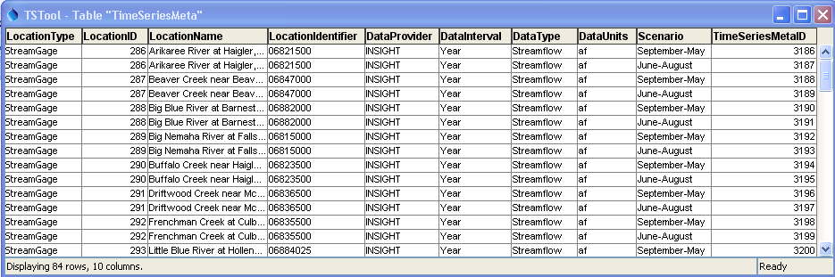
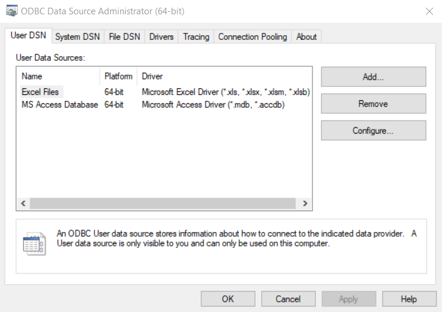
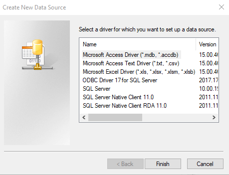
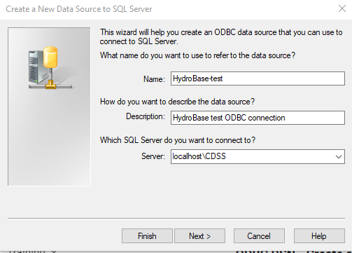
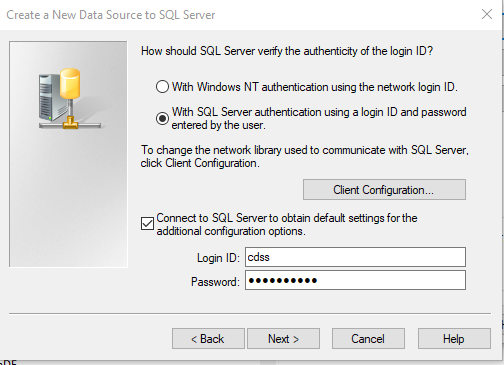
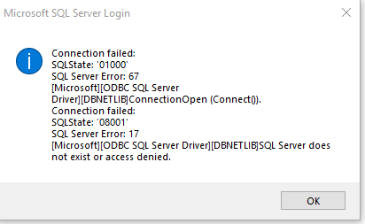
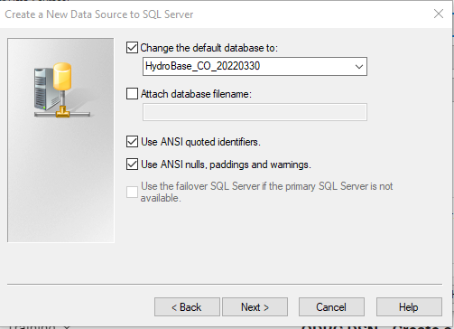
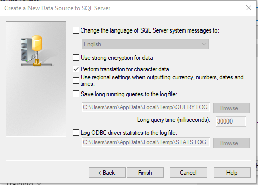
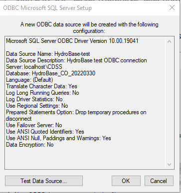
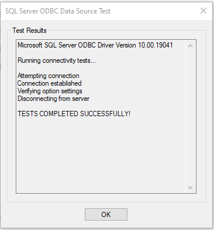

# TSTool / Datastore Reference / GenericDatabase #

* [Overview](#overview)
* [Standard Time Series Properties](#standard-time-series-properties)
* [Limitations](#limitations)
* [Datastore Configuration File](#datastore-configuration-file)
    + [Microsoft Access Database Example (New)](#microsoft-access-database-example-new)
    + [Microsoft Access Database Example (Old, before TSTool 12)](#microsoft-access-database-example-old-before-tstool-12)
    + [PostgreSQL Database Example](#postgresql-database-example)
    + [SQLite Database Example](#sqlite-database-example)
    + [SQL Server Database Example](#sql-server-database-example)
    + [Time Series Datastore Configuration Properties](#time-series-datastore-configuration-properties)
* [Using an ODBC Data Source](#using-an-odbc-data-source)
    + [Microsoft SQL Server and ODBC](#microsoft-sql-server-and-odbc)

------------

## Overview ##

The generic database datastore can be used to provide general access to database tables and views,
for example with the
[`ReadTableFromDataStore`](../../command-ref/ReadTableFromDataStore/ReadTableFromDataStore.md) command.
Properly configured, it also will allow reading time series using the
[`ReadTimeSeriesFromDataStore`](../../command-ref/ReadTimeSeriesFromDataStore/ReadTimeSeriesFromDataStore.md) command,
and writing time series using the
[`WriteTimeSeriesToDataStore`](../../command-ref/WriteTimeSeriesToDataStore/WriteTimeSeriesToDataStore.md) command.
The trade-off for generic datastores is that although tables and views can be accessed in a generic way,
there is no specific application programming interface (API) to deal with the intricacies of the
database and converting tables to more complex data objects like time series may be limited.
 See also the [`TableToTimeSeries`](../../command-ref/TableToTimeSeries/TableToTimeSeries.md) command,
which will convert a table into time series.

TSTool database (datastore) integration is implemented using built-in and plugin datastores.
Built-in datastores are used for databases for major funders,
such as the State of Colorado, and for widely available databases.
Plugin datastores are typically implemented for databases that have limited distribution.

The datastore internally corresponds to an
[Open Database Connectivity](https://en.wikipedia.org/wiki/Open_Database_Connectivity)
(ODBC) connection implemented in Java using
[Java Database Connectivity (JDBC)](https://en.wikipedia.org/wiki/Java_Database_Connectivity) driver.
The connection can be defined one of two ways:

*   (**Preferred**) Provide connection information via `DatabaseEngine`, `DatabaseServer`, `DatabaseName`,
    and potentially login configuration properties,
    and allow the software to use a vendor-specific JDBC driver,
    which is generally optimized for the database software.
    The disadvantage of this approach is that authentication may require extra effort,
    such as using a databases convention for batch logins.
*   (**Use if necessary**) Define an ODBC connection using Windows tools.
    The advantage of this approach is that database authentication occurs through the ODBC connection.
    The disadvantage is that the connection may use a generic database driver
    that does not perform as well as vendor drivers.
    This approach is used when the `DatabaseEngine` and `OdbcName` configuration properties are defined for the datastore.

## Standard Time Series Properties ##

See the discussion of datastore configuration files below for mapping of database contents to time series.

## Limitations ##

The following limitations apply to the generic database datastore:

*   Database permissions control which tables and views are accessible and consequently
    protected tables may not be visible in software or may generate
    errors if attempts are made to manipulate outside of permissions.
*   An attempt is made in the
    [`ReadTableFromDataStore`](../../command-ref/ReadTableFromDataStore/ReadTableFromDataStore.md)
    command to list tables and views for selection.
    However, the ability to filter out system tables is limited because
    some database drivers do not implement required functionality.
    For example, the SQL Server JDBC driver does not allow generic filtering of system
    tables and a work-around has been implemented to remove known
    system table and view names from lists displayed to users.
*   Table column properties in TSTool are determined from database column metadata.
    Although support for common data types has been implemented, some data types may not be fully supported.
    If a database column type is not supported,
    the default is to translate the column data to strings in the output table.
    Additional functionality will be added in the future.
*   Although database column properties can specify the width and precision for floating point data,
    some database metadata is inaccessible, causing data-handling or visualization issues.
    For example, the SQL Server metadata defaults result in the precision of
    floating point numbers (called “precision” in TSTool and “scale” in SQL Server column properties) to be set to zero.x
    The work-around is that any floating point data column that has a
    precision of zero is treated as having a precision of 6 digits after the decimal point.

## Datastore Configuration Files ##

A datastore is configured by creating a datastore configuration file for the connection.
Configurations are processed at software startup to enable datastores.

The following illustrates the generic database datastore configuration file format,
which in this example is a file named `C:/Users/user/.tstool/N/datastores/GenericExample.cfg`
(replace `N` with TSTool major version).

```
# Configuration information for "SomeDatabaseDataStore" datastore (connection).
# The user will see the following when interacting with the datastore:
#
# Type – GenericDatabaseDataStore (required as indicated)
# Name - database identifier for use in applications, for example as the
#     input type/name information for time series identifiers (usually a short string)
# Description - database description for reports and user interfaces (a sentence)
# Enabled – whether the datastore is enabled (default=True)
#
# The following are needed to make the low-level data connection:
#
# DatabaseEngine - the database software (SqlServer)
# OdbcName – ODBC name (specify this OR the following properties)
# DatabaseServer - IP or string address for database server
# DatabaseName - database name used by the server
# DatabasePort – port number to use for database connection
# SystemLogin – the login to be used for the database connection
# SystemPassword – the password to be used for the database connection
#
# Property values can use the notation “Env:xxxx” to use an environment variable,
# “SysProp:xxxx” to use a JRE system property, or “Prompt” to prompt the user for
# the property value (system console is used – not suitable for TSTool startup from
# the Start menu)

Type = "GenericDatabaseDataStore"
Name = "SomeDatabaseDataStore"
Description = "Database on some server"
Enabled = True
DatabaseEngine = "SqlServer"
# Specify OdbcName…
OdbcName = "OdbcName"
# Or, specify the following…
DatabaseServer = "ServerName"
DatabaseName = "DatabaseName"
SystemLogin = "LoginForConnection"
SystemPassword = "PasswordForConnection"
```
**<p style="text-align: center;">
Generic Database Datastore Configuration File
</p>**

Configuration file properties are described in the following table.

**<p style="text-align: center;">
Datastore Configuration File Properties (alphabetized - see example for typical order)
</p>**

| **Property**&nbsp;&nbsp;&nbsp;&nbsp;&nbsp;&nbsp;&nbsp;&nbsp;&nbsp;&nbsp;&nbsp;&nbsp;&nbsp;&nbsp;&nbsp;&nbsp;&nbsp;&nbsp;&nbsp;&nbsp;&nbsp;&nbsp;&nbsp;&nbsp;&nbsp;&nbsp;&nbsp;&nbsp; | **Description** | **Default** |
| -- | -- | -- |
| `ConnectionProperties` | A string to add to the JDBC connection string, typically something like `?property1=value1&property2=value2...`.  Refer to the database software's documentation for properties specific to the database. | |
| `DatabaseEngine` | The database software to use.  See the following table. | None - must be specified. |
| `DatabaseName` | The database name to use (if `OdbcName` is not specified). | |
| `DatabaseServer` | The database server (if `OdbcName` is not specified). | |
| `Description` | Description for the datastore. | |
| `Enable` | Whether the datastore is enabled for use, `True` or `False`. | `True` |
| `Name` | Datastore name, which should use letters, numbers, underscore, and dash, should not use spaces. The name will be used in commands that specify a datastore. | |
| `OdbcName` | Use an ODBC data source name rather than `DatabaseServer`, `DatabaseName`, `SystemLogin`. | |
| `SystemLogin` | The login to use, may be a specific user or a service account (if `OdbcName` is not specified). | |
| `SystemPassword` | The password to use, may be a specific user or a service account (if `OdbcName` is not specified). | |
| `Type`<br>**required** | Must be `GenericDatabaseDataStore`. | None - must be specified. |


The `DatabaseEngine` can be one of the following values,
and is used to control internal database interactions,
such as properly formatting date/time strings for SQL statements.
The JDBC driver software is distributed with TSTool and is updated periodically when driver software is updated.
See driver `jar` files in the installation `bin` folder.

**<p style="text-align: center;">
Supported Databases (`DatabaseEngine` Property Value)
</p>**

| **`DatabaseEngine`**&nbsp;&nbsp;&nbsp;&nbsp;&nbsp;&nbsp;&nbsp;&nbsp;&nbsp;&nbsp;&nbsp;&nbsp;&nbsp;&nbsp;&nbsp;&nbsp;&nbsp;&nbsp;&nbsp;&nbsp;&nbsp;&nbsp;&nbsp;&nbsp;&nbsp;&nbsp;&nbsp;&nbsp;&nbsp;&nbsp;&nbsp;&nbsp; | **Description** | **JDBC Driver Information**&nbsp;&nbsp;&nbsp;&nbsp;&nbsp;&nbsp;&nbsp;&nbsp;&nbsp;&nbsp;&nbsp;&nbsp;&nbsp;&nbsp;&nbsp;&nbsp; |
| -- | -- | -- |
| `Access` | Microsoft Access database | <ul><li>For Java 8 and TSTool 14.3 and later, the [UCanAccess](https://ucanaccess.sourceforge.net/site.html#home) driver is distributed with TSTool.</li><li>For Java 8 and TSTool versions between 12.x and 13.2, Access is not supported.</li><li>For Java 7 (prior to TSTool 12.x), the system ODBC driver on Windows is used.</li></ul> |
| `Excel` | Microsoft Excel workbook (first row of worksheet should be the column names, column types are determined by scanning rows (independent of the ***Rows to Scan*** value in the ODBC DNS setup).  Refer to sheet in SQL as `Select * from [Sheet1$]` ) | Uses system ODBC driver on Windows. |
| `H2` | H2 database, **not actively used but included for historical reasons** | [JDBC Driver](https://www.h2database.com/html/cheatSheet.html) |
| `HSQLDB` | HSQLDB database (Java database). This database is enabled as part of the MicroSoft Access UCanAccess integration. | [HSQLDB web page](https://hsqldb.org/) |
| `Informix` | INFORMIX database, **not actively used but included for historical reasons** | [JDBC Driver](https://www.ibm.com/support/knowledgecenter/SSGU8G_12.1.0/com.ibm.jdbc_pg.doc/ids_jdbc_013.htm) |
| `MySQL` | MySQL database | [JDBC Driver](https://www.mysql.com/products/connector/) |
| `Oracle` | Oracle database | [JDBC Driver](https://www.oracle.com/database/technologies/appdev/jdbc-downloads.html) |
| `PostgreSQL` | PostgreSQL database | [JDBC Driver](https://jdbc.postgresql.org/) |
| `SQLite` | SQLite database | [JDBC Driver](https://github.com/xerial/sqlite-jdbc/releases) |
| `SQLServer` | Microsoft SQL Server database | [JDBC Driver](https://docs.microsoft.com/en-us/sql/connect/jdbc/microsoft-jdbc-driver-for-sql-server) |

TSTool, which is written in Java, is distributed with the software drivers for the above databases
only if datastores have been implemented that use a database product.
For example, the [State of Colorado’s HydroBase database](../CO-HydroBase/CO-HydroBase.md) is
implemented in SQL Server and consequently the SQL Server driver is distributed with TSTool.
Other drivers (e.g., Access via ODBC) depend on installation of the database software,
which typically includes the ODBC drivers.
Some of the databases listed above have only been used in development and software support may be out of date.
If in doubt, contact the software developers.
Additional databases can be supported if necessary.

### Microsoft Access Database Example (New) ###

The following example illustrates how to configure a datastore for a UCanAccess connection to an Access database,
which is available for TSTool 13.3 and later.
Note the format of the `DatabaseName` required for the path to the database file.

```
# Configuration information for Microsoft Access using UCanAccess.
# Properties are:
#
# The user will see the following when interacting with the datastore:
#
# Type - required to be GenericDatabaseDataStore
# Name - datastore identifier used in applications, for example as the
#     input type information for time series identifiers (usually a short string)
# Description - datastore description for reports and user interfaces (short phrase)
# DatabaseEngine - the database software
#

Type = "GenericDatabaseDataStore"
Name = "ExampleDatabase"
Description = "Example Access Database"
DatabaseEngine = "Access"
DatabaseName = "//C/path/to/database.accdb"
# Using the following syntax also seems to work.
#DatabaseName = "//C:/path/to/database.accdb"
# See the discussion below.
#ConnectionProperties = ";memory=false"
```

**<p style="text-align: center;">
Generic Database Datastore Configuration File for Microsoft Access
</p>**

#### Memory and Performance Considerations ####

By default, the UCanAccess driver will read the entire database into memory,
which is done to increase performance for relatively small databases.
However, this can significantly slow down TSTool startup and may lead to an out of memory error.
The [`OpenDataStore`](../../command-ref/OpenDataStore/OpenDataStore.md) command also
reopens the datastore each time the commands are run and will be slow each time.
To avoid loading the database into memory at the initial connection, use the `;memory=false` string in `ConnectionProperties`,
as shown in the above example, and in [`OpenDataStore(ConnectionProperties=";memory=false"`](../../command-ref/OpenDataStore/OpenDataStore.md)).

See the [UCanAccess documentation](https://ucanaccess.sourceforge.net/site.html#examples)
for other connection string properties.

If it is desired to load the full database at startup and TSTool runs out of memory,
it may be necessary to increase the maximum memory used by TSTool.
See the [Troubleshooting](../../troubleshooting/troubleshooting.md#issue-6-out-of-memory-error) documentation.

#### Troubleshooting Access ####

1.  Because Access databases are a single file,
    care must be taken to avoid multiple processes writing to the same database at once.
    Consequently, avoid opening multiple datastores at startup and/or in commands that write to the same file because
    the database may become corrupted.

### Microsoft Access Database Example (Old, before TSTool 12) ###

**This example is for TSTool prior to 12.x, which uses the Windows built-in ODBC driver.**

The following example illustrates how to configure a datastore for an ODBC DSN connection to an Access database:

```
# Configuration information for Microsoft Access database using ODBC DSN connection.
# Properties are:
#
# The user will see the following when interacting with the datastore:
#
# Type - required to be GenericDatabaseDataStore
# Name - datastore identifier used in applications, for example as the
#     input type information for time series identifiers (usually a short string)
# Description - datastore description for reports and user interfaces (short phrase)
# DatabaseEngine - the database software
# OdbcName - the Open Database Connectivity Data Source Name (ODBC DSN), configured
#     in Windows Control Panel
#

Type = "GenericDatabaseDataStore"
Name = "ExampleDatabase"
Description = "Example Access Database"
DatabaseEngine = "Access"
OdbcName = "ExampleDatabase"
```

**<p style="text-align: center;">
Generic Database Datastore Configuration File for Microsoft Access Using ODBC DSN Properties
</p>**

### PostgreSQL Database Example ###

The following example illustrates how to configure a generic datastore for a PostgreSQL database.
PostgreSQL uses a [`.pgpass` file](https://www.postgresql.org/docs/current/libpq-pgpass.html)
to store database login credentials to allow unattended logins.
This relies on the fact that the file is only visible to the current user and therefore
is safe unless the user's account is compromised.
If `SystemPassword = ${pgpass:password}`,
the PostgreSQL `.pgpass` file for the user is searched to match:

* `DatabaseServer`
* `DatabasePort`
* `DatabaseName`
* `SystemLogin`

The password for the matching line is then used for the password.
Using this approach ensures that the user's password is not included in plain text
datastore configuration files.

```
# Configuration information for PostgreSQL database.
#
# The user will see the following when interacting with the datastore:
#
# Name - datastore identifier used in applications, for example as the
#     input type information for time series identifiers (usually a short string)
# Description - datastore description for reports and user interfaces (short phrase)
#
# The following are needed to make database connections in the software
#
# Type - must be GenericDatabaseDataStore because treated generically
# DatabaseEngine - the database software (PostgreSQL)
# DatabaseServer - the PostgreSQL server name or IP address
# DatabaseName - the PostgreSQL database name
# SystemLogin - the login to use for the PostgreSQL session
# SystemPassword - the password to use for the PostgreSQL session
# Enabled - if True then datastore will be enabled when software starts, False to disable

Type = "GenericDatabaseDataStore"
Name = "postgresql-test"
Description = "PostgreSQL test database"
DatabaseEngine = "PostgreSQL"
DatabaseServer = "some.server.com"
DatabaseName = "SomeDatabase"
SystemLogin = "SomeUser"
SystemPassword = "${pgpass:password}"
```

**<p style="text-align: center;">
Generic Database Datastore Configuration File for PostgreSQL
</p>**

### SQLite Database Example ###

The following example illustrates how to configure a generic datastore for a SQLite database file.
Because there is no server software, the filename is used for `DatabaseServer`.

```
# Configuration information for SQLite database.
#
# The user will see the following when interacting with the datastore:
#
# Name - datastore identifier used in applications, for example as the
#     input type information for time series identifiers (usually a short string)
# Description - datastore description for reports and user interfaces (short phrase)
#
# The following are needed to make database connections in the software
#
# Type - must be GenericDatabaseDataStore because treated generically
# DatabaseEngine - the database software (SQLite)
# DatabaseServer - the absolute path to the database using backward or forward slashes
#  "C:\Users\user\Downloads\dev_db.db"
#  "C:/Users/user/Downloads/dev_db.db"
# DatabaseName - NOT USED
# SystemLogin - NOT USED
# SystemPassword - NOT USED
# Enabled - if True then datastore will be enabled when software starts, False to disable

# Change the following to True to enable the datastore
Enabled = True
Type = "GenericDatabaseDataStore"
Name = "nsuserws-test"
Description = "SQLite test database"
DatabaseEngine = "SQLite"
DatabaseServer = "C:\Users\user\Downloads\dev_db.db"
```

**<p style="text-align: center;">
Generic Database Datastore Configuration File for SQLite
</p>**

#### Troubleshooting SQLite ####

1.  Because SQLite databases are a single file,
    care must be taken to avoid multiple processes writing to the same database at once.
    Consequently, avoid opening multiple datastores at startup and/or in commands that write to the same file because
    the database may become corrupted.

### SQL Server Database Example ###
 
The following example illustrates how to configure a generic datastore for a SQL Server database,
using separate database connection properties (NOT using an ODBC DSN).
Such configurations may not be suitable because it may be desirable to
configure login information in an ODBC DSN.
The following is appropriate if a generic read-only service account is configured.

```
# Configuration information for Microsoft SQL Server database.
# Properties are:
#
# The user will see the following when interacting with the datastore:
#
# Name - datastore identifier used in applications, for example as the
#     input type information for time series identifiers (usually a short string)
# Description - datastore description for reports and user interfaces (short phrase)
#

Type = "GenericDatabaseDataStore"
Name = "NDNR-Cascade-WaterRights"
Description = "INSIGHT Development Database"
DatabaseEngine = "SqlServer"
DatabaseServer = "xxxxx"
DatabaseName = "WaterRights"
SystemLogin = "guest"
SystemPassword = "guest"
```
**<p style="text-align: center;">
Generic Database Datastore Configuration File for SQL Server
</p>**

### Time Series Datastore Configuration Properties ###

The [`ReadTimeSeriesFromDataStore`](../../command-ref/ReadTimeSeriesFromDataStore/ReadTimeSeriesFromDataStore.md) and
[`WriteTimeSeriesToDataStore`](../../command-ref/WriteTimeSeriesToDataStore/WriteTimeSeriesToDataStore.md)
commands recognize additional datastore configuration properties,
which allow the commands to read time series from and write time series to a general database design.
To use these command, time series metadata in the database are mapped to TSTool time series
identifiers (`LocationType:Location.DataSource.DataType.Interval.Scenario`) and other
key properties can be provided (e.g., data units).
Core tables in a compatible database design contain the following data:

* Definitions, such as data types, data units, data source (providers)
* Locations
* Time series metadata (typically relationships to the above)
* Time series data records (associated with a time series metadata record)

Relationships between the above tables that use database keys can be complicated to configure.
Consequently, it is recommended that a database view be configured to provide time series
metadata as a list of time series and associated properties.
For performance reasons, it may also be appropriate to copy the view to a
“materialized” table and create indexes on the table.
The following figure illustrates time series metadata from a database view:

**<p style="text-align: center;">

</p>**

**<p style="text-align: center;">
Time Series Metadata View (<a href="../Datastore_Generic_TimeSeriesMeta.png">see also the full-size image</a>)
</p>**

The following example illustrates datastore properties that are used to describe
the database design so that TSTool can read and write time series.
If configured, TSTool also will provide time series browsing features in the main window.

```
# Indicate the table that contains time series metadata
# Use a view that handles the foreign keys so that this configuration is simpler
TimeSeriesMetadataTable = "view_TimeSeriesMeta_All"

# Columns in the metadata table for the time series identifier parts
# Only the TimeSeriesMetadataTable_MetaIdColumn column contains a primary key
TimeSeriesMetadataTable_LocationTypeColumn = "LocationType"
TimeSeriesMetadataTable_LocationIdColumn = "LocationIdentifier"
TimeSeriesMetadataTable_DescriptionColumn = "LocationName"
TimeSeriesMetadataTable_DataSourceColumn = "DataProvider"
TimeSeriesMetadataTable_DataTypeColumn = "DataType"
TimeSeriesMetadataTable_DataIntervalColumn = "DataInterval"
TimeSeriesMetadataTable_ScenarioColumn = "Scenario"
TimeSeriesMetadataTable_DataUnitsColumn = "Units"
TimeSeriesMetadataTable_MetadataIdColumn = "TimeSeriesMetaID"

# Data table to use for time series data, in this case based on the interval
# (could also use the data type if DBA wanted to split out that way)
# Time series formatting strings (e.g., %I = interval like Year) and time series
# properties (e.g., ${TS:Property}) can be used to specify the data table.
TimeSeriesDataTable = "TimeSeriesData%I"

# Properties that describe columns for time series data
# The column names can vary based on date/time precision, etc.
TimeSeriesDataTable_MetadataIdColumn = "TimeSeriesMetaID"
TimeSeriesDataTable_DateTimeColumn = " TimeSeriesDataYear:Year,TimeSeriesDataMonth:Date,TimeSeriesDataDay:Date"
TimeSeriesDataTable_ValueColumn = "Value"
TimeSeriesDataTable_FlagColumn = "Flag"
```
**<p style="text-align: center;">
Generic Database Datastore Time Series Configuration Properties
</p>**

The `TimeSeriesMetadataTable` table/view is used with time series identifier information as a
lookup to determine the internal database key for the time series data records,
indicated by `TimeSeriesMetadataTable_MetadataIdColumn` in the metadata table and
`TimeSeriesDataTable_MetadataIdColumn
`in time series data table(s).
Once the internal key for the time series is determined,
it is used to read or write the individual time series records.

The following table summarizes configuration properties that are used for time series metadata.

**<p style="text-align: center;">
Configuration Properties for Time Series Metadata
</p>**

|**Property**&nbsp;&nbsp;&nbsp;&nbsp;&nbsp;&nbsp;&nbsp;&nbsp;&nbsp;&nbsp;&nbsp;&nbsp;&nbsp;&nbsp;&nbsp;&nbsp;&nbsp;&nbsp;&nbsp;&nbsp;&nbsp;&nbsp;&nbsp;&nbsp;&nbsp;&nbsp;&nbsp;&nbsp;&nbsp;&nbsp;&nbsp;&nbsp;&nbsp;&nbsp;&nbsp;&nbsp;&nbsp;&nbsp;&nbsp;&nbsp;|**Description**|**Default**|
|--|--|--|
|`TimeSeriesMetadataTable`|The name of the database table/view that contains time series metadata, essentially a catalog of time series in the database.|None – must be specified.|
|`TimeSeriesMetadataTable_LocationTypeColumn`|The name of the column in the time series metadata table for the location type.  Typically location type abbreviations are stored in a separate table and are joined to the metadata view.|Location type will not be used to identify time series.|
|`TimeSeriesMetadataTable_LocationIdColumn`|The name of the column in the time series metadata table for the location identifier.  A string is typically used that allows lookup in location-specific tables.||
|`TimeSeriesMetadataTable_DescriptionColumn`|The name of the column in the time series metadata table for the description, typically the location name.||
|`TimeSeriesMetadataTable_DataSourceColumn`|The name of the column in the time series metadata table for the data source.  Typically data source abbreviations are stored in a separate table and are joined to the metadata view.|Location source will not be used to identify time series.|
|`TimeSeriesMetadataTable_DataTypeColumn`|The name of the column in the time series metadata table for the data type.  Typically data type abbreviations are stored in a separate table and are joined to the metadata view.|None – must be specified.|
|`TimeSeriesMetadataTable_IntervalColumn`|The name of the column in the time series metadata table for the interval (containing Day, Month, etc. as per time series identifiers).  Typically data interval abbreviations are stored in a separate table and are joined to the metadata view.|None – must be specified.|
|`TimeSeriesMetadataTable_ScenarioColumn`|The name of the column in the time series metadata table for the scenario (containing blanks or strings).  Typically scenario abbreviations are stored in a separate table and are joined to the metadata view.|Scenario will not be used to identify time series.|
|`TimeSeriesMetadataTable_DataUnitsColumn`|The name of the column in the time series metadata table for the data units (containing blanks or strings).  Typically units abbreviations are stored in a separate table and are joined to the metadata view.|Units for time series will be blank.|
|`TimeSeriesMetadataTable_MetadataIdColumn`|The name of the column in the time series metadata table for the metadata primary key, which is the relationship to data records.|None – must be specified.|

The following table summarizes configuration properties that are used for time series data tables.

**<p style="text-align: center;">
Configuration Properties for Time Series Data
</p>**

|**Property**&nbsp;&nbsp;&nbsp;&nbsp;&nbsp;&nbsp;&nbsp;&nbsp;&nbsp;&nbsp;&nbsp;&nbsp;&nbsp;&nbsp;&nbsp;&nbsp;&nbsp;&nbsp;&nbsp;&nbsp;&nbsp;&nbsp;&nbsp;&nbsp;&nbsp;&nbsp;&nbsp;&nbsp;&nbsp;&nbsp;&nbsp;&nbsp;&nbsp;&nbsp;&nbsp;&nbsp;&nbsp;&nbsp;&nbsp;&nbsp;|**Description**|**Default**|
|--|--|--|
|`TimeSeriesDataTable`|The name of the database table/view that contains time series data records.  To facilitate multiple data tables, this property can be specified with the following special format values, which will cause the table name to be dynamically determined.  Because the value must be defined for reading and writing, dynamic values are confined to data that are available in both cases:<br><ul><li>`%I` – use the time series data interval</li><li>`%T` – use the time series data type</li></ul><br>In the future additional options for specifying the time series table may be provided.|None – must be specified.|
|`TimeSeriesDataTable_MetadataIdColumn`|The name of the column in the time series data table for the metadata ID, which has the same value as the metadata ID in the metadata table (TimeSeriesMetadataTable_MetadataIdColumn) and groups time series records.|None – must be specified.|
|`TimeSeriesDataTable_DateTimeColumn`|The name of the column in the time series data table for the date/time.  Specify a single value to indicate the date/time column is the same for all time series data tables, or use the following syntax to indicate column names for each table:<br><ul><li>`DataTable1:DateTimeColumn1,`<br>`DataTable2:DateTimeColumn2,...`<br><br>The following constraints apply:<ul><li>If the time series interval is Year and the column type is integer, the values are assumed to be the 4-digit year in the time series.</li><li>Otherwise if the column type is timestamp, the date/time values are used directly and are handled according to the time series date/time precision.</li></ul>|None – must be specified.|
|`TimeSeriesDataTable_ValueColumn`|The name of the column in the time series data table for the data values, currently must be the same for all time series data tables.  Null values in the column are interpreted as missing data.|None – must be specified.|
|`TimeSeriesDataTable_FlagColumn`|The name of the column in the time series data table for the data flags, currently must be the same for all time series data tables.|Data flags will not be used with the time series.|

## Using an ODBC Data Source ##

Datastore connections can be defined using a JDBC driver and connection properties specific to the database software,
in which case the database server, database name, and possibly login information must be specified.
See the examples provided previously in this document.
This approach can benefit from an optimized driver that has been developed for the specific database.

Alternatively, connection information can be defined in an ODBC data source name (DSN),
as mentioned in the previous sections, which uses the `OdbcName` configuration file property.
In this case, a Windows ODBC DSN must be defined using the ODBC driver software for the database.
The following section provides examples of ODBC configurations.

### Microsoft SQL Server and ODBC ###

**As of Java 8 (TSTool before version 12), support for using ODBC connections is no longer available.
This documentation is retained as a historical reference.
Commercial alternatives for ODBC JDBC bridge are available and could be evaluated.
However, it is recommended that the JDBC driver for a database is used rather than ODBC data source name.**

To define an ODBC DSN for Microsoft SQL Server, open the ***ODBC Data Source Administrator (64-bit)*** tool in Windows.
The 32-bit version can also be used if necessary but 64-bit is a newer technology.

An ODBC DSN can be defined for a specific user or the system (multiple users).
The following example focuses on a single user to avoid needing administrator privileges.
The following figure shows an initial condition before defining a SQL Server ODBC DSN.

**<p style="text-align: center;">

</p>**

**<p style="text-align: center;">
ODBC DSN - Before Defining SQL Server ODBC DSN(<a href="../odbc-dsn-sql-server-1.png">see also the full-size image</a>)
</p>**

Press ***Add...*** to start adding an ODBC DSN, which displays the following.
Note that multiple SQL Server drivers are listed.
In this case, the drivers may have been installed when the HydroBase SQL Server database was installed.
If a SQL Server driver is not listed or a new version is needed,
[download the driver](https://docs.microsoft.com/en-us/sql/connect/odbc/download-odbc-driver-for-sql-server) and install.

**<p style="text-align: center;">

</p>**

**<p style="text-align: center;">
ODBC DSN - Add an ODBC DSN(<a href="../odbc-dsn-sql-server-2.png">see also the full-size image</a>)
</p>**

Select the "SQL Server" driver and ***Finish***.
Then fill in the information, for example, as shown below.
The ***Server*** selection may not list expected databases and in this case the HydroBase server on the same computer is used.
It may be necessary to contact IT staff for the organization to obtain the correct information.

**<p style="text-align: center;">

</p>**

**<p style="text-align: center;">
ODBC DSN - Create a New Data Source to SQL Server (<a href="../odbc-dsn-sql-server-3.png">see also the full-size image</a>)
</p>**

Press ***Next >*** to configure authentication information.
An appropriate authentication method should be selected.
Using ***With SQL Server authentication using a login ID and password entered by the user***
will enable the ***Login ID*** and ***Password*** fields.
In the following the CDSS service account is used with password `cdss%tools`.

**<p style="text-align: center;">

</p>**

**<p style="text-align: center;">
ODBC DSN - Create a New Data Source to SQL Server (Autentication) (<a href="../odbc-dsn-sql-server-4.png">see also the full-size image</a>)
</p>**

The above may result in the following error.
In this case the error resulted from a bad server name generated for illustration
(used `localhost/CDSS` instead of `localhost\CDSS`).
Check the database name and other information.

**<p style="text-align: center;">

</p>**

**<p style="text-align: center;">
ODBC DSN - Microsoft SQL Server Login Error (Autentication) (<a href="../odbc-dsn-sql-server-5.png">see also the full-size image</a>)
</p>**

If the configuration information is corrected, press ***Next >*** to continue.
Select the database name as shown in the following.

**<p style="text-align: center;">

</p>**

**<p style="text-align: center;">
ODBC DSN - Create a New Data Source to SQL Server (Database Selection) (<a href="../odbc-dsn-sql-server-6.png">see also the full-size image</a>)
</p>**

Press ***Next >*** to continue, which displays the following.
The defaults can be used.

**<p style="text-align: center;">

</p>**

**<p style="text-align: center;">
ODBC DSN - Create a New Data Source to SQL Server (Database Properties) (<a href="../odbc-dsn-sql-server-7.png">see also the full-size image</a>)
</p>**

Press ***Finish*** to continue, which displays the following.

**<p style="text-align: center;">

</p>**

**<p style="text-align: center;">
ODBC DSN - Create a New Data Source to SQL Server (Database Properties) (<a href="../odbc-dsn-sql-server-8.png">see also the full-size image</a>)
</p>**

Use the ***Test Data Source...*** button to test the correction,
which results in output similar to the following for a successful configuration.

**<p style="text-align: center;">

</p>**

**<p style="text-align: center;">
ODBC DSN - SQL Server ODBC Data Source Test (<a href="../odbc-dsn-sql-server-9.png">see also the full-size image</a>)
</p>**

Once configured, create a TSTool datastore configuration file with contents similar to the following and restart TSTool to use.

```
# Configuration information for HydroBase database datastore, CDSS account:
# - 20200720 version
# - use a GenericDatabaseDataStore
# - use an ODBC data source name
#
# Using a datastore name of "HydroBase" will override the legacy
# HydroBase input type convention.  Transitioning to a HydroBase
# datastore allows new TSTool features to be used.
#
# The user will see the following when interacting with the datastore:
#
# Name - datastore identifier used in applications, for example as the
#     input type information for time series identifiers (usually a short string)
# Description - datastore description for reports and user interfaces (short phrase)
#
# The following are needed to make database connections in the software
#
# Type - must be HydroBaseDataStore
# DatabaseEngine - the database software (SqlServer is current standard)
# DatabaseServer - IP or string address for database server, with instance name
#                  (e.g., "localhost\CDSS" can be used for local computer)
# DatabaseName - database name used by the server (e.g., HydroBase_CO_20120722)
# SystemLogin - service account login (omit for default)
# SystemPassword - service account password (omit for default)
# Enabled - if True then datastore will be enabled when software starts, False to disable

# Change the following to True to enable the datastore.
Enabled = True
#Type = "HydroBaseDataStore"
Type = "GenericDatabaseDataStore"
Name = "HydroBase20200720-generic-odbc"
Description = "HydroBase Datastore, generic database datastore, use ODBC DSN"
DatabaseEngine = "SqlServer"
OdbcDsn = HydroBase-test
```
