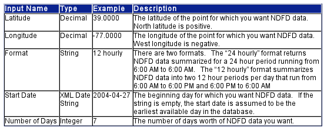

# TSTool / Datastore Reference / NDFD #

* [Overview](#overview)
* [Standard Time Series Properties](#standard-time-series-properties)
* [Limitations](#limitations)

--------------

## Overview ##

**Integration of TSTool and NDFD was tested on a project in the mid-2000s but is not an active feature.
Additional resources are needed to implement a current solution for accessessing similar information
using current web services.
This documentation is retained for reference and may be removed in the future.**

The National Digital Forecast Database (NDFD) XML Web Service from the NWS is a web service that sends
NDFD forecast data from the NWS web site listed above to a requesting
Data Service through the Simple Object Access Protocol (SOAP).
The data retrieved is in an XML format as specified by Digital Weather Markup Language (DWML) format and schema.

To use the forecast data, a Data Service will first make a request to the NDFD Web Service
via the SOAP for getting either instantaneous or daily average data at the following web address:

[http://www.weather.gov/forecasts/xml/DWMLgen/wsdl/ndfdXML.wsdl](http://www.weather.gov/forecasts/xml/DWMLgen/wsdl/ndfdXML.wsdl)

This site provides the following forecast data using web services (bold indicates primary data types for data services).
See the following table for corresponding data type strings.

* **Maximum Temperature**
* **Minimum Temperature**
* **3 Hourly Temperature**
* Dewpoint Temperature
* Apparent Temperature
* **12 Hour Probability of Precipitation**
* **Liquid Precipitation Amount**
* **Snowfall Amount*
* Cloud Cover Amount
* Relative Humidity
* Wind Speed
* Wind Direction
* Weather
* Wave Heights

These data can be instantaneous or a daily average and are available as a grid.
This implies that the Data Services can be called iteratively to obtain a geospatial context to the time-series data.
The following tables show the necessary parameters needed to retrieve data from the
NDFD database site for instantaneous and daily average data respectively (Tables courtesy of NWS).
These data are retrieved through a Web service implementing a SOAP interface.
There are two SOAP functions that need to be called by the Data Service implementation:
the first is `NDFDgen()` which is used to retrieve instantaneous time-series data;
the second function is `NDFDgenByDay()` that is used to retrieve daily average data.
The following tables reflect the parameters needed to call these two NDFD SOAP functions respectively.

Additional reference information on the NWS NDFD SOAP implementation, functions, and time series input type can be retrieved from the NWS forecast site:

[http://www.nws.noaa.gov/xml](http://www.nws.noaa.gov/xml)

**<p style="text-align: center;">
Input Variables to the NDFDgen() Web Service Request
</p>**

**<p style="text-align: center;">

</p>**

**<p style="text-align: center;">
Input Variables to the NDFDgenByDay() Web Service Request
</p>**

**<p style="text-align: center;">

</p>**

## Standard Time Series Properties ##

The standard time series identifier (TSID) for NWS NDFD time series files is of the form:

```
Latitude_Longitude.NWS.DataType.Interval~NDFD~Server
```

Where:

*   The TSID location is a latitude and longitude value and will fall within a grid cell of calculated forecast data.
    This location is based on the NWS latitude and longitude definition and will have the
    form `nnnnnn_mmmmmm` where `nnnnnn` will be translated to `nn.nnnn` and `mmmmmm` will be translated to `–mm.mmmm`.
    These translations are used because the web service only applies to the United States.
    For example, latitude `40.1800` and longitude `–105.0600` would be specified as `401800_1050600`.
*   The TSID data source is NWS since the data is coming from the National Weather Service.
*   The DataType will be one of the data parameters described in the first table.
    Daily average data will only accept `maxt`, `mint`, and `pop12` parameters.
    See the following table for a matrix of data types for available for either instantaneous or daily average data.
*   The Interval is the data interval to retrieve forecast data.
    This would be of the form: `nHour` where `n` is `2`, `3`, `4`, `6`, `8`, `12`, or `24` for instantaneous data or
    `Day` for daily average data averaged over 24 hours respectively.
*   `NDFD` is used for the input type.
*   The Server is an optional parameter to specify the NDFD web service server.
    Currently there is only one server: [http://www.nws.noaa.gov/forecasts/xml](http://www.nws.noaa.gov/forecasts/xml) that is the default.

**<p style="text-align: center;">
Matrix of Data Types
</p>**

| **Data Type** | **Intervals** | **Description** | **SOAP Function Used** |
| ------------- | ------------- | --------------- | ---------------------- |
| `maxt` | 2,3,4,6,8,12,24, or day | Maximum instantaneous or daily average temperature over a given time period | `NDFDgen()` and `NDFDgenByDay()` |
| `mint` | 2,3,4,6,8,12,24, or day | Minimum instantaneous or daily average temperature over a given time period | `NDFDgen()` and `NDFDgenByDay()` |
| `temp` | 2,3,4,6,8,12, or 24 | Instantaneous temperature at the time interval at the time interval over a given time period | `NDFDgen()` |
| `dew` | 2,3,4,6,8,12, or 24 | Instantaneous dew point temperature at the time interval over a given time period | `NDFDgen()` |
| `pop12` | 2,3,4,6,8,12,24, or day | 12 hour probability of precipitation over a given time period | `NDFDgen()` and `NDFDgenByDay()` |
| `qpf` | 2,3,4,6,8,12, or 24 | Instantaneous liquid precipitation amount at the time interval over a given time period | `NDFDgen()` |
| `appt` | 2,3,4,6,8,12, or 24 | Instantaneous apparent temperature at the time interval at the time interval over a given time period | `NDFDgen()` |
| `snow` | 2,3,4,6,8,12, or 24 | Instantaneous snowfall amount at the time interval over a given time period | `NDFDgen()` |
| `sky` | 2,3,4,6,8,12, or 24 | Instantaneous cloud cover at the time interval over a given time period | `NDFDgen()` |
| `rh` | 2,3,4,6,8,12, or 24 | Instantaneous relative humidity at the time interval over a given time period | `NDFDgen()` |
| `wspd` | 2,3,4,6,8,12, or 24 | Instantaneous wind speed at the time interval over a given time period | `NDFDgen()` |
| `wdir` | 2,3,4,6,8,12, or 24 | Instantaneous wind direction at the time interval over a given time period | `NDFDgen()` |
| `wx` | 2,3,4,6,8,12, or 24 | Instantaneous weather conditions at the time interval over a given time period | `NDFDgen()` |
| `waveh` | 2,3,4,6,8,12, or 24 | Instantaneous wave height at the time interval over a given time period | `NDFDgen()` |

## Limitations ##

The NDFD input type has the following limitations:

*   Latitude and longitude rather than a station ID specifies the location.
    Therefore to retrieve data at a location matching a station, the latitude and longitude of the station must first be determined.
*   The NWS NDFD web service only serves data for the United States.
    Thus a request that uses a latitude and longitude that falls outside the United States will return missing data.
