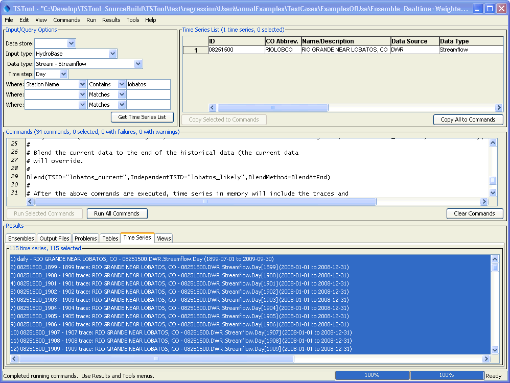
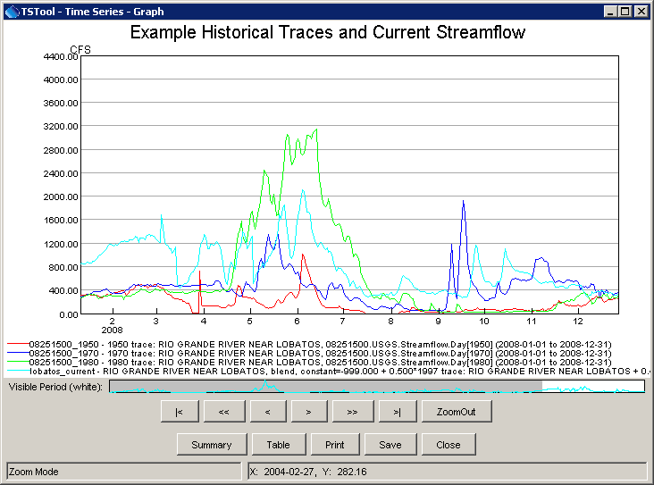
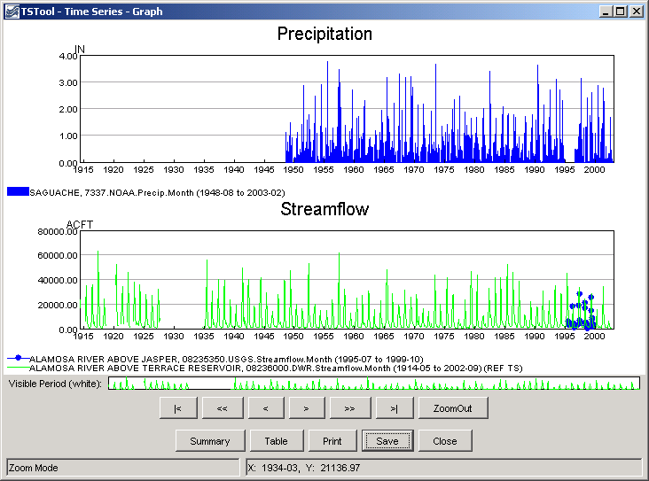
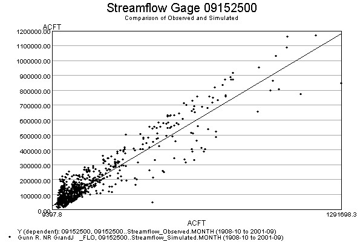

# TSTool / Examples of Use #

This chapter provides examples for reading and processing time series data using TSTool.
General examples are listed first, followed by more complex examples.
Additional information can be found in the training materials (see
***Help / View Training Materials***).

* [General Examples](#general-examples)
	+ [General – One-time Time Series Display/Analysis](#general-one-time-time-series-displayanalysis)
	+ [General – Reproducing an Analysis with a Command File](#general-reproducing-an-analysis-with-a-command-file)
* [Model Data Processing Examples](#model-data-processing-examples)
	+ [Modeling – Preparing Model Files Using a Command File](#modeling-preparing-model-files-using-a-command-file)
	+ [Modeling – Processing Reservoir Target (Input=HydroBase, Output=StateMod)](#modeling-processing-reservoir-target-inputhydrobase-outputstatemod)
	+ [Modeling – Filling Reservoir End of Month Content with a Pattern File (Input=HydroBase, Output=StateMod)](#modeling-filling-reservoir-end-of-month-contents-with-a-pattern-file-inputhydrobase-outputstatemod)
	+ [Modeling – Using a List File to Automate Time Series Processing (Input=HydroBase, Output=StateMod)](#modeling-using-a-list-file-to-automate-time-series-processing-inputhydrobase-outputstatemod)
	+ [Modeling – Processing Frost Dates (Input=HydroBase, Output=StateCU)](#modeling-processing-frost-dates-inputhydrobase-outputstatecu)
	+ [Modeling – Filling Streamflow using MOVE2 (Input=HydroBase)](#modeling-filling-streamflow-using-move2-inputhydrobase)
* [Time Series Ensemble Examples](#time-series-ensemble-examples)
	+ [Time Series Traces – Comparing Historical and Current Conditions (Input=HydroBase)](#time-series-traces-comparing-historical-and-current-conditions-inputhydrobase)
* [Time Series Product Examples](#time-series-product-examples)
	+ [Time Series Product – Using TSTool to Display Graphs from Another Software Application](#time-series-product-using-tstool-to-display-graphs-from-an-application)
	+ [Time Series Product – Automating Graphs for Compare Observed and Simulated Time Series](#automating-graphs-to-compare-observed-and-simulated-time-series)

-------------

## General Examples ##

This section includes examples related to general TSTool use, which may be appropriate for general users.

### General – One-time Time Series Display/Analysis ###

The following example session illustrates how to query time series data for display, analysis, and viewing.

1. Start TSTool.  If the [State of Colorado's HydroBase](../datastore-ref/CO-HydroBase/CO-HydroBase.md) or other database input types are enabled,
you may need to select a database and provide a login.
2. To manipulate time series in any way,
first select the time series of interest in the TSTool main interface.
Pick appropriate ***Datastore*** or ***Input type***, ***Data type***, ***Time step***, and filter information.
Press ***Get Time Series List*** to list the available time series.
After pressing ***Get Time Series List***, a list of time series will be shown in the upper-right corner of the interface.
3. Select one or more time series from the list and transfer to the ***Commands*** list as time series identifiers.
Time series identifiers are explained in [Introduction](../introduction/introduction.md).
4. Press the ***Run All Commands*** button to query the time series.  They should now be listed in the ***Results*** area.
5. Use the Results and Tools menus to view the time series.  For example, display a line graph
(using ***Results / Graph - Line***) and then view the time series as a summary or table.
6. Go back to the ***Commands*** list and use the ***Commands*** menu to add additional commands to manipulate time series.  For example:
* Insert a [`FillInterpolate`](../command-ref/FillInterpolate/FillInterpolate.md) command to fill data
* Insert a [`Cumulate`](../command-ref/Cumulate/Cumulate.md) command to transform the data into cumulative values
7. Repeat steps 4 – 5 to process and view time series.

### General – Reproducing an Analysis with a Command File ###

To reproduce an analysis, save the commands shown in the ***Commands*** list to a command file
and then reload and run the commands later.
For example, assuming that steps similar to the previous section have been executed:

1. Use the ***File / Save / Commands*** As menu to save the commands.
It is recommended that command files be saved with a file extension `.TSTool`.
2. Exit TSTool and restart (alternatively, clear the commands using the ***Clear Commands*** button).
3. Use ***File / Open / Command File***.  Select the file that you previously saved.
4. Then run the commands by pressing the ***Run All Commands*** button.
Display the results using the Results menu.

As the above example shows,
reproducing an analysis consists of saving a command file that can be reused later.
The main complications in this approach are that the
environment in which the commands are run may change over time.
For example if using the [State of Colorado's HydroBase database](../datastore-ref/CO-HydroBase/CO-HydroBase.md), the database version,
ODBC data source name, database host, or working directory may be differ between computers.
It is recommended that commands use directories relative to a working directory
(the folder where the command file is saved) and that the working directory is
defined consistently on different computers that will use the commands.
Using paths relative to the working directory will consequently allow command files to be portable.
TSTool will internally set the working directory that the directory where a command file is opened or saved.

## Model Data Processing Examples ##

Most computer models require data that adhere to a consistent format.
TSTool facilitates processing model data files with features that:

* Allow a specific period of record to be output
* Fill missing data
* Produce time series in a specific order

The following examples illustrate how to use TSTool to process model data.

### Modeling – Preparing Model Files Using a Command File ###

To prepare model files, multiple commands will usually process numerous time series.
Modelers may run TSTool in batch mode from a command shell using a command like:

```text
tstool -commands commandfile
```

Command files also can be run using the graphical user interface (GUI),
if possible, in order to take advantage of additional error-checking and feedback features.

TSTool provides command editor dialogs for every command and helps ensure the
integrity of commands by searching for input time series for each command.
An effort has been made to make the current TSTool recognize and process old commands.
 However, there have been some changes that will require updates to commands.
It is recommended that old command files be migrated to the new syntax using the following approaches:

1. Review the release notes appendix when installing software updates.
2. Be familiar with this documentation, in particular, the command reference.
3. Run an existing command file and review the log file
for warnings about commands that need to be updated.
Then edit the commands in the GUI (see the next step).
4. Open an existing command file using the ***File / Open / Command File*** menu.
TSTool will attempt to convert commands to new syntax as the file is loaded.
Most command files focus on a particular data type and manipulation.
Therefore most updates will generally involve only a few changes.

A number of commands have been added/enhanced to promote
reuse of command files in both batch and GUI run modes.
For example, the [`ProcessTSProduct`](../command-ref/ProcessTSProduct/ProcessTSProduct.md) command
indicates whether the command is active for batch and GUI run modes.
Choosing the correct setting simplifies exchange of command files between users and operating environments.

When querying time series, select a subset of the commands for
intermediate work to verify filling or other manipulation.
General commands (e.g., [`SetOutputPeriod`](../command-ref/SetOutputPeriod/SetOutputPeriod.md))
may be required even if a subset of time series is being processed, for example, to ensure that periods overlap.

TSTool by default reads all available data.  However, the
[`SetInputPeriod`](../command-ref/SetInputPeriod/SetInputPeriod.md) is available to limit the period that is read.
The [`SetOutputPeriod`](../command-ref/SetOutputPeriod/SetOutputPeriod.md) is used to control the period for output products.

### Modeling – Processing Reservoir Target (Input=HydroBase, Output=StateMod) ###

The following example illustrates how to create a monthly reservoir
target file for the StateMod model using data from the [State of Colorado’s HydroBase](../datastore-ref/CO-HydroBase/CO-HydroBase.md).
Note however that end of month data may not always be
available in HydroBase due to data availability and quality control issues.
If the data are not available in HydroBase, time series can be read from other sources.


```text
# Reservoir target file commands
# Each reservoir needs a minimum (zero) and maximum time series (from HydroBase)
SetOutputPeriod(OutputStart="10/1974",OutputEnd="9/1991")
SetOutputYearType(OutputYearType=Water)
# CBT SHADOW MTN GRAND L
NewTimeSeries(Alias="ShadowMtn",NewTSID="513695.USBR.ResEOM.Month",Description="CBT SHADOW MTN GRAND L",Units="AF",InitialValue=0)
513695.USBR.ResEOM.MONTH~HydroBase
# CBT GRANBY RESERVOIR
NewTimeSeries(Alias="Granby",NewTSID="51460.USBR.ResEOM.Month",Units="AF",InitialValue=0)
514620.USBR.ResEOM.MONTH~HydroBase
# DILLON RESERVOIR
NewTimeSeries(Alias="Dillon",NewTSID="364512.USBR.ResEOM.Month",Units="AF",InitialValue=0)
364512.DWB.ResEOM.MONTH~HydroBase
# GREEN MOUNTAIN RESERVIOR
NewTimeSeries(Alias="GreenMtn",NewTSID="363543.USBR.ResEOM.Month",Units="AF",InitialValue=0)
363543.USBR.ResEOM.MONTH~HydroBase
# RIFLE GAP RESERVOIR
NewTimeSeries(Alias="RifleGap",NewTSID="393508.USBR.ResEOM.Month",Units="AF",InitialValue=0)
393508.USBR.ResEOM.MONTH~HydroBase
WriteStateMod(TSList=AllTS,OutputFile="coloup.tar")
ExamplesOfUse/Reservoir_EOM/Example_Reservoir_EOM.TSTool
```
 
### Modeling – Filling Reservoir End of Month Contents with a Pattern File (Input=HydroBase, Output=StateMod) ###

The following example illustrates a command file for creating a
[StateMod](../datastore-ref/StateMod/StateMod.md) reservoir historical end of month file, using pattern filling.

```
# eom.commands.TSTool
#
# commands in this file either pull historical EOM contents from the CRDSS database
# (i.e. Rifle Gap) or from user-defined *.stm files
#
SetOutputPeriod(OutputStart="10/1908",OutputEnd="09/2005")
SetOutputYearType(OutputYearType=Water)
ReadPatternFile(PatternFile="..\Diversions\fill2005.pat")
#
# GREEN MOUNTAIN RESERVOIR
363543...MONTH~StateMod~363543.stm
#
# UPPER BLUE RESERVOIR (ConHoosier)
# Data from HydroBase is used to better represent actual opperations of the reservoir in the cm2005 update
# rather than setting the contents to its maximum as in previous model versions.
363570.DWR.ResMeasStorage.Day~HydroBase
NewEndOfMonthTSFromDayTS(DayTSID="363570.DWR.ResMeasStorage.Day",Alias="ConHoosier363570",Bracket=16)
Free(TSList=LastMatchingTSID,TSID="363570.DWR.ResMeasStorage.Day")
FillPattern(TSList=LastMatchingTSID,TSID="ConHoosier363570",PatternID="09037500")
SetConstant(TSList=LastMatchingTSID,TSID="ConHoosier363570",ConstantValue=0,SetEnd="03/1962")
FillInterpolate(TSList=LastMatchingTSID,TSID="ConHoosier363570",MaxIntervals=0,Transformation=None)
#
# CLINTON GULCH RESERVOIR
# Data from HydroBase is used to better represent actual opperations of the reservoir in the cm2005 update
# rather than setting the contents to its maximum as in previous model versions.
363575.DWR.ResMeasStorage.Day~HydroBase
NewEndOfMonthTSFromDayTS(DayTSID="363575.DWR.ResMeasStorage.Day",Alias="ClintonGulch363575",Bracket=16)
Free(TSList=LastMatchingTSID,TSID="363575.DWR.ResMeasStorage.Day")
FillInterpolate(TSList=AllMatchingTSID,TSID="ClintonGulch363575",MaxIntervals=0)
FillPattern(TSList=LastMatchingTSID,TSID="ClintonGulch363575",PatternID="09037500")
SetConstant(TSList=LastMatchingTSID,TSID="ClintonGulch363575",ConstantValue=0,SetEnd="03/1977")
FillInterpolate(TSList=LastMatchingTSID,TSID="ClintonGulch363575",MaxIntervals=0,Transformation=None)
#
# DILLON RESERVOIR
364512...MONTH~StateMod~364512.stm
#
# WOLCOTT RESERVOIR
373639...MONTH~StateMod~zero.stm
... similar commands for other reservoirs omitted...
#
# Fill remaining missing data with historical averages
FillHistMonthAverage(TSList=AllTS)
#
WriteStateMod(TSList=AllTS,OutputFile="..\statemod\cm2005.eom",Precision=0)
```
 
### Modeling – Using a List File to Automate Time Series Processing (Input=HydroBase, Output=StateMod) ###

It may be desirable to read a file containing a list of station/structure
identifiers and process the corresponding time series.
The following example illustrates a command file to use a
list to read time series from the [State of Colorado's HydroBase](../datastore-ref/CO-HydroBase/CO-HydroBase.md)
and output a [StateMod](../datastore-ref/StateMod/StateMod.md) data file. 


```text
#
# Example to illustrate how a delimited list of location identifiers can be used
# to create time series identifiers for processing.  This example creates
# time series identifiers to read from the State of Colorado's HydroBase, and
# outputs to a StateMod model file.
#
CreateFromList(ListFile="structure_list.txt",IDCol=1,DataSource="DWR",DataType="DivTotal",Interval="Month",InputType="HydroBase",IfNotFound=Ignore)
SetOutputYearType(OutputYearType=Calendar)
WriteStateMod(TSList=AllTS,OutputFile="structure_list.stm")
ExamplesOfUse/CreateFromList/Example_CreateFromList
```

where the list file contains the following:


```text
#
# Structures for which to process data
#
# WDID - State of Colorado Water District Identifier
# Name - Structure name (from HydroBase)
#
"WDID","Name"
0100501,EMPIRE DITCH
0100503,RIVERSIDE CANAL
0100504,ILLINOIS DITCH
```

### Modeling – Processing Frost Dates (Input=HydroBase, Output=StateCU) ###

Frost dates are special time series consisting of four dates per year. The dates correspond to:

* Last day in spring that the temperature was 28 degrees F
* Last day in spring that the temperature was 32 degrees F
* First day in fall that the temperature was 32 degrees F
* First day in fall that the temperature was 28 degrees F

These specific dates are currently consistent with the
[State of Colorado’s HydroBase](../datastore-ref/CO-HydroBase/CO-HydroBase.md) and
[StateCU](../datastore-ref/StateCU/StateCU.md) input types.
Older versions of TSTool (before version 06.00.00) treated frost dates as a single time series,
where the four components were internally manipulated as dates.
The [`Add`](../command-ref/Add/Add.md) command had a limited number of features
supported manipulating frost date time series.
However, other commands could not be used to process the time series.
Consequently, display, analysis, and manipulation capabilities were limited.

As of TSTool version 06.00.00, TSTool handles each of the above data items as separate data types and time series,
internally treating the values as Julian days from January 1.
The StateCU input type, which is used when reading and writing frost date files,
converts between Julian days and Month/Year in the file.
By handling as four separate numerical time series,
all of TSTool’s manipulation tools can be used to fill and analyze frost dates.
This does require each time series to be specified,
whereas before the four were internally handled with a single time series identifier.
Because frost dates are internally treated as numerical Julian days, using the generic numerical
[`Add`](../command-ref/Add/Add.md) command functionality may result in unexpected output
if the time series overlap (Julian days will be added).
To avoid this situation, use the
[`FillFromTS`](../command-ref/FillFromTS/FillFromTS.md),
[`SetFromTS`](../command-ref/SetFromTS/SetFromTS.md),
or [`Blend`](../command-ref/Blend/Blend.md) commands when merging multiple time series.
The following example illustrates how to process a frost dates file for StateCU:

```text
SetOutputPeriod(OutputStart="1950",OutputEnd="2002")
# _________________________________________________________
# 0130 - ALAMOSA SAN LUIS VALLEY RGNL
0130.NOAA.FrostDateL28S.Year~HydroBase
0130.NOAA.FrostDateL32S.Year~HydroBase
0130.NOAA.FrostDateF32F.Year~HydroBase
0130.NOAA.FrostDateF28F.Year~HydroBase
# Add Meeker Stations (5484 and 5487)
# then "free" 5487
5484.NOAA.FrostDateL28S.Year~HydroBase
5484.NOAA.FrostDateL32S.Year~HydroBase
5484.NOAA.FrostDateF32F.Year~HydroBase
5484.NOAA.FrostDateF28F.Year~HydroBase
5487.NOAA.FrostDateL28S.Year~HydroBase
5487.NOAA.FrostDateL32S.Year~HydroBase
5487.NOAA.FrostDateF32F.Year~HydroBase
5487.NOAA.FrostDateF28F.Year~HydroBase
FillFromTS(TSList=AllMatchingTSID,TSID="5484.NOAA.FrostDateL28S.Year",IndependentTSList=AllMatchingTSID,IndependentTSID="5487.NOAA.FrostDateL28S.Year")
FillFromTS(TSList=AllMatchingTSID,TSID="5484.NOAA.FrostDateL32S.Year",IndependentTSList=AllMatchingTSID,IndependentTSID="5487.NOAA.FrostDateL32S.Year")
FillFromTS(TSList=AllMatchingTSID,TSID="5484.NOAA.FrostDateF32F.Year",IndependentTSList=AllMatchingTSID,IndependentTSID="5487.NOAA.FrostDateF32F.Year")
FillFromTS(TSList=AllMatchingTSID,TSID="5484.NOAA.FrostDateF28F.Year",IndependentTSList=AllMatchingTSID,IndependentTSID="5487.NOAA.FrostDateF28F.Year")
Free(TSList=AllMatchingTSID,TSID="5487*")
#
# _________________________________________________________
FillHistYearAverage(TSList=AllMatchingTSID,TSID="*")
#
# _________________________________________________________
WriteStateCU(OutputFile="..\StateCU\Frost2002.stm")
```

### Modeling – Filling Streamflow Using MOVE2 (Input=HydroBase) ###

Data filling is an important activity for modeling.
TSTool provides a number of [data filling commands](../command-ref/overview.md#fill-time-series-missing-data).
Data filling can be accomplished using varying levels of complexity.
The approach used for data filling depends on the data type and interval.
For example, estimating daily precipitation may be difficult because
relationships between daily precipitation time series may not exist.
TSTool provides tools for data filling but it does not automatically pick the most appropriate fill methods.
Data filling involves a number of steps:

1. Initial review of the data (e.g., using the ***Tools / Report - Data Coverage by Year*** menu, and graphs).
2. Review of the spatial proximity of gages using the ***TSTool View / Map Interface***
capability or GIS software (see [Spatial Data Integration](../spatial/spatial.md) Chapter for limitations of the map interface).
3. Comparison of candidate time series (e.g., using the ***Results / Graph - XY-Scatter*** menu).
4. Apply data filling commands.
5. Review final results visually and review time series histories
(by right-clicking on a time series in the ***Time Series Results*** list and selecting ***Time Series Properties***).

The data filling approach can be simple or complex.
An example of a complex data filling technique is to use the
[`FillMOVE2`](../command-ref/FillMOVE2/FillMOVE2.md) command on daily streamflow data.
In particular, consider the following case:

* Time series 1 (TS1) has a long period of gaged unregulated data (e.g., a headwater): 1900 to 2000
* Time series 2 (TS2) has a shorter period of gaged data with 1920 to 1950
being unregulated and 1950 to 2000 being regulated (e.g., due to the construction of a reservoir)
* The goal is to produce an estimate of unregulated flow for TS2 for the full period 1900 to 2000.

This can be accomplished using the following commands:


```text
#
# Data filling example - assume daily DateValue time series as input
#
#
# Generate some sample data for the example described above:
# ts1 has observed values from 1900-2000
# ts2 has observed values from 1920 to 1950 and regulated thereafter
#
# Although data are generated below, they could be read from files or a
# database.  In this case, the SetOutputPeriod() command might need to be used
# to ensure that the final result is for a required period.
#
NewPatternTimeSeries(Alias="ts1",NewTSID="ts1..Streamflow.Day",Description="Time series 1, all unregulated",SetStart="1900-01-01",SetEnd="2000-12-31",Units="CFS",PatternValues="1,2,4,7,12,6,2,1.5")
NewPatternTimeSeries(Alias="ts2",NewTSID="ts2..Streamflow.Day",Description="Time series 1, unregulated from 1920 to 1950, regulated after",SetStart="1900-01-01",SetEnd="2000-12-31",Units="CFS",PatternValues="2,3,6,10,15,3,2.5,2")
#
# Clear out the period 1919- in ts2 because it was not recorded in our example.
SetConstant(TSList=AllMatchingTSID,TSID="ts2",ConstantValue=-999,SetEnd="1919-12-31")
# Clear out the period 1951+ in ts2 because it is regulated and needs to
# be filled with the result of unregulated MOVE2 analysis.
SetConstant(TSList=AllMatchingTSID,TSID="ts2",ConstantValue=-999,SetStart="1951-01-01")
# Analyze and fill the second time series.  Transform the data to log10 and
# use monthly equations…
FillMOVE2(TSID="ts2",IndependentTSID="ts1",NumberOfEquations=MonthlyEquations,DependentAnalysisStart="1920-01-01",DependentAnalysisEnd="1950-12-31",IndependentAnalysisStart="1900-01-01",IndependentAnalysisEnd="2000-12-31",FillFlag="M")
ExamplesOfUse/Filling/Example_Filling.TSTool
```

The above example illustrates a somewhat complicated situation where data filling is
facilitated by the features of the [`FillMOVE2`](../command-ref/FillMOVE2/FillMOVE2.md) command.
If the [`FillMOVE2`](../command-ref/FillMOVE2/FillMOVE2.md) command is not appropriate,
then the [`FillRegression`](../command-ref/FillRegression/FillRegression.md) or other commands can be applied.
In some cases, it may be appropriate to fill different parts of the period using different independent time series.
A simpler approach may involve only a single filling step (e.g., fill the entire period using a single
[`FillRegression`](../command-ref/FillRegression/FillRegression.md) command).

## Time Series Ensemble Examples ##

The general term time series ensemble refers to groups of a time series, often shown in overlapping fashion.
Common ways to create ensembles are:

* Split time series into N-year lengths and shift to overlap.
* Run a model multiple times with different input, in order to generate many possible outcomes.
* Generate synthetic data to use as input to a model.

Several TSTool commands have been implemented to create and process time series ensembles.
Many other commands allow ensembles to be specified to provide a list of time series for processing.
TSTool manages ensemble data by using an ensemble identifier and optionally using a
trace (sequence) number for each time series,
which when processing historical data is typically the starting historical year for the trace.
For most functionality, the ensemble is simply a collection of the time series traces in the ensemble.

### Time Series Traces – Comparing Historical and Current Conditions (Input=HydroBase) ###

The following command file illustrates how historical time series traces
can be plotted on top of real-time data.
The features illustrated in the example were implemented to help
determine an estimate of future flow based on current conditions.


```text
# StartLog(LogFile="Example_Ensemble.TSTool.log")
# These commands query historical and real-time data at the lobatos gage and
# compute a weighted "best-guess" for the flows at lobatos for the remainder
# of the current year.  In other words, the current year will be complete,
# with observed at the beginning and historical "likely" at the end.
#
# First get the historic daily Lobatos gage and convert to traces.  Shift each trace to
# 2008-01-01 (the current year) so that the data can overlay the current year's
# values.
ReadTimeSeries(TSID="08251500.DWR.Streamflow.Day~HydroBase",Alias="daily",IfNotFound=Warn)
CreateEnsembleFromOneTimeSeries(TSID="daily",TraceLength=1Year,EnsembleID="Lobatos",ReferenceDate="2008-01-01",ShiftDataHow=ShiftToReference)
#
# Now weight the traces using representative historic years.
#
WeightTraces(EnsembleID="Lobatos",SpecifyWeightsHow="AbsoluteWeights",Weights="1997,.5,1998,.4,1999,.1",NewTSID="Lobatos..Streamflow.Day.likely",Alias="lobatos_likely")
#
# Now query the current (real-time) flows.  HydroBase may only hold a few weeks or months
# of data.
#
# Uncomment the following line to see the actual real-time values
# 08251500 - RIO GRANDE RIVER NEAR LOBATOS
08251500.DWR.Streamflow-DISCHRG.Irregular~HydroBase
# Convert the irrigular instantaneous values to a daily instantaneous (midnight)
ChangeInterval(TSList=LastMatchingTSID,TSID="08251500.DWR.Streamflow-DISCHRG.Irregular",Alias="lobatos_current",NewInterval=Day,OldTimeScale=INST,NewTimeScale=INST)
#
# Blend the current data to the end of the historical data (the current data
# will override.
#
Blend(TSID="lobatos_current",IndependentTSID="lobatos_likely",BlendMethod=BlendAtEnd)
#
# After the above commands are executed, time series in memory will include the traces and
# the current time series.  You can select only the time series of interest and plot
# OR select many time series and then disable/enable in the plot.  You may need to use
# both approaches to find appropriate time series to weight.
```

The results of processing the above commands in TSTool are a list of the traces,
a weighted time series (based on three traces), and the current daily data,
all at the same streamflow gage, as shown in the following figure.



**<p style="text-align: center;">
Example Graph of Time Series Traces (<a href="../Example_LobatosCurrent_TSTool.png">see also the full-size image</a>)
</p>**

Any of the time series can be selected and viewed.

The following features are useful for selecting appropriate traces:

1. Convert a time series to an ensemble and then plot all the traces.
Use the graph properties to turn traces on/off or use symbols to identify different traces.
2. Use the tools described in Chapter 5 - Tools to evaluate time series and traces.
For example, the Year to Date report can be used to determine how well different years compare volumetrically.
The [`NewStatisticYearTS`](../command-ref/NewStatisticYearTS/NewStatisticYearTS.md) and
[`NewStatisticTimeSeriesFromEnsemble`](../command-ref/NewStatisticTimeSeriesFromEnsemble/NewStatisticTimeSeriesFromEnsemble.md) commands
create derived time series that are useful for evaluating ensemble time series.

Key traces and output time series can be selected and graphed, as shown below.



**<p style="text-align: center;">
Example Graph of Traces and Combined Real-time/Historical Time Series (<a href="../Example_LobatosCurrent_Graph.png">see also the full-size image</a>)
</p>**
 
## Time Series Product Examples ##

Time series products are described in the [TSView Time Series Viewing Tools appendix](../appendix-tsview/tsview.md).
In summary, a time series product file uses time series identifiers to indicate data to be processed,
and includes other properties (e.g., titles) to configure a graph.
TSTool can process time series products in a number of ways, as illustrated by the following examples.

### Time Series Product - Using TSTool to Display Graphs from an Application ###

TSTool primarily is used as an interactive tool or to process command files in batch mode.
However, it is also possible to run TSTool with a command file,
no main graphical user interface, and still display only specific graphs.
For example, TSTool can be called from an application to display a graph by
reading data from a recognized database or file format.
This takes advantage of TSTool’s features rather than adding additional features to the application.
The following example illustrates how to display a graph of
precipitation and streamflow data in a single graph,
using data from the [State of Colorado’s HydroBase database](../datastore-ref/CO-HydroBase/CO-HydroBase.md).
TSTool should be started using a command line similar to:

```text
tstool –commands example.tstool –nomaingui
```

Additionally, the HydroBase database to be used should be configured as a datastore.
In this run mode the main GUI is never made visible.
Because the interactive main interface is disabled,
the normal HydroBase login dialog is not shown; therefore,
the HydroBase information must be defined in the configuration information.

Although it is possible to display several graphs at the same time,
it is currently assumed that only one graph will be shown.
Closing the graph will close TSTool.
The command file can be complex but in many cases will be simple because
an application is calling TSTool to display a single graph.
The following example shows a typical command file for this run mode:

```text
# Example command file to run TSTool without showing the main GUI
# but showing a plot to the screen.  When the plot window closes, TSTool will
# exit without prompting.  TSTool should be called using:
#
# TSTool -commands ThisFile -nomaingui
#
# This is useful for displaying plots from applications that only need to use
# TSTool in a supporting role.
#
# Process a time series product description file and display a plot window
# to the screen.
ProcessTSProduct(TSProductFile="test.tsp",RunMode=GUIAndBatch,View=True)
```

The [`ProcessTSProduct`](../command-ref/ProcessTSProduct/ProcessTSProduct.md)
command references a time series product file.
An example of the file is as follows (see the [TSView Time Series Viewing Tools Appendix](../appendix-tsview/tsview.md)
for a full description of time series product file properties):

```text
[Product]

ProductType = "Graph"
TotalHeight = "400"
TotalWidth = "600"

[SubProduct 1]

GraphType = "Bar"
MainTitleString = "Precipitation"
BarPosition = "CenteredOnDate"

[Data 1.1]

Color = "Blue"
TSID = "7337.NOAA.Precip.Month~HydroBase"

[SubProduct 2]

GraphType = "Line"
MainTitleString = "Streamflow"

[Data 2.1]

SymbolSize = "7"
SymbolStyle = "Circle-Filled"
TSID = "08235350.USGS.Streamflow.Month~HydroBase"

[Data 2.2]

TSID = "08236000.DWR.Streamflow.Month~HydroBase"
```

The resulting graph is shown in the following figure.  Pressing ***Close*** will exit TSTool.



**<p style="text-align: center;">
Example Stand-alone Graph (<a href="../Example_NoMainGUI_Graph.png">see also the full-size image</a>)
</p>**

### Automating Graphs to Compare Observed and Simulated Time Series ###

It often is useful to automate comparison of observed and simulated time series (e.g., during model calibration).
For example, consider the simulated and observed time series stored in a [DateValue file](../datastore-ref/DateValue/DateValue.md)
(`results.dv`), as follows (in this example the DateValue file was created by
reading [`StateMod`](../datastore-ref/StateMod/StateMod.md) model input and output,
and the TSID and DataType lines were hand-edited in the DateValue file to facilitate this example).

```text
# DateValueTS 1.3 file
# File generated by...
# program:   TSTool 6.08.02 (2004-07-27) Java
# user:      sam
# date:      Thu Jul 29 09:17:35 MDT 2004
# host:      host unknown
# directory: J:\CDSS\develop\Apps\TSTool\test\Commands\createTraces
# command:   TSTool -home C:\CDSS 
#-----------------------------------------------------------------------
#
# Commands used to generate output:
#
# 09152500...MONTH~StateMod~J:\CDSS\Data\SWSI_Gunnison\StateMod\gunnv.rih
# 09152500.StateMod.River_Outflow.Month~StateModB~J:\CDSS\Data\SWSI_Gunnison\StateMod\gunnvb.b43
#
Delimiter   = " "
NumTS       = 2
TSID        = "09152500..StreamFlow_Observed.MONTH" "09152500..Streamflow_Simulated.Month"
Alias       = "" ""
Description = "09152500" "Gunn R. NR GrandJ   _FLO"
DataType    = "Streamflow_Observed" "Streamflow_Simulated"
Units       = "ACFT" "ACFT"
MissingVal  = -999.0000 -999.0000
Start       = 1908-10
End         = 2001-09
#
# Time series comments/histories:
#
#
# Creation history for time series 1 TSID=09152500...MONTH Alias=):
#
# Read StateMod TS for 1908-10 to 2001-09 from "J:\CDSS\DataSets\SWSI_Gunnison\StateMod\gunnv.rih"
#
# Creation history for time series 2 TSID=09152500.StateMod.River_Outflow.Month Alias=):
#
#   Read from "J:\CDSS\DataSets\SWSI_Gunnison\StateMod\gunnvb.b43 for 1908-10 to 2000-09
#
#EndHeader
Date "09152500...MONTH, ACFT" "09152500.StateMod.River_Outflow.Month, ACFT"
1908-10 -999.0000 82035.8828
... omitted ...
1916-10 61488.5000 95692.6641
1916-11 56529.8000 97254.9297
1916-12 55339.6000 94700.1563
1917-01 52265.2000 47388.2305
1917-02 49984.2000 42303.5938
1917-03 79935.0000 64748.8125
... similar to end of file ...
```
 
These time series can be read into TSTool, an XY scatter graph produced,
and the time series product saved (results.tsp), as shown in the following example.
The original TSID properties have been inserted as comments, corresponding to the original data.
The absolute paths to the time series files have also been replaced with relative paths,
assuming that the command file to process the product is in the same folder as the product file.

```text
[Product]

ProductType = "Graph"
TotalWidth = "600"
TotalHeight = "400"
MainTitleString = "Streamflow Gage 09152500"
SubTitleString = "Comparison of Observed and Simulated"

[SubProduct 1]

GraphType = "XY-Scatter"
XYScatterMethod = "OLSRegression"
LegendFormat = "Auto"
MainTitleString = ""

[Data 1.1]

#TSID = "09152500...MONTH~StateMod~gunnv.rih"
TSID = "09152500..Streamflow_Observed.MONTH~DateValue~results.dv"

[Data 1.2]

#TSID = "09152500.StateMod.River_Outflow.Month~gunnvb.b43"
TSID = "09152500..Streamflow_Simulated.MONTH~DateValue~results.dv"
```

Finally, a command file (`results.TSTool`) can be created that processes the time series and time series product file:

```text
ProcessTSProduct(TSProductFile="results.tsp",RunMode=GUIAndBatch,View=True,OutputFile="09152500.png")
```
 
The above commands can be run from the TSTool GUI or in batch mode to produce the following graph
(note in this example that the x-axis data values are so large that the software is
having difficulty finding good labels – resize the graph window to improve labeling).



**<p style="text-align: center;">
Excample Scatter Graph (<a href="../Example_Scatter_Graph.png">see also the full-size image</a>)
</p>**

Because this approach relies primarily on the time series identifiers to
associate the time series data with the time series product,
it is important to establish a concise and clean identifier scheme.
The `TSAlias` property can also be used in product files and will take precedence over `TSID` properties.
Using time series aliases can improve the readability of command files.

Once a working example is established, the example can be scaled up to a
larger production either by repeating the example (and changing identifiers)
or by automatically changing the example to replace strings
(for example by using `{Property}` notation in a
[`For`](../command-ref/For/For) or use the
[`ExpandTemplateFile`](../command-ref/ExpandTemplateFile/ExpandTemplateFile.md) command).
