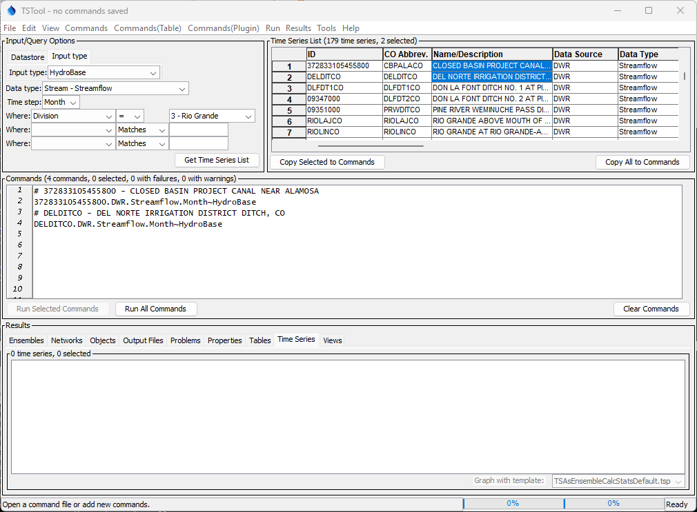
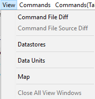
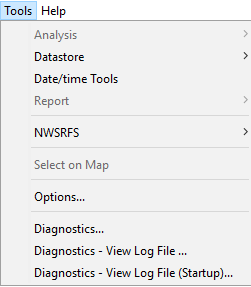

# TSTool / Getting Started #

This chapter provides an overview of the TSTool graphical user interface (GUI).

* [Introduction](#introduction)
* [Starting TSTool](#starting-tstool)
* [Database Selection and User Authentication](#database-selection-and-user-authentication)
* [Main Interface](#main-interface)
    + [Input/Query Options and Time Series List Area](#inputquery-options-and-time-series-list-area)
    + [Command List and Command Error Indicators](#command-list-and-command-error-indicators)
    + [Results](#results)
        - [Results / Ensembles](#results-ensembles)
        - [Results / Networks](#results-networks)
        - [Results / Output Files](#results-output-files)
        - [Results / Problems](#results-problems)
        - [Results / Properties](#results-properties)
        - [Results / Tables](#results-tables)
        - [Results / Time Series](#results-time-series)
        - [Results / Views](#results-views)
* [File Menu - Main Input and Output Control](#file-menu-main-input-and-output-control)
    + [File / New - Open Command File or Databases](#filenew–open-command-file-or-databases)
    + [File / Open - Open Command File or Databases](#fileopen-open-command-file-or-databases)
    + [File / Save - Save Command File, and Time Series](#filesave–save-command-file-and-time-series)
    + [Print Commands](#print-commands)
    + [Properties for Commands Run, TSTool Session, and Input Types](#properties-for-commands-run-tstool-session-and-input-types)
    + [Set Working Directory](#set-working-directory)
    + [File / Exit](#fileexit)
* [Edit Menu - Editing Commands](#edit-menu-editing-commands)
    + [Cut/Copy/Paste/Delete](#cutcopypastedelete)
    + [Select All Commands/Deselect All Commands](#select-all-commandsdeselect-all-commands)
    + [Edit Command](#edit-command)
    + [Convert Selected Commands To/From Comments](#convert-selected-commands-tofrom-comments)
    + [Convert TSID to Read Commands](#convert-tsid-to-read-commands)
* [View Menu –-Display Useful Information and Map Interface](#view-menu-display-useful-information-and-map-interface)
* [Commands Menus](#commands-menus)
* [Run Menu - Run Commands](#run-Menu-run-commands)
    * [Process TSProduct](#process-tsproduct)
* [Results Menu - Display Time Series](#results-menu-display-time-series)
* [Tools Menu](#tools-menu)
    + [Options](#options)
    + [Diagnostics](#diagnostics)
* [Help Menu](#help-menu)
* [Creating Workflows](#creating-workflows)

----------------

## Introduction ##

The TSTool GUI has three main functions:

1. Browse and view time series data.  In this capacity,
   a graph or summary can be created and then TSTool can be closed.
2. Automate time series processing.
   For example, format lists of time series for use with simulation models or other software.
   In this capacity, time series that are read and displayed can be incorporated into a command file,
   which can be run to generate time series files.
3. Process time series products.  For example, create graphs for use on web sites or to facilitate review data or modeling results.
   In this capacity TSTool is used to generate data products in a streamlined fashion.
   The remainder of this chapter provides an overview of the graphical user interface,
   in the general order of the main features and menus on the menu bar (left to right, top to bottom).
   The features necessary to accomplish the above tasks are described at an introductory level.
   See other chapters for more detailed information.
   See also the training materials that are available for TSTool.

## Starting TSTool ##

When using the State of Colorado’s CDSS configuration for TSTool,
the software can be started on Windows using ***Start / All Programs / CDSS / TSTool-Version***
(or ***Start / Programs / CDSS / TSTool-Version***).
The menus vary slightly depending on the operating system.

TSTool also has been implemented for Linux and Mac OS X,
in which the `tstool` script can be run to start the software.

To process a command file in batch mode without showing the user interface,
use a command line similar to the following:

```
tstool –commands commands.TSTool
```

It is customary to name command files with a `.TSTool` file extension.
It may be necessary to specify a full (absolute) path to the command file when
running in batch mode in order for TSTool to fully understand the working directory.
See the [Running TSTool in Various Modes appendix](../appendix-running/running.md)
for more information about running in batch and other modes.

## Database Selection and User Authentication ##

Some data systems require authentication before a connection to the data can be established.
A database selection also may be required.  If database selection or authentication is required,
TSTool may display a dialog at startup asking for information.
This convention is being phased out in favor of database datastores that are configured prior to runtime.

For example, if the HydroBase input type is enabled (see the
[HydroBase Input Type Appendix](../datastore-ref/CO-HydroBase/CO-HydroBase.md)),
the HydroBase login dialog will be shown when TSTool starts in interactive mode.
The dialog is used to select a server and database for the State of Colorado’s HydroBase database.
A HydroBase database can also be selected from the ***File / Open / HydroBase...*** menu.
The following example illustrates using HydroBase on a local computer.

**<p style="text-align: center;">

</p>**

**<p style="text-align: center;">
Select HydroBase Database Dialog
</p>**

HydroBase features will be disabled if the HydroBase login is canceled.

Database connections are often configured using configuration files
so that the dialog confirmation can be avoided.
See the [Installation and Configuration appendix](../appendix-install/install.md)
and information in the [data store appendices](../datastore-ref/overview.md).
The ***Tools / Options*** menu allows input types to be enabled and disabled.

## Main Interface ##

The following figure illustrates the main TSTool interface immediately after startup.
A message is displayed in the upper left letting the user know that
data connections are still being initialized for configured datastores.
Trying to use commands that depend on data connections that have not been initialized will result in errors.

**<p style="text-align: center;">

</p>**

**<p style="text-align: center;">
TSTool At Startup, Waiting for Data Connections to be Initialized (<a href="../GUI_MainWait.png">see also the full-size image</a>)
</p>**
 
The following figure illustrates the main TSTool interface after data connections are initialized.
The interface is divided into three main areas:

* ***Input/Query Options*** (top left) and Time Series List area (top right)
* ***Commands*** (middle)
* ***Results*** (bottom)

Status and progress information is displayed at the bottom of the main
window and also in the borders around main panels (e.g.,
to show how many items are in a list and how many are selected).

**<p style="text-align: center;">

</p>**

**<p style="text-align: center;">
Initial TSTool Interface (<a href="../GUI_MainBlank.png">see also the full-size image</a>)
</p>**

### Input/Query Options and Time Series List Area ###

The upper part of the main window contains the ***Input/Query Options*** and ***Time Series List*** area.
The ***Input/Query Options*** choices help select time series information from datastores
(databases and web services) and input types (typically files and some databases).
The interactive query interface is useful when selecting a time series from a file,
database, or web service (internet).
An alternative to the following interactive approach is to use
read commands from the ***Commands*** menu (see the [Commands chapter](../commands/commands.md)).
To select time series, perform the following steps:

1. **Select the source of the data**.  Select a ***Datastore*** or ***Input type***.
    * A data store is a repository that generally contains multiple time series
      (e.g., a database, web service, or file).
      The details about the datastore are included in a simple configuration file (see datastore appendices).
    * Input types define the storage format (e.g., database or file)
      for time series data, and may require an input name.
      Selecting some input types may prompt for a file,
      which is then listed in the ***Input name*** choices immediately below ***Input type***.<br><br>
      The datastore design is being phased in because it provides more flexibility in defining data connections.
      In the future, all database connections will be transferred to
      datastores and remaining input types may be referred to as “file datastores”, which will use a filename.<br><br>
      The DateValue input type is the default.
      More specific input types (e.g., HydroBase) may be the default if enabled.
      See the appropriate data store or input type appendix for more information.<br><br>
      Depending on the input type, some of the remaining selection choices described below may be disabled or limited.  
2. **Select the time series data type**.  Select the ***Data type*** (if appropriate for the input type).
   For example, select ***Streamflow*** or ***Diversion*** if using a HydroBase input type.
   For some input types, the data type will be listed as ***Auto***,
   indicating that the data type automatically will be determined from the data.
3. **Select the time series time step (interval)**.
   Select the ***Time step*** (if appropriate for the input type).
   The time step, also referred to as the data interval,
   generally will be limited by the input type.
   For example, if reading from the HydroBase database,
   the ***Streamflow*** data type will result in Day, Month, and Irregular (real-time) time steps being listed.
   The time step will be shown as Auto for input types where the time step is determined as data are read.
4. **Specify filter criteria for the time series list**.
   Specify the ***Where*** and ***Is*** clause(s) for the query (if appropriate for the input type).
   This information will limit the number of time series that are returned.
   The filters are highly dependent on the original data.
5. **Generate the time series list**.  Press the ***Get Time Series List*** button
   in the ***Input/Query Options*** area, and TSTool will display a list of matching time series in the ***Time Series List***.
   If the input type is a file, you may first be prompted to select the file containing the time series.
   The ***Time Series List*** shows a list of matching time series,
   typically including location and time series properties.
   As much as possible, the column headings are consistent between different input types.
   The results are typically sorted by name or identifier if from a database,
   or if read from a file are listed according to the order in the file.
   Right-click on the column headings and select ***Sort Ascending*** to sort by that column.
   The sorts are alphabetical so some numeric fields may not sort as expected due to spaces, etc.
6. **Copy time series identifiers to the command list**.
   TSTool requires that time series identifiers (TSIDs) be created in the ***Commands***
   list area in order to read the time series data values.
   To create TSIDs from the ***Time Series List***,
   selecting one or more rows in the ***Time Series List*** (note that the first column will not allow selections)
   and then press the ***Copy Selected to Commands*** button.
   Or, if appropriate, press the ***Copy All to Commands*** button.
7. **Read and display time series**.  The ***Commands*** and ***Results*** areas are discussed below.
   To process time series having different data types or time steps,
   make multiple queries using the ***Input/Query Options*** and ***Time Series List***
   areas and select from the lists as necessary, accumulating time series identifiers in the ***Commands*** list.

After selecting time series and copying to the ***Commands*** area,
the main interface will appear similar to the following figure.
As TSIDs are inserted, TSTool will attempt to read the time series
properties to ensure that the TSID is correct,
and an indicator will be shown for time series that could not be retrieved.
This may result in a slight pause but helps ensure that commands are functional.

**<p style="text-align: center;">

</p>**

**<p style="text-align: center;">
TSTool after Pressing Get Time Series List and selecting from Time Series List (<a href="../GUI_MainWithCommands.png">see also the full-size image</a>)
</p>**

### Command List and Command Error Indicators ###

The ***Commands*** list occupies the middle of the main interface and contains:

* time series identifiers corresponding to time series selected from the ***Time Series List***
* commands inserted using the ***Commands*** menu (see the [Commands chapter](../commands/commands.md)).

Time series identifiers are added to the ***Commands*** list by selecting items in the
***Time Series List*** and copying the identifiers to the ***Commands*** list, as discussed above.
An alternative to using the ***Time Series List*** to select time series is to use
specific read commands from the ***Commands*** menu (e.g., use a
[`ReadDateValue`](../command-ref/ReadDateValue/ReadDateValue.md) command).
Using read commands is useful when more control is needed during the
data read or when processing more than one time series with one command.

The ***Commands*** and other TSTool GUI lists behave according
to standard conventions for the operating system.  For example, on Windows:

* **Single-click** to select one item.
* **Ctrl-click** to additionally select an item.
* **Shift-click** to select everything between the previous selection and the current selection.

Behavior on operating systems other than Windows may vary.
Right-clicking over the ***Commands*** list displays a pop-up menu
with useful command manipulation choices,
some of which are further described in following sections.
A summary of the pop-up menu choices is as follows:

|**Menu Choice**|**Description**
|--|--|
|***Show Command Status Success/Warning/Failure***|Displays the status of a command for each phase of command processing (more discussion below after table).|
|***Edit***|Edit the selected command using custom edit dialogs, which provide error checks and format commands.  Double-clicking on a command also results in editing the command.|
|***Cut***|Cut the selected commands for pasting.|
|***Copy***|Copy the selected commands for pasting.|
|***Paste (After Selected)***|Paste commands that have been cut/copied, pasted after the selected row.|
|***Delete Command(s)***|Delete the selected commands (currently same as ***Cut***).|
|***Find Commands(s)***|Find commands in the command list.  This displays a dialog.  Use the right-click in the found items to go to or select found items.|
|***Select All Commands***|Select all the commands.|
|***Deselect All Commands***|Deselect all the commands.  This is useful because only selected commands are processed (or all if none are selected).  It is therefore important not to unknowingly have one or a few commands selected during processing.|
|***Convert Selected Commands to # Comments***|Convert selected commands to [`#`](../command-ref/Comment/Comment.md) comments.|
|***Convert Selected Commands from # Comments***|Convert # comments to commands.|
|***Convert TSID command to general ReadTimeSeries() command***|Convert the selected TSID command to a [`ReadTimeSeries`](../command-ref/ReadTimeSeries/ReadTimeSeries.md) command.  This general command allows an alias to be assigned to the time series.|
|***Convert TSID command to specific Read...() command***|Convert the selected TSID command to a specific `Read...` command.  The TSID is examined to determine a suitable read command.  Specific read commands may provide parameters to control reading the time series, and may also allow multiple time series to be read.|
|***Run All Commands (create all output)***|Run all commands and create output (e.g., graphs and files).|
|***Run All Commands (ignore output commands)***|Run all commands but skip any output commands.  This is useful if a batch command file has been read and time series are to be listed in the GUI but output products are not to be generated automatically.|
|***Run Selected Commands (create all output)***|Run selected commands and create output (e.g., graphs and files).|
|***Run Selected Commands (ignore output commands)***|Run selected commands but skip any output commands.  This is useful if a batch command file has been read and time series are to be listed in the GUI but output products are not to be generated automatically.|

Commands are numbered to simplify editing.
The command list also includes left and right gutters to display graphics that help with error handling.
The following figure illustrates a command with an error (the first time series
identifier has been edited to include an x, resulting in an invalid identifier). 

**<p style="text-align: center;">

</p>**

**<p style="text-align: center;">
Command List Illustrating Error
</p>**

The following error handling features are available:

* The graphic in the left gutter indicates the severity of a problem (see below for full explanation).
* The colored indicator on the right indicates the severity of a
  problem by its color and, when clicked on, positions the visible list of
  commands to display the command corresponding to the problem.
* Commands have three phases:  1) initialization, 2) discovery, 3) run.
  Initialization occurs when reading a command file or adding a new command.
  The discovery phase is executed only for commands that generate time series
  for other commands and provides other commands with identifiers used in command editing.
  The run phase generates full output.
* Positioning the mouse over a graphic in the left or right gutter
  will show a popup message with the problem information.
  The popup is only visible for a few seconds so use the right-click popup menu
  ***Show Command Status (Success/Warning/Failure)*** for a dialog that does not automatically disappear.
* Clicking on the left gutter will hide and un-hide the gutter.

The meaning of the error handling symbols is described in the following table.
The symbol for the most severe error will be displayed next to each command.

**<p style="text-align: center;">
Command List Graphics for Problems
</p>**

|**Problem Graphic**|**Description**|
|--|--|
|No graphic|Command is successful (a warning or failure has not been detected).|
||The status is unknown, typically because the command has just been inserted.
||The command has a problem that has been classified as non-fatal.  For example, an input file has not been found.  In general, commands with warnings need to be fixed unless work is preliminary.|
||The command has failed, meaning that output is likely incomplete.  A problem summary and recommendation to fix the problem are available in the status information.  Commands with failures generally need to be fixed.  Software support should be contacted if the fix is not evident.|

It is possible that a problem indicator will be shown during
command editing and will be cleared when commands are run.
For example, a command may depend on a file that is created by a previous command.
It is important that errors displayed after running commands are resolved.

### Results ###

The commands in the ***Commands*** list are processed by pressing the
***Run Selected Commands*** or ***Run All Commands*** buttons below the
***Commands*** list area (or by using the ***Run*** menu).
The time series and other output that result from processing are
listed in the bottom of the main interface, as shown in the following figure:

**<p style="text-align: center;">

</p>**

**<p style="text-align: center;">
TSTool after Running Commands (<a href="../GUI_MainWithTS.png">see also the full-size image</a>)
</p>**

The time series listed in the ***Results / Time Series*** list can then viewed using the
***Results*** menu, analyzed further using the ***Tools*** menu,
and output using the ***File / Save*** menus.
Only the selected time series will be output (or all if none are selected).

The following may be available in ***Results***, depending on commands that were run:

* ***Ensembles*** – groups of time series with an ensemble identifier.
  Individual time series that are associated with an ensemble also
  are shown in the ***Time Series*** tab.  Right-click on item to access viewing and analysis options.
* ***Networks*** - a list of networks that have been created, for example to represent river or other flow networks
* ***Output Files*** – files that are created during processing.  Single-click on a file to view.
* ***Problems*** – a full listing of warning and failure messages from all commands.
* ***Properties*** – the list of processor properties that can be referenced in command parameters using `${Property}` syntax
* ***Tables*** – tables created during processing.  Right-click on a table in the list to view the table.
* ***Time Series*** – time series created during processing.  Right-click on one or more time series to view the time series.
* ***Views*** – alternate views of time series, other than the list of time series that is ordered based on command output.

Two progress bars at the bottom of the main window are updated during processing.
The left progress bar indicates the overall progress in processing the
commands (100% means that all commands have been processed).
The right progress bar is used with commands that provide incremental progress during processing,
such as read commands that take longer to run.
For example, if a single command processes many time series,
this progress bar can be used to indicate progress in the command.

#### Results / Ensembles ####

A time series ensemble is a group of related time series, such as time series traces for climate model runs
or historical years that have been shifted to overlap.
See the [Introduction - Time Series Ensembles](../introduction/introduction.md#time-series-ensembles) documentation.
Ensembles are typically associated with modeling or analysis and are only available from from some data sources.
See the ***Commands / Ensemble Processing*** menu for commands that process ensembles.

Right-click on an ensemle to access the popup menu for ensemble tools,
for example to graph the ensemble.

**<p style="text-align: center;">

</p>**

**<p style="text-align: center;">
***Results / Ensembles*** (<a href="../results-ensembles.png">see also the full-size image</a>)
</p>**

#### Results / Networks ####

TSTool has built-in features for representing a converging network,
such as associated with a river system.
Networks are typically used to represent a hierarchy of stream reaches or basins.
The TSTool network features can be used to select time series based on location within a network,
perform modeling on the network, and other analysis.
See the ***Commands / Network Processing*** menu for commands that process networks.

Right-click on a network to access the popup menu for network tools.

**<p style="text-align: center;">

</p>**

**<p style="text-align: center;">
***Results / Networks*** (<a href="../results-networks.png">see also the full-size image</a>)
</p>**

#### Results / Output Files ####

The ***Output Files*** list contains output files created by commands.
In most cases, all files created by a command will be listed.
In some cases, a command may provide a parameter to control whether files are listed,
mainly in cases where a very large number of files may be generated or the files are difficult to view.

Single-click on an output file to view the file using the operating system default program for the file extension.
If an associated program is not available, open the file using the file explorer tool.

**<p style="text-align: center;">

</p>**

**<p style="text-align: center;">
***Results / Output Files*** (<a href="../results-output-files.png">see also the full-size image</a>)
</p>**

#### Results / Problems ####

The ***Results / Problems*** list displays a compilation of all the problems that are associated with commands that have been run.
The messages for a specific command can also be shown by using the ***Show Command Status*** popup menu for a command in the command list area.
In most cases, it is desirable that a command file has no warning or failure messages.

Click to (un)select cells and right-click on problems to copy and paste into other programs.
Use left and right click to select multiple cells.

**<p style="text-align: center;">

</p>**

**<p style="text-align: center;">
***Results / Problems*** (<a href="../results-problems.png">see also the full-size image</a>)
</p>**

#### Results / Properties ####

The ***Results / Properties*** list displays all processor properties that are defined.
The property view is updated when command processing completes.
Some properties are built-in and will always have a value
whereas other properties are defined dynamically, such as by the [`SetProperty`](../command-ref/SetProperty/SetProperty.md) and other commands.
The property type may be important when converting between types,
such as when formatting a floating point number as a string.
Property types correspond to Java built-in classes and TSTool classes such as `DateTime`.

Click to (un)select cells and right-click on properties to copy and paste into other programs.
Use left and right click to select multiple cells.

**<p style="text-align: center;">

</p>**

**<p style="text-align: center;">
***Results / Properties*** (<a href="../results-properties.png">see also the full-size image</a>)
</p>**

The following table lists built-in properties.
Some global properties were implemented in early versions of TSTool before command parameters were added to control behavior.
Global properties should be used with care because they may impact multiple commands.

**<p style="text-align: center;">
***Built-in Properties***
</p>**

| **Property**&nbsp;&nbsp;&nbsp;&nbsp;&nbsp;&nbsp;&nbsp;&nbsp;&nbsp;&nbsp;&nbsp;&nbsp;&nbsp;&nbsp;&nbsp;&nbsp;&nbsp;&nbsp;&nbsp;&nbsp;&nbsp;&nbsp;&nbsp;&nbsp;&nbsp;&nbsp;&nbsp;&nbsp;&nbsp;&nbsp;&nbsp;&nbsp;&nbsp;&nbsp;&nbsp;&nbsp;&nbsp;&nbsp; | **Description** | **Default** |
| -- | -- | -- |
| `AutoExtendPeriod` | Whether to globally automatically extend the time series period to the requested output period. See the [`SetAutoExtendPeriod`](../command-ref/SetAutoExtendPeriod/SetAutoExtendPeriod.md) command. | `true` |
| `AverageEnd` | The global ending date/time used when averaging data.  See the [`SetAveragePeriod`](../command-ref/SetAveragePeriod/SetAveragePeriod.md). | Not set - use all data for averaging. |
| `AverageStart` | The global starting date/time used when averaging data.  See the [`SetAveragePeriod`](../command-ref/SetAveragePeriod/SetAveragePeriod.md). | Not set - use all data for averaging. |
| `ComputerName` | The computer name from the operating system. | Determined from the operating system. |
| `ComputerTimezone` | The computer's time zone (e.g., `America/Denver`). | Determined from the operating system. |
| `CreateOutput` | Global property that indicates whether output files should be created, used to speed up runs during software and dataset development.  | Currently is always `true`. |
| `DebugLevelLogFile` | The debug level (0+) for the log file. | 0 (debug messages are off) |
| `DebugLevelScreen` | The debug level (0+) for console/screen output. | 0 (debug messages are off) |
| `FailureCount` | The number of failure messages for the command file, set after each command completes, to allow checking for failure within the command file. | |
| `HaveOutputPeriod` | Indicates whether the output period has been set, used internally by some commands. See the [`SetOutputPeriod`](../command-ref/SetOutputPeriod/SetOutputPeriod.md) command. | `false` |
| `HydroBaseDMIListSize` | The number of HydroBase DMI, used in automated tests to confirm database connections. | |
| `IgnoreLEZero` | Indicates whether values less than or equals zero should be globally ignored in computing historical averages for filling.  See the [`SetIgnoreLEZero`](../command-ref/SetIgnoreLEZero/SetIgnoreLEZero.md). | `false` |
| `IncludeMissingTS` | Indicates whether missing time series should be included in output by initializing an empty time series, useful to avoid warnings in processing, supported by some commands.  See the [`SetIncludeMissingTS`](../command-ref/SetIncludeMissingTS/SetIncludeMissingTS.md) command | `false` |
| `InitialWorkingDir` | The initial working directory (folder) for the processor using the operating system's path convention, used to help the [`RunCommands`](../command-ref/RunCommands/RunCommands.md) command and other code know the starting point for relative paths. | Determined when a command file is opened. |
| `InputEnd` | Global period end for reading data.  See the [`SetInputPeriod`](../command-ref/SetInputPeriod/SetInputPeriod.md) command. | Read all data. |
| `InputStart` | Global period start for reading data.  See the [`SetInputPeriod`](../command-ref/SetInputPeriod/SetInputPeriod.md) command. | Read all data. |
| `InstallDir` | The TSTool software installation directory (folder) using the operating system path convention. | Determined when the software starts. |
| `InstallDirPortable` | The TSTool software installation directory (folder) using a portable path convention (forward slashes, include colon on Windows). | Determined when the software starts. |
| `InstallDirPosix` | The TSTool software installation directory (folder) using POSIX path convention (only forward slashes, no colon). | Determined when the software starts. |
| `InstallDirURL` | The TSTool software installation directory (folder) using URL path convention. | Determined when the software starts. |
| `OutputEnd` | Global period end for writing data.  See the [`SetOutputPeriod`](../command-ref/SetOutputPeriod/SetOutputPeriod.md) command. | Output all data. |
| `OutputStart` | Global period start for writing data.  See the [`SetOutputPeriod`](../command-ref/SetOutputPeriod/SetOutputPeriod.md) command. | Output all data. |
| `OutputYearType` | Global output year type.  See the [`SetOutputYearType`](../command-ref/SetOutputYearType/SetOutputYearType.md) command. | `Calendar` |
| `ProgramVersionNumber` | TSTool program version as a number with whole number being the major version (e.g., `14.30`). This allows using the version in [`If`](../command-ref/If/If.md) commands but can have issues because minor version numbers are not as distinct as the version string. | Set automatically. |
| `ProgramVersionString` | TSTool program version as a string using semantics versioning (e.g., `14.3.0.dev2`). This allows using the version in [`If`](../command-ref/If/If.md) commands.  | Set automatically. |
| `RunTimeMs` | The run time in milliseconds of the last commands that were run, useful for checking the run time of a workflow. | Set when commands are run. |
| `StartLogEnabled` | Indicate whether the [`StartLog`](../command-ref/StartLog/StartLog.md) command is enabled, useful for controlling whether all log output to one file, such as during testing. | `true` |
| `TSEnsembleResultsListSize` | The number of time series ensembles in results, which is useful to checking workflow results. | Set when processing time series ensembles. |
| `TSResultsListSize` | The number of time series in results, which is useful to checking workflow results. | Set when processing time series. |
| `TempDir` | Temporary directory (folder), using operating system path conventions, useful if a temporary file needs to be created in a workflow. | Set automatically for the operating system. |
| `UserHomeDir` | The user's home directory (folder), using operating system path conventions. | Set automatically. |
| `UserHomeDirPosix` | The user's home directory (folder), using POSIX path conventions (all slashes, no colon). | Set automatically. |
| `UserHomeDirURL` | The user's home directory (folder), using URL path conventions. | Set automatically. |
| `UserName` | The user's login name as determined from the operating system. | Set automatically. |
| `WarningCount` | The number of warning messages for the command file, set after each command completes, to allow checking for warnings within the command file. | |
| `WarningLevelLogFile` | The warning level (0+) for the log file. | 3 |
| `WarningLevelScreen` | The warning level (0+) for console/screen output. | 0 (no warning messages to the console/screen) |
| `WorkingDir` | The TSTool working directory (folder) using the operating system path convention. | Software folder at startup and subsequently the folder for the opened/saved command file. |
| `WorkingDirPortable` | The TSTool working directory (folder) using a portable path convention (all forward slashes, include colon on Windows). | Software folder at startup and subsequently the folder for the opened/saved command file. |
| `WorkingDirPosix` | The TSTool working directory (folder) using a POSIX convention (all forward slashes, no colon). | Software folder at startup and subsequently the folder for the opened/saved command file. |

#### Results / Tables ####

The ***Results / Tables*** tab displays the list of tables resulting from processing commands.
See the ***Commands(Table)*** menu for table processing commands.
Many other commands also allow tables to be created,
for example [`ListFiles`](../command-ref/ListFiles/ListFiles.md) and
[`CompareTimeSeries`](../command-ref/CompareTimeSeries/CompareTimeSeries.md).

**<p style="text-align: center;">

</p>**

**<p style="text-align: center;">
***Results / Tables*** (<a href="../results-tables.png">see also the full-size image</a>)
</p>**

#### Results / Time Series ####

The ***Results / Time Series*** tab lists time series that have been created during command processing.

Right-clicking over the ***Time Series Results*** list displays a pop-up menu with useful
time series viewing choices, including a choice to view the time series properties.
The right-click menu choices are summarized below:
Use ctrl-click and shift-click to select multiple time series.

**<p style="text-align: center;">
Time Series Results List Popup Menu Choices
</p>**

|**Menu Choice**&nbsp;&nbsp;&nbsp;&nbsp;&nbsp;&nbsp;&nbsp;&nbsp;&nbsp;&nbsp;&nbsp;&nbsp;&nbsp;&nbsp;&nbsp;&nbsp;&nbsp;&nbsp;&nbsp;&nbsp;&nbsp;&nbsp;&nbsp;&nbsp;&nbsp;&nbsp;&nbsp;&nbsp;&nbsp;&nbsp;&nbsp;&nbsp;&nbsp;&nbsp;&nbsp;&nbsp;&nbsp;&nbsp;&nbsp;&nbsp;|**Description**|
|--|--|
|***Graph – Area***|Display a graph where the area below time series is filled in.|
|***Graph – Area (stacked)***|Display a graph where the area below time series is filled in, with the time series values being cumulative.|
|***Graph – Bar (left of date)***|Display bar graph for selected time series, drawing bars to the left of the date.|
|***Graph – Bar (center on date)***|Display bar graph for selected time series, drawing bars centered on the date.|
|***Graph – Bar (right of date)***|Display bar graph for selected time series, drawing bars to the right of the date.|
|***Graph – Duration***|Display a duration graph for the selected time series.|
|***Graph – Ensemble***|Display the time series in ensemble form.  Historical years are overlapped.|
|***Graph – Line***|Display a line graph for selected time series.|
|***Graph – Line (log Y-axis)***|Display a line graph for the selected time series, using a log10 y-axis.|
|***Graph – Period of Record***|Display a period of record graph for the selected time series.|
|***Graph – Point***|Display a graph using symbols but no connecting lines.|
|***Graph – Predicted Value***|Display a graph of data and the predicted values from regression.|
|***Graph – Predicted Value Residual***|Display a graph of data minus the predicted values from regression.|
|***Graph – Raster***|Display a raster (heat map) graph for the first selected time series.|
|***Graph – XY-Scatter***|Display an XY-scatter plot for the selected time series.|
|***Table***|Display a scrollable table for the selected time series.|
|***Report – Summary (HTML)***|Display an HTML summary for selected time series using the default web browser.|
|***Report – Summary (Text)***|Display a text summary for selected time series.|
|***Find Time Series...***|Find time series in the time series list.  This displays a dialog.  Use the right-click in the found items to go to or select found items.|
|***Select All for Output***|Select all time series for output.|
|***Deselect All***|Deselect all time series for output.|
|***Time Series Properties***|Display the time series properties dialog (see the TSView Time Series Viewing Tools appendix for a complete description of the properties interface).|

TSTool does not usually try to decide what titles or other graph
properties to use for graphs because of the variability in input data that are handled by TSTool.
However, as of version 12.00.00, graph templates have been enabled to allow configuration of standard graphs.
The ***Ensembles*** and ***Time Series*** results tabs provide ***Graph with template:*** buttons.
These buttons can be used to graph an ensemble or time series by
relaying on a template graph time series product.
The [TSView Time Series Viewing Tools appendix Time Series Graph Templates](../appendix-tsview/tsview.md#time-series-graph-templates)
section provides information about time series products.

The TSTool interface also provides an intermediary step to using
graph templates specifically for ensembles.
If ***Graph – Ensemble*** is selected for a time series, the following dialog will be shown.

**<p style="text-align: center;">

</p>**

**<p style="text-align: center;">
Results – Graph Ensemble Dialog (<a href="../Menu_Results_Graph_Ensemble.png">see also the full-size image</a>)
</p>**

This dialog provides the ability to indicate how the selected
time series should be processed into an ensemble,
and also allows a graph template to be selected,
which typically provides information about graph properties such as title and legend.
The ***Output year type*** and ***Reference date*** input are passed
to the same code as the [`CreateEnsembleFromOneTimeSeries`](../command-ref/CreateEnsembleFromOneTimeSeries/CreateEnsembleFromOneTimeSeries.md) command.
The ***Statistics*** input allows statistics time series to be calculated and added to the graph,
and are passed to the same code as the
[`NewStatisticTimeSeriesFromEnsemble`](../command-ref/NewStatisticTimeSeriesFromEnsemble/NewStatisticTimeSeriesFromEnsemble.md) command.
Finally, the ***Graph template*** selection specifies a graph template
and is used similar to the [`ProcessTSProduct`](../command-ref/ProcessTSProduct/ProcessTSProduct.md) command.
These steps are necessary for TSTool to be able to generically handle various input and configurations.
The resulting graph will be shown and will reflect the calculations and configuration properties.
All input is optional and if omitted will result in default output.

A similar dialog is used if ***Graph – Line (Ensemble Graph)*** is selected for ensemble results,
as shown below.  In this case there is no need to create a new ensemble since it already exists.
Therefore, input is provided to add statistics time series to the output,
and specify the graph template to configure the graph.

**<p style="text-align: center;">

</p>**

**<p style="text-align: center;">
Results – Graph Ensemble Dialog (<a href="../Menu_Results_Graph_Ensemble.png">see also the full-size image</a>)
</p>**

#### Results / Views ####

The ***Results / Views*** tab displays time series organized in alternative views to the ***Time Series*** list.
Views can be used to organize output in ways that are more conducive to review.
See the ***Commands / Visualization Processing*** menu and
[`NewTreeView`](../command-ref/NewTreeView/NewTreeView.md) command,
which can be used at the end of a command file to create a view.

**<p style="text-align: center;">

</p>**

**<p style="text-align: center;">
***Results / Views*** (<a href="../results-views.png">see also the full-size image</a>)
</p>**

## File Menu - Main Input and Output Control ##

The File menu provides standard input and output features as described below.
Some menus are visible only when certain input types are enabled or when time series have been processed.

**<p style="text-align: center;">

</p>**

**<p style="text-align: center;">
File Menu
</p>**

### File / New - Open Command File or Databases ###

The ***File / New / Command File*** menu item clears the current commands so that a new command file can be started.
A new command file name will be requested when the commands are saved.

### File / Open – Open Command File or Databases ###

**<p style="text-align: center;">

</p>**

**<p style="text-align: center;">
File / Open Menu
</p>**

The ***File / Open / Command File*** menu item displays a dialog to select an existing command file.
The menu may also show a list of previously opened command files and options specific to a database.
For example, some databases allow interactive logins.
After a file is selected, the file contents replace the contents of the ***Commands*** list.
A prompt is displayed if commands already exist in the ***Commands*** list and have been modified.
Opening a command file causes the working directory (folder)
to be set to the folder from which the command file was read.
All other files specified with a relative path will be found relative to the command file.
The ***File / Open / Command File (no discovery)*** menu item can be selected to
load a command file without running discovery mode,
which may be appropriate when loading large command files such as generated by expanding a template.
Discovery mode is needed when editing commands because it provides lists of time series and other data to command editors.

TSTool automatically will attempt to update older command files to new syntax if a command has changed.
If a change occurs, the command file will be marked as modified and will need to be saved to reflect the changes.
If an error occurs updating a command, it will be marked with an error and a
comment will be inserted with the original command indicating that an automated update could not occur.
Unrecognized commands are marked with an error and will generate errors if run.

If appropriate for the TSTool configuration,
other menu items will be displayed to allow opening databases.
It is recommended that database connections be configured to automatically open;
however, the menus are useful for development and troubleshooting.

### File / Save – Save Command File, and Time Series ###

**<p style="text-align: center;">

</p>**

**<p style="text-align: center;">
File / Save Menu
</p>**

The ***File / Save / Commands*** and ***File / Save / Commands As*** menu items save
the contents of the ***Commands*** list to a file.
The name of the current command file is shown in the TSTool title bar
and can be referred to when deciding a new command file name.
All commands are saved, even if only a subset is selected.
Saving a command file causes the working directory to be set to the folder where the command file was written.
All other files specified with a relative path will be found relative to the command file.

The ***File / Save / Commands As (Version 9 Syntax)...*** menu
items saves the commands to a version 9 format command file.
The primary difference between version 9 and later syntax is that the
`TS Alias = Command(...)` syntax was replaced with `Command(Alias=...)` syntax in TSTool version 10.

The ***File / Save / Time Series As*** menu item displays a file chooser
dialog for saving time series in the ***Time Series Results*** list.
See the [Input Type Appendices](../datastore-ref/overview.md) for examples of supported file formats.
Only the selected time series in the ***Time Series Results*** list are saved (or all, if none are selected).
Not all formats are supported because in most cases the write
commands are used to automate processing of time series and provider greater control.

### Print Commands ###

The ***File / Print / Commands*** menu prints the contents of the ***Commands*** list.
This is useful when editing and troubleshooting commands.

### Properties for Commands Run, TSTool Session, and Input Types ###

**<p style="text-align: center;">

</p>**

**<p style="text-align: center;">
File / Properties Menu
</p>**
 
The ***File / Properties / Commands Run*** menu item displays information from the
last time that the commands were run, including global properties that impact results.

**<p style="text-align: center;">

</p>**

**<p style="text-align: center;">
Properties of the Last Commands Run (<a href="../Menu_File_PropertiesRun.png">see also the full-size image</a>)
</p>**

This information is useful for troubleshooting processing. 
The ***File / Properties / TSTool Session*** menu item displays information about the current TSTool session, as follows.

**<p style="text-align: center;">

</p>**

**<p style="text-align: center;">
TSTool Session Properties (<a href="../Menu_File_Properties_TSToolSession.png">see also the full-size image</a>)
</p>**

This information is useful for checking the TSTool configuration. 
Additional properties displays may be available depending on enabled input types.
For example, the ***File / Properties / HydroBase*** menu item displays HydroBase properties,
including the database that is being used, database version,
and the water districts that are in the database being queried.
The water districts are determined from the structure table in HydroBase.
The information that is shown is consistent with that shown by other State of Colorado tools and is useful for troubleshooting.

**<p style="text-align: center;">

</p>**

**<p style="text-align: center;">
HydroBase Properties Dialog (<a href="../Menu_File_Properties_HydroBase.png">see also the full-size image</a>)
</p>**

### Set Working Directory ###

The ***File / Set Working Directory*** menu item displays a file chooser dialog that selects the working directory.
The working directory is used by TSTool to local files specified with relative paths.
The working directory normally is set in one of the following ways,
with the current setting being defined by the most recent selection:

1. The startup directory for the TSTool program,
2. The directory where a command file was opened,
3. The directory where a command file was saved,
4. The directory specified by a [`SetWorkingDir`](../command-ref/SetWorkingDir/SetWorkingDir.md)
   command (use of this command is discouraged because it hard-codes a system-specific folder in command files),
5. The directory specified by ***File / Set Working Directory***.

The menu item is provided to allow the working directory to be set before a command file has been saved (or opened).
 
### File / Exit ###

The ***File / Exit*** menu exits TSTool.
A confirmation prompt is displayed before exiting.
If commands have been modified, they can be saved before exiting.
Commands may have been automatically updated by TSTool if an old command file was read.

## Edit Menu – Editing Commands ##

The ***Edit*** menu can be used to edit the ***Commands*** list.
Edit options are enabled and disabled depending on the status of the ***Commands*** list.
Specific edit features are described below.
Right clicking over the ***Commands*** list provides a popup menu with choices similar to those described below.

**<p style="text-align: center;">

</p>**

**<p style="text-align: center;">
Edit Menu
</p>**

### Cut/Copy/Paste/Delete ###

The ***Edit / Cut Command(s)*** and ***Edit / Copy Command(s)*** menu items are enabled if there are items in the ***Commands*** list.
Currently, these features do not allow interaction with other applications.
***Cut Command(s)*** deletes the selected item(s) from the ***Commands*** list and saves its information in memory.
***Copy Command(s)*** just saves the information in memory.
After ***Cut Command(s)*** or ***Copy Command(s)*** are executed, select an item in the ***Commands***
list and use ***Paste Command(s) (After Selected)*** (see below).

***Paste Command(s) (After Selected)*** is enabled if one or more commands from the
***Commands*** list has been cut or copied.
To paste the command(s), select commands in the ***Commands*** list and press ***Edit / Paste Command(s) (After Selected).***
The commands will be added after the last selected command.
To insert at the front of the list, paste after the first command, and then cut and paste the first command to reverse the order.

The ***Delete*** choice currently works exactly like the ***Cut Command(s)*** choice.
Additionally, after lines in the ***Commands*** list have been selected,
you can press the ***Clear Commands*** button below the ***Commands*** list to cut/delete.

The ***Clear Commands*** button in the ***Commands*** area deletes the selected commands or all commands if none are selected.
A confirmation prompt is displayed if no commands are selected.

### Select All Commands/Deselect All Commands ###

The ***Edit / Select All Commands*** and ***Edit / Deselect All Commands*** menu
items are enabled if there are items in the ***Commands*** list.
Use these menus to facilitate editing.
Note that when editing commands it is often useful to deselect all
commands so that new commands are added at the end of the commands list.

### Edit Command ###

The ***Edit / Command*** menu can be used to edit an individual command.
TSTool will determine the command that is being edited and will
display the editor dialog for that command, performing data checks.
Most old commands automatically will be detected and will be converted to new command syntax.
This feature is also accessible by right clicking on the
***Commands*** list and selecting the Edit menu item and by double-clicking on a command.

### Convert Selected Commands To/From Comments ###

The ***Edit / Convert selected commands to comments*** menu can be used to toggle selected
commands in the Commands list to comments (lines that begin with `#`).
This is useful when temporarily disabling commands, rather than deleting them.

The ***Edit / Convert selected commands from comments*** menu can be used to
toggle selected commands in the Commands list from comments back to active commands.
This is useful when re-enabling commands that were temporarily disabled.

Note that the multi-line `/* */` comment notation can be inserted using the
***Commands / General – Comments menu***.

### Convert TSID to Read Commands ###

The ***Edit / Convert TSID command to general ReadTimeSeries() command*** inserts a new
[`ReadTimeSeries`](../command-ref/ReadTimeSeries/ReadTimeSeries.md) command using
the TSID and replaces the original TSID command.
The [`ReadTimeSeries`](../command-ref/ReadTimeSeries/ReadTimeSeries.md)
command allows an alias to be specified for the time series.

The ***Edit / Convert TSID command to specific Read…()*** command inserts
a new read command using the TSID and replaces the original TSID command.
Specific read commands may not be available for all input types and
therefore the [`ReadTimeSeries`](../command-ref/ReadTimeSeries/ReadTimeSeries.md) command may need to be used.
Alternatively, insert a read command using the ***Commands*** menu choices.

## View Menu - Display Useful Information and Map Interface ##

**<p style="text-align: center;">

</p>**

**<p style="text-align: center;">
View Menu
</p>**

The ***View / Datastores*** menu item displays a list of configured data stores,
which is useful when troubleshooting whether a data store is properly configured.
Note that some data stores are not listed in the main window Datastore choices but are available for use by commands.

The ***View / Data Units*** menu item displays a list of configured data units,
which are recognized by the [ConvertDataUnits](../command-ref/ConvertDataUnits/ConvertDataUnits.md)
command and other TSTool features that enforce data unit consistency.
Data units from all data repositories are not automatically understood by TSTool,
although additional capabilities may be added in the future.

The ***View / Map*** menu displays a map interface in a separate window.
See the [Spatial Data Integration chapter](../spatial/spatial.md) for more information.

The ***View / Close All View Windows*** menu closes all visible view windows, including graphs.
This is useful if the command file has generated many graphs and the user wishes to close them all at once.

## Commands Menus ##

The ***Commands*** menu provides several menus (as shown in the following figure), which insert commands into the Commands list.

**<p style="text-align: center;">

</p>**

**<p style="text-align: center;">
Commands Menu
</p>**

Time series commands are organized into the following categories:

* ***Select, Free, Sort Time Series*** – select or deselect time series for processing, free or sort time series
* ***Create Time Series*** – create one or more new time series
* ***Read Time Series*** – read time series from a file or database
* ***Fill Time Series Missing Data*** – fill missing data
* ***Set Time Series Contents*** – set time series data or properties
* ***Manipulate Time Series*** – manipulate data (e.g., scale a time series’ data values)
* ***Analyze Time Series*** – perform analysis on time series (e.g., determine wet/dry/average pattern)
* ***Models – Routing*** – lag and attenuate time series
* ***Output Time Series*** – write time series results to a file or produce graphical products
* ***Check Time Series*** – check time series values and statistics against criteria
* ***Datastore Processing*** – read data from and write data to datastores, using general functionality
* ***Ensemble Processing*** – commands that are specific to ensemble processing
* ***Network Processing*** – commands that process networks of nodes and links
* ***Spatial Processing*** – commands that process spatial data
* ***Spreadsheet Processing*** – commands that process spreadsheet files
* ***Template Processing*** – commands that are specific to template processing
* ***Visualization Processing*** – commands that are specific to visualization
* ***General – Comments*** – insert comments
* ***General – File Handling*** – commands to manipulate files and perform FTP and web retrieval
* ***General – Logging*** – commands for logging (e.g., open a log file, set message levels)
* ***General – Running and Properties*** – commands to control processing and run external programs
* ***General – Test Processing*** – commands to process tests, to validate software and procedures
* ***Deprecated Commands*** – commands that are planned for removal

The ***Commands(Table)*** menu provides commands for table processing.

**<p style="text-align: center;">

</p>**

**<p style="text-align: center;">
Commands(Table) Menu
</p>**
 
Table commands are organized into the following categories:

* ***Create, Copy, Free Table*** – create, copy and free memory for tables
* ***Read Table*** – read tables from various input
* ***Append, Join Tables*** – append and join tables
* ***Table, Timeseries Processing*** – manipulate data between tables and time series
* ***Manipulate Table Values*** – manipulate table contents
* ***Analyze Table*** – analyze table contents, for example to compare tables
* ***Output Table*** – write tables to various output formats
* ***Running and Properties*** – manipulate processor properties in and out of tables

The [Commands Chapter](../commands/commands.md) discusses commands in more detail and the
[Command Reference Appendix](../command-ref/overview.md) provides a reference for each command.

## Run Menu – Run Commands ##

The ***Run menu*** processes the ***Commands*** list to generate results.

**<p style="text-align: center;">

</p>**

**<p style="text-align: center;">
Run Menu
</p>**

The ***Run / All Commands*** (create all output) menu will process all the commands in the
***Commands*** list and create output.

The ***Run / All Commands (ignore output commands)*** menu will process the commands in the
***Commands*** list, ignoring commands that generate output products.
This increases performance and minimizes creation of files.

The ***Run / Selected Commands*** menu items are similar to the above, except that only selected commands are run.

The ***Run / Cancel Command Processing (wait for command to finish)*** menu items will be
enabled if command processing is active,
and allows the processing to be canceled.  Processing may continue until the current command finishes.

The ***Run / Cancel Command Processing (interrupt processor)***
menu will interrupt processing of the current command.
This should only be used in cases where a large or long
command file run has been started unintentionally.

The ***Run / Commands From File...*** choice will run a command file
but will not generate any time series for viewing in the GUI.
This is equivalent to running in batch mode but initiating the run from the TSTool GUI.

Menu items similar to the above also are available in a popup
menu by right clicking on a command in the ***Commands*** list.

### Process TSProduct ###

The ***Run / Process TS Product File*** menu items can be used to
create time series products by processing time series product definition files.
The time series identifiers in the files will be run similar to TSID commands.
The [TSView Time Series Viewing Tools Appendix](../appendix-tsview/tsview.md) describes the format of these files.
Time series product definition files can be saved from graph views using
***Save As / Time Series Product***.
The [`ProcessTSProduct`](../command-ref/ProcessTSProduct/ProcessTSProduct.md)
command provides equivalent functionality.

## Results Menu – Display Time Series ##

The ***Results*** menu displays time series that are listed in the
***Results*** list at the bottom of the TSTool main window and can also be displayed by
right-clicking on results in the ***Time Series Results*** area.
The time series can be viewed multiple times, using the same time series results.

**<p style="text-align: center;">

</p>**

**<p style="text-align: center;">
Results Menu
</p>**
 
Graphing time series results in slightly different viewing options being available,
depending on the type of graph.
Three views of time series are generally available: graph, summary, and table.
Graph properties can be edited by right-clicking on the graph.
The [TSView Time Series Viewing Tools Appendix](../appendix-tsview/tsview.md) describes the graphing tools in detail.
The following table summarizes Results menu items.

**<p style="text-align: center;">
Results Menu Choices
</p>**

|**Menu Choice**&nbsp;&nbsp;&nbsp;&nbsp;&nbsp;&nbsp;&nbsp;&nbsp;&nbsp;&nbsp;&nbsp;&nbsp;&nbsp;&nbsp;&nbsp;&nbsp;&nbsp;&nbsp;&nbsp;&nbsp;&nbsp;&nbsp;&nbsp;&nbsp;&nbsp;&nbsp;&nbsp;&nbsp;&nbsp;&nbsp;&nbsp;&nbsp;&nbsp;&nbsp;&nbsp;&nbsp;&nbsp;&nbsp;&nbsp;&nbsp;|**Description**|
|--|--|
|***Graph – Area***|Display a graph where the area below time series is filled in.|
|***Graph – Area (stacked)***|Display a graph where the area below time series is filled in, with the time series values being cumulative.|
|***Graph – Bar (left of date)***|Display bar graph for selected time series, drawing bars to the left of the date.|
|***Graph – Bar (center on date)***|Display bar graph for selected time series, drawing bars centered on the date.|
|***Graph – Bar (right of date)***|Display bar graph for selected time series, drawing bars to the right of the date.|
|***Graph – Duration***|Display a duration graph for the selected time series.|
|***Graph – Ensemble***|Display an ensemble graph for the selected time series, which shifts the historical years to overlapping positions on the graph.|
|***Graph – Line***|Display a line graph for selected time series.|
|***Graph – Line (log Y-axis)***|Display a line graph for the selected time series, using a log10 y-axis.|
|***Graph – Period of Record***|Display a period of record graph for the selected time series.  Each time series’ period is indicated by a horizontal line.  An alternative to this graph type is to use the Tools…Data Coverage by Year report (see Chapter 5 – Tools).|
|***Graph – Point***|Display a graph using symbols but no connecting lines.  This is useful for data that have infrequent measurements.|
|***Graph – Predicted Value***|Display a graph of data and the predicted values from regression.  First, a regression analysis is performed, similar to the analysis done for the XY-Scatter plot.  The original two time series are then plotted, additionally with the time series that would be generated using the regression results.  The predicted time series and the original time series will be the same where their periods overlap, with only the predicted time series shown outside of that period.|
|***Graph – Predicted Value Residual***|Display a graph of data minus the predicted values from regression.  The predicted value residual graph performs the same analysis as the predicted value graph.  Where the original and predicted time series overlap, the difference is computed and plotted as a time series.  The resulting bar graph therefore shows the relative goodness of fit of the estimated time series.|
|***Graph – XY-Scatter***|Display an XY-scatter plot for the selected time series.|
|***Table***|Display a scrollable table for the selected time series.|
|***Report – Summary (HTML)***|Display an HTML summary for selected time series using the default web browser.|
|***Report – Summary (Text)***|Display a text summary for selected time series.|
|***Find Time Series...***|Find time series in the time series list.  This displays a dialog.  Use the right-click in the found items to go to or select found items.|
|***Select All for Output***|Select all time series for output.|
|***Deselect All***|Deselect all time series for output.|
|***Find Time Series...***|Displays a dialog that can be used to find and select time series in the results.|
|***Select All for Output***|Select all the time series for output.|
|***Deselect All***|Deselect all the time series.|
|***Time Series Properties***|Display the time series properties dialog (see the TSView Time Series Viewing Tools appendix for a complete description of the properties interface).|
 
## Tools Menu ##

The ***Tools*** menu lists tools that perform additional analysis on
time series that are selected in the ***Time Series Results*** list.
These features are similar to the ***Results*** features in that a level of
additional analysis is performed to produce the data product.

**<p style="text-align: center;">

</p>**

**<p style="text-align: center;">
Tools Menu
</p>**

Analysis tools are described in more detail in the [Tools Chapter](../tools/tools.md).
The following sections describe the ***Tools / Options and Tools / Diagnostics*** features.
Some tools are provided based on enabled input types.

### Options ###

The ***Tools / Options*** menu displays program options.  The ***Developer*** tab configures information that should only be modified by software developers.

The ***Datastores and Input Types (Installation)*** tab displays the
datastores and input types that are enabled in the TSTool installation
configuration file and allows the values to be changed.
A warning will be shown if there are insufficient permissions to read or write the configuration file.
These settings can only be changed by someone that has
permission to edit files in the software installation folder.
TSTool by default installs with standard configuration.
However, features can be enabled or disabled to meet the needs of the user.
This can improve performance because fewer software components are active.
TSTool must be restarted to reflect changes to the list of enabled input types.
Enabling an input type may result in additional commands and tools being shown;
however, additional configuration may be required to fully enable access to data.
Refer to the input type and data shore appendices for more information.

As of TSTool 11.09.00 the ***Datastores and Input Types (User)*** tab is also
provided and allows enabling/disabling datastores and input types.
The user settings will override the software installation settings.
Datastores and input types will not be listed in the user configuration
file by default and must be added to the file with a text editor.
Once added, the ***Tools / Options*** editor will allow the settings to be toggled and rewritten to the configuration files.

**<p style="text-align: center;">

</p>**

**<p style="text-align: center;">
Datastore and Input Types that are Enabled based on Installation Configuration File (<a href="../Menu_Tools_Options_InputTypes.png">see also the full-size image</a>)
</p>**

### Diagnostics ###

The ***Tools / Diagnostics*** menu displays the diagnostics interface,
which is used to set message levels and view messages as TSTool processes data.
The ***Tools / Diagnostics – View Log File*** menu displays the log file viewer.
These tools are useful for troubleshooting problems.  Refer to the [Tools Chapter](../tools/tools.md) for more information.

## Help Menu ##

**<p style="text-align: center;">

</p>**

**<p style="text-align: center;">
Help Menu
</p>**

The ***Help / About TSTool*** menu item displays the program version number,
for use in troubleshooting and support.
Information about the software and system can be displayed from the version dialog, to help with troubleshooting.

The ***Help / View Documentation*** menu items display the PDF documentation using the default PDF viewer.

The ***Help / View Training Materials*** menu item opens a file system browser to the location of the training materials.
Training materials are organized by topic and provide working examples.

The ***Help / Import Configuration*** menu item is used to import an
old TSTool configuration file into a new software installation.
It may be necessary to manually copy configuration old files,
in particular for data store configuration.
TSTool configuration files are saved in the system folder under the TSTool installation.
This feature is needed less as of TSTool version 11.09.00 because user configuration files are used across TSTool versions.

## Creating Workflows ##

TSTool command files implement workflows to automate data processing.
This section summarizes basic workflow concepts.

* [Conceptualize a Workflow](#conceptualize-a-workflow)
* [Create a Command File](#create-a-command-file)
    + [Best Practices for Command Files](#best-practices-for-command-files)
* [Run the Command File using TSTool](#run-the-command-file-using-tstool)

### Conceptualize a Workflow ###

TSTool is fundamentally a tool for automating data processing workflows.
Therefore, to define a workflow, it is necessary to first define what work is to be done.
This effort should result in a conceptual workflow.
It is best to conceptualize the workflow without thinking about software limitations.
For example, the following workflow describes a common task:

1. Create a list of every stream gage in a basin.
2. Read in a monthly streamflow volume time series for the gages.
3. Analyze the data for statistics such as current year compared to mean.
4. Generate graphs and tables with the results.

### Create a Command File ###

Once the conceptual workflow has been determined, corresponding TSTool
commands can be used to do the work by creating a command file that can be run by TSTool.
Refer to the [Command Reference](../command-ref/overview.md) to learn which
commands to use for specific work tasks.
For example, the following commands are suitable to perform the above conceptual work tasks:

1. [`ReadTableFromExcel`](../command-ref/ReadTableFromExcel/ReadTableFromExcel.md) - to read the list of stations (or use other table commands)
2. [`For`](../command-ref/For/For.md) - to loop over the stations in the table
3. [`ReadHydroBase`](../command-ref/ReadHydroBase/ReadHydroBase.md) - to read time series from State of Colorado's HydroBase database
   (or use similar commands to read time series)
4. [`RunningStatisticTimeSeries`](../command-ref/RunningStatisticTimeSeries/RunningStatisticTimeSeries.md)
   or other statistics commands (see [Statistic Examples](../examples/examples.md#statistic-examples))
5. [`WriteTableToExcel`](../command-ref/WriteTableToExcel/WriteTableToExcel.md) - to output tabular Excel results
   and [`ProcessTSProduct`](../command-ref/ProcessTSProduct/ProcessTSProduct.md) to process graphs

The command file is typically created using the TSTool graphical user interface
but command files can also be created with a text editor or other software.

#### Best Practices for Command Files ####

Best practices for command files are:

1. Document command files with sufficient comments.
2. Consider using version control such as GitHub to track changes to command files
   and other controlling information.
   For example, model input files can be maintained in version control.
   See the [TSTool test repository](https://github.com/OpenCDSS/cdss-app-tstool-test) for examples.
3. Organize data files logically, for example, put data into a `data` folder.
4. Organize process files logically, for example, if multiple command files are used,
   consider creating multiple folders, with numbers to cause the folders to sort in sequential order.
5. Use relative paths for file references in commands, for example `data/somefile` and `../data/somefile`.
   The TSTool working directory (working folder) will be set to the command file folder
   when the command file is read or saved.
   All other file locations should be specified relative to that folder.
   This allows the files to be shared with others without having to change file paths.
   TSTool automatically defaults to relative paths for file and folder command parameters
   and handles Windows (`\`) and Linux (`/`) folder separators.
6. Name TSTool command files with `.tstool` file extension (previously `.TSTool` was the default extension).
7. Consider using the [`StartLog`](../command-ref/StartLog/StartLog.md) command as the first command in the
   command file to facilitate troubleshooting.
   The log file name can be the same as the command file with `.log` appended.
   This creates a local log file that is managed with command file and related files.
   The command can be commented out if it significantly slows down processing or creates a large log file.
   Log files should be ignored from version control repositories.

### Run the Command File Using TSTool ###

TSTool is typically run using the graphical user interface, as illustrated in the first part of this documentation.
However, it can also be run in batch mode.
See also [Appendix - Running TSTool in Various Modes](../appendix-running/running.md).
