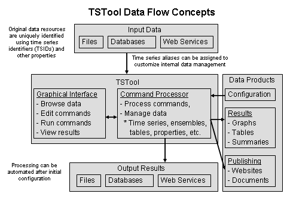
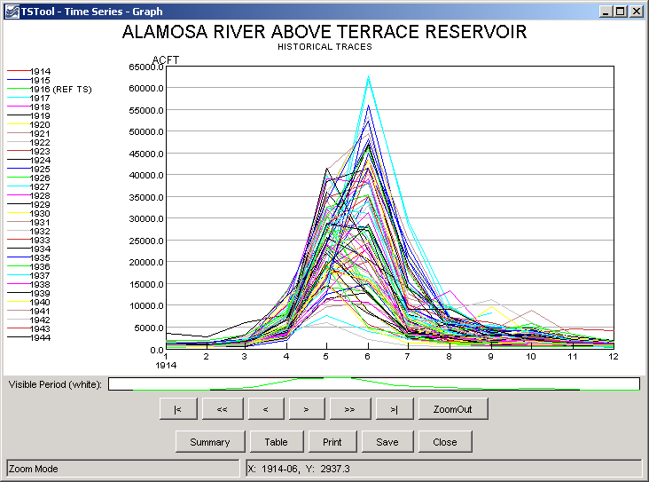

# TSTool / Introduction #

*   [Introduction](#introduction)
*   [TSTool Workflow Concepts](#tstool-workflow-concepts)
    +   [Workflow Overview](#workflow-overview)
    +   [Processor Properties](#processor-properties)
    +   [Using Logic Control Commands and Templates](#using-logic-control-commands-and-templates)
        -   [Logic Control Commands](#logic-control-commands)
        -   [Separate Command Files](#separate-command-files)
        -   [Templates](#templates)
*   [Time Series Concepts](#time-series-concepts)
    +   [Time Series Objects and Identifiers](#time-series-objects-and-identifiers)
    +   [Time Series Aliases](#time-series-aliases)
    +   [Time Series Properties](#time-series-properties)
    +   [Time Series Data Flags](#time-series-data-flags)
    +   [Date/Time Conventions](#datetime-conventions)
    +   [Time Scale for Time Series Data](#time-scale-for-time-series-data)
    +   [Time Series Commands and Processing Sequence](#time-series-commands-and-processing-sequence)
*   [Time Series Ensembles](#time-series-ensembles)
*   [Tables](#tables)
*   [Networks](#networks)

---------------

## Introduction ##

TSTool can be thought of as a time series calculator,
and additionally TSTool processes data tables and to a limited degree spatial data.
TSTool reads, displays, manipulates, analyzes, and writes time series data,
either interactively or in batch (automated) mode.
The TSTool graphical user interface (GUI), also called the user interface (UI)
provides access to viewing and analysis features,
command editors, and provides error feedback.
Time series can be read from and written to a variety of file and database formats.

Although a graphical user interface is provided, the heart of TSTool's analytical features is a command workflow processor.
Depending on the task being performed, the command language may be used extensively or not at all.
This flexibility makes TSTool useful for basic data viewing and advanced analysis.

This User Manual documentation is divided into the following chapters:

Chapter 1 – Introduction (this chapter) provides background information on time series concepts and how TSTool processes time series.

[Chapter 2 – Getting Started](../getting-started/getting-started.md) provides an overview of TSTool interface features.

[Chapter 3 – Commands](../commands/commands.md) provides a summary of time series processing commands.

[Chapter 4 – Tools](../tools/tools.md) provides information about analysis tools.

[Chapter 5 – Examples of Use](../examples/examples.md) provides examples of how TSTool is commonly used.

[Chapter 6 – Quality Control](../quality-control/quality-control.md) provides guidelines and examples for using TSTool to quality control software and data processing workflows.

Chapter 7 – Processing - automate data processing for the following:

*   [Datastore Processing](../processing/datastores/datastores.md) - databases, web services, etc.
*   [Ensemble Processing](../processing/ensembles/ensembles.md) - time series ensembles (e.g., operational scenarios)
*   [File Processing](../processing/files/files.md) - file manipulation
*   [Network Processing](../processing/networks/networks.md) - upstream to downstream networks such as river systems
*   [Objects Processing](../processing/objects/objects.md) - general objects including JSON
*   [Spatial Data Processing](../processing/spatial-data/spatial-data.md) - map interface and processing spatial data
*   [Spreadsheet Processing](../processing/spreadsheets/spreadsheets.md) - spreadsheet integration
*   [Table Processing](../processing/tables/tables.md) - tables from files, databases, etc.
*   [Template Processing](../processing/templates/templates.md) - reusable templates with placeholders for dynamic data
*   [Time Series Processing](../processing/time-series/time-series.md) - any timestamped data
*   [Visualization Processing](../processing/visualizations/visualizations.md) - graphs and other visual information products

[Chapter 8 – Model Framework Integration](../modeling/modeling.md) - provides information about model integration

[Chapter 9 – Troubleshooting](../troubleshooting/troubleshooting.md) - provides troubleshooting information, including a list of obsolete commands.

[Chapter 10 – Best Practices](../best-practices/best-practices.md) - describes best practices for workflows

[Chapter 11 – Resources](../resources/resources.md) - lists additional informational resources

[Training ](../training/overview.md) - provides training lessons with examples

[Reference - Commands ](../command-ref/overview.md) - provides a full list of commands in groups and alphabetical list

[Reference - Datastores ](../datastore-ref/overview.md) - provides a full list of datastores supported by TSTool

[Appendix - Install TSTool](../appendix-install/install.md) - provides information about installing and configuring TSTool.

[Appendix - Release Notes](../appendix-release-notes/release-notes.md) - summarizes TSTool changes over time.

[Appendix - Running TSTool in Various Modes](../appendix-running/running.md) - summarizes how to run TSTool in various modes

[Appendix - Tables](../processing/tables/tables.md) - provides general information about tables

[Appendix - TSView Time Series Viewing Tools](../appendix-tsview/tsview.md) - provides a general reference for time series viewing features.  These features are used throughout TSTool.

[Appendix - GeoView Mapping Tools](../appendix-geoview/geoview.md) - provides a general reference for the GeoView map interface

## TSTool Workflow Concepts ##

This section provides information about workflow concepts.

### Workflow Overview ###

Although TSTool can be used simply to browse and view data,
the main function of TSTool is to automate data processing using a workflow of commands.
The following figure illustrates overall workflow concepts.

**<p style="text-align: center;">

</p>**

**<p style="text-align: center;">
TSTool Data Flow Concepts (<a href="../TSTool_DataFlow.png">See full-size image)</a>
</p>**

Input data are retrieved using unique identifiers,
such as time series and table identifiers.
The TSTool UI is used to browse data, edit commands,
run commands (by calling the command processor), and view results.
The command processor internally manages data including lists of time series,
time series ensembles, tables, and processor properties,
and provides access to the data in interactions with the UI.
The command processor can also output results to files, databases, web services, and can create data products.
Once configured, processing can be automated to run on desktop computers and servers.

The interpretation of input data and definition of workflow and
data products depends heavily on standards and conventions,
some of which are defined by data providers, and some of which are defined by the TSTool design.
Although standards define specific features,
TSTool allows users a great deal of flexibility in defining workflows and producing data products.

### Processor Properties ###

The time series processor performs data management tasks such as tracking the
list of time series and providing requested time series to commands for processing
(using the time series identifier and alias to match time series).
The processor also has an understanding of standard global properties that serve as defaults for all commands,
such as the input and output periods and working directory.
In addition to global properties that are assigned by default,
the [`SetProperty`](../command-ref/SetProperty/SetProperty.md) command can be used to
provide user-specified properties to the processor.
For example, the user might want to define a property corresponding to a folder on the system for data files.
The property then can be used in command parameters to insert the folder name.
The syntax for using a property in a command parameter is:

```
Command(InputFile=”${PropertyName}/filename.ext”)
```

These processor properties should not be confused with time series properties,
which are specific to each time series and are set with the
[`SetTimeSeriesProperty`](../command-ref/SetTimeSeriesProperty/SetTimeSeriesProperty.md) command.
Command editors may be updated over time to provide drop-down choices of defined global properties;
however, the properties are often entered in command editors using the `${Property}` syntax.
After commands are run, properties are shown in the ***Results / Properties*** tab.

The following table lists important standard global properties that can be used in command
parameters that recognize the global properties (refer to specific
command documentation to determine whether a command supports global properties).
The internal representation of each property varies depending on the meaning of the property.
For example, date/times are represented internally as DateTime objects.
Regardless of internal representation, the value is converted to a
string when used in string parameters such as filenames.
Because some data types (such as date/times) can be formatted in a variety of ways,
the default representations (such as the [ISO 8601](https://en.wikipedia.org/wiki/ISO_8601)
`YYYY-MM-DD` representation for dates) is typically used.
The [`FormatDateTimeProperty`](../command-ref/FormatDateTimeProperty/FormatDateTimeProperty.md)
command can be used to format date/time string properties.

**<p style="text-align: center;">
Important Command Processor Global Properties (see the [Full List of Standard Properties](../getting-started/getting-started.md#results-properties))
</p>**

|**Property Name**&nbsp;&nbsp;&nbsp;&nbsp;&nbsp;&nbsp;&nbsp;&nbsp;&nbsp;&nbsp;&nbsp;&nbsp;&nbsp;&nbsp;&nbsp;&nbsp;&nbsp;&nbsp;&nbsp;&nbsp;&nbsp;&nbsp;&nbsp;&nbsp;&nbsp;&nbsp;&nbsp;&nbsp;|**Type**|**Description**|
|--|--|--|
|`CreateOutput`|Boolean|Indicates whether commands should create output files (true) or not (false) – this is useful for speeding processing during initial testing.|
|`InitialWorkingDir`|String|The initial working directory (folder), initially defaulted to the main command file folder.  This property is used with the [`RunCommands`](../command-ref/RunCommands/RunCommands.md) command to help the processor keep track of changing working directories.|
|`InputStart`|DateTime|The global input period start, for read commands.|
|`InputEnd`|DateTime|The global input period end, for read commands.|
|`OutputStart`|DateTime|The global output period start, for commands that create or write time series.|
|`OutputEnd`|DateTime|The global output period end, for commands that create or write time series.|
|`OutputYearType`|String|The output year type, for commands that create or write time series.|
|`WorkingDir`|String|The working directory (folder), initially defaulted to the command file folder.  All other relative paths will be relative to this location.  The [`SetWorkingDir`](../command-ref/SetWorkingDir/SetWorkingDir.md) can be used to modify the value; however, this is not recommended because it can lead to hard-coding paths in command files, which limits portability.|

### Using Logic Control Commands and Templates ###

TSTool processes a workflow of commands sequentially from the first command in the
command file to the last command in the command file.
This is generally appropriate for simple data processing workflows.
However, if processing a large amount of data, it can be cumbersome to create long command files
with repetitive logic.
Consequently, three options, logic control commands, separate command files, and templates, have been implemented
to allow scaling processing for large datasets.
The benefit and downside of using these techniques should be evaluated when implementing command workflows.
Note also that both approaches can be used together.

It is recommended that logic control commands should be used if possible because they are simpler to implement.
Templates are an older approach that are appropriate in some cases.

#### Logic Control Commands ####

TSTool 10.26.00 introduced the
[`If`](../command-ref/If/If.md) command and TSTool 10.31.00 introduced the
[`For`](../command-ref/For/For.md) command.
It has never been the intent of TSTool developers to create a full programming language.
However, these basic commands provide fundamental capability that allow logic control in TSTool command files.
These commands can be used in place of templates in order to
expand a block of command logic to process a list of input data.
The command functionality is limited to simple logic constructs.

The [`If`](../command-ref/If/If.md) and [`For`](../command-ref/For/For.md) commands work by using
processor properties to evaluate and manage the state of processing.
Processor properties are set with the
[`SetProperty`](../command-ref/SetProperty/SetProperty.md) command and
can also be set with a number of other commands.
See the ***Commands /  General – Running and Properties*** command menu and also look for
command parameters used to set a property.
For example, the [`CopyTable`](../command-ref/CopyTable/CopyTable.md) command sets a property
for the row count of the copied table, which is useful for error checks.

The benefits of using logic commands (in particular the [`For`](../command-ref/For/For.md) command) are listed below.

*   Because logic is repeated within the [`For`](../command-ref/For/For.md) and [`EndFor`](../command-ref/EndFor/EndFor.md) command block,
    command files can be much shorter than if using templates.
    Consequently, command files load faster and in most cases also run faster.
*   The syntax of TSTool logic commands is controlled by TSTool editors and
    parameters are edited with command editor dialogs, thereby providing guidance to users.

The downside of using logic commands are listed below:

*   [`For`](../command-ref/For/For.md) commands compress logic into a repeating loop of commands.
    This makes it more difficult to troubleshoot errors.  Additional TSTool features will be added over time to help.
*   There is more reliance on processor properties,
    which cannot be checked until the commands are run.
    Consequently, users may have more difficulty troubleshooting command file logic.

#### Separate Command Files ####

It is often appropriate to separate large workflows into separate major steps.
For example, steps may include downloading data, filling and checking data, running an analysis, and publishing results.

One approach is to split the workflow into multiple command files that can be run independently.
It is recommended that the command file names start with a number such as `01...`, `02...`, `03...`
corresponding to the processing steps.
To run all steps sequentially, a main command file can be created that runs each command file using the
[`RunCommands`](../command-ref/RunCommands/RunCommands.md) command.

The benefits of using separate command files are as follows:

1.  Large workflows are split into more manageable steps.
2.  Separate steps can be run at different frequencies,
    which can be helpful during development and reduce overall processing time.
3.  More complex steps can be isolated in a separate command file,
    which can receive focused attention.

The downside of using separate command files are as follows:

1.  The separate command files may need to repeat some logic, such as initial set-up.
2.  Hand-off of data from one command file to the next requires writing data at the end of one command file
    and reading data in the next command file.
    The [`DateValue`](../datastore-ref/DateValue/DateValue.md) format and other formats
    can be used for this purpose.

#### Templates ####

Templates are text files that include templating language supported by the FreeMarker template library
(see [freemarker.apache.org](https://fremarker.apache.org)).
FreeMarker is used because it is written in Java, as is TSTool, and can be integrated at code level.
Text files can include TSTool command files, TSTool time series product files,
data files, HTML files for websites, and other files.
The [`ExpandTemplateFile`](../command-ref/ExpandTemplateFile/ExpandTemplateFile.md) command
(see the ***Commands / Template Processing*** menu) is used to expand the template into a
final TSTool command file that can be run as usual.
Conceptually the process to expand a template TSTool command file is as follows.

1.  Edit the template file with a text editor, including FreeMarker syntax to implement logic and looping.
    If the template is a TSTool command file, it is helpful to copy and paste commands from the bottom part of command editor dialogs
    and then convert the command to template syntax.
    It is also helpful to develop the core logic of a TSTool command file as usual with TSTool,
    and then edit the command file with a text editor to convert to a template.
    Include FreeMarker syntax as documented in the
    [`ExpandTemplateFile`](../command-ref/ExpandTemplateFile/ExpandTemplateFile.md) command documentation and on the FreeMarker website.
2.  Create a small TSTool command file that includes an
    [`ExpandTemplateFile`](../command-ref/ExpandTemplateFile/ExpandTemplateFile.md) command.
    The purpose of this command file is to process the template command file created in the previous
    step into the final TSTool command file that can be run in the next step.
    The [`ExpandTemplateFile`](../command-ref/ExpandTemplateFile/ExpandTemplateFile.md) command utilizes data from
    the TSTool processor to expand the template, including:
    1.  Processor properties including built-in properties (e.g., global input and output periods)
        and user-defined properties (e.g., set with
        [`SetProperty`](../command-ref/SetProperty/SetProperty.md) command and other commands).
    2.  One-column tables that can be used to iterate in template lists.
        If necessary, one-column tables can be created from larger tables using the
        [`CopyTable`](../command-ref/CopyTable/CopyTable.md) command.
3.  Open and run the expanded TSTool command file to run the final commands.
    Any errors in logic will need to be addressed by editing the template file and re-expanding to the final command file.

The benefits of using a template for a TSTool command file are as follows:

*   The full set of FreeMarker features can be used,
    which provides functionality beyond other options available in TSTool.
    A relatively small template file can be expanded into a file that represents a complete workflow or data product.
*   Because the final file is completely expanded, any errors in that file can be reviewed at the specific location of the error.
    For example, if a block of TSTool commands is reproduced 100 times, an error
    in the 98th block will be very evident because all the commands are present in the final command file.
*   Developing a robust template command file can encompass the primary logic of a workflow.

The downside of using a template for a TSTool command file are as follows:

*   The final expanded command file may be very large.
    Consequently, the file may take a long time to load into TSTool and may actually cause TSTool to run out of memory.
    One reason that TSTool can be slow loading the file is that TSTool runs
    commands in “discovery” mode to ensure that data are correct and can be used by other commands.
    For example, commands that read time series will generally attempt to read the time series
    metadata so that time series can be listed in choices for other commands.  The following work-arounds may be helpful:
    +   Minimize the length of the template command file so as to minimize the length of the expanded command file.
    +   Use the ***File / Open / Command File (no discovery)...*** menu to open the command file.
        This will avoid running the discovery step, which is appropriate since the
        expanded command file should generally not be edited after being auto-generated.
*   The FreeMarker template language syntax may be difficult to understand and master competency.
*   The `${Property}` notation used by FreeMarker conflicts with the similar notation used by TSTool.
    Consequently, where appropriate, the notation needs to be “escaped” by using FreeMarker literal string notation.
    See the [`ExpandTemplateFile`](../command-ref/ExpandTemplateFile/ExpandTemplateFile.md) command documentation for examples.

## Time Series Concepts ##

The following sections provide information about important time series concepts as implemented in TSTool.

### Time Series Objects and Identifiers ###

TSTool handles time series as objects that are read (or internally created),
manipulated, viewed, and output.
Time series data include properties (also referred to as attributes or metadata)
and a series of date/time and data value pairs (and optionally value data flags).
Data generally consist of floating point values;
however, time series may contain other data such as strings or images.
TSTool primarily focuses on numerical time series.
Time series are defined either as regular interval (equal spacing of date/time)
or irregular interval (e.g., infrequent measurements).
Regular time series lend themselves to simpler storage and faster
processing because date/time information only needs to be stored for the endpoints and processing is less complicated.

TSTool defines each time series as having an interval base and multiplier (e.g., `1Month`, `24Hour`).
In many cases, the multiplier is `1` and is not shown in output (e.g., `Month` rather than `1Month` is shown).
In addition to a period of record, interval, and data values, time series properties include:

*   Units (e.g., `CFS`)
*   Data type (e.g., `Streamflow`)
*   Data limits (the maximum, minimum, and other statistics)
*   Description (generally a station or structure name)
*   Missing data value (used internally to mark missing data and trigger data filling,
    typically `NaN` [Not a Number] or a special value such as `-999`)
*   Comments (often station comments, if available)
*   Processing history (a list of comments about how the time series was created and manipulated)

To identify time series in the original data and manage time series internally,
TSTool assigns each time series a time series identifier (TSID) that uses the notation:

```
LocationType:Location.Source.Type.Interval.Scenario[Seq]~InputType~InputName
```

```
LocationType:Location.Source.Type.Interval.Scenario[Seq]~DataStoreName
```

The TSID can be thought of as a unique resource identifier, similar to a URL for web resources.
The first five parts (`Location.Source.Type.Interval.Scenario`) are used to identify
time series within the original data (e.g., to find the time series in a file or database):

*   `LocationType` – optionally used where necessary to uniquely identify locations
    (e.g., use a location type of `Basin` or `Subbasin` where other identifier information
    would result in ambiguous interpretation of the identifier parts
*   `Location` – typically a physical location identifier, such as a station, basin, or sensor identifier.
*   `Source` – a data provider identifier, usually a government or system identifier (e.g., `USGS`, `NWS`),
    necessary because sometimes the provider for a location changes over time or a database may contain time series from multiple data providers
*   `Type` – the data type, typically specific to the data
    (e.g., `Streamflow`, `Precip`) – TSTool does not try to institute global data type definitions).
*   `Interval` – the data interval, indicating the time between data values (e.g., `6Hour`, `Day`, `Irregular`).
*   `Scenario` – an optional item that indicates a scenario (e.g., `Hist`, `Filled`, `Max`, `Critical`).
*   `Seq` – an optional sequence identifier used in cases
    where multiple time series traces in an ensemble may be available,
    with all other identifier information being equal (e.g., for simulations
    where multiple versions of input are used or for cases when a historical
    time series is cut into annual traces, collectively known as ensembles).
    Where historical data are used as input for an analysis,
    the sequence identifier typically is a four-digit year corresponding to the data input start year.

The last part of the TSID after the tilde (`~DataStoreName` or `~InputType~InputName`) indicates input information,
which allows TSTool to locate and read the time series from a file, database, or the internet.
The input information was introduced starting with TSTool version 5.04.00.
The datastore convention was introduced in TSTool version 9.08.00
and is now the default for new data integrations.
The datastore design allows any name to be used to define a datastore,
which allows more flexibility in defining data connections.
The details about datastore configuration are defined in a simple properties file.

See the [Appendix - Datastores](../datastore-ref/overview.md) documentation for a list of datastores
(and input types) that are supported by TSTool.
Datastores are available for databases and web services.
Some datastore configurations are included in the software installation by default
and others must be configured in user files,
potentially requiring additional software to be installed, such as database software.
Legacy input types have been retained for file input and HydroBase database,
and datastores for HydroBase can also be defined.

An example of a time series identifier for a monthly streamflow time series in the State of Colorado's HydroBase is:

```
09010500.USGS.Streamflow.Month~HydroBase
```

The same time series for a USGS NWIS daily streamflow RDB file might be identified using:

```
09010500.USGS.Streamflow.Month~UsgsNwisRdb~C:\Users\user\Downloads\09010500.txt
```

In these examples, the optional scenario (fifth part) and sequence identifier are not used.
TSID strings can be saved in a command file or time series product
description file to used by the
[`ProcessTSProduct`](../command-ref/ProcessTSProduct/ProcessTSProduct.md)
indicate the time series to process.
The TSID with input information allows TSTool to determine
how to access the time series and is useful for managing time series.
The TSTool UI typically handles creation of all time series identifiers;
however, command files can be edited with a text editor.
The path to files can be absolute or relative to the command file.
The latter is recommended to improve portability of files between computers.

TSTool only shows the input type and input name
parts of the identifier when editing read commands.
There are cases where two time series identifiers will be the same except for the input type and name.
In these cases, an alias should be assigned when reading
the time series and the alias used in later commands (see the next section).

### Time Series Aliases ###

Because time series identifiers are somewhat cumbersome to work with,
TSTool allows a time series alias to be used instead.
For example, the following command illustrates how a HydroBase time series can be read and associated with an alias:

```
ReadTimeSeries(Alias=”09010500”,TSID=”09010500.USGS.Streamflow.Month~HydroBase”)
```

The following older syntax was phased out in TSTool version 10.00.00,
and is automatically converted to the above syntax when a command file is read:

```
TS 09010500 = ReadTimeSeries(“09010500.USGS.Streamflow.Month~HydroBase”)
```

If an alias is defined for a time series, the alias will be used instead of the
alias and will be displayed in command editors and results
(although the TSID is often also shown in output).
TSTool ignores upper/lower case when comparing identifiers, aliases,
and other commands, although it is good practice to be consistent.
The general term “TSID”, when used as a command parameter to identify time series to process,
allows a TSID or alias to be specified.

TSTool commands allow the alias to be defined using time series properties.
For example, the parameter `Alias=”%L”` will assign the alias as the
location part of the time series identifier.
A combination of the special formatting strings and literal characters
can be used to create unique aliases for time series.
It is recommended that aliases not contain spaces or other
whitespace and that periods be avoided because they are used in TSIDs.

When defining a series of commands as a workflow to perform a task,
a user generally will develop a rough draft of the process by using TSTool’s
interactive data browsing and command editing features.
However, it is useful to develop a data flow description more identifiers
that are more appropriate than the default TSIDs provided by TSTool.
Consequently, at an appropriate time in the workflow definition,
it is useful to take a step back and review the identifiers being used,
and insert aliases where possible.
For example, an inventory of time series may be defined to describe time series used in a process,
similar to the following (where the bold indicates information that will be replaced with a specific value):

|**Time Series Alias**&nbsp;&nbsp;&nbsp;&nbsp;&nbsp;&nbsp;&nbsp;&nbsp;&nbsp;&nbsp;&nbsp;&nbsp;&nbsp;&nbsp;&nbsp;&nbsp;&nbsp;&nbsp;&nbsp;&nbsp;&nbsp;&nbsp;&nbsp;&nbsp;&nbsp;&nbsp;&nbsp;&nbsp;&nbsp;&nbsp;&nbsp;&nbsp;&nbsp;&nbsp;&nbsp;&nbsp;&nbsp;&nbsp;&nbsp;&nbsp;&nbsp;&nbsp;&nbsp;&nbsp;&nbsp;&nbsp;&nbsp;&nbsp;&nbsp;&nbsp;&nbsp;&nbsp;&nbsp;&nbsp;&nbsp;&nbsp;&nbsp;&nbsp;&nbsp;&nbsp;&nbsp;&nbsp;&nbsp;&nbsp;&nbsp;&nbsp;&nbsp;&nbsp;|**Description**|
|--|--|
|`Location-Streamflow-Month-Original`|Original monthly streamflow.|
|`Location-Streamflow-Month-QC`|Monthly streamflow data after quality control.|
|`Location-Streamflow-Month`|Monthly streamflow data after filling data gaps, ready for analysis.|
|`Location-Streamflow-Year`|Annual streamflow data, accumulated from `Location-Streamflow-Month`.|

By using aliases, it is possible to switch the data inputs with minor changes to the processing logic.
If it is important to indicate the source of information,
such as when comparing the same data stored in two different databases,
then the alias can be defined to include the input name.
Regardless of whether an alias is used,
the original TSID also is maintained with the time series and is available for reports and displays.

In summary, if an alias is assigned to a time series, it will take precedence over the TSID when identifying the time series.

### Time Series Properties ###

Each time series has two types of properties,
which can be accessed using `%`-descriptors (for example, see the
[`SetPropertyFromTimeSeries`](../command-ref/SetPropertyFromTimeSeries/SetPropertyFromTimeSeries.md) command `PropertyValue` parameter)
and in some cases the `${ts:Property}` syntax.
Time series properties are internally managed as:

*   Built-in properties that are common to all time series:
    +   `alias` - alternative to time series identifier
    +   `datatype` - data type such as `Streamflow`
    +   `description` - time series description, often the description for a sensor or location
    +   `interval` - data interval such as `IrregSecond` or `Day`
    +   `tsid` - time series identifier
    +   `units` - data units
    +   more may be added in the future
*   User-defined (dynamic) properties:
    +   Any number of properties is allowed.
    +   Set by various commands including [`SetTimeSeriesProperty`](../command-ref/SetTimeSeriesProperty/SetTimeSeriesProperty.md).
    +   View using the TSTool ***Results / Time Series*** area.  Right-click and view ***Time Series Properties*** and then ***Properties***.

### Time Series Data Flags ###

Time series include a date/time, value, and (optional) data flags.
Irregular interval time series store a date/time for each value and
regular interval time series only store the start and end date/time and an array of values.

Optional data flags are stored with each value and can have zero, one, or multiple characters.
Data flags may be read from the original time series data source
and many commands allow setting the data flag, for example to mark filled data values.
The data flag can be output in some file formats and
can be shown in tabular and graph displays.

### Date/Time Conventions ###

TSTool uses date/time information in several ways:

1.  Data values in time series are associated with a date/time and the precision
    of all date/time information should be consistent within the time series.
2.  The data interval indicates the time spacing between data points and is
    represented as a multiplier (optional if `1`) and a base (e.g., `Day`, `Hour`).
    Consequently 24Hour data has a base interval of `Hour` and a multiplier of `24`.
3.  The period of a time series is defined by start and end date/time values, using appropriate precision.
4.  An analysis period may be used to indicate when data processing should occur.
5.  Output is typically formatted for calendar year (January to December) or water year (October to November).
    Additionally, a year type of `NovToOct` has been implemented to represent
    November to October and additional similar year types may be implemented in the future.
    Calendar year is the default but can be changed in some commands.

A date/time has a precision.  For example, `2002-02` has a monthly precision and `2002-02-01` has a daily precision.
Each date/time object knows its precision and “extra” date/time
information is set to reasonable defaults but generally are not used
(e.g., hour, minute, and second for a monthly precision date/time are set to zero and the day is set to 1).
The date/time precision is important because TSTool uses the date/time
objects to iterate through data, to compare dates, and to calculate a plotting position for graphs.
Specifying date/time information with incorrect precision may cause inconsistent behavior.

The TSTool documentation and user interface typically use
[ISO 8601 International Standard formats](https://en.wikipedia.org/wiki/ISO_8601) for date/time information.
For example, dates are represented using `YYYY-MM-DD` and times are represented using `hh:mm:ss`.
A combined date/time is represented as `YYYY-MM-DD hh:mm:ss`.
In order to support common use, TSTool also attempts to handle date/time
formats commonly used in the United States and other locales.
In such cases, the length of the date/time string and the position of special
characters are used to make a reasonable estimate of the format.
Using ambiguous formats (e.g., two-digit years that may be confused with months) may cause errors in processing.
Adhering to the ISO 8601, standard formats will result in the fewest number of errors.
The input type and datastore appendices discuss date/time issues with various data formats.

Plotting positions are computed by converting dates to floating point values,
where the whole number is the year, and the fraction is the fractional part of the year, considering the precision.
The floating-point date is then interpolated to screen pixels or page coordinates.
In most cases, the high-precision date/time parts are irrelevant because they default to zero.
However, in some cases the precision can impact plots significantly.
For example, when plotting daily and monthly data on the same graph,
the monthly data will be plotted ignoring the day whereas the daily values correspond days 1 to 31.
The ability to plot monthly data mid-month or end-of-month has not been implemented.
The [TSView Time Series Viewing Tools Appendix](../appendix-tsview/tsview.md) provides examples of plots.

The date/time precision is very important when performing an analysis
or converting between time series file formats.
For example, a file may contain 6Hour data using a maximum hour of 24 (e.g., `6`, `12`, `18`, `24`).
When reading this data, TSTool will convert the hour 24 values to hour 0 of the next day.
Consequently, the hour and day of the original data will seemingly be shifted,
even though the data are actually consistent.
This shift may also be perceived when converting from hourly data to daily
data because the hour can have a value of `0` to `23`, whereas days in the month start with `1`.
The perceived shift is purely an artifact of time values having a minimum value of zero.
Some commands will allow an automatic conversion of 24Hour interval data to Day interval data to avoid hour offset issues.

TSTool understands leap years and days per month.
Consequently data formats that do not properly implement leap years or simplify time
by assuming a constant number of days per month may result in missing values in data when read into TSTool.

TSTool does have the capability to handle time zone in small interval (hour, minute) data.
However, fully representing time zone and daylight savings offsets is
somewhat complex and TSTool for the most part does not perform time zone conversions or normalization.

Input formats that have different conventions are handled by converting the data to
TSTool conventions when reading the data and converting from TSTool conventions when writing the data.

### Time Scale for Time Series Data ###

The time scale for time series data gives an indication of how data values were measured or computed.
The time scale is generally determined from the data type (or the data type and interval)
and can be one of the following (the abbreviations are used in some software parameters such as the
[`ChangeInterval`](../command-ref/ChangeInterval/ChangeInterval.md) command):

*   Instantaneous (`INST`):  The data value represents the data observed at
    the time associated with the reading (e.g., instantaneous temperature, streamflow, or snow depth).
    Instantaneous data may be of irregular or regular interval, depending on the data collection system.
    If irregular, the precision of the date/time associated with the reading may vary (e.g.,
    automated collection systems may have very precise times whereas
    infrequently recorded field measurements may only be recorded to the day).
*   Accumulated (`ACCM`):  The data value represents the accumulation of the observed data over the preceding interval.
    The date/time associated with the data value corresponds to the end of the interval.
    For example, precipitation (rain or snow recorded as melt) is often recorded as an accumulation over some interval.
    Accumulated values are typically available as a regular time series,
    although this is not a requirement (e.g., accumulated precipitation might by measured by a sensor with date/time reflecting a change in the value).
    For interval time series, a statistic may be used, such as `Total`.
*   Mean (`MEAN`):  The data value represents the mean value of observations during the preceding interval.
    The date/time associated with the data value corresponds to the end of the interval.
    The mean includes values after the previous timestamp and including the current timestamp.
    The computation of mean values may be different depending on whether the original data are irregular or regular.
    For example, if the original data are regular interval,
    then equal weight may be given to each value when computing the mean (a simple mean).
    If the original data are irregular interval, then the weight given to each irregular
    value may depend on the amount of time that a value was observed (a time-weighted mean, not a simple mean).
    For regular interval time series,
    other statistics may be used (e.g., `Median`, `Min`, `Max`).

Without having specific information about the time scale for data, TSTool assumes that all irregular interval time series are instantaneous for displays,
and regular interval data use the date/time as end of the interval.
If time series are graphed using bars, an option is given to display the bar to the left,
centered on, or to the right of the date/time.
If time series are graphed using lines or points, the data values are drawn at the date/time corresponding to data values.
In most cases, this default is adequate for displays.
Graphing data that have different time scales together may result in visual inconsistencies.
Graphs can be configured to connect points or use a step.

The time scale is important when changing the time interval of data.
For example, conversion of instantaneous data to mean involves an averaging process.
Conversion of instantaneous data to accumulated data involves summing the original data.
Commands that change interval either operate only on data of a certain time scale or
require that the time scale be specified to control the conversion.
Refer to the command documentation for specific requirements.

Input formats that have different conventions are handled by converting the
data to TSTool conventions when reading the data and converting from TSTool conventions when writing the data.

### Time Series Commands and Processing Sequence ###

Although TSTool can be run in batch mode (see the [Getting Started](../getting-started/getting-started.md) chapter),
it is possible to perform all time series viewing and manipulation within the UI.
Commands are used to read, manipulate, and output time series.
Commands are processed sequentially from the first to the last commands using the steps described below.
This section describes in detail the processing sequence.
See the examples in the [Examples of Use](../examples/examples.md) chapter for illustrations of the processing sequence.

TSTool commands fall into several categories:

1.  Time series identifiers (see [Time Series Objects and Identifiers](#time-series-objects-and-identifiers)),
    which are equivalent to time series “read” commands (where the identifier
    input type or datastore is used to determine how to read from the original data format)
2.  General commands, which are used to set properties like the period
    for output, and control processing such as [`If`](../command-ref/If/If.md) and [`For`](../command-ref/For/For.md) commands
3.  Time series commands, which are used to read and manipulate time series and output results
4.  Ensemble commands, which process ensembles of time series,
5.  Table commands, which process tables of information.

Commands are processed sequentially and can be repeated as necessary.
A typical user starts learning TSTool by performing simple queries and
displaying results while gradually utilizing more commands.  Command syntax is as follows:

```
Command(Param1=Value1,Param2=”Value”,...)
```

Values that may contain spaces or commas are normally surrounded by double quotes.
This notation is useful for the following reasons:

*   The parameter names are included in the command, which makes the command more readable as text.
*   Because the parameter name is included, the parameters can be in any order.
    The command editor dialogs will enforce a default older.
*   Parameters that have default values can be omitted from the parameter list, shortening commands.
*   New parameters can be added over time, without requiring parameter order to change in existing commands.

Older commands used a fixed notation where parameters were required to be in a specific order.
TSTool will attempt to update older command syntax to the current syntax when a command file is read.
The [Command Reference](../command-ref/overview.md) describes each command’s function and parameters.

The following sequence occurs when processing commands:

#### 1. Check the command for run-time initialization errors. ####

Commands initially are parsed when a command file is opened or new commands are added in the UI.
When commands are run, additional checks are performed based on run-time data,
such as the period that has been specified for the run.  Example commands are shown below.
If the command results in reading or creating a time series, step 3 is executed, as described below.

```
# Example commands
08235350.USGS.Streamflow.Month~HydroBase
08236000.DWR.Streamflow.Month~HydroBase
Add(TSID=”08235350.USGS.Streamflow.Month”,HandleMissingHow=IgnoreMissing,TSList=SpecifiedTSID,AddTSID=”08236000.DWR.Streamflow.Month”)
08235350.USGS.Streamflow.Month~HydroBase
```

#### 2. Read or create time series. ####

TSTool recognizes that certain commands should read or create a new time series and will perform the appropriate action.
For example, in the above example, the time series identifier
`08235350.USGS.Streamflow.Month~HydroBase` indicates that the corresponding
time series should be read from a HydroBase database.
The input type in the identifier (information after the `~`)
is used to determine how to read the time series.
By default, the entire time series will be read unless the
[`SetInputPeriod`](../command-ref/SetInputPeriod/SetInputPeriod.md) or
[`SetOutputPeriod`](../command-ref/SetOutputPeriod/SetOutputPeriod.md) commands have been specified.

1.  Read data.  If the input type, and if needed, input name, are specified in the identifier,
    they are used to read the data.   Time series properties such as units are assigned.
2.  Compute data limits.  The time series data limits are computed because they may be needed later for filling.
    This information includes the long-term monthly averages.  These limits are referred to as the original data limits.
3.  Save time series in processor.  The time series that are read or created are managed by the processor,
    using the TSID and alias.  The time series can then be manipulated by other commands, as per the following step.

#### 3. Manipulate time series or other data. ####

Commands that manipulate time series (fill, add, etc.)
do not automatically read the time series or make another copy.
Instead, time series that are in memory are located using the TSID or
alias and are manipulated as per the command functionality.
The following example illustrates how the time series identified by `08235350.USGS.Streamflow.Month`
has its data values modified by adding the data from the time series identified by `08236000.USGS.Streamflow.Month`.

```
# Example commands
08235350.USGS.Streamflow.Month~HydroBase
08236000.DWR.Streamflow.Month~HydroBase
Add(TSID=”08235350.USGS.Streamflow.Month”,HandleMissingHow=IgnoreMissing,TSList=SpecifiedTSID,AddTSID=”08236000.DWR.Streamflow.Month”)
08235350.USGS.Streamflow.Month~HydroBase
```

To locate a time series so that it can be modified,
TSTool first checks the alias of time series (those that have been read or created in previous commands)
against the current time series of interest (`TSID=”08235350.USGS.Streamflow.Month”`),
assuming that this string is an alias.
If the alias is not found, it checks the full identifier of known time series against the current time series of interest.
In this example, time series `08235350.USGS.Streamflow.Month` was read in the
first step and is therefore found as a match for the identifier.
Similarly, the second time series in the command (`08236000.USGS.Streamflow.Month`)
is found and is used to process the command, resulting in a modification of the first time series.
Sequential manipulations of the same time series can occur (e.g., fill by one method, then fill by another).

TSTool commands generally use the TSList parameter to locate time series in memory,
where the default value depends on the command.  For example, `TSList=AllTS` will process all time series.
For commands that require a single input time series, TSTool often will default to `TSList=LastMatchingTSID`,
which finds the first time series prior to the current command.
It is possible to create more than one time series with the same identifier
while allowing localized processing of each time series.
For example, the time series identified by `08235350.USGS.Streamflow.Month~HydroBase` is read twice,
once to be acted on by the [`Add`](../command-ref/Add/Add.md) command,
and once with no manipulation (e.g., to compare the "before" and "after").
However, this may lead to confusion and generally should be avoided
by using unique identifiers for each time series that is being processed.

During processing, extra time series can accumulate and will be available for output.
Use the [`Free`](../command-ref/Free/Free.md) command to free time series that are no longer needed.
This removes the time series from memory.
Output commands also may use the TSList parameter to indicate which time series are to be output.

#### 4. After processing the time series, a list of available time series that are in memory are listed in the UI. ####

One or more of these time series can be selected and viewed using the ***Results*** menu or analyzed using the
***Tools*** menu (also right click on time series listed in the results menu at the bottom of the main window).
Time series also can be saved in some of recognized input type formats using the ***File / Save / Time Series*** As menus.

If running in batch mode using the `-commands` option, all of the above
steps occur in sequence and the UI is not displayed.
Processing the example shown above results in three time series in memory:

1.  A time series identified by `08235350.USGS.Streamflow.Month`, containing the sum of the two time series.
2.  A time series identified by `08236000.DWR.Streamflow.Month`,
    containing the input to the [`Add`](../command-ref/Add/Add.md) command.
3.  A time series also identified by `08235350.USGS.Streamflow.Month`,
    containing the original data from the time series that is added to.
    This contains the original data because a time series identifier by itself in a command list will cause the time series to be read.

These time series can be graphed or saved in an output file.

## Time Series Ensembles ##

A time series ensemble is a group of related, typically overlapping, time series.
Ensembles can be used to manage related scenarios (e.g., input and results of model scenarios)
or as a way of shifting a historical time series so that years overlap.
Many commands operate on a list of time series by using the parameters
`TSList=EnsembleID` and `EnsembleID=”SomeID”`.
Statistics time series can be derived from ensembles,
for example to calculate the average condition over time (although care must be taken in
whether this can be interpreted as a time series of related values,
for use as input to a process).
Ensembles are assigned unique identifiers and are displayed at the
bottom of the TSTool main window in the Ensembles results tab.
Each time series in an ensemble is also available for individual processing and is listed in the Time Series results tab.
Time series in ensembles often have a `[Seq]` sequence identifier in the TSID
corresponding to the starting year of the ensemble trace time series,
or other unique identifier.

The following figure illustrates an ensemble of annual time series created from a long historical time series.

**<p style="text-align: center;">

</p>**

**<p style="text-align: center;">
Example Ensemble Plot Showing Historical Years (<a href="../TSView_Graph_Traces.png">see full-size image)</a>
</p>**

In general, ensembles provide a way to process a group of time series.
Refer to the command reference for specific features and limitations related to ensemble processing.

## Tables ##

TSTool is able to process tabular datasets.
See the ***Commands(Table)*** menu commands and ***Results / Tables*** tab.

Tables correspond to:

*   database query results
*   delimited and fixed-format text files
*   time series viewed as a date/value table
*   attribute table associated with a spatial data layer

Each table has properties, including:

*   unique text identifier, which is used by commands to request and save the table in the processor
*   column metadata:
    +   name (used in table views and output files for column heading)
    +   type (single values or array of values, corresponding to common database, JSON, and other format types):
        -   `boolean`
        -   `datetim`e
        -   `double`
        -   `float`
        -   `integer`
        -   `long` (integer)
        -   `short` (integer)
        -   `string`
    +   precision (number of digits after the decimal, for double and float types)
    +   width (characters used for output)

TSTool generally assumes that table cells within a column are consistent with the column type.
If command processing results in cell values that are different from the column data type,
the TSTool UI and commands may generate warnings or may be able to handle type conversion.

Similar to time series data values, table cell values may contain missing values indicated by `null`,
or special values like `NaN` for floating point values,
which are handled in views, output, and calculations.

Floating point values use default formatting,
for example precision based on data units or a default precision.
Date/times use default formatting, typically [ISO 8601](https://en.wikipedia.org/wiki/ISO_8601) format.

## Networks ##

TSTool is able to process hierarchical networks such as converging river networks.
See the ***Network Processing*** menu commands and ***Results / Networks*** tab.
Networks are defined using a simple node identifier and downstream identifier convention as shown in the following figure.
See the [`CreateNetworkFromTable`](../command-ref/CreateNetworkFromTable/CreateNetworkFromTable.md) command.
Time series are associated with the nodes in the network.

**<p style="text-align: center;">

</p>**

**<p style="text-align: center;">
Network Definition Input Table (<a href="../../command-ref/AnalyzeNetworkPointFlow/AnalyzeNetworkPointFlow_InputTable.png">see full-size image</a>)
</p>**

The time series associated with a network can be analyzed,
for example to perform a point flow analysis,
and can be used to visualize data.
