# TSTool / Spatial Data Processing #

This documentation describes TSTool integration with spatial data.

*   [Introduction](#introduction)
*   [Commands](#commands)
*   [TSTool User Interface](#tstool-user-interface)
*   [Examples](#examples)
*   [TSTool Map Interface](#tstool-map-interface)
    +   [Time Series and Map Layer Relationships](#time-series-and-map-layer-relationships)
    +   [Opening a Map](#opening-a-map)
    +   [Using Time Series to Select Locations on the Map](#using-time-series-to-select-locations-on-the-map)
    +   [Using Locations on the Map to Select Time Series](#using-locations-on-the-map-to-select-time-series)
    +   [Spatial Analysis Commands](#spatial-analysis-commands)

------------

## Introduction ##

TSTool can be used to automate spatial data processing to a limited degree.
TSTool is not intended to replace geographic information system (GIS) software but does
provide useful functionality for common spatial data processing tasks.

Example use cases include:

*   reading spatial data tabular data from shapefile `.dbf` file
*   creating GeoJSON, KML, and shapefiles files from tables and time series
*   processing GeoJSON files as objects

## Commands ##

Spatial data processing commands are found in the ***Commands / Spatial Data Processing*** menu.

Properties (attributes) associated with spatial data layer features can be determined
by processing table and time series data, and then outputting in standard spatial data formats.

## TSTool User Interface ##

The ***Results / Output Files*** tab lists spatial data output files that are created when processing commands.
Click on an output file to view.

Spatial data files must be viewed with appropriate software,
such as ArcGIS, QGIS, or web mapping tools.

## Examples ##

See the ***Examples*** section of command documentation.

## TSTool Map Interface ##

Although the main focus in TSTool is time series,
many time series are associated with a location such as a station, area, or sensor.
This chapter discusses the relationship between time series and spatial data and
provides an overview of using map-related features in TSTool.
Time series concepts (such as time series identifiers) are discussed in detail in
[the Introduction chapter](../../introduction/introduction.md).
 Information about the built-in map display tool used in TSTool is provided in the
[GeoView Mapping Tools Appendix](../../appendix-geoview/geoview.md).

The map capability in the TSTool user interface is limited and has not been fully developed.
However, commands related to tables can be used to link time series to tables, for example:

*   the [`ReadTableFromDBF`](../../command-ref/ReadTableFromDBF/ReadTableFromDBF.md) command can be used to
    read the attribute data from an Esri shapefile and attributes can be attached to time series using the
    [`SetTimeSeriesPropertiesFromTable`](../../command-ref/SetTimeSeriesPropertiesFromTable/SetTimeSeriesPropertiesFromTable.md) command
*   similarly, it is possible to use commands like
    [`CalculateTimeSeriesStatistic`](../../command-ref/CalculateTimeSeriesStatistic/CalculateTimeSeriesStatistic.md),
    save to a table, and then join the table in a spatial data layer using GIS tools
*   time series read from sources that provide location data typically have properties
    set during the read and these properties can be copied to a table with
    [`CopyTimeSeriesPropertiesToTable`](../../command-ref/CopyTimeSeriesPropertiesToTable/CopyTimeSeriesPropertiesToTable.md),
    the table can be written using
    [`WriteTableToDelimitedFile`](../../command-ref/WriteTableToDelimitedFile/WriteTableToDelimitedFile.md),
    and then the file can be used by GIS software as a point layer

It also is often possible to perform selections of time series based on spatial constraints,
simply by using available attributes.
For example [USGS NWIS web services](../../datastore-ref/USGS-NWIS-Daily/USGS-NWIS-Daily.md)
allow querying by county name and Hydrologic Unit Code.
Of course, this requires that the locational properties for time series are available.

The remainder of this chapter describes map-related features and concepts.
Future TSTool enhancements will build on features described in the above paragraph
in order to allow automated processing of map data and products (similar to how the
[`ProcessTSProduct`](../../command-ref/ProcessTSProduct/ProcessTSProduct.md) command processes time series products).

### Time Series and Map Layer Relationships ###

An example is useful to provide an overview of the relationship between time series and map layers.  

Map layers often indicate physical features (e.g., rivers, cities, roads, data collection stations)
or features that are overlaid on physical features (e.g., political boundaries,
weather fronts, regions or points of interest).  A layer’s data consist of:

1.  Features – the coordinate information that defines the shape on the map.
2.  Attributes – a tabular list of data values associated with the features.
3.  Metadata – data about the layer, including the source, coordinate system, history, etc.
4.  Projection – the coordinate system for the coordinates, which is usually noted in metadata but may also be indicated by a projection file or similar.
5.  Symbology – the symbol information for each layer (e.g., point symbol, line width, polygon fill color), labels, and other visualization information.

The features and attributes are the primary data, and the other information facilitates using the features and attributes.

Consider a data collection station, represented by a point on the map.
This station may be located near a river and collect streamflow stage (water depth).
The station software may convert the stage to flow or may allow this to be done by other software.
The station also may collect “climate” (meteorological) data such as precipitation, temperature, wind speed and direction, etc.
Each measurement type requires a sensor and the cost of hardware typically
controls the number and sensitivity of measuring devices.
For data management, the station is typically assigned an alphanumeric station identifier
and each data type that is collected is assigned an alphanumeric data type.
The data are saved locally as date/value information and are then transmitted to or requested from a data collecting system.
The date/value information is essentially time series.
Data units and handling of missing data are considered during implementation of data collection systems.
Measurements may be taken regularly (e.g., once every fifteen minutes) or may occur at irregular intervals,
perhaps in response to some change in conditions.
In nomenclature used with TSTool, the former are called regular time series and the latter irregular,
reflected by the data interval (time step).

For the discussion purposes, consider only a meteorological station that measures precipitation and temperature.
For mapping purposes, a choice may be made to focus on the physical nature of the map,
in which case a single “Met Stations” (or  “Climate Stations”) layer may be shown, using a single symbol.
This is suitable if the measurement types for such a station are
consistent throughout a system or only one data type is of interest.
It is frequently the case that the real-time data that are collected are managed in a database,
with data being archived over time, for example resulting in the following time series for precipitation data:

1.  Real-time data (often provisional data available for a short period).
2.  Real-time extended data – real-time data collected for the past year, for example, having received limited or no quality control
3.  Real-time archived data – real-time data for the historical period, quality controlled
4.  Hourly accumulation – for example, convert real-time precipitation data to hourly totals
5.  Daily accumulation – for example, convert hourly precipitation data to daily totals
6.  Monthly accumulation – etc.
7.  Yearly accumulation – etc.

The first two examples are often referred to as “real-time” data whereas the last
five examples are often referred to as “historical” data.  In a system that is homogeneous,
a map layer that shows “Precipitation Stations” will imply that all of the above time series are available at the station.
However, in a system where, for various reasons,
not all stations have real-time and historical data, more attention to detail may be needed on maps.

To address this case, the map could show separate layers for real-time and historical stations (two layers).
However, this does not address the issue that there may be multiple categories
of real-time data and multiple categories of historical data.
To address this issue, additional layers might be added for each time series type,
using the same or similar symbols for each layer.
The limitation in this approach is that the map now has many layers
and many of the points will be the same and will therefore symbols will plot on top of each other.

Layered symbols can be used to help with visualization.
For example, use the symbol size and shape, and configure the order of layers
to ensure that multiple symbols drawing on each other will still allow sufficient visibility of the symbols.
This can be applied to indicate data types collected at a location, and also data type/interval information.
The following example shows this approach to indicate station type:

**<p style="text-align: center;">
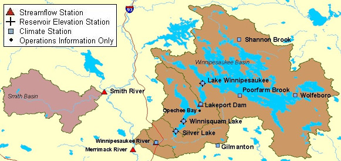
</p>**

**<p style="text-align: center;">
Example of Symbol Layering (<a href="../SymbolExample.png">see full-size image</a>)
</p>**

Using many layers and symbols to indicate time series data interval may not be
appropriate if the symbols are to be used for classification.
For example, the symbol size or color may indicate a physical characteristic of the feature.
For this reason and because maps usually focus on physical features,
using symbols to indicate the various data intervals is not common.
More common are maps that show a layer for real-time data and a layer for historical data,
as shown in the following figure:

**<p style="text-align: center;">
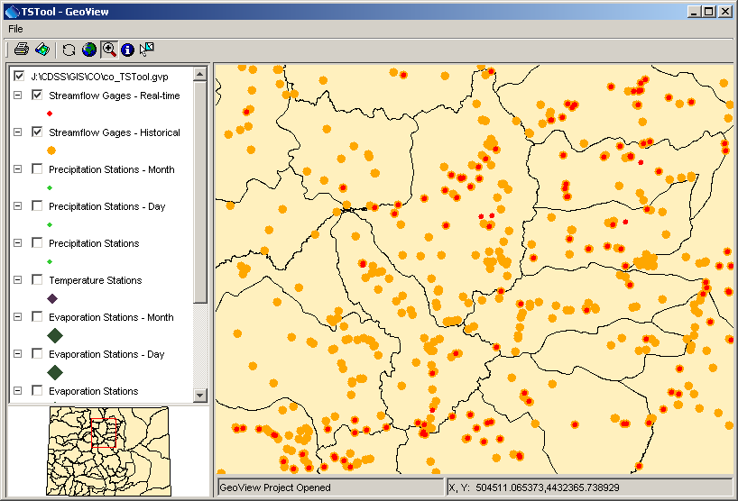
</p>**
 
**<p style="text-align: center;">
Example Map Showing Real-time and Historical Data Layers (<a href="../GeoView_StreamSymbols.png">see full-size image</a>)
</p>**

The map is useful because the user and software can determine where
real-time time series SHOULD be available, and where historical data SHOULD be available.
The mapping tools can be integrated with application software by
hard-coding the data type and interval for real-time and historical data or use a
configuration file (e.g., to indicate that “historical” data should always have an interval of Month).  

TSTool is a generic tool and therefore configuration information is required to
make the link between the map layers and time series.
The approach that has been taken is to rely on a delimited lookup file,
which allows users to determine at what level to categorize map layers.
More specific information allows a more specific link (i.e.,
a time series in TSTool can be matched with a specific feature in a map layer)
while less information results in a looser link (i.e., several time series in
TSTool may match one station and selecting the station may result in more than one time series).

The following example illustrates the time series to map layer configuration file:

```text
# This file allows time series in TSTool to be linked to stations in spatial
# data layers.  The columns are used as appropriate, depending on the direction
# of the select (from time series list or from the map).
#
# This file has been tested with the \CDSS\GIS\CO\co_TSTool.gvp file.  Not all
# possible combinations of time series and map layers have been defined - only
# enough to illustrate the configuration.
# Additional attributes need to be added to the point files to allow more
# extensive functionality.  For example, if attributes for data interval (time
# step) and data source are added to the attributes, then a definition query
# can be defined on the layer for displays to use the same data file.  The
# configuration below can then use the different names to configure the link
# to time series.
#
# This file is discussed in the TSTool documentation.
#
# TS_InputType - the time series input type, as used in TSTool
# TS_DataType - the data type shown in TSTool, specific to an input type
#                For example, TSTool uses "Streamflow" for HydroBase, whereas
#                for other input types a different data type string may be used.
# TS_Interval - time series interval of interest (e.g.,"Month", "Day", "1Hour"
#                "Irregular")
# Layer_Name - the layer name used in the map layer list
# Layer_Location - the attribute that is used to identify a location, to be
#                matched against the time series data location
# Layer_DataType - the attribute that is used to indicate the data type for a
#                station's time series (CURRENTLY NOT USED - UNDER EVALUATION)
# Layer_Interval - the attribute that is used to indicate the interval for a
#                station's time series
# Layer_DataSource - the attribute that is used to indicate the data source for
#                a station's time series.
#
# When matching time series in the TSTool time series query list with features
# on the map, the TS_* values are matched with the time series identifier
# values and the Layer_* attributes are matched against specific time series.
#
# Data layers are listed from largest interval to smallest.
"TS_InputType","TS_DataType","TS_Interval","Layer_Name","Layer_Location","Layer_DataSource"
HydroBase,DivTotal,Day,"Diversions",id_label_7,””
HydroBase,DivTotal,Month,"Diversions",id_label_7,””
HydroBase,EvapPan,Day,"Evaporation Stations",station_id,””
HydroBase,EvapPan,Month,"Evaporation Stations",station_id,””
HydroBase,Precip,Irregular,"Precipitation Stations",station_id,””
HydroBase,Precip,Day,"Precipitation Stations",station_id,””
HydroBase,Precip,Month,"Precipitation Stations",station_id,””
HydroBase,RelTotal,Day,"Reservoirs",id_label_7,””
HydroBase,RelTotal,Month,"Reservoirs",id_label_7,””
HydroBase,Streamflow-DISCHRG,Irregular,"Streamflow Gages - Real-time",station_id,””
HydroBase,Streamflow,Day,"Streamflow Gages - Historical",station_id,””
HydroBase,Streamflow,Month,"Streamflow Gages - Historical",station_id,””
```

**<p style="text-align: center;">
Example Time Series to Map Layer Lookup File
</p>**

The intent of the file is to allow lookup of map layers from time series and to
allow lookup of time series from map layers.
The ability to perform these actions depends on the number of layers in the map and the attributes in map layers.
For example, in the last two lines of the above example,
historical streamflow time series are both linked to a single “Streamflow Gages – Historical” layer on the map.
Consequently, it will not be possible from the map layer to indicate to TSTool
that specifically day or month interval data are requested (both daily and monthly time series would be selected).
This behavior may be appropriate, or more specific layers and attributes may be needed.
Multiple maps are typically needed, in order to meet all the various needs
of users and therefore maps with more detail may need to be configured for use with TSTool.

The following sections describe more specifically how to utilize the links between time series and map layers.

### Opening a Map ###

To open a map in TSTool, first select the ***View / Map*** menu item, which will display the following window.

**<p style="text-align: center;">
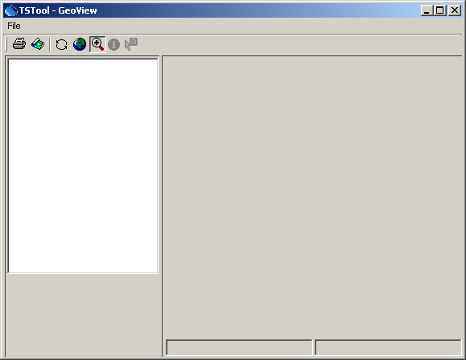
</p>**

**<p style="text-align: center;">
Map (GeoView) Window when First Opened (<a href="../GeoView_Window_Blank.png">see full-size image</a>)
</p>**

In this window, select ***File / Open Project*** and select a GeoView Project File (`*.gvp`), as shown below.

**<p style="text-align: center;">
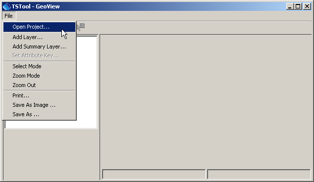
</p>**

**<p style="text-align: center;">
Opening a Map (GeoView Project) File (<a href="../GeoView_Window_OpenProject.png">see full-size image</a>)
</p>**

The format for a GVP file is described in the [GeoView Mapping Tools Appendix](../../appendix-geoview/geoview.md).
The file is a simple text file that can be manually edited.
Although using an Esri `*.mxd` or other file was considered,
such file formats have been changing, are binary, and are proprietary in nature.

After opening the GVP file, a map will be displayed and the TSTool
***Tools / Show on Map*** button will be enabled when appropriate.

### Using Time Series to Select Locations on the Map ###

To select time series on the map, first select time series in the upper part of the
TSTool interface and then select the
***Tools / Select*** on Map menu item, as illustrated in the following figure:
 
**<p style="text-align: center;">
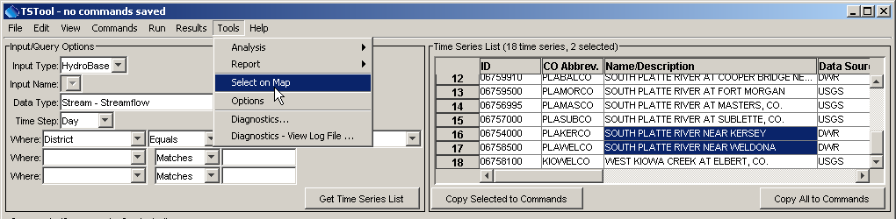
</p>**

**<p style="text-align: center;">
Example of Selecting Time Series on the Map (<a href="../Menu_Tools_SelectOnMap.png">see full-size image</a>)
</p>**

Note that in the above example,
the selection is initiated from the time series input/query list
(not the time series results at the bottom of the TSTool main window).
The latter may be implemented in the future; however,
it is faster to use the input/query list because only time series header information is processed.
When ***Tools / Select on Map*** is selected, features on the map are selected as follows:

1.  The software tries to find appropriate map layers by matching the lookup file
    `TS_DataType` and `TS_Interval` column values with the ***Data Type*** and ***Time Step*** values in the input/query list.  
2.  The resulting layers (indicated by ***Layer_Name***) are searched to match the ID
    (and optionally Data Source) values in the input/query time series list with
    the attributes indicated by the `Layer_Location` and `Layer_DataSource` lookup file
    (`Layer_Interval` can also optionally be used).
3.  Matching features are selected and the map zooms to highlight the features,
    as shown in the following figure (the arrows have been added for illustration).

**<p style="text-align: center;">
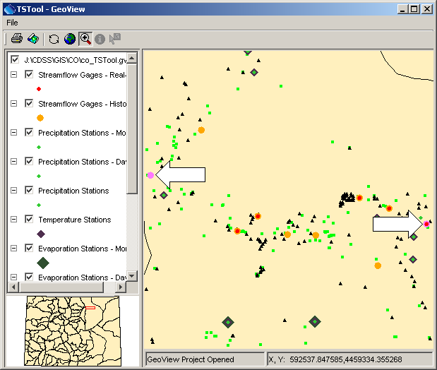
</p>**

**<p style="text-align: center;">
Map after Using Time Series to Select Features (<a href="../Menu_Tools_SelectOnMap2.png">see full-size image</a>)
</p>**

If the lookup file does not include a `Layer_DataSource`, then this value is ignored in the search.
Once selected on the map, users can evaluate the significance of the distribution of stations,
etc. and can use other map features.

To support this functionality, the attributes for the layer should include a column for the location identifier,
and optionally the data source, where the values match the values shown in TSTool.
Additionally providing an attribute for data interval allows another level of selection.
In this case, the intervals in the attributes must match those shown in TSTool.
Providing all information will result in record-level queries that allow a direct link between a time series and a layer.

### Using Locations on the Map to Select Time Series ###

To select time series from the map:

1.  Perform a time series query to create a list of time series (see the previous section for an example).
    **The map can be used to select time series in this list,
    but selecting from the map will not initiate a database query or file read.
    This is because the variety of input types that TSTool
    supports require specific information to query/read time series.**
2.  Select a layer of interest on the map.
    This layer should correspond to time series in the list from the first step.
    For example, if the time series list contains daily streamflow time series,
    select the map layer that corresponds to such data.  For example:<br><br>
    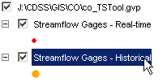<br>
3.  Activate the select tool on the map interface toolbar:<br><br>
    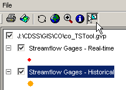<br>
4.  Draw a box around features of interest on the map.
    The software will attempt to match the features in the time series list in the TSTool main window.
    To do so, it first matches the layer name with the similar value in the lookup file.
    It then tries to match the ID (and optionally ***Data Source***) values in the
    input/query time series list with the attributes indicated by the `Layer_Location` and
    `Layer_DataSource` lookup file (`Layer_Interval` can also be used).
    Matched time series are selected in the list.
    Previous selections are not cleared – use the right click popup menu to clear selections first if appropriate.<br><br>
    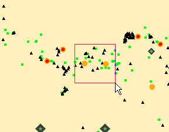<br>
    **<p style="text-align: center;">
    Selecting Features on the Map
    </p>**
    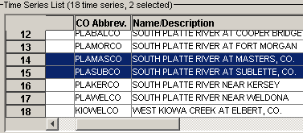<br>
    **<p style="text-align: center;">
    Time Series List After Select from Map<br>
    </p>**
5.  Once time series have been matched,
    the information can be copied to the commands area for further processing.
    This capability is therefore useful for identifying available data for an area.

If not all selected features in a layer correspond to time series, a warning similar to the following may be shown:
 
**<p style="text-align: center;">
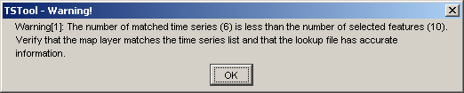
</p>**

**<p style="text-align: center;">
Selection Warning
</p>**

This may indicate that the attributes in the spatial data are not detailed enough to do the lookup.
For example, a data source attribute may exist but may only apply to one data interval
(e.g., real-time instead of historical data types).
A sufficient combination of layers and attributes in layers can avoid or minimize such problems.

The above procedure is not completely robust in that the user may select
a layer that does not match the time series list.
Additional features are being considered to minimize this possibility.
However, the use of the map interface is considered an advanced feature and some reliance is made on a user’s capability.
