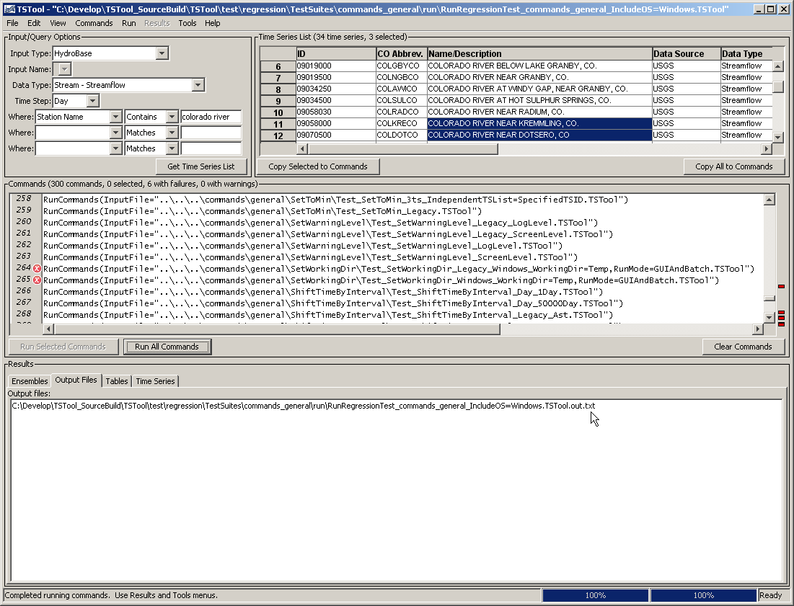

# TSTool / Quality Control #

This chapter discusses how TSTool software is quality controlled and how to use TSTool for quality control.

*   [Using TSTool to Quality Control Data](#using-tstool-to-quality-control-data)
*   [Using TSTool to Quality Control System Functionality](#using-tstool-to-quality-control-system-functionality)
*   [Quality Control for TSTool Software](#quality-control-for-tstool-software)
    +   [Writing a Single Test Case](#writing-a-single-test-case)
    +   [Creating and Running a Test Suite](#creating-and-running-a-test-suite)
    +   [Controlling Tests with Special Comments](#controlling-tests-with-special-comments)
    +   [Verifying TSTool Software Using a Full Dataset](#verifying-tstool-software-using-a-full-dataset)

------------

## Using TSTool to Quality Control Data ##

TSTool can be used to quality control time series and other data.
The primary commands for checking data are:

**<p style="text-align: center;">
TSTool Commands to Check Data
</p>**

| **Data Object** | **Command**&nbsp;&nbsp;&nbsp;&nbsp;&nbsp;&nbsp;&nbsp;&nbsp;&nbsp;&nbsp;&nbsp;&nbsp;&nbsp;&nbsp;&nbsp;&nbsp;&nbsp;&nbsp;&nbsp;&nbsp;&nbsp;&nbsp;&nbsp;&nbsp;&nbsp;&nbsp;&nbsp;&nbsp;&nbsp;&nbsp;&nbsp;&nbsp; | **Description** |
| -- | -- | -- |
| File | [`CompareFiles`](../command-ref/CompareFiles/CompareFiles.md) | Compare files for equivalence. For example, write time series to DateValue files and then compare the resulting text files. Tables can be written to comma-separated-value (CSV) files. Spatial data can be written to GeoJSON files.  Property lists can be written to property files. File comparisons depend on the format, which is impacted by precision of numbers, date formatting, etc. |
| Property | [`If`](../command-ref/If/If.md) | Compare properties for equivalence. For example, some commands set processor properties based on processing. |
| Table | [`CompareTables`](../command-ref/CompareTables/CompareTables.md) | Compare tables for equivalence. |
| Time Series | [`CheckTimeSeries`](../command-ref/CheckTimeSeries/CheckTimeSeries.md) | Check individual time series values for out of range, missing, greater than, etc.  Values that are detected can be flagged with a string and optionally can be set to missing.  The HTML summary (see [`WriteSummary`](../command-ref/WriteSummary/WriteSummary.md) command) will indicate flagged values and graph products can label data points with flags.  Flags can be written to data management systems if flags are supported. |
| Time Series | [`CheckTimeSeriesStatistic`](../command-ref/CheckTimeSeriesStatistic/CheckTimeSeriesStatistic.md) | Calculates a statistic (e.g., count of data values greater than a criteria) and then checks the statistic against a criteria (e.g., is count greater than a criteria). |
| Time Series | [`CompareTimeSeries`](../command-ref/CompareTimeSeries/CompareTimeSeries.md) | Compare time series for equivalence. |

The above commands can be used to check time series for out of range and other unusual data conditions.
If values are replaced with missing, the missing values can be filled using the fill commands.
Additional quality control of time series can be performed by using a combination of other commands.
 For example, the [`NewStatisticYearTS`](../command-ref/NewStatisticYearTS/NewStatisticYearTS.md)
command computes an annual statistic time series, which can then be checked using one of the above commands.
The [`Cumulate`](../command-ref/Cumulate/Cumulate.md) command also is useful for visualizing trends.

## Using TSTool to Quality Control System Functionality

The previous section described how TSTool can be used to quality control data.
Another aspect of quality control is ensuring that a system is working.
For example, TSTool accesses data from many input sources and it may be difficult
for the maintainers of data systems to know if systems are running (is the system up?)
and that data are being properly returned (are values reasonable?).
TSTool can be used as a test runner to check for system uptime, for example:

1.  Blanket test.  Generate a command file to read a representative number of time series (or all) from a system.
    It may be necessary to set the input period to be short.  If any errors occur, they need to be resolved.
2.  Data count test.  Generate a command file to read a representative number of time series.
    Specify the input period as an appropriate value (e.g., short for real-time data).
    Use the [`CheckTimeSeriesStatistic`](../command-ref/CheckTimeSeriesStatistic/CheckTimeSeriesStatistic.md)
    command to generate a count of data values in the period and check for reasonable values.

Other tests also can be performed.
The following section describes how very specific tests can be run to test software functionality.
A similar approach can be used to test systems,
if it is known that expected results from the system will not change over time.

## Quality Control for TSTool Software ##

TSTool software provides many data processing commands.
Each command typically provides multiple parameters.
The combination of commands and parameters coupled with potential data
changes and user errors can make it difficult to confirm that TSTool software is itself performing as expected.
To address this quality control concern, several commands have been built into
TSTool to facilitate using TSTool itself to test functionality.
Test cases can be defined for each command, with test cases for various combinations of parameters.
The suite of all the test cases can then be run to confirm that the
version of TSTool does properly generate expected results.
This approach performs regression testing of the software and utilizes TSTool’s
error-handling features to provide visual feedback during testing.

Test cases are developed by software developers as new features are implemented, according to the following documentation.
However, users can also develop test cases and this is encouraged to
ensure that all combinations of parameters and input data are tested.
Providing verified test data and results prior to new development will facilitate the new development.

### Writing a Single Test Case ###

A single test case is illustrated by the following example (indented lines
indicate commands that are too long to fit on one line in the documentation).

```
# Test filling with interpolation where maximum gap interval to fill is 2.
StartLog(LogFile="Results/Test_FillInterpolate_MaxIntervals=2.TSTool.log")
RemoveFile(InputFile="Results/Test_FillInterpolate_MaxIntervals=2_out.dv",IfNotFound=Ignore)
NewPatternTimeSeries(Alias="ts1_day",NewTSID="ts1...Day",Description="test data 1",SetStart="2000-01-01",SetEnd="2003-05-13",PatternValues="1,2,3,2,1,-999,5,1,-999,-999,-999,1,3,5")
FillInterpolate(TSList=AllMatchingTSID,TSID="ts1_day",MaxIntervals=2)
# Uncomment the following command to regenerate expected results.
# WriteDateValue(OutputFile="ExpectedResults/Test_FillInterpolate_MaxIntervals=2_out.dv")
WriteDateValue(OutputFile="Results/Test_FillInterpolate_MaxIntervals=2_out.dv")
CompareFiles(InputFile1="ExpectedResults/Test_FillInterpolate_MaxIntervals=2_out.dv",InputFile2="Results/Test_FillInterpolate_MaxIntervals=2_out.dv",IfDifferent=Warn)
```

#### Example Test Case Command File ####

The purpose of the test case command file is to regenerate results and then compare the
results to previously generated and verified expected results.
The example illustrates the basic steps that should be included in any test case:

1.  **Start a log file to store the results of the specific test case.**
    The previous log file will be closed and the new log file will be used until it is closed.
    The log file is not crucial to the test but helps with troubleshooting if necessary
    (for example if evaluating the test case output when run in a test suite, as explained later in this chapter).
2.  **Remove the results that are to be generated by the test.**
    This is necessary because if the software fails and old results match expected results,
    it may appear that the command was successful.
    Using the `IfNotFound=Ignore` parameter is useful because someone who is
    running the tests for the first time may not have previous results.
    Test developers should use IfNotFound=Warn when setting up the test to confirm that
    the results being removed match the name that is actually generated in a later command,
    and then switch to `IfNotFound=Ignore`.
3.  **Generate or read time series data.**
    The [`NewPatternTimeSeries`](../command-ref/NewPatternTimeSeries/NewPatternTimeSeries.md)
    command is used in the example to create a time series of repeating values.
    This is a useful technique because it allows full control over the initial
    data and minimizes the number of files associated with the test.
    Synthetic data are often appropriate for simple tests.
    If the test requires more complicated data, then time series can be read from a DateValue or other time series file.
    For example, if functionality of another software program is being implemented in TSTool,
    the data file from the original software may be used.
4.  **Process the time series using the command being tested.**
    In the example, the [`FillInterpolate`](../command-ref/FillInterpolate/FillInterpolate.md) command is being tested.
    In many cases, a single command can be used in this step.
    However, in some cases, it is necessary to use multiple commands.
    This is OK as long as each command or the sequence is sufficiently tested with appropriate test cases.
5.  **Write the results.**  The resulting time series are written to a standard format.
    The DateValue format is useful for general testing because it closely represents all time series properties.
    Note that two write commands are used in the example – one writes the
    expected results and the other writes the results from the current test.
    The expected results should only be written when the creator of the test has
    confirmed that it contains verified values.
    In the example, the command to write expected results is commented out
    because the results were previously generated.
    Some commands do not process time series; therefore,
    the [`WritePropertiesToFile`](../command-ref/WritePropertiesToFile/WritePropertiesToFile.md) and
    [`WriteTimeSeriesPropertiesToFile`](../command-ref/WriteTimeSeriesPropertiesToFile/WriteTimeSeriesPropertiesToFile.md) commands
    can be used to write processor properties (e.g., global output period)
    and time series properties (e.g., data limits).
    Additional properties will be enabled as the software is enhanced.
6.  **Compare the expected results and the current results.**
    The example uses the [`CompareFiles`](../command-ref/CompareFiles/CompareFiles.md) command to compare
    the DateValues files generated for the expected and current results.
    This command omits comment lines in the comparison because file headers often change due to dynamic comments with date/time.
    If the software is functioning as expected, the data lines in the file will exactly match.
    The example illustrates that if the files are different,
    a warning will be generated because of the `WarnIfDifferent=True` parameter.
    Other options for comparing results include:
    1.  **Use the [`CompareTimeSeries`](../command-ref/CompareTimeSeries/CompareTimeSeries.md) command.**
        This command expects to find matching time series and will compare data values to a precision.
        For example, read one time series from a DateValue file and then compare with the current time series in memory.
        Using this command avoids potential issues with the DateValue or other file formats
        changing over time (and requiring the expected results to be reverified);
        however, doing a file comparison is often easier to troubleshoot because a
        graphical difference program can visually illustrate differences that need to be evaluated.
    2.  **If testing a read/write command, compare the results with the original data file.**
        For example, if the test case is to verify that a certain file format is properly read,
        then there will generally also be a corresponding write command.
        The test case can then consist of a command to read the file, a command to write the results,
        and a comparison command to compare the two files.
        This may not work if the header of the file uses comment lines that are not recognized by the
        [`CompareFiles`](../command-ref/CompareFiles/CompareFiles.md) command.
    
If the example command file is opened and run in TSTool, it will produce time series results,
the log file, and the output file.  If the expected and current results are the same, no errors will be indicated.
However, if the files are different, a warning indicator will be shown in the command list area of the main window next to the
[`CompareFiles`](../command-ref/CompareFiles/CompareFiles.md) command.

General guidelines for defining test cases are as follows.
Following these conventions will allow the test cases to be incorporated into the full test suite.

*   Define the test case in a folder matching the command name.
*   Name the command file with prefix `Test_`, extension `.TSTool`, and use the following guidelines:
    +   for the default case using the filename pattern `Test_CommandName.TSTool`
    +   If there is a reason to define a test for a specific data set or input,
        add additional information to the filename, for example:  `Test_CommandName_RiverX.TSTool` or `Test_CommandName_6Hour.TSTool`
    +   If defining a test for legacy syntax, name the command file as follows
        (and see the `@readOnly` comment tag described in [Controlling Tests with Special Comments](#controlling-tests-with-special-comments):  `Test_CommandName_Legacy.TSTool`
    +   If defining a test for parameter values other than the default values,
        use a command file name similar to the following,
        where the parameters are listed at the end of the file name body:  `Test_CommandName_Param1=Value1,Param2=Value2.TSTool`
        Although this can result in very long names, the explicit naming clarifies the purpose of the test.
        The name of the example command file shown above is `Test_FillInterpolate_MaxIntervals=2.TSTool`.
*   Add a short comment to the top of the test case explaining the test.
*   Use as little data as possible to perform the test – long time series cause tests to
    run longer and take up more space in the repository that is used for revision control.
    Even though hundreds or thousands of tests may ultimately be defined,
    it is important to be able to run them in a short time to facilitate testing.
*   If possible, test only one command in the test – more complicated testing is described in
    [Verifying TSTool Software Using a Full Dataset](#verifying-tstool-software-using-a-full-dataset).
*   If an input file is needed, place it in a folder named Data,
    if necessary copying the same input from another command – this may require
    additional disk space but ensures that each command can stand alone.
*   Write the expected results to a folder named `ExpectedResults`.
*   Write the generated results and other dynamic content, including log file, to a folder named Results.
*   (Recommended) When creating output files, use `_out` in the filename before the extension and use
    an extension that is appropriate for the file content – this helps identify
    final output products in cases where intermediate files might be produced.

### Creating and Running a Test Suite ###

The previous section described how to define a single test case.
However, opening and running each test case command file would be very tedious and inefficient.
Therefore, TSTool provides a way to generate and run test suites,
which is the approach taken to perform a full regression test prior to a software release.

The following example command file illustrates how to create a test suite:

```
#
# Create the regression test runner for the
# TSTool/test/test-suites/commands-general files.
#
# Only command files that start with Test_ are included in the output.
# Don't append the generated commands, in order to force the old file to be
# overwritten.
#
CreateRegressionTestCommandFile(SearchFolder="..\..\..\commands\general",OutputFile="..\run\RunRegressionTest_commands_general_IncludeOS=Windows.TSTool",Append=False,IncludeTestSuite="*",IncludeOS="Windows")
```
When the command file is run, it searches the indicated search folder for files
matching the pattern `Test_*.TSTool`.
It then uses this list to create a command file with contents similar to the following
example (its contents are truncated in the following figure due to length).
This file will be listed as an output file after running the above command file.
The `IncludeTestSuite` and `IncludeOS` parameters are described in
[Controlling Tests with Special Comments](#controlling-tests-with-special-comments).

```
# File generated by...
# program:      TSTool 9.00.04 (2009-01-20)
# user:         sam
# date:         Tue Jan 20 22:56:17 MST 2009
# host:         SOPRIS
# directory:    C:\Develop\TSTool_SourceBuild\TSTool\test\regression\TestSuites\commands_general\create
# command line: TSTool -home test/operational/RTi
#
# The following 287 test cases will be run to compare results with expected results.
# Individual log files are generally created for each test.
# The following test suites from @testSuite comments are included: *
# Test cases for @os comments are included: Windows
StartRegressionTestResultsReport(OutputFile="RunRegressionTest_commands_general_IncludeOS=Windows.TSTool.out.txt")
RunCommands(InputFile="..\..\..\commands\general\Add\Test_Add_1.TSTool")
RunCommands(InputFile="..\..\..\commands\general\Add\Test_Add_Ensemble_1.TSTool")
RunCommands(InputFile="..\..\..\commands\general\AddConstant\Test_AddConstant_1.TSTool")
RunCommands(InputFile="..\..\..\commands\general\AddConstant\Test_AddConstant_Legacy_Ast.TSTool")
RunCommands(InputFile="..\..\..\commands\general\AddConstant\Test_AddConstant_Legacy_NoAst.TSTool")
...omitted...
RunCommands(InputFile="..\..\..\commands\general\WriteSummary\Test_WriteSummary_1.TSTool")
```

The above command file can then be opened and run.
Each [`RunCommands`](../command-ref/RunCommands/RunCommands.md) command will run a single test case command file.
Warning and failure statuses from each test case command file are propagated to the test suite
[`RunCommands`](../command-ref/RunCommands/RunCommands.md) command.
The output from running the test suite will be all of the output from
individual test cases (in the appropriate Results folders) plus the
regression test report provided in the TSTool Results list in the main window.
An example of the TSTool main window after running the test suite is shown in the following figure.
Note the warnings and errors, which should be addressed before releasing the
software (in some cases commands are difficult to test and more development on the test framework is needed).

**<p style="text-align: center;">

</p>**

**<p style="text-align: center;">
TSTool Main Interface Showing Regression Test Results (<a href="../GUI_MainRegressionTest.png">see full-size image</a>)
</p>**

An excerpt from the output file is shown below (normally the test number would be
sequential from 1 to the number of tests but only a few examples are included below).

```
# File generated by...
# program:      TSTool 9.00.04 (2009-01-20)
# user:         sam
# date:         Wed Feb 25 16:59:52 MST 2009
# host:         SOPRIS
# directory:    C:\Develop\TSTool_SourceBuild\TSTool\test\regression\TestSuites\commands_general\run
# command line: TSTool
#
# The test status below may be PASS or FAIL.
# A test can pass even if the command file actual status is FAILURE, if failure is expected.
#     Test   Commands   Commands
#     Pass/  Expected   Actual
# Num Fail   Status     Status     Command File
#---------------------------------------------------------------------
   1  PASS   SUCCESS    SUCCESS    C:\Develop\TSTool_SourceBuild\TSTool\test\regression\commands\general\
                                       Add\Test_Add_1.TSTool
   2  PASS   SUCCESS    SUCCESS    C:\Develop\TSTool_SourceBuild\TSTool\test\regression\commands\general\
                                       Add\Test_Add_Ensemble_1.TSTool
  34  PASS   Warning    WARNING    C:\Develop\TSTool_SourceBuild\TSTool\test\regression\commands\general\
                                       CreateFromList\Test_CreateFromList_InputType=HydroBase,
                                       IDCol=1,DataSource=DWR,DataType=DivTotal,
                                       Interval=Month,IfNotFound=Ignore.TSTool
  35  PASS   Failure    FAILURE    C:\Develop\TSTool_SourceBuild\TSTool\test\regression\commands\general\
                                       CreateFromList\Test_CreateFromList_InputType=HydroBase,
                                       IDCol=1,DataSource=DWR,DataType=DivTotal,
                                       Interval=Month,IfNotFound=Warn.TSTool
  36  PASS   Success    SUCCESS    C:\Develop\TSTool_SourceBuild\TSTool\test\regression\commands\general\
                                       CreateFromList\Test_CreateFromList_InputType=HydroBase,
                                       OutputPeriod,IDCol=1,DataSource=DWR,DataType=DivTotal,
                                       Interval=Month,IfNotFound=Default.TSTool
  37  PASS   Warning    WARNING    C:\Develop\TSTool_SourceBuild\TSTool\test\regression\commands\general\
                                       CreateFromList\Test_CreateFromList_Legacy.TSTool
  38  PASS   Failure    FAILURE    C:\Develop\TSTool_SourceBuild\TSTool\test\regression\commands\general\
                                       CreateTraces_Alias\Test_CreateTraces_Legacy_1.TSTool
 251 *FAIL*  SUCCESS    FAILURE    C:\Develop\TSTool_SourceBuild\TSTool\test\regression\commands\general\
                                       SetWorkingDir\Test_SetWorkingDir_Legacy_Windows_WorkingDir=Temp,
                                       RunMode=GUIAndBatch.TSTool
 252 *FAIL*  SUCCESS    FAILURE    C:\Develop\TSTool_SourceBuild\TSTool\test\regression\commands\general\
                                       SetWorkingDir\Test_SetWorkingDir_Windows_WorkingDir=Temp,
                                       RunMode=GUIAndBatch.TSTool
 287  PASS   SUCCESS    SUCCESS    C:\Develop\TSTool_SourceBuild\TSTool\test\regression\commands\general\
                                       WriteTimeSeriesProperty\
                                       Test_WriteTimeSeriesProperty_PropertyName=DataLimitsOriginal.TSTool
#---------------------------------------------------------------------
# FAIL count = 6
# PASS count = 281
```

A test passes if its expected status (by default `SUCCESS`) matches the actual status,
and the test fails otherwise.  Note that there are cases where a test case is actually intended to fail,
in order to test that TSTool is properly detecting and handling the failure (rather than ignoring it or crashing).  

The features built into TSTool can therefore be used to efficiently test the software,
contributing to increased software quality and efficient software releases.
See the next section for more information on controlling the test process.

### Controlling Tests with Special Comments ###

The previous two sections described how to define individual test cases and how to
automatically create and run a test suite comprised of test cases.
However, there are special conditions that will cause the normal testing procedures to fail, in particular:

*   tests depend on a specific software version
*   tests depend on a database that is not available
*   tests depend on a database version that is not available (data in the default or most recent database have changed)
*   tests can only be run on a certain operating system
*   tests depend on a specific environment configuration that is not easily reproduced for all users

Any of these conditions can cause a test case to fail,
leading to inappropriate errors and wasted time tracking down problems that do not exist or need to be solved.
To address this issue, TSTool recognizes special comment annotations that can be included in test case command files.
See the [`#` Comment command](../command-ref/Comment/Comment.md) documentation for details.
For example, the `#@expectedStatus` annotation provides information for to the
[`CreateRegressionTestCommandFile`](../command-ref/CreateRegressionTestCommandFile/CreateRegressionTestCommandFile.md)
command and command processor.  The syntax of the special comments is illustrated by the following example:

```
#@expectedStatus Failure
```

**<p style="text-align: center;">
Examples of `#` Comment Annotation Tags used in Testing
</p>**

|**Parameter&nbsp;&nbsp;&nbsp;&nbsp;&nbsp;&nbsp;&nbsp;&nbsp;**&nbsp;&nbsp;&nbsp;&nbsp;&nbsp;&nbsp;&nbsp;&nbsp;&nbsp;&nbsp;&nbsp;&nbsp;&nbsp;&nbsp;&nbsp;&nbsp;&nbsp;&nbsp;&nbsp;&nbsp;&nbsp;&nbsp;&nbsp;&nbsp;&nbsp;&nbsp;&nbsp;|**Description**|
|-------------|---------------|
|`#enabled False` | Indicate that a test should be disabled.  This is useful when a new test is not yet ready to be included in tests or an old test is obsolete and needs to be updated with new syntax. |
|`@expectedStatus Failure`<br>`@expectedStatus Warning`|The [`RunCommands`](../command-ref/RunCommands/RunCommands.md) command `ExpectedStatus` parameter is by default `Success`.  However, a different status can be specified if it is expected that a command file will result in `Warning` or `Failure` and still be a successful test.  For example, if a command is obsolete and should generate a failure, the expected status can be specified as `Failure` and the test will pass only if the command fails.  Another example is to test that the software properly treats a missing file as a failure.|
|`@os Windows`<br>`@os UNIX`|Using this tag indicates that the test is designed to work only on the specified operating system (OS) and will be included in the test suite by the [`CreateRegressionTestCommandFile`](../command-ref/CreateRegressionTestCommandFile/CreateRegressionTestCommandFile.md) command only if the `IncludeOS` parameter includes the corresponding OS.  This is primarily used to test specific features of the OS and similar but separate test cases should be implemented for each OS.  If the OS type is not specified as a tag in a command file, the test is always included.|
|`@readOnly`|Use this tag to indicate that a command file is read-only.  This is useful when legacy command files are being tested because the TSTool user interface will automatically update old command syntax to new.  Consequently, saving the command file will overwrite the legacy syntax and modify the original test.  If this tag is included, the TSTool interface will warn the user that the file is read-only and will only save if the user indicates to do so.|
|`@require application TSTool >= 13.03.00` | Indicate that a specific version of TSTool is required to run the command file. TSTool is usually backward compatible; however, a specific version or later will be needed to run new commands, corresponding to release notes. |
|`@require datastore HydroBase >= 20210321` | Indicate that a specific datastore version (in this case for datastore named `HydroBase`) is required to run the command file. Additional test control such as using test suites and using datastore names with version may be necessary to control which database is used for tests. |
|`@testSuite ABC`|Indicate that the command file should be considered part of the specified test suite, as specified with the `IncludeTestSuite` parameter of the [`CreateRegressionTestCommandFile`](../command-ref/CreateRegressionTestCommandFile/CreateRegressionTestCommandFile.md) command.  Do not specify a test suite tag for general tests.  This tag is useful if a group of tests require special setup, for example a specific database.  The suite names should be decided upon by the test developer.|

Using the above special comment tags, it is possible to create test suites that are appropriate for specific environments.
For example, using `@testSuite` HydroBase indicates that a test case should be included in the
HydroBase test suite, presumably run in an environment where a connection to HydroBase has been opened.
Consequently, multiple test suites can be created and run as appropriate depending on the system environment.

### Verifying TSTool Software Using a Full Dataset ###

The previous sections described how to test TSTool software using a suite of test cases.  This approach can be utilized when performing general tests, for example prior to a normal software release.   However, there may be cases where TSTool has been used to produce a large data set and it is desirable to confirm that a software release will still create the full dataset without differences.  For example, for the State of Colorado’s Decision Support Systems, large basin model data sets are created and are subject to significant scrutiny.  Approaches previously described in this chapter can be utilized to verify that TSTool is functioning properly and creates the dataset files.  The following procedure is recommended and uses CDSS as an example:

1.  If not already installed, install the data set in its default location
    (e.g., `C:\CDSS\data\colorado_1_2007`) – these files will not be modified during testing.
2.  Create a parallel folder with a name indicating that it is being used for verification
    (e.g., `C:\CDSS\data\colorado_1_2007_verify20090216`).
3.  Copy the data set files from step 1 to the folder created in step 2
    (e.g., copy to `C:\CDSS\data\colorado_1_2007_verify20090216\colorado_1_2007`) – these files will be modified during testing.
4.  Create a TSTool command file in the folder created in step 2 that will
    run the tests (e.g., `VerifyTSTool.TSTool`).
    It is often easier to edit this command file with a text editor rather than with TSTool itself.
    The contents of the file are illustrated in the example below.  Some guidelines for this step are as follows:
    1.  Organize the command file by data set folder, in the order that data need to be created.
    2.  Process every `*.TSTool` command to verify that it runs and generates the same results.
    3.  If command files do not produce the same results, copy the command file to a name
        with “-updated” or similar in the filename and then change the file until it creates the expected results.
        This may be required due to changes in the command, for example implementing stricture error handling.
        These command files can then be shared with maintainers of the data set so that future releases can be updated.
    4.  As tests are formalized, it may be beneficial to save a copy of this file with the
        original data set so future tests can simply copy the verification command file rather than
        recreating it (e.g., save in a QualityControl folder in the master data set).
        This effort will allow the creator of the data set to quality control
        their work as well as helping to quality control the software.
5.  Run the command file – any warnings or failures should be evaluated to determine
    if they are due to software or data changes.
    Software differences should be evaluated by software developers.
    It may be necessary to use command parameters such as `Version`,
    available for some commands, to recreate legacy data formats.

The following example command file illustrates how TSTool software is verified using the
full data set (indented lines indicate commands that are too long to fit on one line in the documentation).
Note that  intermediate input files that would normally be modified by other software
(e.g., StateDMI for CDSS data sets) could impact TSTool verification.
However, a similar quality control procedure can be implemented for StateDMI.

Guidelines for setting up the each test in the command file are as follows:

1.  Remove output files that are generated from each individual command file
    that is run using [`RemoveFile`](../command-ref/RemoveFile/RemoveFile.md) commands.
    This will ensure that test does not use old results for its output comparison.
2.  Run each individual command file using the
    [`RunCommands`](../command-ref/RunCommands/RunCommands.md) command.
3.  Compare the results of the run with the original data set file using the
    [`CompareFiles`](../command-ref/CompareFiles/CompareFiles.md) command.
 
```
StartLog(LogFile="VerifyTSTool.TSTool.log")
# This command file verifies the TSTool functionality by recreating a released
# StateMod/StateCU data set.  The general process is as follows:
# 1) Copy the entire original data set to this folder (e.g., do manually).
# 2) Commands below will remove output files from product and StateMod/StateCU
# folders.  This is done in case regeneration stops - don't want any confusion
# with original output and what should be created here.
# 3) Commands below will run the command files used to generate the model files.
# 4) Commands below will use CompareFile() commands to compare results.  Comment
# lines are ignored so only data differences (processing output) will be
# flagged.
# If run interactively from TSTool, indicators will show where results are
# different.  Differences must then be evaluated to determine if input data,
# process, or software have changed.  Differences may be valid.
#
##############################################################################
# Diversions
##############################################################################
RemoveFile(InputFile="colorado_1_2007\Diversions\514634.stm")
RunCommands(InputFile="colorado_1_2007\Diversions\514634.stm.commands.TSTool")
CompareFiles(InputFile1="colorado_1_2007\Diversions\514634.stm",InputFile2="..\colorado_1_2007\Diversions\514634.stm",WarnIfDifferent=True)
#
RemoveFile(InputFile="colorado_1_2007\Diversions\954699.stm")
RunCommands(InputFile="colorado_1_2007\Diversions\954699.commands.TSTool")
CompareFiles(InputFile1="colorado_1_2007\Diversions\954699.stm",InputFile2="..\colorado_1_2007\Diversions\954699.stm",WarnIfDifferent=True)
#
RemoveFile(InputFile="colorado_1_2007\Diversions\Fraser.stm")
RunCommands(InputFile="colorado_1_2007\Diversions\Fraser.commands.TSTool")
CompareFiles(InputFile1="colorado_1_2007\Diversions\Fraser.stm",InputFile2="..\colorado_1_2007\Diversions\Fraser.stm",WarnIfDifferent=True)
#
##############################################################################
##############################################################################
# instream
##############################################################################
##############################################################################
#
RemoveFile(InputFile="colorado_1_2007\statemod\cm2005.ifm")
RunCommands(InputFile="colorado_1_2007\instream\ifm.commands.tstool")
CompareFiles(InputFile1="colorado_1_2007\statemod\cm2005.ifm",InputFile2="..\colorado_1_2007\statemod\cm2005.ifm",WarnIfDifferent=True)
#
##############################################################################
# reservoirs
##############################################################################
#
RemoveFile(InputFile="colorado_1_2007\reservoirs\363543-add.stm")
RemoveFile(InputFile="colorado_1_2007\reservoirs\364512-add.stm")
RemoveFile(InputFile="colorado_1_2007\reservoirs\503668-add.stm")
RemoveFile(InputFile="colorado_1_2007\reservoirs\513709-add.stm")
RemoveFile(InputFile="colorado_1_2007\reservoirs\514620-add.stm")
RemoveFile(InputFile="colorado_1_2007\reservoirs\723844-add.stm")
RemoveFile(InputFile="colorado_1_2007\reservoirs\838713-add.stm")
RunCommands(InputFile="colorado_1_2007\reservoirs\res.stm.commands.tstool")
# CompareFiles(InputFile1="colorado_1_2007\reservoirs\363543-add.stm",InputFile2="..\colorado_1_2007\reservoirs\363543.stm",WarnIfDifferent=True)
# CompareFiles(InputFile1="colorado_1_2007\reservoirs\364512-add.stm",InputFile2="..\colorado_1_2007\reservoirs\364512-add.stm",WarnIfDifferent=True)
# CompareFiles(InputFile1="colorado_1_2007\reservoirs\503668-add.stm",InputFile2="..\colorado_1_2007\reservoirs\503668-add.stm",WarnIfDifferent=True)
# CompareFiles(InputFile1="colorado_1_2007\reservoirs\513709-add.stm",InputFile2="..\colorado_1_2007\reservoirs\513709-add.stm",WarnIfDifferent=True)
# CompareFiles(InputFile1="colorado_1_2007\reservoirs\514620-add.stm",InputFile2="..\colorado_1_2007\reservoirs\514620-add.stm",WarnIfDifferent=True)
# CompareFiles(InputFile1="colorado_1_2007\reservoirs\723844-add.stm",InputFile2="..\colorado_1_2007\reservoirs\723844-add.stm",WarnIfDifferent=True)
# CompareFiles(InputFile1="colorado_1_2007\reservoirs\838713-add.stm",InputFile2="..\colorado_1_2007\reservoirs\838713-add.stm",WarnIfDifferent=True)
#
RemoveFile(InputFile="colorado_1_2007\statemod\cm2005B.tar")
RunCommands(InputFile="colorado_1_2007\reservoirs\Btar.commands.tstool")
CompareFiles(InputFile1="colorado_1_2007\statemod\cm2005B.tar",InputFile2="..\colorado_1_2007\statemod\cm2005B.tar",WarnIfDifferent=True)
#
RemoveFile(InputFile="colorado_1_2007\statemod\cm2005C.tar")
RunCommands(InputFile="colorado_1_2007\reservoirs\Ctar.commands.tstool")
CompareFiles(InputFile1="colorado_1_2007\statemod\cm2005C.tar",InputFile2="..\colorado_1_2007\statemod\cm2005C.tar",WarnIfDifferent=True)
#
RemoveFile(InputFile="colorado_1_2007\statemod\cm2005.eom")
RunCommands(InputFile="colorado_1_2007\reservoirs\eom.commands.tstool")
CompareFiles(InputFile1="colorado_1_2007\statemod\cm2005.eom",InputFile2="..\colorado_1_2007\statemod\cm2005.eom",WarnIfDifferent=True)
#
RemoveFile(InputFile="colorado_1_2007\statemod\cm2005H.tar")
RunCommands(InputFile="colorado_1_2007\reservoirs\Htar.commands.tstool")
CompareFiles(InputFile1="colorado_1_2007\statemod\cm2005H.tar",InputFile2="..\colorado_1_2007\statemod\cm2005H.tar",WarnIfDifferent=True)
#
##############################################################################
# streamSW
##############################################################################
#
RemoveFile(InputFile="colorado_1_2007\streamSW\404657.stm")
RunCommands(InputFile="colorado_1_2007\streamSW\404657.commands.tstool")
CompareFiles(InputFile1="colorado_1_2007\streamSW\404657.stm",InputFile2="..\colorado_1_2007\streamSW\404657.stm",WarnIfDifferent=True)
#
RemoveFile(InputFile="colorado_1_2007\statemod\cm2005.rbd")
RunCommands(InputFile="colorado_1_2007\streamSW\rbd.commands.tstool")
CompareFiles(InputFile1="colorado_1_2007\statemod\cm2005.rbd",InputFile2="..\colorado_1_2007\statemod\cm2005.rbd",WarnIfDifferent=True)
#
RemoveFile(InputFile="..\colorado_1_2007\statemod\cm2005.rid")
RunCommands(InputFile="colorado_1_2007\streamSW\rid.commands.tstool")
CompareFiles(InputFile1="colorado_1_2007\statemod\cm2005.rid",InputFile2="..\colorado_1_2007\statemod\cm2005.rid",WarnIfDifferent=True)
#
RemoveFile(InputFile="colorado_1_2007\statemod\cm2005.rih")
RunCommands(InputFile="colorado_1_2007\streamSW\rih.commands.tstool")
CompareFiles(InputFile1="colorado_1_2007\statemod\cm2005.rih",InputFile2="..\colorado_1_2007\statemod\cm2005.rih",WarnIfDifferent=True)
#
##############################################################################
# TSTool - do after others, in case differences might cascade
##############################################################################
#
RemoveFile(InputFile="colorado_1_2007\TSTool\fill2005.pat")
RunCommands(InputFile="colorado_1_2007\TSTool\fill2005.pat.commands.TSTool")
CompareFiles(InputFile1="colorado_1_2007\TSTool\fill2005.pat",InputFile2="..\colorado_1_2007\TSTool\fill2005.pat",WarnIfDifferent=True)
#
RemoveFile(InputFile="colorado_1_2007\TSTool\Patgage.xbg")
RunCommands(InputFile="colorado_1_2007\TSTool\pattern_gage_raw_data.commands.TSTool")
CompareFiles(InputFile1="colorado_1_2007\TSTool\patgage.xbg",InputFile2="..\colorado_1_2007\TSTool\patgage.xbg",WarnIfDifferent=True)
```
