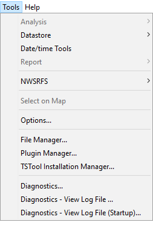
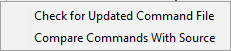

# TSTool / Tools #

This chapter discusses the tools available under the ***Tools*** menu.
Tools configure TSTool or analyze data and information.

The ***Tools*** menu lists tools that perform additional analysis on
time series that are selected in the ***Time Series Results*** list.
These features are similar to the ***Results*** menu features in that a
level of additional analysis is performed to produce the data product.

Tools may or may not correspond to commands – often tools internally execute the features available in commands,
in order to implement a more complicated analysis.
Tools are interactive, whereas commands can be used in automated processing.
Tools are therefore appropriate for one-off interactive data viewing,
whereas commands should be used to automate processing on large datasets.

**

**

**

Tools Menu

**

Tools may be specific to a datastore type and consequently some
tools may not be available in TSTool for all configurations.
Where possible, TSTool functionality is included in commands to facilitate automation.

*   [Analysis Tools](#analysis-tools)
    +   [Mixed Station Analysis](#mixed-station-analysis)
*   [Command Tools](#command-tools)
    +   [Check for Updated Command File](#check-for-updated-command-file)
    +   [Compare Commands With Source](#compare-commands-with-source)
*   [Report Tools](#report-tools)
    +   [Data Coverage by Year Report](#data-coverage-by-year-report)
    +   [Data Limits Summary Report](#data-limits-summary-report)
    +   [Month Summary Reports](#month-summary-reports)
    +   [Year to Date Total Report](#year-to-date-total-report)
*   [Map Tools](#map-tools)
*   [TSTool Options](#tstool-options)
*   [Diagnostics](#diagnostics)
    +   [Diagnostics Settings](#diagnostics-settings)
    +   [Diagnostics – View Log File](#diagnostics–view-log-file)

------------------------

## Analysis Tools ##

Analysis tools analyze time series and typically produce an output report.

**

**

**

Tools / Analysis Menu

**

### Mixed Station Analysis ###

The ***Mixed Station Analysis*** tool is under development and not ready for production use.
Instead, use the
[`FillMixedStation`](../command-ref/FillMixedStation/FillMixedStation.md) and
[`FillRegression`](../command-ref/FillRegression/FillRegression.md) commands,
which provide most of the functionality envisioned by the interactive tool.
The following  documentation is retained for discussion purposes and to guide future enhancements.

The ***Mixed Station Analysis*** tool is an interactive tool that tries to find the best
combination of time series necessary to fill data using regression or the MOVE2 method.
The optimal results can then optionally be used as parameters for the
[`FillMixedStation`](../command-ref/FillMixedStation/FillMixedStation.md) command.
The following figure illustrates the ***Mixed Station Analysis*** tool.

**

**

**

Mixed Station Analysis Interface (<a href="../Menu_Tools_Analysis_MixedStationAnalysis.png">see also the full-size image</a>)

**

## Command Tools ##

Command tools are used to compare the commands in the TSTool software (local commands)
with the command file stored in an online repository or other source.
This helps with version control and maintenance of the command file.

**

**

**

Tools / Commands Menu

**

### Check for Updated Command File ###

The ***Tools / Commands / Check for Updated Command File*** tool compares the local commands
with the original source file,
which is typically stored in a GitHub repository or other online location,
in order to determine which copy is more recent.
For example, use this tool to evaluate whether a newer command file version
has been published on the web and needs to be downloaded,
or whether local changes need to be saved in the respository.
This requires that the following are defined:

*   Use a `#@sourceUrl` comment to indicate the source location of the command file.
*   Use a `#@version` and/or `#@versionDate` commnt to indicate the command file version.

The version information from the source command file and the commands in the TSTool interface are compared
and version information is displayed.

See also the next section.

### Compare Commands With Source ###

The ***Tools / Commands / Compare Commands With Source*** tool compares the local commands
with the original source file,
which is typically stored in a GitHub repository or other online location.
This requires that the following are defined:

*   Use a `#@sourceUrl` command to indicate the source location of the command file.
*   Install the Kdiff3 software (the default comparison program)
    or another visual differnce program and 
    configure in the [TSTool configuration file](../appendix-install/install.md#tstool-configuration).

The source command file and the commands in the TSTool interface are downloaded to temporary files and 
are then compared with the visual difference program.
The comparison is helpful to understanding differences before synchronizing the local and source commands.

## Report Tools ##

Report tools analyze time series, typically creating a summary report.  
 
**

**

**

Tools / Report Menu

**

### Data Coverage by Year Report ###

The ***Tools / Report - Data Coverage by Year*** menu processes the time series
that have been selected and produces a report similar to the following (abbreviated).
This report is useful, in particular, for evaluating data availability for multiple time series over a period.
Although effort has been taken to make the report as compact as possible,
it may need to be printed in landscape format on a large paper size.

**

**

**

Data Coverage by Year Report (<a href="../Menu_Tools_Report_DataCoverage.png">see also the full-size image</a>)

**
 
### Data Limits Summary Report ###

The ***Tools / Report - Data Limits*** Summary menu processes the time series that
have been selected and produces a report similar to the following (abbreviated).
The data limits summary for each time series is included.
This report is useful, in particular, for evaluating data availability for specific time series.
Currently, only monthly time series have detailed summaries.
All other data intervals shown overall period summaries.
The value `-999` is used to indicate missing data.

**

**

**

Data Limits Summary Report (<a href="../Menu_Tools_Report_DataLimits.png">see also the full-size image</a>)

**
 
### Month Summary Reports ###

The ***Tools / Report - Month Summary*** menus process the time series
that have been selected and produces a report similar to the following (abbreviated).
This report is similar to default summary output for monthly time series;
however, it is applied to shorter data intervals, including minute, hour, and day interval.
Values are first accumulated to daily values (by averaging the values in a day if the ***Daily Means*** report
is chosen or by totaling the values in a day if the ***Daily Totals*** report is chosen).
For example, use total for precipitation and means for average flows or daily temperature.
The daily values are then further accumulated to produce monthly values, again using means or totals.
The report includes a header for the time series, the report, and footnotes.
Values are only shown if full data are available for a month and statistics are computed using only complete months.

**

**

**

Monthly Summary (Daily Mean) Report (<a href="../Menu_Tools_Report_MonthSummary_DailyMean.png">see also the full-size image</a>)

**
 
### Year to Date Total Report ###

The ***Tools / Report - Year to Date Total*** menu processes the time series that
have been selected and produces a report similar to the following (abbreviated).
This report is useful, in particular, for comparing on a volumetric basis the
different years of a time series over a full period.
The year-to-date volumes are sorted; to find a particular year, use the ***Search*** button on the report display.
The report information can then be used, for example, to select time series traces for analysis and output.
Currently, this report can only be used to process daily CFS data.
Real-time data can be analyzed by first converting to a daily interval using the
[`ChangeInterval`](../command-ref/ChangeInterval/ChangeInterval.md) command.
Warning: some years may have no data at the beginning of a year and the
corresponding year-to-date totals will consequently be zero.
Refer to the data coverage and data limit reports for more detail.

**

**

**

Year to Date Total Report (<a href="../Menu_Tools_Report_YearToDateTotal.png">see also the full-size image</a>)

**
 
## Map Tools ##

The ***Tools / Select on Map*** menu button is enabled when a map is displayed (using ***View / Map***)
and time series are listed in the upper right part of the main window.
The locations corresponding to selected time series or all time series in this
list can be displayed on the map.  See the [Processing / Spatial Data](../processing/spatial-data/spatial-data.md) documentation for more information.
Map features are implemented at only a basic level.

## TSTool Options ##

The ***Tools / Options*** menu provides a way to set TSTool options during the session.
Minimal capabilities are provided.  Instead, the TSTool environment is typically configured
in its configuration file (see the [Installation and Configuration appendix](../appendix-install/install.md)),
data store configuration files, and with commands.

## Diagnostics ##

Diagnostics features are useful for troubleshooting.
When an error occurs, a small warning dialog may be displayed, as shown in the following figure:

**

**

**

Example Warning Message Dialog

**

If results are not as expected, also review the messages in the status bar at the bottom of the main or secondary windows. 

### Diagnostics Settings ###

The ***Tools / Diagnostics*** menu item displays the ***Diagnostics*** dialog,
which is used to set message levels and view messages as the application runs.
The ***Diagnostics*** dialog (see the following figure) can be used to evaluate a problem.

**

**

**

Diagnostics Interface (<a href="../Diagnostics.png">see also the full-size image</a>)

**

The settings at the top of the dialog are used to specify the level of detail
for messages printed to the console window,
the status area at the bottom of the main window (and the ***Diagnostics*** dialog), and the log file.
The log file contains warning, status, and debug messages,
many of which are not normally displayed in the main interface.
The log file is created in the logs directory under the installation directory.
The ***Diagnostics*** interface features are as follows:

|**Dialog Feature**|**Description**|
|--|--|
|***Status***, ***Warning***, ***Debug***|Enter integer values, with larger numbers resulting in more output and slower performance.  Zero indicates no output.  If troubleshooting, a good guideline is to set the debug level to 10 or 30 (and select the ***Allow Debug*** checkbox).  The default settings are often enough for normal troubleshooting and result in good software performance.|
|***Allow Debug***|Select to enable debug messages.  Turning on debug messages will significantly slow down the software.|
|***Show Messages***|Select to display messages in the ***Diagnostics*** window.|
|***Flush Log File***|Force messages to be written to the log file.  Messages can be buffered in memory and may not otherwise immediately be written to the log file.|
|***Restart Log File***|Restart the log file.  This is useful if a long session has occurred and troubleshooting will occur on new actions.|
|***New Log File***|Open a new log file, with a new name.|
|***Apply***|Apply the settings in the ***Diagnostics*** dialog.|
|***View Log File***|View the log file in an integrated window.  The View Log File button will be enabled if the log file has been opened.|
|***Launch Log File Viewer***|View the log file using a viewer from the operating system.  On Windows computers, Notepad will be used.|
|***Close***|Apply the settings in the ***Diagnostics*** dialog and close the window.|

### Diagnostics – View Log File ###

The ***Tools / Diagnostics – View Log File*** menu item displays the integrated log file viewer.
Selecting this menu item is equivalent to selecting the View Log File button in the ***Diagnostics*** dialog.
The log file viewer will be displayed in a window as shown in the following figure.

**

**

**

Log File Viewer Window (<a href="../Diagnostics_ViewLog.png">see also the full-size image</a>)

**

The log file messages can be scrolled.
To find a string in the log file, right-click and select the ***Find*** menu item.
The information in the log file can also be copied and pasted into email, when contacting support.
