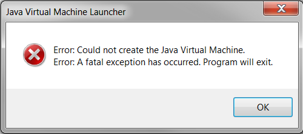
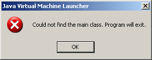

# TSTool / Troubleshooting #

TSTool is a Java desktop application that uses many software components,
some of which are tightly integrated with TSTool software code,
and some of which are third-party components.
TSTool can call other software programs.
TSTool also interfaces with databases and web services that are implemented
in different technologies that are maintained at different locations (other computers).
Consequently, errors can occur in various software components.
The following are general suggestions for troubleshooting issues.
Specific troubleshooting guidance is also provided in the documentation for each command.
**If it is difficult to find a troubleshooting topic using the section headers,
use the search feature of this documentation or browser page search to facilitate
finding information on a troubleshooting topic.**

* [Background and Terminology](#background-and-terminology)
	+ [Automated Testing](#automated-testing)
	+ [Logging](#logging)
	+ [Severity Levels for Issues](#severity-levels-for-issues)
	+ ["Exceptions"](#exceptions)
* [TSTool Installation and Version](#tstool-installation-and-version)
* [Log File](#log-file)
* [Command Status/Log](#command-statuslog)
* [System Information](#system-information)
* [Errors and Possible Solutions](#errors-and-possible-solutions)
	+ [Issue 1 - Java Virtual Machine launcher error](#issue-1-java-virtual-machine-launcher-error)
	+ [Issue 2 - Error connecting to State of Colorado’s HydroBase database on State computer](#issue-2-error-connecting-to-state-of-colorados-hydrobase-database-on-state-computer)
	+ [Issue 3 - No HydroBase databases are listed in HydroBase selection dialog](#issue-3-no-hydrobase-databases-are-listed-in-hydrobase-selection-dialog)
	+ [Issue 4 - Could not find the main class](#issue-4-could-not-find-the-main-class)
	+ [Issue 5 - Unable to find files](#issue-5-unable-to-find-files)
	+ [Issue 6 - Out of Memory Error](#issue-6-out-of-memory-error)
	+ [Issue 7 - Time series have missing data](#issue-7-time-series-have-missing-data)
	+ [Issue 8 - HEC-DSS features are unavailable](#issue-8-hec-dss-features-are-unavailable)
	+ [Issue 9 - Time series data type for data source is unavailable](#issue-9-time-series-data-type-for-data-source-is-unavailable)
	+ [Issue 10 - Unexpected failure](#issue-10-unexpected-failure)
	+ [Issue 11 - TSTool text (fonts) are small](#issue-11-tstool-text-fonts-are-small)
	+ [Issue 12 - Datastore is (not) available](#issue-12-datastore-is-not-available)
* [Obsolete Commands](#obsolete-commands)

------------------

## Background and Terminology ##

This section provides background on troubleshooting and related terminology.

Troubleshooting fundamentally boils down to investigation to determine the location and cause of
a problem, and then fixing the problem.
The person doing the troubleshooting will benefit from skills and experience with the technologies
that are involved and this is typically the first barrier to troubleshooting.
Problems can occur for many reasons, for example shown below,
listed in approximate order of typical investigation:

* user tries to use the software in an incorrect way
(user error, such as using wrong feature for a task)
* user provides incorrect input (input error)
* user has tried to do too much with the software (software limitation)
* user does not properly interpret or respond to a valid warning (user error)
* data access permission issue
* internet resource has an issue so can't get to data (service unavailable)
* software version incompatibility (computer or software issue)
* software has a logic problem (bug)
* something that has not been seen before (perhaps a combination of the above)

### Logging ###

Logging output is one of the fundamental tools to use in troubleshooting.

"Logging" means that "log messages" from software are output to help software users and developers
troubleshoot issues, typically to a "log file" or software window,
Most software components can log messages to one or more output forms.
Logging systems typically allow messages of different type (e.g., debug, status, warning, error, critical)
to be output.
Software will often use some type of run-time option or configuration file to control
how much logging output is generated.
The amount output by default will typically be small because generating log messages
slows down software and can create large log files.

Unfortunately, log messages may be written for technical people and even then may be
difficult to understand.  One goal of open source software projects such as TSTool is to improve logging messages
based on user feedback so the messages are as useful as possible.

See the [Log File](#log-file) section below for more information about using the TSTool log file.

### Severity Levels for Issues ###

Issues generated by software can have different severity levels.
Implementation of levels in different software can be a subject of great debate among software developers and users.
For example, is a problem an "error" or a "failure" or a "failure error"?
Too many levels leads to confusion and allows for too much interpretation.
Too few levels misses an opportunity to gracefully handle problems.
In TSTool, the following levels are used.
TSTool will try to run all commands, rather than stopping at the first issue.
This allows users to troubleshoot all the issues rather than fix one and then run again,
which can be very inefficient.

* **Warning** - an issue occurred that may have negative impacts,
but the software can generally continue with additional processing, for example:
	+ missing data in an analysis, which will impact the analysis
	+ missing file when a command is first edited - more checks are done at run time
* **Failure** - an issue occurred that likely has serious impacts on results and should be resolved,
	for example:
	+ critical input data are missing that prevent processing to occur
	+ critical input data are missing that will render output inaccurate

Either of the above cases should be investigated by users and resolved.
TSTool provides features to help users be aware of processing issues.
If any of those issues are due to software limitations,
they should be brought to the attention of the TSTool software maintainers,
for example via the GitHub issues. 

### "Exceptions" ###

Software programming languages handle errors in different ways.
This section focuses on background that will help users understand why they
see error messages presented as they are.

Most languages use an "exception" concept, as in:

```
try {
    some logic here
}
catch SomeExceptionType {
    some code to handle the exception
}
```

The "try" block wraps code that may generate an "exception" to normal conditions and the
"catch" block provides steps to deal with the exception.
Quite often, multiple try/catch blocks are nested within each other.

Languages define many types of standard exceptions, such as `FileNotFoundException`,
`InvalidParameterException`, `OutOfMemoryException` and `SecurityException`.
The specific exception types are used to let the software specifically handle
issues and give users more specific feedback on those issues.
Such handling can greatly increase the length and complexity of software.
However, without exception handling, software is much less robust.

Logging messages often present information about exceptions using the word "exception"
or show the specific exception type.
Exception messages also often are shown as an "exception stack", which
shows the list of code modules involved in an issue, from closest to the issue
to the start of the program.  This information is useful to software developers.

There are also different exception handling philosophies.
Some software may check for bad input before trying to use the input,
in which case more code is written on the front end.
Other software may have limited input checks and instead warn users when such
input causes an exception.
Both options are valid but result in different experience for users.
TSTool implements both approaches.
For examples, command parameters are checked for basic validity when a command is
edited in the user interface and when initial runtime processing occurs.
Common up-front checks include:

* Invalid number (such as negative when number should be greater than or equal to zero) or decimal number
when an integer is expected results in a failure (needs to be fixed).
* Missing input file may result in a warning during initial command setup (wait and see).

Common run-time checks include:

* Missing input file at runtime is often a failure (can't process data).
* Data read from a datastore has too much missing data to allow analysis (may or may not be OK).

Some TSTool commands also provide command parameters to allow users to control the level
of error handling.  For example, the [`RemoveFile`](../command-ref/RemoveFile/RemoveFile.md)
command provides the ability to ignore the case if the file to be removed does not exist.
The default behavior is often conservative (warn) and requires the user to make a decision.

### Automated Testing ###

One goal of software developers is to ensure that users are able to successfully
use software with as few issues as possible.
Software developers tend to dislike repetitive tasks and wasting time.
Therefore, automated testing is an important part of verifying that software is working as expected.
If a problem occurs, a software developer will often try running an existing test
or add a new test if no test exists for the issue.
Tests are often implemented at different levels, for example:

* unit tests - run small software code blocks, often used in a software development environment
* functional tests - run tests using functional software,
can be used in deployed and development environments
* system tests - run larger datasets to evaluate interaction of components,
can be used in deployed and development environments

For TSTool, thousands of functional tests have been developed to validate commands,
using a built-in testing framework.
These tests can be run by TSTool users and developers and serve as a starting point for troubleshooting,
for example to try a smaller example before testing a full dataset or more complicated process.

See the TSTool automated tests:

* [TSTool tests GitHub repository](https://github.com/OpenCDSS/cdss-app-tstool-test)
* [Quality Control chapter of this documentation](../quality-control/quality-control.md) - explains how to use TSTool for testing

## TSTool Installation and Version ##

TSTool versions are installed in separate folders,
which on Windows follows the naming convention `C:\CDSS\TSTool-Version`, such as `C:\CDSS\TSTool-12.00.00`.
See the [Installation and Configuration appendix](../appendix-install/install.md) for more information.
Separate installation folders take more disk space and result in more entries in the ***Start*** menu.
This approach has the following ben:

* Old versions of TSTool can continue to be used independent of new versions.
	+ Most TSTool features are backward compatible,
	meaning that newer versions of the software will run old command files.
	+ However, new TSTool versions will add new commands and command parameters
	that if saved to command files will not run in older TSTool versions.
* Multiple versions facilitate troubleshooting because issues can be pinpointed to
specific versions, and corresponding source code can be reviewed.
* If necessary, a version of the software can be "frozen" for an analysis process
as a long-term archive.

The TSTool version can be determined from its installation folder and also the ***Help / About TSTool*** menu.

## Log File ##

TSTool currently uses custom logging features to create a log file that is helpful to troubleshoot issues.
In the future a standard Java logging library may be implemented, such as [SLF4J](https://www.slf4j.org/);
however, this will require rework of the existing code.

The log file records data processing actions in the sequence that they are performed.
The level of messages various depending on software component, software programmer decisions,
and run-time settings, such as the ***Tools / Diagnostics*** menu and
[`SetDebugLevel`](../command-ref/SetDebugLevel/SetDebugLevel.md) command.
Although log files may be helpful to software developers and technical users,
they can be difficult for others to understand.
The log file exists in the following locations and can be edited with a text file editor:

* User's home folder TSTool files, for example:
	+ Windows: `C:\Users\user\.tstool\log\tstool_user.log`
	+ Linux:  `/home/user/.tstool/log/tstool_user.log`
	+ Cygwin:  `/cygdrive/C/Users/user/.tstool/log/tstool.log` (different files from Windows)
	+ Git Bash (MinGW):  `/c/Users/user/.tstool/log/tstool.log` (same files as Windows)
* File specified by the TSTool [`StartLog`](../command-ref/StartLog/StartLog.md) command.
* Log file in software installation folder:
	+ Windows: `C:\CDSS\TSTool-version\logs\tstool_user.log`
	(this was used in older versions of TSTool and has been phased out because
	writing to the folder often requires administrator privileges)

The log file contains a sequential record of log messages for application startup followed by
output from interacting with the TSTool user interface and running the commands,
as shown in the following example.
The first part of the line indicates the message type, which can be one of the following,
shown in increasing severity and therefore decreasing frequency:  `Debug`, `Status`, `Warning`, `Error`.
In other words, one should expect very few and ideally no `Error` messages.
Any message of level `Warning` or `Error`
should be dealt with because they can lead to a proliferation of problems in later commands.
TSTool's built-in logging allows a numeric level within the above categories,
with the following general convention:

* `<= 0` - no message
* `1` - human-facing messages used in main interfaces such as graphical user interfaces
* `2` - important messages in the main application intended for the log file
* `3` - important messages in commands intended for the log file 
* `10` - intermediate level messages intended for the log file
* `100` - very detailed messages intended for the log file

Using a higher number can result in significantly more output and consequently larger log files.
To facilitate viewing log files, use the TSTool **Tools / Diagnostics... View Log File** menu.
The following is an example of a log file.

```txt
Status[1]: Opened log file "C:\Users\sam\cdss-dev\TSTool\git-repos\cdss-app-tstool-test\test\regression\commands\general\FillInterpolate\Results/Test_FillInterpolate_FillStart,FillEnd.TSTool.log".  Previous messages not in file.
#
# C:\Users\sam\cdss-dev\TSTool\git-repos\cdss-app-tstool-test\test\regression\commands\general\FillInterpolate\Results/Test_FillInterpolate_FillStart,FillEnd.TSTool.log - TSTool log file
#
# File generated by...
# program:      TSTool 12.00.00 (2017-04-24)
# user:         sam
# date:         Mon Apr 24 23:48:43 America/Denver 2017
# host:         colorado
# directory:    C:\Users\sam\cdss-dev\TSTool\git-repos\cdss-app-tstool-test\test\regression\TestSuites\commands_general\run
# command line: TSTool
#
Status[2]: <- Done processing command "StartLog(LogFile="Results/Test_FillInterpolate_FillStart,FillEnd.TSTool.log")" (2 of 9 commands, 4 ms runtime)
Status[2]: -> Start processing command 3 of 9: "RemoveFile(InputFile="Results/Test_FillInterpolate_FillStart,FillEnd_out.dv",IfNotFound=Ignore)"
Status[2](RemoveFile_Command.runCommand): Removed file "C:\Users\sam\cdss-dev\TSTool\git-repos\cdss-app-tstool-test\test\regression\commands\general\FillInterpolate\Results/Test_FillInterpolate_FillStart,FillEnd_out.dv".
Status[2]: <- Done processing command "RemoveFile(InputFile="Results/Test_FillInterpolate_FillStart,FillEnd_out.dv",IfNotFound=Ignore)" (3 of 9 commands, 1 ms runtime)
Status[2]: -> Start processing command 4 of 9: "NewPatternTimeSeries(Alias="ts1_day",NewTSID="ts1...Day",Description="test data 1",SetStart="2000-01-01",SetEnd="2003-05-13",PatternValues="1,2,3,2,1,-999,5,1,-999,-999,-999,1,3,5")"
Status[2](TSEngine.setTimeSeries): Setting time series "ts1...Day" at position 1 (internal [0])
Status[2]: <- Done processing command "NewPatternTimeSeries(Alias="ts1_day",NewTSID="ts1...Day",Description="test data 1",SetStart="2000-01-01",SetEnd="2003-05-13",PatternValues="1,2,3,2,1,-999,5,1,-999,-999,-999,1,3,5")" (4 of 9 commands, 0 ms runtime)
Status[2]: -> Start processing command 5 of 9: "FillInterpolate(TSList=AllMatchingTSID,TSID="ts1_day",MaxIntervals=0,FillStart="2002-01-15",FillEnd="2002-11-15",FillFlag="X")"
Status[2](FillInterpolate_Command.runCommand): Filling "ts1...Day" by interpolating.
Status[2]: <- Done processing command "FillInterpolate(TSList=AllMatchingTSID,TSID="ts1_day",MaxIntervals=0,FillStart="2002-01-15",FillEnd="2002-11-15",FillFlag="X")" (5 of 9 commands, 1 ms runtime)
Status[2]: -> Start processing command 6 of 9: "# Uncomment the following command to regenerate expected results."
Status[2]: -> Start processing command 7 of 9: "# WriteDateValue(OutputFile="ExpectedResults/Test_FillInterpolate_FillStart,FillEnd_out.dv")"
Status[2]: -> Start processing command 8 of 9: "WriteDateValue(OutputFile="Results/Test_FillInterpolate_FillStart,FillEnd_out.dv")"
Status[2](WriteDateValue_Command.runCommand): Writing DateValue file "C:\Users\sam\cdss-dev\TSTool\git-repos\cdss-app-tstool-test\test\regression\commands\general\FillInterpolate\Results/Test_FillInterpolate_FillStart,FillEnd_out.dv"
Status[2]: <- Done processing command "WriteDateValue(OutputFile="Results/Test_FillInterpolate_FillStart,FillEnd_out.dv")" (8 of 9 commands, 12 ms runtime)
Status[2]: -> Start processing command 9 of 9: "CompareFiles(InputFile1="ExpectedResults/Test_FillInterpolate_FillStart,FillEnd_out.dv",InputFile2="Results/Test_FillInterpolate_FillStart,FillEnd_out.dv",IfDifferent=Warn)"
Status[2](CompareFiles_Command.runCommand): There are 0 lines that are different, 0.00% (compared 1241 lines).
Status[2]: <- Done processing command "CompareFiles(InputFile1="ExpectedResults/Test_FillInterpolate_FillStart,FillEnd_out.dv",InputFile2="Results/Test_FillInterpolate_FillStart,FillEnd_out.dv",IfDifferent=Warn)" (9 of 9 commands, 10 ms runtime)
Status[1]: Retrieved 1 time series.
Status[1]: Processing took 28 ms, 0.0280 seconds
Status[2](RunCommands_Command.runCommand): ...done processing commands from file.
Status[2]: <- Done processing command "RunCommands(InputFile="..\..\..\commands\general\FillInterpolate\Test_FillInterpolate_FillStart,FillEnd.TSTool")" (419 of 1847 commands, 35 ms runtime)
Status[2]: -> Start processing command 420 of 1847: "RunCommands(InputFile="..\..\..\commands\general\FillInterpolate\Test_FillInterpolate_Legacy_Ast.TSTool")"
Status[2](RunCommands_Command.runCommand): Processing commands from file "C:\Users\sam\cdss-dev\TSTool\git-repos\cdss-app-tstool-test\test\regression\commands\general\FillInterpolate\Test_FillInterpolate_Legacy_Ast.TSTool" using command file runner.
Status[2](TSCommandProcessor.setInitialWorkingDir): Setting the initial working directory to "C:\Users\sam\cdss-dev\TSTool\git-repos\cdss-app-tstool-test\test\regression\commands\general\FillInterpolate"
Status[2](TSCommandProcessor.resetWorkflowProperties): Resetting workflow properties.
Status[2](TSEngine.processCommands): InitialWorkingDir=C:\Users\sam\cdss-dev\TSTool\git-repos\cdss-app-tstool-test\test\regression\commands\general\FillInterpolate
Status[2](TSEngine.processCommands): CreateOutput=null => true
Status[2](TSEngine.processCommands): Recursive=null => false
Status[2](TSEngine.processCommands): AppendResults=null => false
Status[1]: Processing 11 commands...
Status[2]: -> Start processing command 1 of 11: "#@readOnly"
Status[2]: -> Start processing command 2 of 11: "# Test filling all matching TSID because of *"
Status[2]: -> Start processing command 3 of 11: "StartLog(LogFile="Results/Test_FillInterpolate_Legacy_Ast.TSTool.log")"
Status[2](StartLog_Command.runCommand): Logfile full path is "C:\Users\sam\cdss-dev\TSTool\git-repos\cdss-app-tstool-test\test\regression\commands\general\FillInterpolate\Results/Test_FillInterpolate_Legacy_Ast.TSTool.log"
```

## Command Status/Log ##

TSTool can run in interactive mode with a graphical user interface (GUI) and in batch mode.
In both cases a log file contains messages from the program.
For TSTool 12.x and later, the log file is created in the `.tstool/log` folder under the user's
home folder, and older versions of TSTool
create a log file in the `logs` directory under the main installation directory.
It is recommended that the [`StartLog`](../command-ref/StartLog/StartLog)
command be inserted as the first command in each command file,
using the name of the commands file in its name.
In any case, the log file can be viewed using the ***Tools / Diagnostics*** features.
In most cases, the log file should only be used for major troubleshooting because
it contains technical details that may not be understandable by the user.
The error-handling features of the GUI provide a status for each command.
Often, an error in an early command leads to additional errors in other
commands and therefore fixing the first error can resolve multiple problems.

When running the TSTool GUI, major problems will be indicated with an
icon next to the offending command (see [Getting Started chapter](../getting-started/getting-started.md)
for a summary of command error handling features).
When running in batch mode, warnings are only printed to the log file.
In either case, the log file viewer can be used to pinpoint the source of problems.
If the run has been successful the GUI will show no problem indicators
and the log file will contain primarily status messages, which provide useful information about data processing.

## System Information ##

When troubleshooting, it is helpful to know information about the computer system and TSTool software environment.
This information may be requested by those who are providing support.
To view TSTool and system information, use the ***Help / About TSTool*** menu and then ***Show Software/System Details***.

## Errors and Possible Solutions ##

The most common problems are program configuration (see the
[Installation and Configuration Appendix](../appendix-install/install.md),
user input error (see the [Commands Reference](../command-ref/overview.md) for command syntax),
and data errors for various [datastores and input types](../datastore-ref/overview.md).
Other problems may be listed in the following table.
All other errors should be reported to the TSTool developers.
You may need to email the log file to support to help determine the nature of a problem.

The following sections summarizs common errors and their fixes.
If an error is occurring in batch mode,
it is useful to run the command file in the graphical user interface to utilize error feedback features.
Errors specific to a datastore are discussed in the documentation for the datastore
(see [input type and datastore documentation](../datastore-ref/overview.md)).
Specific troubleshooting for commands is discused in the [Command Reference](../command-ref/overview.md).

### Issue 1 - Java Virtual Machine launcher error ###

**Scope** – This error has been seen on Windows computers.

**Behavior** – The following error is displayed when trying to start TSTool:



**Possible Cause** – TSTool was updated from Java 6 to Java 7 as of version 11.00.00.
The Java Runtime Environment (JRE) provides a “sandbox” to run Java programs like TSTool.
The memory for the JRE within this sandbox is split between the JRE itself and the software that is being run.
The maximum amount of memory available to the JRE and the software it is running is theoretically 4 GB
on a 32-bit operating system or when a 32-bit JRE is running on a 64-bit operating system.
Practically, however, the maximum amount of memory available to a program running in the JRE
is in the range 1.4 to 1.6 GB.
Differences between memory use for JRE versions 6 and 7 may be causing this error.

**Possible Solution #1** – The amount of memory allocated to TSTool at startup may be
greater than the amount that is available on the computer.
Try closing some other applications and then restarting TSTool.

**Possible Solution #2** – The amount of memory allocated to TSTool at startup is controlled by
the `–Xmx` option in the software launcher configuration file `TSTool.l4j.ini`,
which is located in the `bin` folder under the TSTool installation folder.
The default value for the software may be too high based on the computer’s configuration.
To resolve, edit the `TSTool.l4j.ini` file with a text editor and decrease the
number at the end of the `–Xmx` parameter.  For example, use the following:

```
-Xmx1100m -Dsun.java2d.noddraw=true -Djava.net.useSystemProxies=true
```

The above solution will need to be implemented after each TSTool installation,
unless the TSTool defaults are changed in future releases.

**Root Cause Solution** – This issue is being studied and in the
future the default value in this configuration file may be reduced.
Another option is to run TSTool on 64-bit computers using 64-bit JRE,
which will increase the amount of memory available to the JRE and programs that it runs.
64-bit TSTool installers will be provided in the future.

**Additional Resources** – the following article provides additional information:
[Fix "could not create the java virtual machine" issue](http://www.tomshardware.co.uk/faq/id-1761312/fix-create-java-virtual-machine-issue.html)

### Issue 2 - Error connecting to State of Colorado’s HydroBase database on State computer ###

**Scope** – This issue has been seen when running TSTool connecting to the HydroBase
database within the State of Colorado’s computer network, typically on Windows computers.

**Behavior** – TSTool versions 10.23.00 or later displays an error connecting to
HydroBase within the State of Colorado’s computer network.
The error may be shown from the interactive HydroBase login prompt or result in
exceptions being logged in the TSTool log file (see ***Tools / Diagnostics*** menus in TSTool).

**Possible Cause** – Within the State of Colorado’s system, access to a shared
server version of HydroBase is provided to staff.
Due to limitations in the ability to update the version of SQL Server,
SQL Server 2000 is used for some instances of HydroBase.
TSTool version 10.23.00 and later uses a newer Java ODBC driver for SQL Server,
necessary to keep up to date with Microsoft software releases for newer database software versions.
However, the newer SQL Server driver does not support SQL Server 2000.

**Possible Solution** – The work-around is copy the `TSTool-Version\bin\sqljdbc4.jar` file from
TSTool version 10.21.00 or earlier into a similar location for the new TSTool version.
A copy of this file is also available on the
[Open Water Foundation TSTool software page](https://sites.google.com/site/cdssstaging/tstool/download) (see bottom of page).

**Root Cause Solution** – The solution to the root cause is for the
State of Colorado to enhance software that is holding back upgrades of the HydroBase server,
and then upgrade HydroBase to a newer version of SQL Server.
When this occurs, this error should no longer occur.

**Additional Resources** – The following page provides information about
Microsoft SQL Server database and driver compatibility:  [xxx](https://msdn.microsoft.com/en-us/data/ff928484).

### Issue 3 - No HydroBase databases are listed in HydroBase selection dialog ###

**Scope** – This issue has been seen when running TSTool connecting to the HydroBase
database on Windows computers

**Behavior** – TSTool runs but when showing the HydroBase selector at login lists no HydroBase databases

**Possible Cause** – TSTool attempts to list available SQL Server databases by searching the computer for databases.
This requires the SQL Server Browser service to be running.
If this service does not run, TSTool does not know which databases are available.

**Possible Solution** – As administrator, start the SQL Server Browser:

1. In ***Start...*** search for `local services`.  Start the application.
2. Look for ***SQL Server Browser***. It will probably be disabled.
3. Right click and edit properties. Change the startup type to ***Automatic***.
4. Then in the main window right click again and select ***Start***.
If everything is disabled, investigate running the local services tool as administrator,
for example run `C:\Windows\System32\services.msc` as administrator.
The permissions seem a bit inconsistent.
5. After starting the SQL Server Browser,
restart TSTool and HydroBase instances should be listed in the selection dialog.

**Alternative Solution** – Recent versions of TSTool ship with a HydroBase datastore configuration file `system/HydroBase.cfg`.
Whereas the HydroBase login allows selection of the HydroBase database through a dialog and use a default connection
name of `HydroBase`, datastores allow a named database connection to be created by default each time TSTool is started.
The dialog approach has been in place for years and consequently remains the default behavior.
If the `Enabled = True` property is set in the `HydroBase.cfg` datastore configuration file,
then the HydroBase version indicated in the configuration file will be used for the datastore.
If a datastore is configured with name `HydroBase`, it will be available in the ***Datastore*** tab of the main window
and can be used in datastore-enabled commands such as
[`ReadTableFromDataStore`](../command-ref/ReadTableFromDataStore/ReadTableFromDataStore.md).
Datastores can also be listed via the ***View / Datastores*** menu.
However, there is potential that the HydroBase selected through the dialog may be a different version than
that configured in the datastore configuration file.
Hence, the datastore is disabled by default until this issue can be
resolved with the State of Colorado CDSS team and CDSS modelers.

**Root Cause Solution 1** – The root cause solution is to turn on the SQL Server Browser in the HydroBase installer.
Note that switching to the datastore approach may or may not be the best solution given that
someone may want to select the HydroBase version at runtime rather than select a datastore.
The HydroBase selector could be updated to allow a datastore name to be selected and could
remember what was selected previously, similar to how TSTool now remembers which command files
have been recently selected.

**Additional Resources** – The following page provides information about
Microsoft SQL Server database and driver compatibility:
[Microsoft JDBC Driver for SQL Server Support Matrix](https://msdn.microsoft.com/en-us/data/ff928484).

### Issue 4 - Could not find the main class ###

**Scope** – Windows computer

**Behavior** – when starting TSTool, the following is displayed:



**Possible Cause 1** – This error may be shown if software files have been manually moved.
To help diagnose errors, try running the `TSTool.exe` from a command prompt rather
than from a desktop shortcut or Windows Explorer.
Doing so may print useful messages to the command prompt window.

**Possible Solution** – Reinstall using the installation program.

### Issue 5 - Unable to find files ##

**Scope** – Any computer

**Behavior** – TSTool cannot find files specified to commands

**Possible Cause 1** – When TSTool runs commands, it typically prepends all relative paths with the
"working directory" (working folder), which is available as the `${WorkingDir}` processor property
(see the ***Properties*** in the ***Results*** after running a command file (even a one-line comment)
to see the value of this property).
This is necessary because TSTool might be run from any folder on the computer and it internally
needs to know the full path to files.
The working directory is set to the location of the command file.
Commands in the command file may be using an absolute path from another computer or the relative path to files
from the command file folder may be wrong.
Relative paths are recommended as a best practice if possible.

**Possible Solution 1** – Confirm that the path to a file specified in a command is correct.

**Possible Cause 2** - If running in batch mode using the `-commands CommandFile` command line parameter,
it may be necessary to specify the full path to the command file so that it is found regardless
of the starting folder for running TSTool.

**Possible Solution 2** - If running in batch mode, try specifying the full path to the command file being run with
`-commands CommandFile`.  It may also be necessary to use double quotes around the file name
to protect spaces.

**Root Cause Solution** – TSTool software will likely be updated in the future to
default to relative path for command parameters that specify filenames.
This will minimize errors with absolute paths on a computer being saved in command files,
when those paths are likely not the same on other computers.

### Issue 6 - Out of Memory Error ###

**Scope** – Any computer

**Behavior** – TSTool fails on large queries or displays out of memory error.

**Possible Cause** - TSTool may run out of memory on queries (hundreds or thousands of time series or tables,
depending on machine memory).
More time series may be able to be handled if run in batch mode because GUI resources are minimized.

**Possible Solution 1** - Increase the amount of memory that TSTool will use:

* If running on Windows using the TSTool.exe program (the default configuration),
increase the value of the `–XmxNNNm` option in the `bin\TSTool.l4j.ini` file under the software installation folder.
* If running on Windows using the `TSTool.bat` file,
change the `-XmxNNNm` option after the JRE program name to tell Java to allow more memory
(increase the number of MB NNN as appropriate for the amount of memory available on the machine.
Use a high number to force using hard disk swap space if desired).
* If running on Linux or Unix using the `tstool` script, change the `-XmxNNNm` option
after the JRE program name to tell Java to allow more memory (increase the number
of MB NNN as appropriate for the amount of memory available on the machine.
Use a high number to force using hard disk swap space if desired).

**Possible Solution 2** - Another solution is to free memory being used by unneeded resources
such as temporary time series and tables by using [`Free`](../command-ref/Free/Free.md) and [`FreeTable`](../command-ref/FreeTable/FreeTable.md) commands.

**Possible Solution 3** - TSTool has historically been released using 32-bit Java Runtime Environment (JRE),
which has a maximum memory limitation of approximately 4 GB.
The `jre_*` folder under the TSTool installation folder contains the JRE being used.
This folder can be replaced with a compatible 64-bit JRE, if necessary, to allow more memory to be used.

**Root Cause Solution** – TSTool has historically been released using 32-bit Java Runtime Environment (JRE),
which has a maximum memory limitation of approximately 4 GB.
Distributing TSTool with 64-bit JRE by default will allow the maximum memory setting to be increased.
Some components, in particular native software libraries such as HEC-DSS libraries,
require that separate 32-bit and 64-bit versions of libraries are used.

### Issue 7 - Time series have missing data ###

**Scope** – Any computer

**Behavior** – Time series results have missing data that are unexpected indicated by `-999`, `NaN` or other values

**Possible Cause 1** – TSTool queries time series by allocating memory for the requested
period and then filling in values from the database.
The output period (or maximum if not specified) may be such that time series values were not found
in input and were set to the missing data value of `-999`, `NaN`, or other value.

**Possible Solution 1** – Use fill commands to fill the missing data within the requested period.

**Possible Cause 2** – Confirm that the input source such as web service data store
return period is as expected.  Some web services default to returning a specific period, such as only the current
day.

**Possible Solution 2** – Specify the `InputStart` and `InputEnd` parameters when reading data to force the period to be longer.

**Possible Cause 3** – The software may have an issue reading data.

**Possible Solution 3** – Review the TSTool log file to see if any errors (exceptions) are indicated and if so contact TSTool developers.

### Issue 8 - HEC-DSS features are unavailable ###

**Scope** – Any computer

**Behavior** – Features to read and/or write HEC-DSS data are unavailable or generated errors that prevent using.

**Possible Cause 1** – TSTool is unable to load HEC-DSS DLL files and therefore HEC-DSS features are unavailable.

**Possible Solution 2** - The HEC-DSS library files are distributed in the `TSTool-Version/bin`
folder and by default this is where TSTool looks for the files.
If the start folder for TSTool is changed from this folder, the files may not be found.
Therefore, do not reconfigure TSTool to start in other than the `bin` folder.

**Possible Cause 2** - HEC-DSS functionality is currently only supported with 32-bit Java Runtime Environment on Windows.

**Possible Solution 2** – Run TSTool on a 32-bit Windows computer to use HEC-DSS features.

**Root Cause Solution** – Update TSTool to support 64-bit HEC-DSS software libraries on Windows and Linux.

### Issue 9 - Time series data type for data source is unavailable ###

**Scope** – Any computer

**Behavior** – A data type combination is not available for queries.

**Possible Cause** – TSTool has been implemented to support various input types as much as possible.
However, it may not have features to view all time series in a datastore.

**Possible Solution** - Refer to the datastore appendix for limitations on data handling.
Additional software features may need to be implemented.

### Issue 10 - Unexpected failure ###

**Scope** – Any computer

**Behavior** – TSTool does not start or components have unexpected failure

**Possible Cause** – TSTool is been developed using a version of Java that is indicated in the metadata for software files.
Trying to use an older Java version to run new TSTool version may cause unexpected errors.
This will only be a problem in custom installations where the default Java distributed with TSTool is not used.
To determine the Java version that is being used to run TSTool and that was used to create the software,
use the ***Help / About TSTool*** menu item and press ***Show Software/System Details*** to display information
that includes the Java version that is being used to run TSTool.
See the log file and command shell window for details.
If the log file does not offer insight, contact support.

**Possible Solution** - Make sure that the version of Java being used is new enough to run TSTool.
If this cannot be resolved, contact TSTool support.

## Issue 11 - TSTool text (fonts) are small ##

**Scope** – Any computer and in particular when using a high resolution monitor

**Behavior** – text is difficult to read because fonts are small

**Possible Cause** – TSTool uses Java Swing for the user interface and this package
does not automatically handle display DPI (dots per inch).
The fundamental issue is that that graphical interfaces need to scale their content
based on internal direction from the software (e.g., specifying font size)
and the display resolution of the hardware.

**Possible Solution** - A solution that does not require user action may be possible but will
require TSTool software developers to update to Java 9 or later,
and as of TSTool 12.06.00 Java 8 is used.
Use the TSTool ***Help / About TSTool / Show Software/System Details*** menu to determine the Java version being used.

Until Java can be updated and tested, a workaround requires user action.  See the
[Stack Overflow article - "How do I run Java apps upscaled on a high-DPI display?](https://superuser.com/questions/988379/how-do-i-run-java-apps-upscaled-on-a-high-dpi-display/1207925).
The answer by "Elderry", May 10, 2017, has been demonstrated to work and is summarized below.
The following instructions are for Windows 10.
This solution should work on any Java software.

1. For the TSTool version that is being run,
use a file browser to navigate to the Java Runtime Environment software folder,
typically something like `C:\CDSS\TSTool-12.06.00\jre_18\bin`.
Repeat the following For the `java.exe` and `javaw.exe` programs.
2. Right-click on the file and select ***Properties***.
3. Select the ***Compatibility*** tab.
4. Select the ***Change high DPI settings*** button.
5. Change the ***Override high DPI scaling behavior.  Scaling performed by:  System***.
The initial choice was probably ***Application***.
6. Restart TSTool.  If successful, text should use a size that is typical for Windows applications.

## Issue 12 - Datastore is (not) available ##

**Scope** – typically TSTool 12 or later

**Behavior** – a datastore that has been configured is not available,
or a datastore has been disabled but is still showing in TSTool

**Possible Cause** – TSTool version 12 and later supports "out of the box" installation datastores,
and user-configured datastores that overrides the installation configuration.
Versions 12 and later are phasing in these features but may require manually editing configuration files
until software features can be implemented to streamline configuration.
Datastore issues typically involve configuration file issues.

**Possible Solution** - The following is a possible solution, using HydroBase datastore on Windows as an example.
Edit the configuration files appropriately to enable/disable the HydroBase datastore.

1. The `C:\Users\user\CDSS\TSTool-Version\system\TSTool.cfg` file sets configuration properties to
globally enable/disable a datastore by type,
which controls the ***Commands*** menus that are shown for a datastore.
The file can be edited with a text editor or use the ***Tools / Options*** menu.
Set the `HydroBaseEnabled` property to `true` to enable or `false` to disable.
2. The `C:\Users\user\.tstool\NN\system\TSTool.cfg` file can be created to 
override the installation `TSTool.cfg` configuration file.
Make sure to include the `[TSTool]` line before specific properties.
Set the `HydroBaseEnabled` property to `true` to enable or `false` to disable.
3. TSTool will look for installation datastore configuration files in the `C:\Users\user\CDSS\TSTool-Version\system` folder.
Check to see whether a configuration file exists called `HydroBase.cfg` and that the `Enabled = true` property is set.
Also specify the HydroBase database version for the database that is installed on the computer,
consistent with the HydroBase that was installed with the HydroBase Database Manager.
If uncertain, the HydroBase selector dialog shown when TSTool starts should provide a list of databases.
If databases are not listed when TSTool starts,
see [Issue 3 - No HydroBase databases are listed in HydroBase selection dialog](#issue-3-no-hydrobase-databases-are-listed-in-hydrobase-selection-dialog).
**A common mistake is a typo in the HydroBase database name.**
4. Alternatively, copy the `HydroBase.cfg` file described above into the folder `C:\Users\user\.tstool\NN\datastores` and edit
to enable or disable the datastore.
5. Restart TSTool.  If successful, the HydroBase datastore will be listed in the ***Datastore*** tab in the upper left.
Note that this is separate from the HydroBase ***Input Type***, which is configured by selecting a HydroBase
from the login dialog shown when TSTool starts.
A unified HydroBase datastore and input type will be implemented in the future.
Use the ***View / Datastores*** menu to check the datastore status and configuration errors.

## Obsolete Commands ##

TSTool and the commands that it provides have evolved over time.
In very early versions, many commands used syntax similar to the following:

```
-somecommand parameter
```

Later, the function notation with fixed parameter list was adopted, using "camelCase" for readability:

```
someCommand(parameter1,parameter2)
```

Parameters for such commands were required to be in a specific order and enhancements were
difficult to implement because the parameter order needed to be maintained.
Subsequent enhancements added new commands and converted older commands to a new free-format “named parameter” notation,
where parameter values can be optionally enclosed in double quotes
to handle intervening whitespace and other special characters.
The command names were also converted to "MixedCase".

```
SomeCommand(Param1=Value1,Param2=Value2)
```

The new notation allows parameters to be omitted when using a default value,
and allows new parameters to be added to commands, as necessary, to enhance existing functionality.
The above syntax is now standard throughout TSTool.
Support for the older notation is provided where possible.

Prior to TSTool version 10, some commands that created time series used the syntax:

```
TS Alias = Command(...)
```

In version 10, this syntax has been made similar to all other commands:

```
Command(Alias=”....”,...)
```

In most cases, loading an old command file will automatically convert from old to new syntax.
TSTool provides warnings for commands that are not recognized or are
out of date and cannot automatically be updated.  The command editor can be used to correct errors.

The following table lists obsolete commands.
The TSID and alias are generally interchangeable when specifying a time series to process.
 
**<p style="text-align: center;">
TSTool Command Summary – Obsolete Commands
</p>**

|**Command**&nbsp;&nbsp;&nbsp;&nbsp;&nbsp;&nbsp;&nbsp;&nbsp;&nbsp;&nbsp;&nbsp;&nbsp;&nbsp;&nbsp;&nbsp;&nbsp;&nbsp;&nbsp;&nbsp;&nbsp;&nbsp;&nbsp;&nbsp;&nbsp;&nbsp;&nbsp;&nbsp;&nbsp;&nbsp;&nbsp;&nbsp;&nbsp;&nbsp;&nbsp;&nbsp;&nbsp;&nbsp;&nbsp;&nbsp;&nbsp;|**Description**|**Replacement**&nbsp;&nbsp;&nbsp;&nbsp;&nbsp;&nbsp;&nbsp;&nbsp;&nbsp;&nbsp;&nbsp;&nbsp;&nbsp;&nbsp;&nbsp;&nbsp;&nbsp;&nbsp;&nbsp;&nbsp;&nbsp;&nbsp;&nbsp;&nbsp;&nbsp;&nbsp;&nbsp;&nbsp;&nbsp;&nbsp;|
|--|--|--|
|`add(TSID,TSID1,TSID2,...)`|Add the 2nd+ time series to the first time series, retaining the original identifier.  This form of the command is obsolete and should be updated to use the new form described that includes a flag for handling missing data.|[`Add`](../command-ref/Add/Add.md) command.|
|`-archive_dbhost HostName`|This legacy option is normally set during installation and is typically not specified in command files.  Specify the Internet host name for the remote HydroBase database server.  This is configured at installation time and will be either `localpc` (for a local Microsoft Access HydroBase database, indicating that no remote server is used) or a machine name for the Informix database server.  To change the defaults from those in the tstool.bat file, specify this option again on the command line or edit the batch file.  See also `-dbhost`.  This option is used in addition to the `-dbhost` information to allow a TSTool user to switch between the local PC and the main database server.|[HydroBase datastore](../datastore-ref/CO-HydroBase/CO-HydroBase.md) configuration information|
|`-averageperiod MM/YYYY MM/YYYY`|Specify the period to be used to compute averages when the `-fillhistave` option is specified.|[`SetAveragePeriod`](../command-ref/SetAveragePeriod/SetAveragePeriod.md) command and command parameters for specific commands.|
|`-batch`|Indicates to run in batch mode.   This is automatically set if `-commands` is specified.|None – no longer used.|
|`-browser Path`|This option is normally set during installation and is typically not specified in command files.  Specify the path to the web browser to use for on-line documentation.|None – no longer used.|
|`CreateTraces()`|Create an ensemble from a time series.|[`NewEnsemble`](../command-ref/NewEnsemble/NewEnsemble.md) command.|
|`-cy`|Output in calendar year format.|[`SetOutputYearType`](../command-ref/SetOutputYearType/SetOutputYearType.md) command|
|`-d#[,#]`|Set the debug level.  The first number is the debug level for the screen.  The second is for the log file.  If one level is specified, it is applied to the screen and log file output.|[`SetDebugLevel`](../command-ref/SetDebugLevel/SetDebugLevel.md)|
|`-data_interval Interval`|Indicate the data interval (e.g., `MONTH`, `DAY`) to use with all structures/stations indicated by the -slist option.  This option is only available in batch mode.|[`ReadTimeSeriesList`](../command-ref/ReadTimeSeriesList/ReadTimeSeriesList.md) and [`CreateFromList`](../command-ref/CreateFromList/CreateFromList.md) commands|
|`-datasource ODBCDataSourceName`|Specify an ODBC Data Source Name to use for the HydroBase database.|[HydroBase datastore](../datastore-ref/CO-HydroBase/CO-HydroBase.md) configuration information.|
|`-data_type Type`|Indicate the data type (e.g., `DivTotal`, `DQME`) to use with all structures/stations indicated by the `-slist` option. This option is only available in batch mode. This command is obsolete.|[`ReadTimeSeriesList`](../command-ref/ReadTimeSeriesList/ReadTimeSeriesList.md) and [`CreateFromList`](../command-ref/CreateFromList/CreateFromList.md) commands|
|`day_to_month_reservoir(TSID,ndays,flag)`|Read a daily time series and convert to a monthly time series using the reservoir method. This is generally only applied to reservoir storage.|[`NewEndOfMonthTSFromDayTS`](../command-ref/NewEndOfMonthTSFromDayTS/NewEndOfMonthTSFromDayTS.md) and [`FillInterpolate`](../command-ref/FillInterpolate/FillInterpolate.md) commands|
|`-dbhost HostName`|This option is normally set during installation and is typically not specified in command files.  Specify the Internet host name for the primary HydroBase database server.  This is configured at installation time and will be either localpc (for a local Microsoft Access database) or a machine name for the Informix database server.  To change the defaults from those in the `tstool.bat` file, specify this option again on the command line or edit the batch file.|[HydroBase datastore](../datastore-ref/CO-HydroBase/CO-HydroBase.md) configuration information.|
|`-detailedheader`|Insert time series creation information in output headers.  This preserves information from the log file that may otherwise be lost.  The default is not to generate detailed headers.|See output command parameters.|
|`fillCarryForward()`|Fill by repeating value.|[`FillRepeat`](../command-ref/FillRepeat/FillRepeat.md) command|
|`fillconst(TSID,Value)`|Fill the time series with a constant value.|[`FillConstant`](../command-ref/FillConstant/FillConstant.md) command|
|`-fillData File`|Specify a StateMod format fill pattern file to be used with the `fillpattern()` command.  This command can be repeated for multiple pattern files.|[`ReadPatternFile`](../command-ref/ReadPatternFile/ReadPatternFile.md) command|
|`-fillhistave`|Currently only enabled for frost dates and monthly data.  Indicates that the time series should be filled with the historical average values from the output period where data are missing (after filling by other methods).  See also the `-averageperiod` option.|[`FillHistMonthAverage`](../command-ref/FillHistMonthAverage/FillHistMonthAverage.md) and [`FillHistYearAverage`](../command-ref/FillHistYearAverage/FillHistYearAverage.md) commands.|
|`Graph g = newGraph(GraphType,Visibility,TimeSeriesToGraph)`|Create a new graph window. This command is no longer supported.|[`ProcessTSProduct`](../command-ref/ProcessTSProduct/ProcessTSProduct.md) command|
|`-helpindex Path`|This option is normally set during installation and is typically not specified in command files.  Specify the path to help index file for on-line documentation.|No longer used.|
|`-ignorelezero`|Treat data values <= 0 as missing when computing averages but do not replace when filling.|[`SetIgnoreLEZero`](../command-ref/SetIgnoreLEZero/SetIgnoreLEZero.md) command|
|`-include_missing_ts`|If a time series cannot be found, include an empty time series.|[`SetIncludeMissingTS`](../command-ref/SetIncludeMissingTS/SetIncludeMissingTS.md) command|
|`-informix`|Indicate that Informix is used for HydroBase.|Not used.|
|`-missing Value`|Use the specified value for missing data values (StateMod only).  The default is `-999.0`.|[`WriteStateMod`](../command-ref/WriteStateMod/WriteStateMod.md) command|
|`-fillusingcomments`|This option only applies to diversion time series and causes the diversion comments to be evaluated.  Comments that indicate no diversion in an irrigation year will result in missing data for that year being replaced with zeros.|[`FillUsingDiversionComments`](../command-ref/FillUsingDiversionComments/FillUsingDiversionComments.md) command|
|`month1/year1 month2/year2`|Specifies beginning and ending months for period of record - calculations are still based on the entire period of record (i.e., regression values) but the final output is according to these values, if given.  Month 1 is January.  Years are 4-digit.|[`SetOutputPeriod`](../command-ref/SetOutputPeriod/SetOutputPeriod.md) command|
|`-o outputfile`|Specify output file name.  This is used in conjunction with other `-o` options.|[Output (write) commands](../command-ref/overview#output-time-series.md)|
|`-odatevalue`|Output a DateValue format file.|[`WriteDateValue`](../command-ref/WriteDateValue/WriteDateValue.md) command|
|`-ostatemod`|Output a StateMod format file.|[`WriteStateMod`](../command-ref/WriteStateMod/WriteStateMod.md) command|
|`-osummary`|Output a time series summary.|[`WriteSummary`](../command-ref/WriteSummary/WriteSummary.md) command|
|`-osummarynostats`|Output a time series summary without statistics (this is used with the data extension procedure developed by Ayres for CDSS).|No longer supported.|
|`regress(TSID1,TSID2)`|Performs a linear regression analysis between the two time series, filling missing data of the first time series.  Regression information is printed to the log file.|[`FillRegression`](../command-ref/FillRegression/FillRegression.md) command|
|`regress12(TSID1,TSID2)`<br>`regressMonthly(TSID1,TSID2)`|Same as regress() except 12 separate monthly regressions values are calculated.|[`FillRegression`](../command-ref/FillRegression/FillRegression.md) command|
|`regresslog(TSID1,TSID2)`|Same as regress() except regressions values are calculated logarithmically.|[`FillRegression`](../command-ref/FillRegression/FillRegression.md) command|
|`regresslog12(TSID1,TSID2)`<br>`regressMonthlyLog(TSID1,TSID2)`|Same as regresslog() except 12 monthly regressions values are calculated.|[`FillRegression`](../command-ref/FillRegression/FillRegression.md) command|
|`setconst(TSID,Value)`|Set the time series to the given value for all data.  If the time series is not in the database, created an empty time series and then set to a constant value.|[`SetConstant`](../command-ref/SetConstant/SetConstant.md) command|
|`setconstbefore(TSID,Value,Date)`|The time series to the given value for all data on and before the specified date (`YYYY-MM` or `MM/YYYY`).|[`SetConstant`](../command-ref/SetConstant/SetConstant.md) command|
|`setConstantBefore()`|Set a value constant before a date/time.|[`SetConstant`](../command-ref/SetConstant/SetConstant.md) command|
|`SetMissingDataValue()`|Set the missing data value used in a StateMod time series.|[`WriteStateMod`](../command-ref/WriteStateMod/WriteStateMod.md) command|
|`setQueryPeriod(Start,End)`|Set the global period to query databases and read from files.|[`SetInputPeriod`](../command-ref/SetInputPeriod/SetInputPeriod.md) command|
|`-sqlserver`|Specify that SQL Server is used for HydroBase.|[HydroBase datastore](../datastore-ref/CO-HydroBase/CO-HydroBase.md) configuration information. SQL Server is now the default because Microsoft Access is no longer supported.|
|`-slist File`|Create time series from a list file.|[`ReadTimeSeriesList`](../command-ref/ReadTimeSeriesList/ReadTimeSeriesList.md) and [`CreateFromList`](../command-ref/CreateFromList/CreateFromList.md) commands|
|`-units value`|Output using the specified units (default is to use database units).|No longer used.  If necessary, units can be converted by a number of commands including the [`ConvertDataUnits`](../command-ref/ConvertDataUnits/ConvertDataUnits.md) command|
|`-w#[,#]`|Set the warning level.  The first number is the warning level for the screen.  The second is for the log file.  If one level is specified, it is applied to the screen and log file output.|[`SetWarningLevel`](../command-ref/SetWarningLevel/SetWarningLevel.md) command|
|`-wy`|Output in water year format.|[`SetOutputYearType`](../command-ref/SetOutputYearType/SetOutputYearType.md) command|
